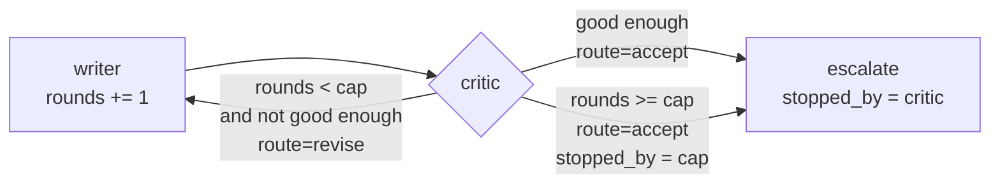

# 3.5 — The guard you write yourself

## One-line answer

Three lines in the deciding node — count the rounds in state, force the exit route at a cap, record
*why* it stopped — turn the runaway of [3.4](3.4-the-loop-that-never-ends.md) into a run that ends,
says it gave up, and hands the ticket to a human.

## The story

You are at the cash machine and you have typed the wrong PIN.

You try again, more carefully. Wrong again — you are thinking of the other card. You try a third
time, and the screen changes. It does not say *try again*. It says the card has been retained, and to
contact the bank.

Nobody enjoys this. But consider the alternative machine, the one that lets you keep typing. It is
friendlier for exactly as long as it is you standing there, and it is a gift to the person who found
your card on the pavement. Three tries is not a limit on your patience; it is a limit on how much
damage a wrong assumption can do before a human gets involved.

And notice the last part. The card is not swallowed silently. There is a message, and the message
says what happened and what to do about it. The machine gave up *and told you it had*.

## The idea in plain language

[3.4](3.4-the-loop-that-never-ends.md) established that the runtime bounds nothing about a routed
cycle. So the bound is yours. It has three parts and each one does a different job:

1. **A counter in session state.** Not a local variable, not a module global — the loop has to see it
   across passes, and [3.3](3.3-what-survives-one-turn-of-the-loop.md) established that state is the
   only place that works.
2. **A forced exit route at the cap.** The deciding node stops asking its real question and emits the
   route that leads out, regardless of what it thinks of the draft.
3. **A record of why it stopped.** A flag in state saying the cap was hit, so that whatever comes next
   can tell the difference between *the critic accepted this* and *we ran out of patience*.

The third one is the one people leave out, and it is the one that matters most. A loop that hits its
cap and takes the same exit as a loop that succeeded has converted a failure into a silent success —
which is Principle 10 broken in the quietest possible way. The draft that gets sent is one the critic
never approved, and nothing anywhere says so.

The word for this is **containment**: not preventing the bad thing, but bounding what it can cost.
Principle 13 says every new power arrives with its containment story, and a loop is a real power —
it is the difference between one attempt and as many as it takes.

One thing the guard is deliberately **not**: an instruction in a prompt. "Do not take more than three
attempts" in a critic's system prompt is a request, and the model may honour it. The cap in the node
is a fact. Day 66 will make the general version of this argument about injection; the small version
is here, and it is that a rule enforced by the thing being governed is not enforced.

## Why Sutra needs it

Day 59 is the phase gate for runaway agents and containment, and it will ask for this exact shape.
Day 58's triage graph has a review loop in it, and that loop is the desk's most expensive stage.

There is a Sutra-specific reason too, which is quota. The desk shares one free-tier key across every
ticket. A loop with no cap does not fail the ticket it is on; it fails every ticket for the rest of
the day, because it spends the shared budget. The cap is what keeps one bad ticket's blast radius to
one bad ticket.

## The mechanism

The critic from [3.4](3.4-the-loop-that-never-ends.md) — still never satisfied on the merits — with the
guard added.

```python
CAP = 3


def review(ctx: Context, node_input: str) -> Event:
    """Never satisfied on the merits. The cap is what ends it."""
    rounds = ctx.state.get("rounds", 0)
    if rounds >= CAP:
        ctx.state["stopped_by"] = "cap"
        return Event(route="accept", output=f"cap of {CAP} reached, escalating unfinished")
    return Event(route="revise", output="revise")


def escalate(ctx: Context, node_input: str) -> str:
    reason = ctx.state.get("stopped_by", "critic")
    return f"handed to a human (stopped by: {reason}) - {node_input}"
```

**Line by line:**

- `rounds = ctx.state.get("rounds", 0)` — reads the counter the writer maintains. The counter and the
  cap live in different nodes on purpose: the writer knows how many drafts it has made, the critic
  decides what that means.
- `if rounds >= CAP:` — the guard, before the real judgement. Checking the cap *first* is deliberate:
  once you are at the cap you do not want to spend another model call asking a question whose answer
  you are going to override.
- `ctx.state["stopped_by"] = "cap"` — part three, and the line that is usually missing. Without it the
  run ends in exactly the same place whether the critic was satisfied or exhausted.
- `return Event(route="accept", ...)` — the forced exit reuses the existing exit route rather than
  inventing a third one. That is a design choice with a cost, discussed under *When it breaks*.
- `output=f"cap of {CAP} reached, escalating unfinished"` — the output says what happened in words, so
  it appears in the event stream and in any log built from it, not only in state.
- `def escalate(...)` — the node after the loop reads `stopped_by` and reports it. This is what makes
  the whole thing honest: the difference between the two exits is visible in the final output.

Run it:

```bash
cd days/day-54-sequential-parallel-loop/lab
uv run python guard.py
```

**Line by line:**

- `guard.py` builds this graph. It also keeps [3.4](3.4-the-loop-that-never-ends.md)'s outside
  observer, which raises after twelve writer passes, so that the unguarded comparison below
  terminates.
- `--cap N` moves the cap. `--no-guard` removes the three lines entirely.

Measured on 2026-09-05:

```text
guard: cap=3
    draft v1
    revise
    draft v2
    revise
    draft v3
    cap of 3 reached, escalating unfinished
    handed to a human (stopped by: cap) - cap of 3 reached, escalating unfinished
    final state: {'rounds': 3, 'stopped_by': 'cap'}
```

Three drafts, then the run ends — and it ends **saying why**. The last output names the reason and
the final state carries `stopped_by: 'cap'` for anything downstream to read. Compare that with what a
loop that genuinely converged would produce, where `stopped_by` is absent and `escalate` reports
`stopped by: critic`.

Move the cap:

```bash
uv run python guard.py --cap 2
```

**Line by line:**

- `--cap 2` changes one integer. Nothing else about the graph, the critic or the writer moves.

```text
guard: cap=2
    draft v1
    revise
    draft v2
    cap of 2 reached, escalating unfinished
    handed to a human (stopped by: cap) - cap of 2 reached, escalating unfinished
    final state: {'rounds': 2, 'stopped_by': 'cap'}
```

Two drafts. The cap is the number, and the number is in one place.

Now take the three lines out:

```bash
uv run python guard.py --no-guard
```

**Line by line:**

- `--no-guard` skips the `if rounds >= CAP` branch entirely. The critic still emits `revise` every
  time, and the graph is still exactly as valid as it was.

```text
guard: none
    Runaway: writer ran 13 times with no guard in the graph
```

Thirteen passes and counting, stopped by the observer rather than by the graph. Same nodes, same
edges, same critic. Three lines.



## When it breaks

The guard above has a real weakness, and it is visible in that diagram: **both exits go to the same
node**. The reply that leaves after three failed reviews travels the same edge as the reply the critic
approved, and the only thing separating them is a state key that the downstream node has to remember
to read.

Write the downstream node the obvious way and the distinction evaporates:

```python
def send(node_input: str) -> str:
    """Sends the reply. Notice what it does not ask."""
    return f"sent: {node_input}"
```

**Line by line:**

- No `ctx`, so no access to `stopped_by`. This node cannot tell the two exits apart even in principle.
- It is a completely reasonable node. Nothing about it looks wrong. It sends the reply it was given.

The result is a reply going to a customer that no critic ever approved, from a graph that ended
cleanly with exit code zero. The failure has been contained — the loop stopped, the quota survived —
and then quietly un-contained by the node after it.

The better shape is a third route:

```python
if rounds >= CAP:
    ctx.state["stopped_by"] = "cap"
    return Event(route="escalate", output=f"cap of {CAP} reached")
```

**Line by line:**

- `route="escalate"` — a distinct third route, with its own edge to its own node, so the graph itself
  distinguishes *finished* from *gave up*.
- The downstream node for `escalate` does something different: queues the ticket for a person rather
  than sending. It cannot forget to check a flag, because it is only ever reached one way.
- The cost is one more node and one more edge. That is the entire cost, and it buys a distinction the
  graph can enforce rather than one each downstream node must remember.

Day 62 and Day 63 build the human hand-off properly; this is the edge it hangs from.

## In production

**What a professional writes instead.** They put the cap in configuration rather than in a module
constant, because the right number is discovered rather than chosen — and they emit a metric on the
`stopped_by` value, so *how often the cap fires* is a number on a dashboard. That number is the
health of the loop: at nought per cent the cap is too high to be doing anything, at twenty per cent
the critic's criteria are wrong and no cap will fix that. They also log the whole round history when
the cap fires, because a loop that failed to converge is the most informative thing that happened all
day.

**What degrades at scale.** The cap bounds one run and, exactly like `max_concurrency` in
[2.5](../02-at-the-same-time/2.5-fan-out-against-a-quota.md), it says nothing about many runs. A cap
of three on a graph handling two hundred tickets an hour is up to six hundred review passes an hour
against one free-tier key. Per-run containment and per-provider containment are different problems
with different homes, and the second one is Day 70's Quota-Router.

**The failure mode that only appears with real traffic.** A cap that is never reached in testing and
is reached constantly on one category of ticket. Because the cap works, nothing fails; the tickets in
that category simply all get escalated, and the desk's answer rate for them quietly drops to zero.
Without a metric on `stopped_by` there is no signal at all — the system is behaving exactly as
designed and doing nothing useful. A guard makes failure survivable and, in doing so, makes it
invisible. The metric is what puts it back.

**The review comment a senior engineer leaves:** *"The cap is here and the `stopped_by` flag is here,
which is good, but both exits land on `send`. Give the cap its own route and its own node. Right now
the only thing between a customer and an unreviewed reply is that `send` remembers to check a state
key, and `send` does not take `ctx`."*

**The interview question:** *"How do you bound an agent loop, and what do you do when the bound is
hit?"* An honest answer: *"A counter in the run's state, checked in the deciding node before it does
its real work, forcing the exit route at the cap — and, the part people leave out, a record of why it
stopped. I would give the cap its own route rather than reusing the success route, so the graph
distinguishes 'the critic approved this' from 'we gave up', instead of relying on every downstream
node to check a flag. Then I emit a metric on that reason, because how often the cap fires is the
health of the loop: never means the cap is decorative, often means the exit criteria are wrong. And
the cap goes in the node, not the prompt — a rule the model is asked to follow is not a bound."*

## Check yourself

```bash
cd days/day-54-sequential-parallel-loop/lab
uv run python guard.py
uv run python guard.py --cap 2
uv run python guard.py --no-guard
```

Now add a third route to `guard.py` — `escalate` — with its own node, and make the `accept` node one
that only ever sends approved replies. Run it and check that `stopped_by` is no longer needed to tell
the two apart.

**Out loud, without scrolling up:** name the three parts of a loop guard, and say which one is most
often left out and what it costs.

**Next:** [4.1 — The shape of the triage flow](../04-where-they-meet/4.1-the-shape-of-the-triage-flow.md).
