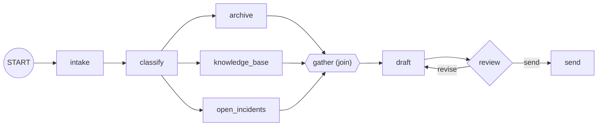

# 4.1 — The shape of the triage flow

## One-line answer

The triage graph is a chain with a fan-out in the middle and a loop at the end — and running it end
to end exposes a bug none of the three shapes shows on its own: the second time round the loop, the
drafting node has lost the research.

## The story

You are moving house on a Saturday and there are six of you.

The morning is a queue. One person is at the van door and everything goes past them in order: it gets
labelled, then it gets checked off the inventory, then it goes in. You cannot check something off
before it has a label, so the three jobs happen one at a time, in that order, at the door.

Upstairs is nothing like that. Three people are packing three bedrooms at the same time, in three
different rooms, and none of them is waiting for the others. They finish when the slowest room
finishes.

And then there is the last part of the day, which is the part that goes round. Somebody walks the
empty house with the inventory, comes back, and says the bathroom cabinet is still full. Two people
go and get it. Then somebody walks it again and finds the shed. Then again, and it is clear. Nobody
knew at breakfast how many walk-throughs there would be.

Here is what actually went wrong that day. On the second walk-through, the person doing it had the
note from the first walk-through in their hand — *"bathroom cabinet"* — and had put the inventory
down somewhere. So they checked the bathroom cabinet, found it empty, and said the house was clear.
The shed was found by accident, an hour later, by someone looking for a screwdriver.

Three shapes in one day, and the mistake was at the seam between two of them.

## The idea in plain language

The three shapes of this day are not alternatives. A real workflow uses all three, in the places
where each is the right answer:

| Shape | Use it when | In the triage graph |
| --- | --- | --- |
| chain | each stage needs the previous one's answer | intake → classify, and draft → review |
| fan-out + join | the pieces are independent | the three research lookups |
| routed back edge | the number of passes is a result, not a setting | the review loop |

Put them together and you get one graph. The important thing is that the *edges* compose without any
special syntax: a fan-out tuple sits inside a chain tuple, and a back edge is just another `Edge` in
the same list. There is no "sub-workflow" ceremony required to nest one shape inside another.

What does not compose automatically is the **data**. Each shape has its own rule about what arrives at
the next node — the previous output for a chain, a dictionary for a join, the *deciding* node's
output for a back edge — and the place those three rules collide is exactly where the interesting
bug lives.

## Why Sutra needs it

This is Day 58's graph, drawn one day early with plain functions instead of agents so the shape can be
run and read before any of it costs a model call.

Day 58 is a build day, and a build day goes badly if the shape is being designed while it is being
built. Everything below is the skeleton: same nodes, same edges, same joins, same loop, same
`max_concurrency`. Day 58 replaces the function bodies with real work and Day 57 replaces the critic
with a real one.

## The mechanism

Six nodes, three shapes, one edge list.

```python
workflow = Workflow(
    name="triage",
    edges=[
        (START, intake_n, classify_n, BRANCHES, gather, draft_n, review_n),
        Edge(from_node=review_n, to_node=draft_n, route="revise"),
        Edge(from_node=review_n, to_node=send_n, route="send"),
    ],
    max_concurrency=2,
)
```

**Line by line:**

- The first tuple is one chain with a fan-out embedded in it: `intake` then `classify` are ordinary
  links, `BRANCHES` is the three-way fan-out from
  [2.1](../02-at-the-same-time/2.1-three-branches-from-one-edge.md), `gather` is the `JoinNode` from
  [2.2](../02-at-the-same-time/2.2-the-node-that-waits-for-everyone.md), and `draft` then `review`
  are ordinary links again. Six of the graph's eight edges come from this one line.
- `Edge(from_node=review_n, to_node=draft_n, route="revise")` — the back edge, and the only reason
  this graph is not a straight line. Note that it points at `draft`, not at `classify`: a revision
  re-drafts and does not re-research.
- `Edge(from_node=review_n, to_node=send_n, route="send")` — the exit.
- `max_concurrency=2` — the cap from
  [2.5](../02-at-the-same-time/2.5-fan-out-against-a-quota.md). Three branches, two at a time.

The deciding node carries both an exit condition and the guard from
[3.5](../03-around-again/3.5-the-guard-you-write-yourself.md):

```python
def review(ctx: Context, node_input: str) -> Event:
    rounds = ctx.state.get("rounds", 0)
    if rounds >= CAP:
        ctx.state["stopped_by"] = "cap"
        return Event(route="send", output=f"cap of {CAP} reached")
    if rounds >= ACCEPT_AT:
        return Event(route="send", output="good enough")
    return Event(route="revise", output="revise")
```

**Line by line:**

- The cap is checked before the judgement, for the reason
  [3.5](../03-around-again/3.5-the-guard-you-write-yourself.md) gives: at the cap you are overriding
  the answer, so do not pay for it.
- `ACCEPT_AT` stands in for a real critic. In `--strict` mode it is three, which makes the loop
  actually go round; by default it is one, so the happy path is one pass.

Run the happy path:

```bash
cd days/day-54-sequential-parallel-loop/lab
uv run python triage.py
```

**Line by line:**

- `triage.py` builds this graph with plain functions and prints every output, the research log, and
  the final state.
- `--strict` sets `ACCEPT_AT` to three so the review loop runs three times.

Measured on 2026-09-05:

```text
critic accepts at round 1, cap 3, max_concurrency 2
    customer bounced back to the sign-in page
    auth
    ticket:4610
    kb:KB-104
    incidents:none
    {'archive': 'ticket:4610', 'knowledge_base': 'kb:KB-104', 'open_incidents': 'incidents:none'}
    draft v1 from [archive, knowledge_base, open_incidents]
    good enough
    sent (good enough) label='auth'
    research log: archive:start | knowledge_base:start | archive:end | knowledge_base:end | open_incidents:start | open_incidents:end
    final state: {'ticket': 'customer bounced back to the sign-in page', 'label': 'auth', 'rounds': 1}
```

All three shapes are visible in that output. The first two lines are the chain. The next four are the
fan-out and its join. `draft v1 from [archive, knowledge_base, open_incidents]` is the drafting node
naming its three sources, which it could only do because the join handed it a dictionary.

The research log shows `max_concurrency=2` working: `archive` and `knowledge_base` start and end
together, and only then does `open_incidents` begin. Three bedrooms, two people, three rooms packed.



## When it breaks

Now make the critic strict, so the loop actually goes round:

```bash
uv run python triage.py --strict
```

**Line by line:**

- `--strict` sets `ACCEPT_AT = 3`. The graph, the nodes, the edges and the fan-out are all unchanged.

```text
critic accepts at round 3, cap 3, max_concurrency 2
    customer bounced back to the sign-in page
    auth
    ticket:4610
    kb:KB-104
    incidents:none
    {'open_incidents': 'incidents:none', 'knowledge_base': 'kb:KB-104', 'archive': 'ticket:4610'}
    draft v1 from [archive, knowledge_base, open_incidents]
    revise
    draft v2 from [revise]
    revise
    draft v3 from [revise]
    cap of 3 reached
    sent (cap of 3 reached) label='auth'
    research log: archive:start | knowledge_base:start | archive:end | knowledge_base:end | open_incidents:start | open_incidents:end
    final state: {'ticket': '...', 'label': 'auth', 'rounds': 3, 'stopped_by': 'cap'}
```

Read line by line until something is wrong, and stop at this:

```text
    draft v2 from [revise]
```

The first draft was built from three sources. The second was built from the word `revise`.

This is [3.3](../03-around-again/3.3-what-survives-one-turn-of-the-loop.md) arriving in a real graph.
The back edge comes from `review`, so on the second pass `draft`'s `node_input` is the critic's
output, not the join's dictionary. The research is not gone from the run — it is right there in the
event stream — but it is gone from the node that needs it, and `draft` handled that gracefully by
formatting whatever it was given. No error. A shorter, worse reply, produced confidently.

That is the second walk-through of the empty house: the note from last time is in your hand, the
inventory is on a windowsill somewhere, and the shed is still full.

Notice also that this only appears when the loop runs more than once. The default run above is
perfect, and it exercises the chain, the fan-out, the join, the concurrency cap and the loop's exit —
everything except the second pass. **A workflow test that never loops twice is not testing the
loop.**

The fix is the one [3.3](../03-around-again/3.3-what-survives-one-turn-of-the-loop.md) named: put what
must survive into session state.

```python
def draft(ctx: Context, node_input) -> str:
    if isinstance(node_input, dict):
        ctx.state["research"] = node_input
    research = ctx.state.get("research", {})
    ctx.state["rounds"] = ctx.state.get("rounds", 0) + 1
    sources = ", ".join(sorted(research))
    return f"draft v{ctx.state['rounds']} from [{sources}]"
```

**Line by line:**

- `if isinstance(node_input, dict)` — the first pass arrives from the join with a dictionary; later
  passes arrive from the critic with a string. The type is what distinguishes them, and checking it is
  honest about the fact that this node has two callers.
- `ctx.state["research"] = node_input` — store it once, on the pass that has it.
- `research = ctx.state.get("research", {})` — every pass reads from state, including the first. That
  is deliberate: one code path for both callers, rather than a branch that behaves differently on
  pass one.
- The critic's verdict is still available as `node_input` on later passes, which is what the writer
  actually needs from it. Nothing is lost; the two inputs simply come from two places now.

That is a `TODO(me)` in this day's build brief, not something to copy. The point of the section is
that **the bug is only visible where the shapes meet**, and neither section 2 nor section 3 could have
shown it to you.

## In production

**What a professional writes instead.** They decide, per node, which of its inputs come from the
handover and which from state, and they write that down — as a `state_schema`, or at minimum as a
docstring naming the keys. A node inside a loop that reads `node_input` for anything except the
deciding node's verdict is a bug waiting for its second iteration.

**What degrades at scale.** The interaction between the loop and the fan-out. Put the back edge in the
wrong place — pointing at `classify` rather than at `draft` — and every revision re-runs the three
research lookups. On the happy path that is invisible, because there are no revisions. At a three-pass
average it triples the desk's request volume, and the graph looks identical in the diagram. Where a
back edge points is a cost decision as much as a correctness one.

**The failure mode that only appears with real traffic.** Exactly the one above. `draft v2 from
[revise]` is not an error, it is a shorter reply, and the tickets that loop are the hard tickets. So
the system produces its worst answers on the questions that needed its best, and every metric that
counts completions says it is working.

**The review comment a senior engineer leaves:** *"The back edge lands on `draft`, and `draft` reads
its sources from `node_input`. On the second pass `node_input` is the critic's verdict, so the
revision is drafted with no research at all. Stash the join's output in state on the first pass and
read it from there every pass. And add a test that forces at least two revisions — the current one
never loops."*

**The interview question:** *"Walk me through a workflow that uses sequential, parallel and looping
steps together. What goes wrong?"* An honest answer: *"The shapes compose in the edge list without any
ceremony — a fan-out tuple nests inside a chain tuple and a back edge is just another edge. What does
not compose is the data. Each shape has a different rule about what the next node receives, and the
bug I hit was at the seam: my drafting node was downstream of a join on the first pass and downstream
of the critic on every pass after, so the second draft was built from the word 'revise' instead of
from three research results. No exception, just a worse answer. It only appeared when the loop ran
twice, which my happy-path test never did. The fix is that anything which has to survive an iteration
lives in session state, and the lesson is that a workflow test which never loops is not testing the
loop."*

## Check yourself

```bash
cd days/day-54-sequential-parallel-loop/lab
uv run python triage.py
uv run python triage.py --strict
```

Now move the back edge so it points at `classify` instead of `draft`, run `--strict`, and count how
many times each research branch appears in the log.

**Out loud, without scrolling up:** name the three shapes in the triage graph and the node where two
of them meet, and say what arrives at that node on the second pass.

**Next:** [4.2 — The branch that took everyone down with it](4.2-the-branch-that-took-everyone-down-with-it.md).
