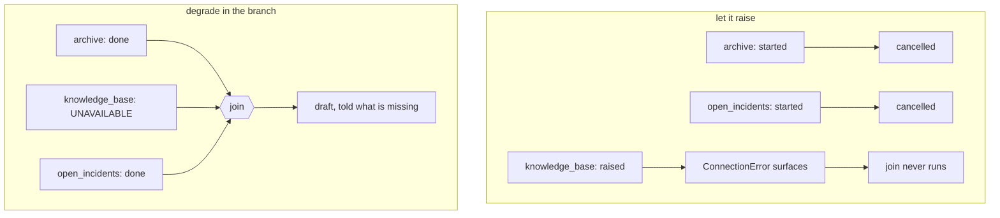

# 4.2 — The branch that took everyone down with it

## One-line answer

When one branch of a fan-out raises, the whole fan-out fails: the measured log shows all three
branches started and **none of them finished**, so degrading gracefully is something a branch does to
itself, not something the join does for it.

## The story

Four of you book a holiday together on one booking.

Three passports are in date. The fourth was renewed late and the number on the booking is the old
one. The airline's system does not send three of you and hold one back. It does not put the three
valid passengers on the flight and email the fourth. The booking is one thing, and one thing is
either valid or it is not, so the whole booking is cancelled.

Everybody understands the rule as soon as it is explained. Nobody expected it, because from the
outside four people buying four seats looks like four independent transactions, and the fact that
they share a reference is an implementation detail right up until the moment it is the only detail
that matters.

The person who books separately next time is not being unfriendly. They have learned where the
boundary is.

## The idea in plain language

A fan-out with a join is one unit of work. It succeeds when every branch succeeds, and if any branch
raises, the exception surfaces and the join never runs.

That is the right default, and it is worth being clear about why, because "one failure kills three
branches" sounds like a design flaw. The alternative default would be for the runtime to swallow the
exception and hand the join a partial result — and that is trap #4 from plan §5.1 and Principle 10
in one move. A framework that decides on your behalf that two research results out of three is fine
has made a product decision about answer quality inside a scheduler.

So the runtime does the honest thing: it surfaces the error. What it costs you is that the sibling
branches are cancelled where they stand, and their work is discarded even if they were nearly done.

Which leaves you with a decision, and it is genuinely a decision rather than an obvious answer:

- **Fail the whole stage.** Correct when every branch is essential. If the drafting node cannot write
  a sensible reply without the knowledge-base article, a missing article is a failed stage.
- **Degrade inside the branch.** Correct when a missing source makes the answer worse but still
  useful. The branch catches its own error and returns a value that says *"I could not answer"*.

The word for the second one is **graceful degradation**, and the important structural fact is *where*
it happens: inside the branch, in the branch's own code, deciding about the branch's own failure. It
is not something the join can do, because by the time the join would see the problem the exception
has already travelled past it.

## Why Sutra needs it

The desk's three research branches are not equally important. The archive is the whole point of
Phase 7 — Day 49 built it and Day 50 tuned it — so a reply drafted without it is a reply that has
forgotten every ticket the desk has ever seen. The open-incidents check is a nice-to-have: if it is
down, the reply is still worth sending, it just will not mention that there is an outage.

Those two branches deserve different answers to the question above, and today they get the same one
by default. Day 58 has to make that choice deliberately for each branch, and this part is the
evidence it needs.

## The mechanism

Three branches, one of them raising, and a log that records how far each one got.

```python
LOG: list[str] = []


async def archive(node_input: str) -> str:
    LOG.append("archive:start")
    await asyncio.sleep(0.02)
    LOG.append("archive:end")
    return "ticket:4610"


async def knowledge_base(node_input: str) -> str:
    """The branch that fails. With --degrade it catches its own error and reports a gap."""
    LOG.append("knowledge_base:start")
    try:
        raise ConnectionError("kb index is offline")
    except ConnectionError as exc:
        if not DEGRADE:
            raise
        LOG.append("knowledge_base:degraded")
        return f"kb:UNAVAILABLE ({exc})"
```

**Line by line:**

- `LOG.append("archive:start")` and `"archive:end"` — start and end recorded separately, which is the
  whole measurement. A branch that starts and never ends was cancelled; a branch that never starts
  was never scheduled.
- `await asyncio.sleep(0.02)` — a real delay on the two healthy branches, so that they are genuinely
  mid-flight when the third one raises. With no delay they would finish first and the demonstration
  would show nothing.
- `raise ConnectionError("kb index is offline")` — a specific exception with a message that names the
  system. Never a bare `Exception`, and never a returned string saying "error": trap #4 exists
  because the second one is what stops retries, tracing and callbacks from working.
- `if not DEGRADE: raise` — the switch. The same branch either lets the error out or handles it.
- `return f"kb:UNAVAILABLE ({exc})"` — the degraded value. It is a value, not an empty string and not
  `None`, and it says why. The drafting node downstream can read it and decide to say *"I could not
  check the knowledge base"* rather than silently writing a thinner answer.

Run it:

```bash
cd days/day-54-sequential-parallel-loop/lab
uv run python blast.py
```

**Line by line:**

- `blast.py` fans out to the three branches, joins them, and drafts. It catches whatever surfaces and
  prints it, then prints the log.
- `--degrade` turns on the branch-level handling.

Measured on 2026-09-05:

```text
mode: let it raise
    ConnectionError: kb index is offline
    log: archive:start | knowledge_base:start | open_incidents:start
```

Read the log. Three `:start` entries and **not one `:end`**. `archive` and `open_incidents` had done
nothing wrong; they were mid-`await` when `knowledge_base` raised, and they were cancelled where they
stood. Their work was thrown away.

The exception that surfaced is the original `ConnectionError`, with its original message, from the
branch that raised it — not a wrapper, not a generic workflow error. That is trap #4 being avoided by
the runtime on your behalf: the error you catch at the top is the error that happened.

Now the same graph with the branch handling itself:

```bash
uv run python blast.py --degrade
```

**Line by line:**

- `--degrade` changes nothing except what `knowledge_base` does with its own exception. The graph,
  the join, the other two branches and the drafting node are untouched.

```text
mode: degrade in the branch
    kb:UNAVAILABLE (kb index is offline)
    ticket:4610
    incidents:none
    {'knowledge_base': 'kb:UNAVAILABLE (kb index is offline)', 'archive': 'ticket:4610', 'open_incidents': 'incidents:none'}
    drafted from {'knowledge_base': 'kb:UNAVAILABLE (kb index is offline)', 'archive': 'ticket:4610', 'open_incidents': 'incidents:none'}
    log: archive:start | knowledge_base:start | knowledge_base:degraded | open_incidents:start | archive:end | open_incidents:end
```

Every branch reaches `:end` or `:degraded`. The join fires with three entries, one of which honestly
reports that it has nothing. The drafting node runs with a dictionary that contains the failure
rather than hiding it.



## When it breaks

The dangerous version of degrading is degrading into a value that lies:

```python
    except ConnectionError:
        return ""
```

**Line by line:**

- Catches the error, returns an empty string, and says nothing about what happened.
- It is one character shorter than the honest version and it is a different program.

There is no error and no log line. The join fires with three entries. The drafting node receives
`{"knowledge_base": "", ...}` and writes a reply from the two sources it has, and that reply is
indistinguishable — to the drafting node, to the logs, to the customer and to you — from a reply
written when the knowledge base genuinely had no relevant article.

This is Principle 10 broken in one line. The rule that catches it: **a degraded result must be
distinguishable from a successful empty result.** `""` is not; `"kb:UNAVAILABLE (kb index is
offline)"` is. Day 50 drew the same distinction for retrieval, between *"I found nothing"* and *"there
is no past case"*, and it is the same mistake in a different stage of the same pipeline.

The other half of doing this properly is that a degraded branch is still a failure, even though the
run succeeded, and something must count it:

```python
        logging.warning("research branch %s degraded: %s", "knowledge_base", exc)
        ctx.state["research.degraded"] = ctx.state.get("research.degraded", []) + ["knowledge_base"]
```

**Line by line:**

- `logging.warning(...)` — the event exists in the log even though nothing raised. Without this, a
  knowledge base that has been down for a week produces a week of successful runs.
- `ctx.state["research.degraded"]` — a list in state, namespaced by stage, so the drafting node can
  say *"I could not check the knowledge base"* in the reply itself. Note this is a read-modify-write
  from inside a fan-out, which [2.4](../02-at-the-same-time/2.4-two-branches-one-state-key.md) showed
  is unsafe. Doing it properly means each branch writing its own key and something after the join
  collecting them — which is one more reason the join exists.

## In production

**What a professional writes instead.** They classify each branch as **required** or **best-effort**,
in writing, next to the branch. Required branches let their exceptions out. Best-effort branches catch
a *specific* exception, return a value that names the gap, log a warning, and record the degradation
somewhere the reply can mention it. What they never do is decide this per incident: a branch whose
policy is chosen while the pager is going off will be `except Exception: return ""`.

**What degrades under concurrency.** The cancellation. When one branch raises, the others are
cancelled mid-`await`, and a branch that had already done something with a side effect outside the
graph — written a row, sent a webhook, incremented a counter — does not get to undo it. Cancellation
is not a rollback. This is why side effects belong after the join, in a node that runs once and only
when everything succeeded, and it is the thread Day 60 picks up as idempotency.

**The failure mode that only appears with real traffic.** Partial degradation that nobody counts. One
branch degrades on two per cent of tickets, which is invisible in a sample of ten and is thousands of
worse-than-necessary replies a month. It shows up in no error rate, because there was no error, and
the only way to see it is to have counted the degradations on purpose. That metric is the entire
value of the `research.degraded` key above.

**The review comment a senior engineer leaves:** *"This branch catches `ConnectionError` and returns
an empty string. Two problems: an empty string is what a successful search with no results also
returns, so the drafter cannot tell them apart, and nothing counts this. Return a value that names
the failure, log a warning, and put the branch name in `research.degraded` so the reply can say what
it could not check."*

**The interview question:** *"One parallel step fails. What happens to the others?"* An honest answer:
*"They are cancelled, and the exception surfaces. I measured it: all three branches logged `start` and
none logged `end`, and the join never ran. That is the right default, because the alternative is the
framework silently deciding that a partial result is acceptable. If I want degradation I put it in the
branch, catching a specific exception and returning a value that says what is missing — never an empty
string, because an empty string is indistinguishable from a successful search that found nothing. And
I log it and count it, because a degraded run is a successful run and will otherwise never appear in
any error rate."*

## Check yourself

```bash
cd days/day-54-sequential-parallel-loop/lab
uv run python blast.py
uv run python blast.py --degrade
```

Now make `archive` raise as well, with `--degrade` off, and read the log. Say which branch's exception
surfaced and what that tells you about how the runtime picks.

**Out loud, without scrolling up:** one branch of a three-way fan-out raises — what happens to the
other two, and where does the code that prevents that live?

**Next:** [4.3 — Retries inside a loop multiply](4.3-retries-inside-a-loop-multiply.md).
