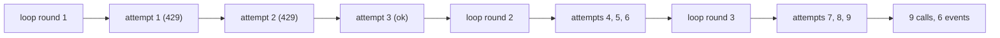

# 4.3 — Retries inside a loop multiply

## One-line answer

A node that retries three times inside a loop that runs three rounds makes **nine** calls, not three
and not six — measured — so the cap on the loop and the retry budget on the node have to be chosen
together or they multiply behind your back.

## The story

You are trying to reach the plumber and his line is busy.

You redial. Busy. You redial again. Busy again. On the fourth try it rings, and he says he is on
another job and to call back after four.

So at four you do it again, and it is busy, and you redial twice more before it connects. And at six,
and the same thing happens.

At the end of the day someone asks how many times you called the plumber, and you say three,
because you spoke to him three times. Your phone's call log says eleven. Both numbers are correct;
they are answers to different questions. Nobody was counting the second one, and the second one is
the one the phone bill is calculated from.

## The idea in plain language

There are two kinds of repetition in a graph, they are configured in different places, and they
compose by multiplication.

**A retry** is the runtime running the *same node again* because it raised. It is set per node, with
`RetryConfig`, and it is invisible from outside — from the graph's point of view the node ran once
and succeeded, and the fact that it took four attempts is not in the event stream as four node runs.

**A loop iteration** is the graph going back round a routed edge. It is visible: the node runs again,
emits again, and every pass is in the event stream.

The total number of times the node's body executes is **retries × iterations**. Both numbers are
small and reasonable on their own. Their product is not necessarily either.

| Retries per attempt | Loop rounds | Total calls |
| --- | --- | --- |
| 1 (no retry) | 3 | 3 |
| 3 | 3 | 9 |
| 5 | 5 | 25 |

That last row is a node with a default-ish retry budget inside a loop with a cap most people would
call conservative, and it is twenty-five requests for one ticket. Against a free tier of a few
hundred per day, twelve tickets is the day.

There is a third multiplier available if you are unlucky: a fan-out. Three branches, each retrying
three times, inside a loop running three rounds, is twenty-seven. Nothing about that graph looks
extreme in a diagram.

## Why Sutra needs it

Addendum 02 makes 429 handling mandatory on every model call path, and the natural way to satisfy
that on a node is `retry_config`. So Sutra's research nodes will have retries, correctly, for good
reasons.

Day 58 then puts those nodes into a graph with a review loop. Nobody adds a multiplier deliberately;
one person sets a sensible retry budget and another sets a sensible cap, and the product is a number
neither of them chose. This part exists so that when Day 59's phase gate asks *"what is the worst
this graph can cost?"*, the answer is a calculation rather than a shrug.

## The mechanism

A node that fails twice before succeeding, inside a loop that runs three rounds.

```python
from google.adk.workflow import RetryConfig

ATTEMPTS = 0
FAIL_TIMES = 2
ROUNDS = 3


class Throttled(Exception):
    """Stands in for HTTP 429. A real provider raises this with a retry-after header."""


def search(node_input=None) -> str:
    """Fails `FAIL_TIMES` times per round, then succeeds. Counts every attempt it ever makes."""
    global ATTEMPTS
    ATTEMPTS += 1
    if ATTEMPTS % (FAIL_TIMES + 1) != 0:
        raise Throttled(f"429 on attempt {ATTEMPTS}")
    return f"result (attempt {ATTEMPTS})"


searcher = FunctionNode(
    func=search,
    name="search",
    retry_config=RetryConfig(
        max_attempts=4,
        initial_delay=0.0,
        backoff_factor=1.0,
        jitter=0.0,
        exceptions=["Throttled"],
    ),
)
```

**Line by line:**

- `ATTEMPTS` counts every entry into the function body, across retries and across loop rounds. That
  is the number nobody counts, and the whole part is about it.
- `ATTEMPTS % (FAIL_TIMES + 1) != 0` — succeeds on every third attempt, so each loop round costs
  exactly three calls and the arithmetic is legible in the output.
- `RetryConfig(max_attempts=4, ...)` — the retry policy, attached to the node rather than to the
  graph. Verified with
  `python -c "from google.adk.workflow import RetryConfig; print(sorted(RetryConfig.model_fields))"`
  on `google-adk==2.7.1`, which prints
  `['backoff_factor', 'exceptions', 'initial_delay', 'jitter', 'max_attempts', 'max_delay']`.
- `max_attempts=4` — **attempts, including the original**, not retries in addition to it. Four
  attempts is three retries. Getting that off by one is the most common way a retry budget turns out
  to be bigger than intended.
- `initial_delay=0.0, backoff_factor=1.0, jitter=0.0` — the delays are flattened so the demonstration
  runs instantly. **Do not copy these values.** A real 429 handler needs a real delay, and the field
  documentation gives the defaults it would otherwise use: one second initial, doubling, sixty second
  maximum.
- `exceptions=["Throttled"]` — retry on *this* exception only. Given as a string, which is how the
  field accepts exception class names; it also accepts classes directly. Retrying on everything
  retries on a bug in your own node, which turns one exception into four.

Run it:

```bash
cd days/day-54-sequential-parallel-loop/lab
uv run python retry.py
```

**Line by line:**

- `retry.py` builds this node inside a three-round loop and prints the total call count.
- `--no-retry` removes the `retry_config`. `--timeout` is a separate small graph, below.

Measured on 2026-09-05:

```text
retry: max_attempts=4, rounds: 3
    result (attempt 3)
    round 1
    result (attempt 6)
    round 2
    result (attempt 9)
    round 3
    finished at round 3
    total calls made by 'search': 9
```

**Nine.** Three loop rounds, and the outputs say `attempt 3`, `attempt 6`, `attempt 9` — three calls
consumed per round.

Look at what the event stream shows: three `result` lines and three `round` lines. Six events for
nine calls. The retries are invisible from the graph's point of view; the node succeeded three times,
and the six failed attempts left no trace in the outputs at all. That is the property that makes this
multiplier easy to miss — **you cannot count it by reading the events.**

Now take the retries away:

```bash
uv run python retry.py --no-retry
```

**Line by line:**

- `--no-retry` passes `retry_config=None`. The node, the loop and the exception are unchanged.

```text
retry: off, rounds: 3
    Throttled: 429 on attempt 1
    total calls made by 'search': 1
```

One call, and the whole graph dies on the first 429. This is the other end of the trade and it is
just as wrong: the retry is not decoration, it is the thing that makes a free tier usable at all.
Neither end is the answer; the number is.



## When it breaks

The other per-node control is `timeout`, and it breaks in a way worth meeting once because the error
is specific and searchable:

```bash
uv run python retry.py --timeout
```

**Line by line:**

- `--timeout` builds a one-node graph whose node awaits for five seconds with
  `FunctionNode(func=slow, name="slow_search", timeout=0.2)`.

```text
    NodeTimeoutError: Node 'slow_search' timed out after 0.2 seconds.
```

`NodeTimeoutError` is importable from `google.adk.workflow`, and the message names the node and the
limit. Verified with
`python -c "from google.adk.workflow import NodeTimeoutError; print(NodeTimeoutError)"` on
`google-adk==2.7.1`.

Now the part that actually breaks. `timeout` and `retry_config` are set on the same node, and they
interact:

- A timeout is a failure, so a node with both will retry after timing out.
- The node's total worst-case duration is therefore `max_attempts × timeout`, plus the backoff delays
  between attempts.
- And that whole thing sits inside a loop, so multiply again by the cap.

A node with `timeout=30`, `max_attempts=4` and default backoff, inside a loop capped at three rounds,
has a worst case measured in several minutes for one ticket, from three numbers that individually
read as cautious. Nothing warns you, because each of the three is a reasonable value and the product
is not written down anywhere.

The smallest fix is to write it down: put the multiplication in a comment next to the graph, next to
the cap.

```python
# Worst case per ticket: search(4 attempts) x review loop(MAX_ROUNDS=3) = 12 model calls.
# Free-tier floor is ~10 RPM (Addendum 02), so one ticket can saturate a minute on its own.
MAX_ROUNDS = 3
```

**Line by line:**

- The comment is the deliverable. Not the constant — the constant was already there — but the
  sentence that says what it costs when multiplied by the other constants.
- Naming the free-tier number in the same comment is what turns "twelve calls" from a number into a
  judgement.

## In production

**What a professional writes instead.** They budget per *request*, not per node, and they make the
budget a thing the run can see. A counter in session state, incremented on every model call, checked
before each one, with the loop's exit condition reading it: *"stop if we have spent more than N calls
on this ticket, regardless of what the critic thinks."* That is the same guard as
[3.5](../03-around-again/3.5-the-guard-you-write-yourself.md) with a different currency, and it is
strictly better than a round cap, because rounds are a proxy for cost and this is cost.

**What degrades at scale.** The multiplication meets the fan-out. Retries are per node, so three
branches retrying is three independent retry budgets, and a provider outage means all three exhaust
theirs simultaneously — the fan-out becomes a burst of retries precisely when the provider is least
able to serve them. `max_concurrency`
([2.5](../02-at-the-same-time/2.5-fan-out-against-a-quota.md)) bounds the branches but not the
retries within them, so the two controls need to be set with each other in mind.

**The failure mode that only appears with real traffic.** Retries are invisible in the event stream,
as measured above: six failed attempts left no trace. So the graph looks like it is making three
calls per ticket right up until the quota is gone, and the dashboard built from workflow events
agrees with the wrong number. The only place the truth appears is the provider's own usage page, or a
counter you incremented yourself in the call path.

**The review comment a senior engineer leaves:** *"`max_attempts=4` on this node and `MAX_ROUNDS=3` on
the loop is twelve calls per ticket in the worst case, and neither number says so. Put the
multiplication in a comment, and consider a per-ticket call budget in state instead of a round cap —
rounds are a proxy for what we actually care about."*

**The interview question:** *"How do you reason about the cost of an agent workflow with retries and a
loop?"* An honest answer: *"By multiplying, because they compose that way and nothing surfaces the
product. I measured it: a node with four attempts inside a three-round loop made nine calls, and the
event stream showed six events, so the retries were completely invisible from the graph. If there is
a fan-out as well you multiply a third time. The practical consequence is that the loop cap and the
retry budget cannot be chosen independently, and the better control is a per-ticket call budget in
session state that the loop's exit condition reads — that way the bound is in the currency I actually
care about rather than in rounds, which are only a proxy for it."*

## Check yourself

```bash
cd days/day-54-sequential-parallel-loop/lab
uv run python retry.py
uv run python retry.py --no-retry
uv run python retry.py --timeout
```

Now set `ROUNDS = 5` and `max_attempts=5` in `retry.py` and predict the total before you run it. Then
run it.

**Out loud, without scrolling up:** a node retries up to four times inside a loop capped at three
rounds — how many calls in the worst case, and how many of them appear in the event stream?

**Next:** [5.1 — The three classes that still import](../05-the-old-shapes/5.1-the-three-classes-that-still-import.md).
