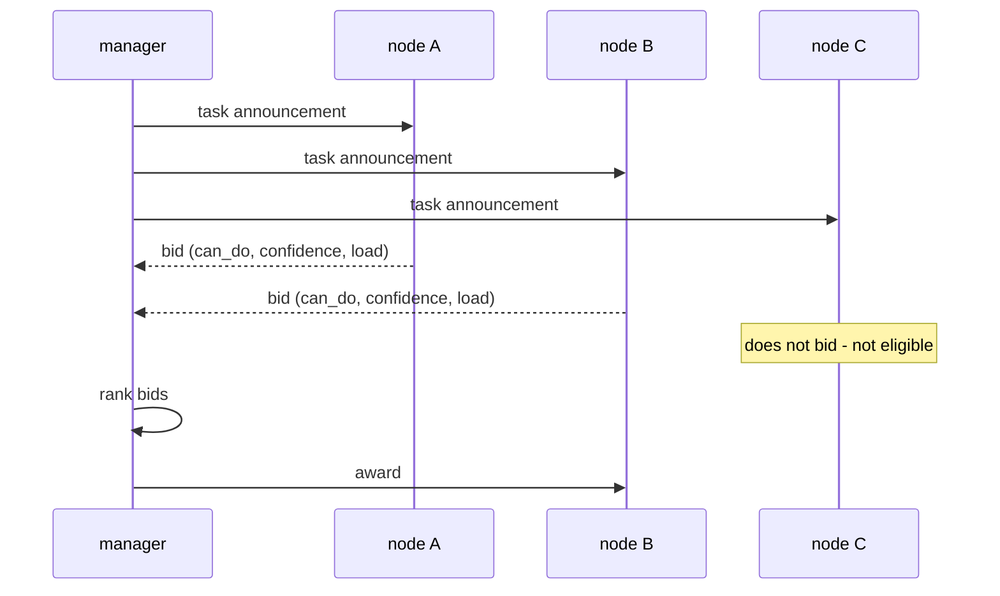

# The Contract Net Protocol — asking instead of assigning

> **The Contract Net Protocol: High-Level Communication and Control in a Distributed Problem
> Solver** · `doi:10.1109/TC.1980.1675516` · IEEE Transactions on Computers, C-29(12),
> pp. 1104–1113, December 1980 · <https://doi.org/10.1109/TC.1980.1675516>
>
> Record opened via the Crossref metadata API on 2026-09-05; title copied from the registration
> record.

## One-line answer

Work should be assigned by **announcing the task and letting candidates bid on it**, because the
candidate knows things about its own fitness — what it is holding right now, whether it has the
data — that no central routing table can hold.

## The story

Before this document existed, the way you gave work to a machine in a network of machines was to
write down, somewhere central, which machine did what. A table. Sensor data goes to node 3.
Analysis goes to node 7.

The table was written when the system was built, by somebody who knew what each node was for. And
it was right, in the sense that node 3 really was the sensor node.

It was also, quite often, the wrong answer at the moment it was consulted. Node 3 was the sensor
node and node 3 was currently working through a backlog. Node 7 was the analysis node and node 7
had lost its copy of the reference data twenty minutes ago. The table could not know either of
those things, because the table was written before they happened and it lives somewhere else.

So the work went where the table said, and sat there, while a node that could have done it
immediately sat idle — and nobody in the system had the job of noticing.

That is the problem this document set out to solve, and it named it precisely: the manager's
knowledge of the workers is always out of date, and the workers' knowledge of themselves never is.

## The idea in plain language

The proposal is a conversation with three messages, and its name comes from how building work is
awarded: you do not tell a builder to do the job, you put the job out and take bids.

**Announce.** The node with work to hand out — the paper calls it the **manager** — broadcasts a
description of the task to everyone, along with the criteria a reply should address.

**Bid.** Any node that thinks it can help — a **potential contractor** — replies with its own
assessment: whether it can do this, how well suited it is, what it would cost. Nodes that cannot
help say nothing.

**Award.** The manager reads the bids, picks one, and awards the task to that node. It becomes the
contractor for that task, and it may in turn become a manager if it needs to sub-contract part of
the work.

Two definitions the paper leans on, because they are what makes it more than a job queue:

- **Distributed problem solver** — a set of nodes working on one problem with no central controller
  and no complete view of the whole system in any one place. This is the setting; the protocol only
  makes sense in it.
- **Opportunistic control** — the idea that who does what should be decided at the moment the work
  arises, from the state of the system at that moment, rather than fixed in advance.

The single sentence to carry away: **the knowledge used to route travels in the opposite direction
from the work.** In a routing table, knowledge sits with the manager and flows outwards. In a
contract net, knowledge sits with the workers and flows back as bids.

## Why Sutra needs it

Day 55's routing is the *other* design, and the paper is what makes that a choice rather than an
assumption.

[3.1](../parts/03-the-description-routes/3.1-the-staff-list-behind-the-counter.md) showed ADK
building a staff list into the router's prompt: name, description, name, description. That is a
routing table. It is written by the person who defined the agents, it is fixed at construction, and
it is consulted by the lead without asking anybody anything. Everything in
[3.2](../parts/03-the-description-routes/3.2-the-clerk-whose-sign-said-all-enquiries.md) and
[3.3](../parts/03-the-description-routes/3.3-writing-a-description-that-routes.md) is the work of
keeping a static table honest, and it is real work precisely because the table cannot ask.

Read [1.3](../parts/01-why-split-the-desk/1.3-three-homes-for-a-step.md)'s three homes again with
the paper in hand. An edge is a table with one entry. A call and a hand-over both consult a table of
descriptions. Nowhere in today's mechanism does the lead ask a specialist whether it is *available*
or whether it *has what it needs* — because ADK offers no way to.

Day 70's Quota-Router is where this returns and where it matters. Routing to the provider with
headroom is a bid-shaped question: only the provider's own counter knows how many requests are left
in the window, and a static preference order cannot know it.

## The mechanism

The protocol is three message types and one decision rule.

| Message | From | Contains |
| --- | --- | --- |
| **Task announcement** | manager, broadcast | what the task is; the eligibility criteria; what a bid must say |
| **Bid** | any eligible node | that node's own assessment of its suitability |
| **Award** | manager, to one node | the task, now assigned |

The decision rule is that the manager ranks the bids on the criterion it announced and awards to the
best. The criterion is domain-specific — the paper is explicit that it is *"commonly expressed as
the price ... but could also be soonest time to completion, fair distribution of tasks"* — and that
generality is deliberate: the protocol specifies the conversation, not the objective.

Three properties follow, and they are the reasons the idea survived.

**Nodes self-select.** A node that cannot help does not bid. That is not politeness; it is the
mechanism doing its work. The manager never has to know why a node stayed silent, and the silence
carries real information.

**Bidding is the point at which fresh knowledge enters.** A bid is written *now*, so it can reflect
current load, current data, current health. A table is written *then*.

**A contractor can become a manager.** Sub-contracting is the same three messages one level down,
which is how the protocol handles a task that turns out to be several tasks.



The comparison that matters for this curriculum:

| | Routing table (ADK descriptions) | Contract net |
| --- | --- | --- |
| Who holds the routing knowledge | the manager | each worker |
| When it was written | at construction | at the moment of asking |
| Can it reflect current load | no | yes |
| Can it reflect missing data | no | yes |
| Messages per decision | 0 extra | one broadcast + N bids |
| Fails when | descriptions drift or overlap | bidders are slow, absent or dishonest |

## The paper in one demo

The demo implements the announce–bid–award loop and **nothing else**: no agents, no models, no
queue, no transport. Two files.

```text
days/day-55-delegation-and-transfer/lab/papers/contract-net/
├── contract_net.py    # the protocol: Announcement, Bid, rank, award
└── demo.py            # one ticket, three nodes, and the ablation switch
```

`contract_net.py` — the protocol, complete:

```python
"""The Contract Net Protocol, and nothing else."""

from __future__ import annotations

from dataclasses import dataclass


@dataclass(frozen=True)
class Announcement:
    """A task, broadcast to everyone."""

    task_id: str
    subject: str
    text: str


@dataclass(frozen=True)
class Bid:
    """A node's own assessment. `None` from a node means "I am not bidding"."""

    node: str
    can_do: bool
    confidence: float  # 0.0-1.0, the node's own reading of its fit
    load: int  # tasks the node is already holding


def rank(bids: list[Bid]) -> list[Bid]:
    """Best bid first: able nodes only, most confident, then least loaded."""
    able = [b for b in bids if b.can_do]
    return sorted(able, key=lambda b: (-b.confidence, b.load, b.node))


def award(announcement: Announcement, bids: list[Bid]) -> Bid | None:
    """The winning bid, or None when nobody bid - which is itself an answer."""
    ranked = rank(bids)
    return ranked[0] if ranked else None
```

**Line by line:**

- `Announcement` carries the task and its subject. `subject` exists only so the ablation has
  something to route on; the protocol itself does not need it.
- `Bid.can_do` is the node's own verdict, and it is separate from `confidence` on purpose. A node
  can be highly suited *in principle* and unable *right now*, and collapsing those into one number
  is exactly the information a routing table loses.
- `load` is the tie-breaker and is the second thing only the node knows.
- `rank` filters on `can_do` before sorting. A node that says it cannot do the task is not a weak
  candidate; it is not a candidate.
- `award` returning `None` is a real outcome — *nobody bid* — and the paper treats it as one. A
  protocol that always produces a winner has hidden the case worth knowing about.

`demo.py` — the scenario and the ablation:

```python
"""Run the contract net on one ticket, with an ablation switch."""

from __future__ import annotations

import sys

from contract_net import Announcement, Bid, award

TASK = Announcement(
    task_id="t-4188",
    subject="kb",
    text="which article covers the samesite cookie fix",
)

# What is true about the three nodes at this moment. Only the node itself knows this.
STATE = {
    "kb_node": {"has_index": False, "load": 0},  # its index failed to rebuild today
    "archive_node": {"has_index": True, "load": 1},  # holds KB-104 quoted inside a ticket
    "billing_node": {"has_index": True, "load": 4},  # busy, and wrong subject anyway
}

# The manager's belief about who handles what. This is the routing table.
STATIC_TABLE = {"kb": "kb_node", "ticket": "archive_node", "billing": "billing_node"}


def bid_from(node: str, announcement: Announcement) -> Bid | None:
    """Each node's own reply. It reads its own state; the manager cannot."""
    state = STATE[node]
    if node == "kb_node":
        return Bid(node, can_do=state["has_index"], confidence=0.9, load=state["load"])
    if node == "archive_node":
        return Bid(node, can_do=True, confidence=0.6, load=state["load"])
    return None  # billing_node does not bid on a knowledge-base question


def main() -> int:
    bidding = "--no-bids" not in sys.argv
    print(f"task     {TASK.task_id}  subject={TASK.subject!r}")
    print(f"text     {TASK.text}")
    print(f"bidding  {'on' if bidding else 'off (static routing table)'}\n")

    if bidding:
        bids = [b for n in STATE if (b := bid_from(n, TASK)) is not None]
        for b in bids:
            print(
                f"  bid   {b.node:<14} can_do={b.can_do!s:<5} "
                f"confidence={b.confidence} load={b.load}"
            )
        winner = award(TASK, bids)
        chosen = winner.node if winner else None
    else:
        chosen = STATIC_TABLE[TASK.subject]
        print(f"  table {TASK.subject!r} -> {chosen}")

    print(f"\n  awarded to   {chosen}")
    if chosen is None:
        print("  outcome      no node bid - the manager must escalate")
        return 1
    answered = STATE[chosen]["has_index"]
    print(f"  outcome      {'answered' if answered else 'FAILED - node has no index'}")
    return 0 if answered else 1


if __name__ == "__main__":
    raise SystemExit(main())
```

**Line by line:**

- `STATE` is what is true right now and is deliberately unavailable to `STATIC_TABLE`. That
  separation *is* the paper's claim, expressed as two variables.
- `kb_node` is the correct node by subject and cannot do the job today, because its index failed to
  rebuild. That is the "table was right when it was written" case.
- `archive_node` bids with lower confidence — `0.6` against `0.9` — because it can answer only
  indirectly: the article is quoted inside ticket 4188. It is honest about being second best and it
  is the only one that can actually deliver.
- `billing_node` returns `None`. Silence is the protocol's way of saying not-eligible, and it means
  the manager never has to reason about billing at all.
- The ablation is `--no-bids`, which skips the whole conversation and reads `STATIC_TABLE`. It
  changes one thing: where the routing knowledge comes from.
- The exit code is the outcome, so this is an eval that can go red.

Run it. Bidding on:

```bash
cd days/day-55-delegation-and-transfer/lab/papers/contract-net
uv run python demo.py; echo "exit: $?"
```

**Line by line:**

- The `cd` matters: `demo.py` imports `contract_net` as a sibling module, so it is run from its own
  directory rather than from the repo root.
- No flag means bidding is on — the paper's contribution is the default, and the ablation is the
  thing you have to ask for.
- `echo "exit: $?"` prints the exit code, which is where the outcome lives. This is an eval.

Measured on 2026-09-05:

```text
task     t-4188  subject='kb'
text     which article covers the samesite cookie fix
bidding  on

  bid   kb_node        can_do=False confidence=0.9 load=0
  bid   archive_node   can_do=True  confidence=0.6 load=1

  awarded to   archive_node
  outcome      answered
exit: 0
```

And the ablation — the same task, the same nodes, the same state, routing by table instead:

```bash
uv run python demo.py --no-bids; echo "exit: $?"
```

**Line by line:**

- `--no-bids` is the ablation switch. It is one flag and it removes exactly one thing: the
  announce–bid step. The nodes, their state, the task and the ranking code are untouched.
- Run from the same directory as before, so the only difference between the two runs is the flag.

```text
task     t-4188  subject='kb'
text     which article covers the samesite cookie fix
bidding  off (static routing table)

  table 'kb' -> kb_node

  awarded to   kb_node
  outcome      FAILED - node has no index
exit: 1
```

The table sends a knowledge-base question to the knowledge-base node, which is correct in every way
except the one that mattered. The contract net asks, hears `can_do=False` from the obvious
candidate, and awards to the second-best node, which answers.

Exit 0 against exit 1, from one flag. The idea did the work, and switching it off breaks the run.

## When it breaks

The paper is forty-six years old and the field kept some of it. Here is where the claim does not
hold.

**It assumes bidders are honest.** A bid is a self-report, and nothing verifies it. A node that
overstates its confidence wins work it should not have. In a closed system built by one team that
is fine; the moment nodes are written by different parties — or *are* language models, which are
enthusiastic self-reporters — self-assessment is the weakest possible basis for a decision. This is
the single largest reason the protocol is not the default in multi-agent LLM systems today.

**It costs a round trip and it scales with the roster.** One announcement plus N bids plus one
award, per task. In the setting the paper describes — a distributed sensor network where tasks are
large and communication is cheap relative to the work — that is negligible. In an LLM system where a
bid would itself be a model call, asking five specialists whether they can help costs five requests
before any work starts, which on a free tier is the entire budget for the ticket
([6.1](../parts/06-price-of-a-handoff/6.1-a-handoff-costs-a-request.md) prices routing at one).

**It has no answer for a slow bidder.** The manager must decide how long to wait. Wait too little
and you lose the best node; wait too long and every task is bounded by your slowest participant. The
paper's setting made this tolerable; a request-response system with latency budgets does not.

**It was demonstrated, not benchmarked.** The evidence is a distributed sensing application, argued
through, rather than a measured comparison against alternatives across workloads. It is a design
proposal with a worked example, and it should be read as one.

**Nobody bidding is a real outcome and needs a policy.** `award` returns `None`, and the system now
has a task and no contractor. The protocol says what happened; it does not say what to do. That is
the same gap [8.2](../parts/08-in-production/8.2-who-decided-and-why.md) found in the desk's roster,
arriving from the other direction.

## In production

**What survived.** The conversation did, almost unchanged. FIPA — the standards body for agent
communication — specified it as the *Contract Net Interaction Protocol*
(<https://www.fipa.org/specs/fipa00029/>), adding explicit reject and confirm messages, and an
*Iterated* variant (<https://www.fipa.org/specs/fipa00030/>) that allows several rounds of bidding.
The vocabulary survived too: *call for proposals*, *propose*, *accept-proposal*, *reject-proposal*
are the FIPA message names, and they are recognisably announce, bid and award.

The idea also survived in places that never cite it. Every job system where workers **pull** work
rather than having it pushed to them is running the argument of this paper: the worker knows it is
free, and the scheduler does not. Load balancers that ask backends for a health signal before
routing are doing the same thing with a degenerate one-bit bid.

**What did not survive.** The full protocol, as a general answer to distributed task assignment.
Two reasons, and both are visible in today's ADK.

The first is cost. Asking is not free, and in most systems the routing decision has to be much
cheaper than the work. A contract net spends messages proportional to the roster on *every* task,
which only pays when the work is large and the routing mistake is expensive. Modern systems mostly
took the cheaper half: a static table, plus a health check or a queue depth as the one dynamic
input.

The second is trust. Self-reported bids need either honest participants or verification, and
verification is usually harder than the routing problem you were solving. The field's answer was to
move the knowledge back to the manager and keep it fresh by other means — heartbeats, metrics,
queue depths — which is a routing table that updates rather than a conversation.

**Where today's ADK sits.** Firmly on the table side, and now you can say exactly where the gap is.
`_build_transfer_instruction_body` pastes descriptions written at construction into the router's
prompt ([3.1](../parts/03-the-description-routes/3.1-the-staff-list-behind-the-counter.md)). No
specialist is asked whether it is available, whether its index rebuilt, or how many requests it has
left in its window. Everything in section 3 of this day — the intrusion measurement, the reciprocal
exclusions, the tie-break count — is the maintenance cost of a table that cannot ask, and it is a
real cost paid on every roster change.

**Where Sutra will bid anyway.** Day 70's Quota-Router is the one place this curriculum crosses
over, because the routing input there — requests remaining in this window, per provider — is
knowledge only the provider's own counter holds, and it changes every minute. That is a bid, and
crucially it is a bid that costs nothing to collect, because it comes back on a response header
rather than from a model call. That is the modern compromise in one sentence: **take bids where they
are free, and use a table everywhere else.**

## Check yourself

```bash
cd days/day-55-delegation-and-transfer/lab/papers/contract-net
uv run python demo.py; echo "exit: $?"
uv run python demo.py --no-bids; echo "exit: $?"
```

Now set `kb_node`'s `has_index` to `True` in `demo.py` and run both again. Both should succeed —
and that is the honest limit of the demo: when the table is right, asking bought you nothing but
messages. Write down what that tells you about when to use each.

Then open the FIPA Contract Net Interaction Protocol specification
(<https://www.fipa.org/specs/fipa00029/>) and find the two message types FIPA added that the 1980
paper did not have.

**Out loud, without scrolling up:** *what did this paper actually claim, and what do we do
differently now?* Say which half of it is in ADK today and which half the field dropped, and name
the one place in this curriculum where Sutra will take bids after all.

**Next:** back to the hub — [`LESSON.md`](../LESSON.md) — for the build brief and the ledger.
