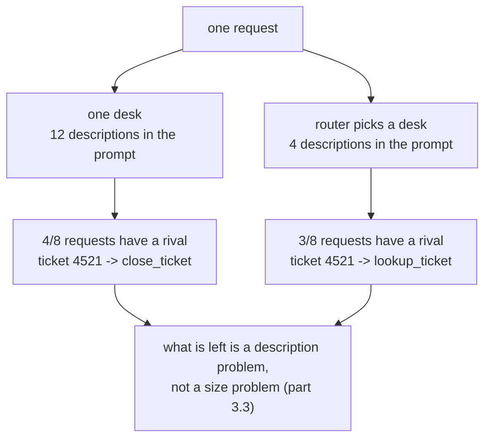

# 1.1 — One counter, and everything behind it

## One-line answer

Adding a twelfth tool to one agent does not make it twelve times more capable; it makes every
request a harder choice, and the lab measures the pressure: **four requests out of eight had a
rival tool within one point at twelve tools, against three out of eight at four**, with the
twelve-tool desk picking `close_ticket` for *"what does ticket 4521 say"*.

## The story

There is a hardware shop near where I grew up with exactly one counter and one man behind it.
Everything is behind him: taps, screws, paint, keys, gas bottles, garden hose, light bulbs. You ask
for a washer for a dripping tap. He turns around and looks at a wall with four thousand small
drawers on it.

He is good. He usually finds it. But you can watch the moment where he decides — the pause, the
half-step to the left, the second look at the drawer labels. And you can watch what happens on a
Saturday when the shop is full. He brings you a washer that is nearly right, because *nearly right*
was in the drawer he was already standing next to.

Now walk into the big place on the main road. Four counters: plumbing, electrical, paint, keys. You
state your problem once at the door and someone points. The man on plumbing has one wall of drawers
instead of four, and he has never once handed anybody a light bulb.

Nothing about the second shop is cleverer. It stocks the same things. The difference is how many
drawers are in front of one person at the moment they have to choose.

## The idea in plain language

An agent chooses a tool by reading descriptions. That is all it has. Day 10 established the
mechanism — [the docstring is the
description](../../../day-10-function-tools/parts/01-the-form-fills-itself/1.2-the-docstring-is-the-description.md)
— and the description is what the model reads when it decides which function to call. There is no
type system, no registry, no lookup. Twelve tools means twelve descriptions in the prompt, and one
of them has to look more like the request than the other eleven.

Two things get worse as that list grows, and they are worth keeping apart because they have
different fixes.

**Contention.** Descriptions overlap. `lookup_ticket` says it reads a ticket. `search_archive` says
it finds similar tickets. `close_ticket` says it closes a ticket. All three claim the word
*ticket*, so a request containing the word *ticket* is a three-way argument. Contention is not
about the model being weak. It is about the list being ambiguous. Adding a thirteenth tool that
also mentions tickets makes it worse for every request, including the ones the new tool has nothing
to do with.

**Prompt weight.** Every description is sent on every request. Day 24 measured this as the thing
that is [charged again every
turn](../../../day-24-token-accounting-and-budgets/parts/01-what-a-request-costs/1.2-charged-again-every-turn.md).
Twelve descriptions are twelve descriptions of tax on a request that will use one of them.

**Delegation** is the fix this section is about, and here is the plain definition before any
framework word appears: *delegation is splitting one worker's job across several workers, and
deciding at request time which one does it.* That is the shop with four counters. The stock did not
change. The number of drawers in front of the person choosing did.

Two words that will be used from here on:

- **Router** (also *lead*, also *coordinator*): the agent that reads the request and decides who
  handles it. In the shop, the person at the door who points.
- **Specialist**: an agent with a narrow job and a short tool list. The person on the plumbing
  counter.

## Why Sutra needs it

Day 58 assembles the triage graph end to end: intake, classify, research, draft, review. If every
one of those steps is a call to one agent that owns every tool the desk has, then the research step
can close a ticket and the review step can issue a refund, because nothing in the wiring says it
cannot. The split is not tidiness. It is what makes blast radius a property of the design rather
than a hope, which is Principle 13, and it is what Day 68 turns into real permissions.

It also decides today's shape. Sections 4 and 5 are two different mechanisms for handing work to a
specialist. Neither is worth learning until you can say why you would split at all.

## The mechanism

The measurement is `select.py`. It does **not** claim to show a model choosing badly — that would
need a live model and a claim no offline lab can support. It measures the thing that is true
whichever model you plug in: for each request, how many tools score within one point of the winner.
Call it contention. It is the number of drawers the man is deciding between.

```bash
cd days/day-55-delegation-and-transfer/lab
uv run python select.py
```

**Line by line:**

- `select.py` holds twelve tools, each with the words its description claims, and eight requests a
  support desk actually receives.
- The scorer counts how many of a tool's claimed words appear in the request. It is not a model,
  and its docstring says so; it stands in for one so the *structure* can be measured for free
  (Principle 15 — a structural fact should not cost a request).
- A tool counts as a **rival** when it scores within one point of the winner. One point, not zero,
  because a description a model reads is not a word count, and near-ties are where it goes wrong.

Measured on 2026-09-05:

```text
  CONTENDED  what does ticket 4521 say              close_ticket      rivals: lookup_ticket, search_archive
  CONTENDED  open the screenshot the customer sent  read_attachment   rivals: list_recent, lookup_ticket, post_reply, refund_order
  CONTENDED  send the customer the invoice again    reissue_invoice   rivals: post_reply
  clear      has a similar ticket come up before    search_archive    rivals: -
  clear      this is urgent, raise the priority     set_priority      rivals: -
  clear      the customer wants their money back    refund_order      rivals: -
  CONTENDED  which billing plan are they on         check_plan        rivals: reissue_invoice
  clear      close the ticket, it is resolved       close_ticket      rivals: -

  one desk, twelve tools
  tools offered per request   12
  requests with a rival       4/8
```

Read the first line before the summary. The request is *"what does ticket 4521 say"* and the winner
is **`close_ticket`**. Not because closing is a sensible reading of that sentence, but because
`close_ticket` claims the word *ticket*, `lookup_ticket` claims *ticket* and *say*, and on a
twelve-item list a near-tie went the wrong way. That is what a crowded list does. It turns a clear
request into a coin toss between three plausible drawers.

The second line is the one nobody predicts. *"open the screenshot the customer sent"* has **four**
rivals, because `open` is claimed by `read_attachment`, `lookup_ticket` and `list_recent`, and
`customer` is claimed by `post_reply` and `refund_order`. Two ordinary words, four competitors.
Nobody wrote those descriptions to overlap. They overlapped because twelve people wrote twelve
descriptions on twelve different days and nobody ever read them side by side.

Now split the same twelve tools across three counters, routing by subject first:

```bash
uv run python select.py --split
```

**Line by line:**

- `--split` puts the same twelve tools into three desks of four, and routes each request to the
  desk that owns it before any tool is chosen.
- Nothing about the tools changed: the same names, the same claimed words, the same requests. Only
  the size of the list at the moment of choosing changed.

```text
  CONTENDED  what does ticket 4521 say              lookup_ticket     rivals: search_archive
  CONTENDED  open the screenshot the customer sent  read_attachment   rivals: list_recent, lookup_ticket
  clear      send the customer the invoice again    reissue_invoice   rivals: -
  clear      has a similar ticket come up before    search_archive    rivals: -
  clear      this is urgent, raise the priority     set_priority      rivals: -
  clear      the customer wants their money back    refund_order      rivals: -
  CONTENDED  which billing plan are they on         check_plan        rivals: reissue_invoice
  clear      close the ticket, it is resolved       close_ticket      rivals: -

  three desks, four tools each
  tools offered per request   4
  requests with a rival       3/8
```

Three things moved, and the second is the important one.

1. **Tools offered per request fell from twelve to four.** Two thirds of the descriptions are no
   longer in the prompt for any given request.
2. **`what does ticket 4521 say` now wins with `lookup_ticket`.** The wrong answer was not fixed by
   a better description. It was fixed by removing `close_ticket` from the room.
3. **Contention fell from four out of eight to three out of eight** — and *not* to zero.



## When it breaks

The break is the number that did **not** go to zero.

`which billing plan are they on` is contended before the split and still contended after it, with
the same rival: `check_plan` and `reissue_invoice` both claim the word *billing*. The split put
them on the same desk, so it did nothing for them at all.

That is the honest limit of this part, and it is why section 3 exists. Splitting fixes contention
*between subjects*. It cannot fix two tools on one desk that describe themselves the same way. If
you split a desk and the ambiguity survives, the problem was never the size of the list. It was two
descriptions claiming the same job, and the repair is in
[3.3](../03-the-description-routes/3.3-writing-a-description-that-routes.md).

The other break is the one you cause by over-splitting. Push it far enough and every specialist
holds one tool, at which point the router is choosing between twelve specialists instead of twelve
tools. You have moved the identical problem up one level and added a request to every ticket, which
[6.1](../06-price-of-a-handoff/6.1-a-handoff-costs-a-request.md) prices. There is no free split.
There is a size that is neither extreme, and it is found by measuring rather than by taste.

## In production

**What a professional writes instead.** They do not start from "how many tools should an agent
have". They start from the audit question: *what is the worst thing this agent can do in one turn?*
An agent holding `refund_order` can move money. An agent holding `lookup_ticket` can read a row.
Those two do not belong in the same list however well the model chooses, because the split is a
containment boundary first and a routing improvement second. Day 68 makes that formal.

**What degrades at scale.** Tool lists grow in one direction and nobody ever removes one. The
description of the fourteenth tool is written by someone who has not read the other thirteen, so
contention rises with team size rather than with request volume. The measurable version is a
contention report in the quality gate: score every tool against a fixed request set, and fail the
build when a new tool creates a rival for an existing one. It costs no quota and it catches the
drawer-next-to-the-one-you-were-standing-at problem before a customer does.

**The failure that only appears with real traffic.** Contention is invisible on your own test
questions, because you wrote them in the vocabulary of the tool you were thinking about. Real users
write *"the invoice thing again"*. Short, vague requests are exactly where a crowded list fails,
and short, vague requests are most of real traffic. Your evalset reports that routing is fine.

**The review comment a senior engineer leaves:** *"This agent now has eleven tools and four of them
mention tickets. Before you add the twelfth, run the contention check and show me which existing
tool it competes with. If the answer is `search_archive`, one of those two descriptions is wrong,
and adding a specialist will not fix it."*

**The interview question:** *"Why would you split one agent into three?"* An honest answer: *"Two
reasons, and only one of them is about quality. The routing reason is contention. I measured a
twelve-tool desk where four requests out of eight had a rival tool within one point, and one of
them picked `close_ticket` for 'what does ticket 4521 say' purely because the list was crowded.
Splitting the same twelve tools across three specialists took that to three out of eight and fixed
that request. The second reason is containment: an agent that can issue refunds and an agent that
can read tickets should not be the same agent, whatever the routing looks like. And I'd say what
the split does not fix — two tools on the same desk claiming the same words are still ambiguous
afterwards, so the description work is a separate job."*

## Check yourself

```bash
cd days/day-55-delegation-and-transfer/lab
uv run python select.py
uv run python select.py --split
```

Now open `select.py`, add a thirteenth tool called `escalate_ticket` claiming `("escalate",
"ticket", "urgent")`, and re-run both. Write down what happened to `this is urgent, raise the
priority`.

**Out loud, without scrolling up:** state the two separate reasons to split one agent into three,
and name the kind of ambiguity that splitting does *not* fix.

**Next:** [1.2 — The handbook that served four jobs](1.2-the-handbook-that-served-four-jobs.md).
