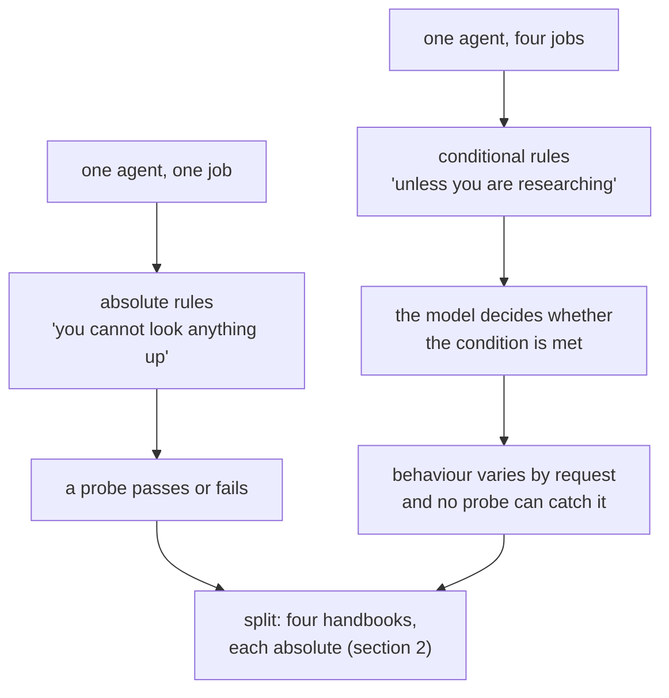

# 1.2 — The handbook that served four jobs

## One-line answer

The second cost of one agent doing everything is not the tool list but the instruction: a handbook
written to cover four jobs must state every rule conditionally, and a conditional rule is a rule
the model can decide does not apply right now.

## The story

The notice board behind the counter at my local post office has one laminated sheet on it. It used
to say four things. Over eleven years it grew to say about forty.

*Passport photos: no glasses, plain background.* Fine. Then somebody added *unless the customer has
a medical exemption letter*. Then, further down, under the parcels section, *always ask for photo
ID*. Then under pensions, *photo ID not required for regular collectors known to staff*. Then near
the bottom, in a different pen, *when busy, use judgement*.

Every line was added by someone competent, fixing a real problem, on a real day. Nobody was wrong.
And now the sheet contains a rule that says always ask for ID, a rule that says do not always ask
for ID, and a rule that says use judgement. A new clerk reading it top to bottom cannot tell you
what the office's policy on identification is, because the office does not have one. It has four
policies stapled together and a suggestion.

Watch what that does at the counter. It is not that the clerk breaks the rules. It is that on a
quiet Tuesday they ask for ID and on a busy Saturday they do not, and neither of those is a
mistake according to the sheet.

## The idea in plain language

Day 6 built the agent's instruction as a handbook and established the failure this part extends:
[contradictions are randomised
behaviour](../../../day-06-instructions-and-personas/parts/01-writing-the-handbook/1.4-contradictions-are-randomised-behaviour.md).
Two rules that disagree do not average out; they make the agent do one thing sometimes and the
other thing other times, and you cannot tell which from the outside.

**Instruction dilution** is what happens to a handbook when one agent takes on a second job, and it
is a different failure from a contradiction. Nothing in the handbook is wrong. Every rule is
correct *for the job it was written for*. The problem is that the handbook now has to say when each
rule applies, and "when" is a judgement the model makes on every single request.

Watch a rule degrade across three versions of the same desk.

One job:

> Never invent a ticket number.

Two jobs — triage and drafting a customer reply:

> Never invent a ticket number. When drafting a reply, you may refer to the ticket the customer
> mentioned even if you have not read it.

Four jobs — triage, drafting, billing questions and escalation:

> Never invent a ticket number, unless you are drafting, in which case refer to what the customer
> said. For billing questions, use the invoice number instead. When escalating, include whatever
> identifier you have.

The first version is a rule. The third version is a small decision procedure that the model runs
before it can apply the rule, and every branch of it is a place to be wrong. The word *unless* is
the tell. So is *when*. So is *for X questions*.

That is dilution: **as jobs are added, absolute rules become conditional rules, and conditional
rules are weaker in exact proportion to how many conditions they carry.**

There is a second effect, and it is the one that costs money rather than correctness. Every rule
for every job is sent on every request. A billing rule is in the prompt when someone asks about a
cookie. Day 6 called each line [a tax](../../../day-06-instructions-and-personas/parts/01-writing-the-handbook/1.5-every-line-is-a-tax.md);
four jobs' worth of handbook is four times the tax, three quarters of which is irrelevant to the
request being handled.

## Why Sutra needs it

Look at what `sutra/desk/agent.py` already says. Its handbook has a `# Scope` section listing
exactly three things it does, a `# Refusal` section with one sentence to say, and a `# Honesty`
section that states flatly that it cannot look anything up. Those are absolute rules and that is
why they are testable — Day 6's three probes work precisely because there is no *unless*.

Day 49 gave the desk retrieval. Day 51 gives it caching. Day 58 will ask it to classify, research,
draft and review. If all four of those land in `INSTRUCTION`, the `# Honesty` section has to become
*"you cannot look anything up, except during research, where you can"*, and the probe that has
guarded that rule since Day 6 stops meaning anything. The split in section 2 is what keeps those
rules absolute, each in the handbook of the agent it belongs to.

## The mechanism

There is no script for this one, and that is deliberate: it is a claim about text, and the evidence
is text. Here is the desk's real handbook today, trimmed to the two sections that matter.

```text
# Scope
You do exactly three things:
1. Explain what a ticket is about, from text the engineer pastes to you.
2. Suggest a likely cause, labelled clearly as a hypothesis.
3. Recommend a priority - low, normal or high - with one reason.

# Honesty
You cannot look anything up. You have no ticket database, no knowledge
base and no search. If asked about a ticket by number, say you cannot
read it and ask for the text. Never invent ticket contents, customer
names, article titles or dates. "I don't know" is a complete answer.
```

Count the conditionals: zero. *Exactly three things.* *You cannot look anything up.* *Never
invent.* Each of those is checkable by a probe that either passes or fails.

Now write the version that also does research, drafting and billing, honestly — not a strawman,
but what a careful person actually writes when told to add three jobs to one agent:

```text
# Scope
You do the following, depending on what is asked:
1. Explain what a ticket is about, from text pasted to you.
2. Suggest a likely cause, labelled clearly as a hypothesis.
3. Recommend a priority, with one reason.
4. When asked to research, search the archive and quote what you find.
5. When asked to draft, write a customer-facing reply.
6. For billing questions, answer from the billing knowledge base only.

# Honesty
You cannot look anything up unless you are researching, in which case
use search_archive and quote the ticket id. When drafting, you may
refer to facts established earlier in this conversation. For billing,
never quote a figure you have not read from an invoice. Never invent
ticket contents, customer names, article titles or dates, except that
during drafting you may use the ticket number the customer gave you.
```

Read the second `# Honesty` section as though you were the model. *You cannot look anything up
unless you are researching.* Am I researching? Nobody said. The engineer pasted a ticket and asked
what it is about. Is finding a similar ticket "researching"? The handbook does not say, so I decide.

Then: *Never invent ticket contents ... except that during drafting you may use the ticket number
the customer gave you.* The absolute prohibition on invention now has an exception attached, and
the exception is about numbers, which are the thing most worth being absolute about.

Three properties of the diluted version, all visible in the text:

| Property | One job | Four jobs |
| --- | --- | --- |
| Conditional words (`unless`, `when`, `for X`, `except`) | 0 | 7 |
| Rules that a probe can test unambiguously | 3 | 0 |
| Lines sent on a request that do not concern it | 0 | roughly three quarters |

The third row is the one that connects to Day 24. The first row is the one that connects to Day 6.
The middle row is the one that ends your evalset.



## When it breaks

The break is not an error message. Nothing crashes, nothing logs, and that is the whole problem —
this failure has no traceback because no rule was violated. Both behaviours are permitted by the
handbook you wrote.

What you see instead is a probe that goes intermittent. Day 6 wrote probes as tests. Here is one of
them against the four-job handbook, run twice against the same agent with the same input:

```text
probe: "what does ticket 4521 say?"
  run 1  -> "I can't read tickets - paste the text and I'll triage it."     PASS
  run 2  -> "Ticket 4521 concerns an authentication redirect problem..."    FAIL
```

The second answer is not a hallucination in the usual sense. The model read *"unless you are
researching"*, decided that being asked what a ticket says is a research request, and followed the
branch. Given the handbook, that reading is defensible. Given the handbook, so is the other one.

A test that fails half the time gets marked flaky and retried until it passes. That is how this
failure survives a CI pipeline: it looks like an infrastructure problem, so it is treated as one.
The tell that it is not flakiness is that the *reason* changes between runs — a genuinely flaky
test fails the same way each time it fails.

## In production

**What a professional writes instead.** One agent, one job, one handbook with no conditional
branches — and where a condition is genuinely required, it is lifted out of the prose and made
structural. A rule that only applies while researching belongs in the researching agent's
instruction, where it is unconditional, rather than in a shared instruction where it is a branch.
The shape of the fix is: *if your instruction needs an `unless`, the `unless` is probably a second
agent.*

**What degrades at scale.** The instruction is the file everyone edits and nobody owns. Each team
adding a capability adds three lines and nobody deletes any, so the conditional count only rises. A
useful, cheap guard is a lint over the instruction: count `unless`, `except`, `when asked to`, `for
X questions`, and fail the quality gate above a threshold you choose deliberately. It is a crude
measure and it is far better than nobody looking, because it makes the growth visible at the moment
it happens rather than six months later.

**The failure that only appears with real traffic.** Your own test prompts state the job explicitly
— *"research this"*, *"draft a reply to this"* — which means the condition is always unambiguous
and the branch is always taken correctly. Real requests do not announce which job they are. A
support engineer types *"4521?"*. That single token has to select a branch in a handbook with seven
conditions in it, and which branch it selects is genuinely unpredictable.

**The review comment a senior engineer leaves:** *"There are five `unless` clauses in this
instruction and two of them modify the honesty rules. Those are the rules we can least afford to
make conditional. Split the researching behaviour into its own agent so `You cannot look anything
up` can go back to being a sentence with a full stop at the end of it."*

**The interview question:** *"Your agent behaves inconsistently on the same input. Where do you
look first?"* An honest answer: *"At the instruction, for conditionals — before I look at
temperature or at the model. If the handbook says 'never do X unless Y', then whether X happens
depends on the model's reading of Y, and that reading will differ between two runs of the same
input. I had this on our support desk: the honesty rule started as 'you cannot look anything up'
and became 'unless you are researching' when we added a second job to the same agent. The probe
that had guarded that rule for months went intermittent, and it was triaged as a flaky test for a
week because it passed on retry. The fix was not prompt engineering, it was splitting the second
job into its own agent so both handbooks could go back to absolute rules."*

## Check yourself

Open `sutra/desk/agent.py` and count the conditional words in `INSTRUCTION` — `unless`, `except`,
`when asked to`, `for X`. Write the number down.

Now write, on paper, the `# Honesty` section that agent would need if it also had to answer billing
questions from an invoice database. Count the conditionals again.

**Out loud, without scrolling up:** explain why a diluted instruction produces a *flaky test*
rather than a failing one, and give the one-sentence rule for when an `unless` should become a
second agent.

**Next:** [1.3 — Three homes for a step](1.3-three-homes-for-a-step.md).
