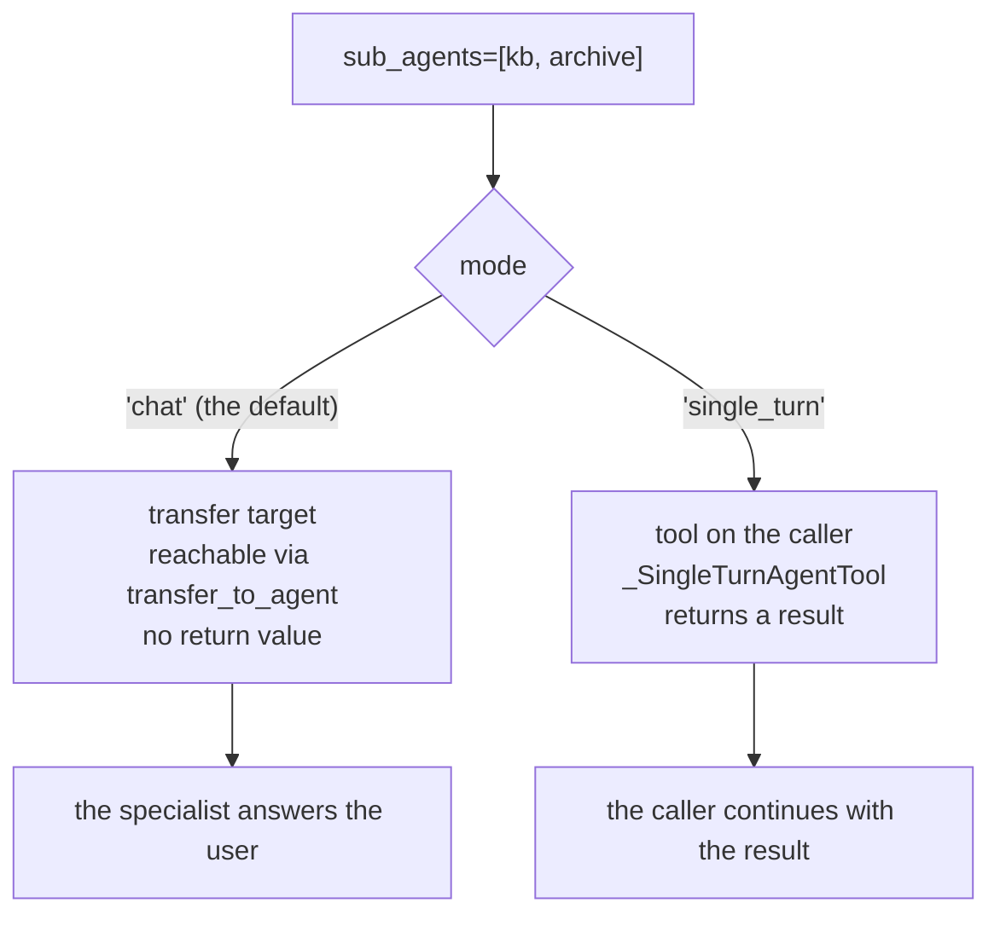

# 2.1 — A call comes back

## One-line answer

The whole of today rests on one difference: **an agent-as-tool call returns a result to the caller,
and a transfer does not return at all** — and in ADK 2.7.1 that difference is one word in the
sub-agent's definition, which moves it out of the transfer list and into the tool list.

## The story

You ring your bank about a charge you do not recognise.

The person who answers listens, then says "let me check something, hold on". You hear a click, some
silence, another click, and she is back. "That's a pre-authorisation from the hotel, it'll drop off
in a few days." You never spoke to whoever she checked with. You did not know their name. As far as
your afternoon is concerned, that person does not exist — the woman who answered asked a question,
got an answer, and carried on being the person you were talking to.

The second time you ring, about closing an account, it goes differently. She listens and says "I'll
put you through to retentions." Click. A different voice, a different name, a different script. And
when you then remember you also wanted to ask about the hotel charge, you ask *him*, because he is
who you are talking to now. Nobody is going to put you back.

Both calls were one phone call to one bank. In one of them the person you were talking to stayed
the person you were talking to. In the other, she left.

## The idea in plain language

Those two shapes have names in every system that has ever had more than one worker.

A **call** — in ADK, a sub-agent declared `mode="single_turn"` — is a question with a return value.
The caller decides to ask, asks, waits, and receives a result. Then the caller continues. It is the
same shape as calling a function: control leaves and comes back, and the thing that comes back is
data the caller can inspect, use, or ignore.

A **transfer** — in ADK, `transfer_to_agent` — is a change of who is answering. The caller decides
to hand over, and that is the last thing it does on this turn. There is no return value, because
there is nobody left waiting for one. The specialist does not report back to the lead; it answers
the user.

Two consequences follow immediately, and they are the reason this distinction is worth its own
document.

**A call has a place to put a bad answer.** If the specialist returns something wrong, empty or
unusable, the caller is still running and can do something about it: ask again, ask someone else,
say "I could not find that". A transfer has no such place. Whatever the specialist says *is* the
answer, because it is speaking to the user directly.

**A transfer has a place to put a long conversation.** If what follows is genuinely five turns of
billing questions, a transfer costs one hand-over and then billing simply handles them. Doing the
same thing with calls means the lead sits in the middle of every one of those turns, paying a
request each time to pass messages back and forth.

Neither is the better one. They answer different questions, and section 1's decision procedure is
how you pick.

## Why Sutra needs it

The desk's research step is the case that decides today's build. Day 58's triage graph reads a
ticket, finds similar past tickets, and then drafts a reply that quotes the fix. The drafter must
still be running when the research comes back, because it has a reply to write. So research is a
call, and the whole reason `sutra/delegation.py` exists in tonight's build brief is to get that
word right the first time.

The other case — a ticket that turns out to be a refund dispute — is a transfer, and the same file
has to hold both, because a real desk does both.

## The mechanism

Here is the fact that makes this concrete and that no amount of prose replaces: in ADK 2.7.1 you do
not choose between two different APIs. You attach the specialist the same way and change one field.
`staff.py` builds a real lead with two real sub-agents and prints what the framework did with them.

```bash
cd days/day-55-delegation-and-transfer/lab
uv run python staff.py
```

**Line by line:**

- `build()` creates two `LlmAgent` specialists and one lead, and passes the specialists as
  `sub_agents=[...]`. That is the only attachment there is.
- `_get_transfer_targets(lead)` is ADK's own function, imported from
  `google.adk.flows.llm_flows.agent_transfer`. It returns the agents this lead may transfer to.
- `lead.tools` is the ordinary tool list. Whatever appears there is something the lead can *call*.
- No model is constructed and no request is sent. Both of these are request-building code paths,
  which is why the whole demonstration is free.

Verified against `google-adk` 2.7.1 (`google/adk/flows/llm_flows/agent_transfer.py`) and
adk.dev/workflows/collaboration/ on 2026-09-05.

Measured on 2026-09-05:

```text
sub-agent modes
  kb_specialist        mode='chat'
  archive_specialist   mode='chat'

tools on the lead
  none

transfer targets
  ['kb_specialist', 'archive_specialist']
```

Both specialists are transfer targets. The lead has no tools. If the lead's model wants either
specialist, its only route is to hand the conversation over.

Now change one word — `mode="single_turn"` on `kb_specialist` — and run again:

```bash
uv run python staff.py --single-turn
```

**Line by line:**

- `--single-turn` sets `mode="single_turn"` on `kb_specialist` only. `archive_specialist` is
  untouched, so the two can be compared inside one run.
- Nothing else in the file changes: same names, same descriptions, same `sub_agents=[...]` list.

```text
sub-agent modes
  kb_specialist        mode='single_turn'
  archive_specialist   mode='chat'

tools on the lead
  [('_SingleTurnAgentTool', 'kb_specialist')]

transfer targets
  ['archive_specialist']
```

`kb_specialist` has moved. It is no longer in the transfer list; it is in the tool list, wrapped in
`_SingleTurnAgentTool` and named after itself. The lead can now **call** it and get a result, and
can still **transfer** to `archive_specialist`.

Notice the first line of the first run: the modes printed `'chat'` although the code passed
`mode=None`. ADK fills that in. From `google/adk/agents/llm_agent.py`, verified 2026-09-05:

```text
  Default value is chat as a sub-agent, single_turn as a node in a workflow.
```

So a sub-agent you attach without saying anything is a transfer target. The default is the
hand-over, not the call. That is worth knowing before you attach your first specialist, because it
means the more generous of the two options is the one you get by not choosing.



## When it breaks

The break is reaching for the 1.x spelling, and it fails loudly, which is the good kind.

Before ADK 2.x, wrapping an agent as a tool was written `AgentTool.create(agent)`, and that shape
is all over tutorials and in this curriculum's own legacy draft of this day. On 2.7.1:

```text
Traceback (most recent call last):
  File "<string>", line 5, in <module>
AttributeError: type object 'AgentTool' has no attribute 'create'
```

There is no `create` classmethod. The constructor is `AgentTool(agent, skip_summarization=False, *,
include_plugins=True, propagate_grounding_metadata=False)` — and even that is not the spelling you
want, for reasons [5.3](../05-agent-as-tool/5.3-the-session-it-does-not-share.md) measures. The
error is a gift: it stops at import rather than producing an agent that silently behaves like
something else.

The quieter break is the one with no error at all. Attach a specialist with no `mode`, expect a
call, and you get a transfer — because `chat` is the default. Nothing raises. The lead simply
stops talking after the first hand-over, and the reply your graph was going to write never gets
written. That is [7.2](../07-failure-lab/7.2-the-handover-that-never-came-back.md) in full.

## In production

**What a professional writes instead.** They set `mode` explicitly on every sub-agent, including
the ones where the default is what they want. It is the same discipline as ADK-73's rule about
pinning the model rather than accepting the default: a field whose value came from a framework
default is a field nobody decided, and this particular default is the difference between "asks a
question" and "gives away the conversation". A one-word field is cheap to write and expensive to
have wrong.

**What degrades at scale.** The two shapes have different failure surfaces, and a system that uses
them interchangeably gets both. Calls nest — a caller can call a specialist that calls another —
so their cost is multiplicative and their latency adds up along the chain
([8.1](../08-in-production/8.1-how-deep-is-defensible.md)). Transfers do not nest; they replace, so
their cost is flat but you lose the ability to intervene. Under load these behave differently
enough that "which one is this?" becomes the first question in every incident.

**The failure that only appears with real traffic.** In testing, one request goes in and one answer
comes out, so a transfer and a call look identical from the outside — both produce a sensible
reply. The difference shows on turn two, and there is no turn two in most test suites. The cheapest
guard is an eval with a *second* turn on a different subject, which is exactly what `lost.py` is.

**The review comment a senior engineer leaves:** *"Every one of these five sub-agents has no `mode`,
which means all five are transfer targets. Was that the intent? Three of them return a fact the
caller formats, so they should be `single_turn`. Right now any one of them can end up owning the
conversation, and the lead's summarising step will never run."*

**The interview question:** *"What is the difference between agent-as-tool and agent transfer?"* An
honest answer: *"A call comes back and a transfer does not. With agent-as-tool the caller asks a
bounded question, gets a result, and keeps going — so it can check the result, retry, or fall back.
With a transfer the caller's turn is over; the specialist answers the user directly and control
returns only if somebody transfers back. In ADK 2.7.1 both are attached the same way, with
`sub_agents=[...]`, and the choice is the sub-agent's `mode` field: `single_turn` puts it in the
caller's tool list, and the default `chat` leaves it as a transfer target. I set it explicitly
every time, because the default is the one that gives away more."*

## Check yourself

```bash
cd days/day-55-delegation-and-transfer/lab
uv run python staff.py
uv run python staff.py --single-turn
```

Now edit `staff.py` so that `archive_specialist` is also `single_turn`, and predict — before you
run it — what `transfer targets` will print. Then run it.

**Out loud, without scrolling up:** state the one-sentence difference between a call and a
transfer, name the field that selects between them, and say what its default is.

**Next:** [2.2 — Who owns the turn afterwards](2.2-who-owns-the-turn.md).
