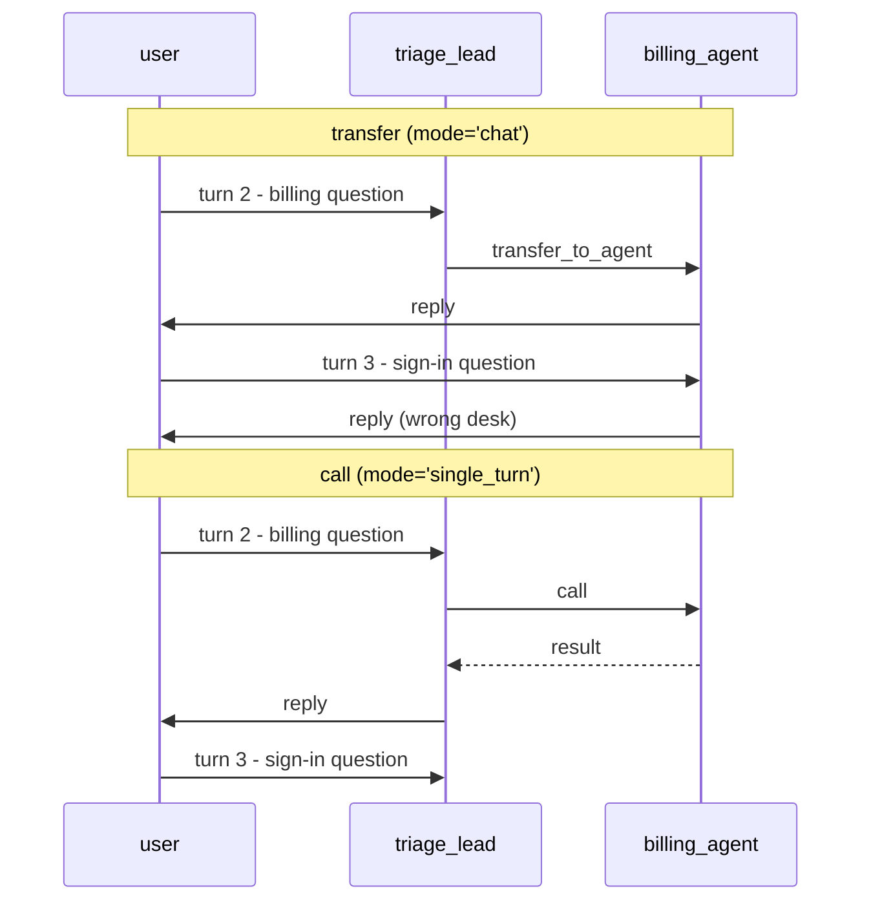

# 2.2 — Who owns the turn afterwards

## One-line answer

After a call, the caller speaks last and the user never learns the specialist existed; after a
transfer, the specialist speaks last and every following turn goes to it — which is why a hand-over
that nobody reverses ends with **three turns out of five answered by the wrong desk**.

## The story

At the passport office they take your file off you at the first window and it goes into a plastic
tray. You watch it travel. Window one checks your form, then puts the tray on a shelf behind
window two. Window two calls your name.

Halfway through, window two needs to know whether your old passport counts as proof of address.
She does not send you anywhere. She leans back, asks the supervisor sitting behind her, gets a
nod, and carries on. Your file never left her desk. From where you are standing, nothing happened
at all.

Later, she stamps the form and says "this one needs the citizenship team". Your file goes into a
different tray, and a man from a different room comes and takes it. When you then remember you
wanted to change the delivery address, you have to ask him, and he has to look at a screen he has
only just opened, and he asks you to say the whole thing again.

The tray is the point. Whoever is holding the tray is who you are dealing with. A question asked
over a shoulder does not move the tray. A hand-off does.

## The idea in plain language

The **turn** is the unit of a conversation: one user message, and everything the system does before
it comes back and speaks. The question this part answers is who is holding the turn at each moment,
and — crucially — who is holding it when the turn ends, because that is who holds the *next* one.

**During a call:** the caller holds the turn throughout. The specialist runs, produces a result,
and finishes. The caller then speaks. The user sees one reply, in the caller's voice, and cannot
tell from the outside that a specialist was involved unless the caller says so. When the next user
message arrives, it goes to the caller, because the caller never let go.

**During a transfer:** the caller holds the turn until it hands over, and then it is finished for
this turn. The specialist produces the reply the user sees. When the next user message arrives, it
goes to the specialist, because the specialist is the agent now in play.

That last sentence is the one people miss, and it is where the cost lives. A transfer is not scoped
to the request that caused it. It changes who the conversation is with, indefinitely, until
something changes it back.

There are exactly three ways it changes back, and it is worth having them explicitly:

1. **The specialist transfers back.** It decides — reads the next message, judges it not to be its
   job, and calls `transfer_to_agent` naming the lead. A decision, not a guarantee.
2. **Somebody wired a return.** The graph or a callback moves control at a known point. This is a
   Day 53/54 mechanism, not a delegation mechanism.
3. **The session ends.** The conversation is over and the next one starts fresh at the lead.

Nothing in that list is automatic for a `chat`-mode transfer. Option 1 is the usual answer, and it
depends on a model deciding to give up work it currently owns.

## Why Sutra needs it

The desk's whole value is that a support engineer types into one place. If the third question in a
session is silently being answered by an agent that was brought in for the second question, the
engineer has no way to know, and the answers get subtly wrong in a way that reads as the desk
having lost the plot. Day 58's graph has five stations, and if any hand-over between them is a
transfer that does not come back, the stations after it never run.

It also sets up Day 63. An approval gate has to know *who is asking* for the approval. If the
conversation has quietly migrated to a different agent, the approval request comes from an agent
the user did not think they were talking to, which is precisely the shape of a confused-deputy
problem — Day 68's subject.

## The mechanism

`lost.py` runs a five-turn conversation. Turn 2 is a billing question and is correctly handed to
the billing agent. Turns 3, 4 and 5 are sign-in questions. Nobody hands back.

```bash
cd days/day-55-delegation-and-transfer/lab
uv run python lost.py; echo "exit: $?"
```

**Line by line:**

- `build()` makes a real lead with one real `billing_agent` sub-agent, so `billing.mode` and
  `lead.tools` are the framework's answers, not the script's.
- `holder` tracks who owns the turn. It changes on the hand-over and never changes back, which is
  the whole claim being demonstrated.
- The topic of each turn is written into the fixture, so "wrong desk" is a fact about the fixture
  rather than a judgement about an answer.
- The script exits non-zero when any turn is answered by the wrong desk: it is an eval, and it can
  go red (Principle 11).

Measured on 2026-09-05:

```text
billing_agent mode = 'chat'
reachable as a tool = False

  turn 1  ok    triage this ticket about a failed sign-in            answered by triage_lead
  turn 2  ok    also, why was this account charged twice             answered by billing_agent
  turn 3  WRONG back to the sign-in problem - which kb article covers it answered by billing_agent
  turn 4  WRONG is the session cookie the cause                      answered by billing_agent
  turn 5  WRONG what priority should i give the sign-in ticket       answered by billing_agent

  conversation ends held by      billing_agent
  answered by the wrong desk     3/5
exit: 1
```

Turn 2 is correct. That is the part worth sitting with: **the routing decision was right**, and it
still produced three wrong answers, because the decision had a scope nobody chose. The lead decided
one thing — *this message is billing's* — and the framework applied it to everything after.

Now make the same hand-off a call:

```bash
uv run python lost.py --single-turn; echo "exit: $?"
```

**Line by line:**

- `--single-turn` sets `mode="single_turn"` on `billing_agent`. As
  [2.1](2.1-a-call-comes-back.md) showed, that moves it into the lead's tool list.
- The lead therefore never stops holding the turn: it calls billing, gets a result, and speaks.

```text
billing_agent mode = 'single_turn'
reachable as a tool = True

  turn 1  ok    triage this ticket about a failed sign-in            answered by triage_lead
  turn 2  ok    also, why was this account charged twice             answered by billing_agent
  turn 3  ok    back to the sign-in problem - which kb article covers it answered by triage_lead
  turn 4  ok    is the session cookie the cause                      answered by triage_lead
  turn 5  ok    what priority should i give the sign-in ticket       answered by triage_lead

  conversation ends held by      triage_lead
  answered by the wrong desk     0/5
exit: 0
```

Turn 2 is still answered by billing — the specialist still did the work. What changed is that the
turn came home. Three out of five to zero out of five, from one word.



## When it breaks

The failure has no error text, which is why it needs a fixture to see at all. What it produces in
the wild is a support ticket that reads: *"the assistant got weirdly focused on billing and
wouldn't answer anything else"*.

There is a second-order break worth naming, because it is the one that makes this expensive to fix
later. Once a transfer has happened, the specialist's own view of the conversation is the branch it
has been running in, and it answers turn 3 with whatever context it has. It does not say *"I am the
billing agent and this is not my area"* unless its handbook tells it to, and most handbooks do not,
because they were written by someone imagining the agent only ever receives its own kind of
question.

So the observable symptom is not refusal. It is a confident, fluent, wrong-desk answer. The
strongest cheap defence is a line in every specialist's handbook: *"If a request is not about
invoices, transfer back to `triage_lead` and say nothing else."* That is a mitigation, not a fix,
because it is still a model decision — but it converts a silent failure into one the agent at least
attempts to handle.

## In production

**What a professional writes instead.** They make return explicit rather than hoping for it. Two
common shapes: give the specialist `disallow_transfer_to_peers=True` so it can only go back to the
lead ([4.3](../04-transfer-in-2x/4.3-parents-peers-and-two-switches.md) measures exactly what that
does), or avoid `chat` mode for anything that is not genuinely a multi-turn ownership change. A
useful rule of thumb from real systems: **transfer only to agents that can hold a whole
conversation with a human, and call everything else.** A knowledge-base lookup cannot hold a
conversation. Billing, with a real refund workflow behind it, can.

**What degrades at scale.** Session length. In a two-turn test, a stuck transfer costs one wrong
answer. In a thirty-turn support session it costs twenty-eight, and the longer the session, the
higher the chance the user has drifted onto a different subject. The metric that catches it is not
accuracy; it is *the distribution of which agent authored the final event*, per session, per turn
index. If the lead authors turn 1 and almost never authors turn 10, transfers are not coming back.

**The failure that only appears with real traffic.** Users change subject mid-session constantly,
and they do it without a signal — no "new question", just "and also". Your test set has one topic
per conversation because you wrote one topic per conversation. Production sessions have three.

**The review comment a senior engineer leaves:** *"This transfers to `kb_specialist`, which is a
lookup. After it answers, the user is talking to the knowledge-base agent for the rest of the
session, and that agent's handbook has no idea what to do with 'what priority should I give this'.
Make it a call. Keep transfers for agents that are supposed to own a customer."*

**The interview question:** *"What happens to the conversation after an agent transfer?"* An honest
answer: *"It belongs to the agent you transferred to, and not just for that message — for every
message after it, until something transfers back. There are only three ways back: the specialist
decides to hand back, you wired a return in the graph, or the session ends. I measured this on our
desk with a five-turn fixture: one correct hand-over on turn 2 and then three turns answered by the
billing agent, which was confidently wrong about session cookies. The routing decision was right;
its scope was what nobody chose. We changed it to a single-turn call and went from three wrong
answers to zero, and for the transfers we genuinely wanted we set `disallow_transfer_to_peers` so
the only way out is back to the lead."*

## Check yourself

```bash
cd days/day-55-delegation-and-transfer/lab
uv run python lost.py; echo "exit: $?"
uv run python lost.py --single-turn; echo "exit: $?"
```

Now add a sixth turn to `TURNS` that *is* a billing question, and re-run both. Write down which
version answers it at the billing desk and what that costs in the other version.

**Out loud, without scrolling up:** name the three ways control comes back after a transfer, and
say which of them the framework guarantees.

**Next:** [2.3 — Whose handbook is in force](2.3-whose-handbook-is-in-force.md).
