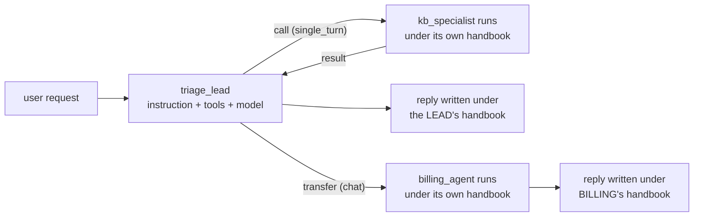

# 2.3 — Whose handbook is in force

## One-line answer

A hand-off swaps the whole rulebook — instruction, tools, model and refusals — for the
specialist's own, which is the reason a split works at all and also the reason the desk's carefully
tested refusal policy stops applying the moment control leaves it.

## The story

The two coffee shops on my street have the same sign over the door. Same logo, same cups, same
prices. They are not the same shop. One is company-owned and one is a franchise, and the difference
shows up in exactly one place: what happens when something goes wrong.

Spill a drink in the company one and they replace it, no questions, because the staff handbook has
a line about it. Spill a drink in the franchise and the man behind the counter says he will have to
ask the owner. He is not being difficult. His handbook is a different document. It was written by
someone else, for a business with different margins, and it does not contain that line.

From the pavement they are one brand. From behind the counter they are two sets of rules, and which
set you get depends entirely on which door you walked through.

## The idea in plain language

Day 6 established where an agent's instruction ends up: it becomes the system instruction on the
request, [assembled by the framework before the user's
message](../../../day-06-instructions-and-personas/parts/03-the-instruction-fields/3.1-where-your-instruction-lands.md).
An agent *is*, operationally, four things bundled together:

- its **instruction** — the handbook: scope, refusals, tone, honesty rules;
- its **tools** — what it can do;
- its **model** — which lane it runs in and what it costs;
- its **description** — what other agents are told about it (section 3's whole subject).

A hand-off replaces all four at once. That is not a side effect; it is the point. When the lead
transfers to `billing_agent`, the request that goes to the provider carries billing's instruction,
billing's tool declarations and billing's model. The desk's `# Refusal` section is not in that
prompt. It is not overridden or merged. It is simply not there.

This cuts two ways, and both matter.

**It is why splitting works.** Part 1.2 showed a handbook degrading as jobs are added. Separate
agents fix that because each handbook can be absolute again: the researching agent's instruction
can say *"always search before answering"* with no `unless`, precisely because it never has to
handle a drafting request.

**It is why a split is a security boundary you have to design.** Every rule you rely on has to
exist in every agent that could be the one answering. Test the desk's refusal policy for a hundred
prompts, hand over to a specialist, and you are now running a handbook that has been tested for
none of them.

There is one exception, and it is worth naming because it is the tool for the job:
`global_instruction` on the root agent applies across the tree. Day 6 covered it and flagged it as
[deprecated](../../../day-06-instructions-and-personas/parts/03-the-instruction-fields/3.4-the-deprecated-global-instruction.md),
so it is awareness, not a plan. 🅿️ The modern shape is to put cross-cutting rules where they cannot
be forgotten: a callback or plugin that runs for every agent, which is Day 13's and Day 14's
machinery and Day 67's subject.

## Why Sutra needs it

`sutra/desk/agent.py` has a `# Refusal` section with one exact sentence for out-of-scope requests,
and a `# Honesty` section forbidding invented ticket contents. Day 6 built three probes against
those. Tonight's build brief adds specialists. Unless every specialist's handbook carries the same
two rules, the desk's honesty guarantee has a hole in it the exact size of whatever the specialists
handle — and the probes will not find it, because probes are run against the root agent.

Day 66's threat model needs this stated plainly: an attacker who can steer a routing decision can
choose which rulebook applies to their request. That is not a hypothetical once transfers exist.

## The mechanism

The clean way to see this is to look at what the framework assembles, agent by agent. The desk's
own handbook, from `sutra/desk/agent.py`:

```text
# Refusal
Anything else is out of scope: refunds, release dates, account changes,
company policy. When asked, say this and nothing more:
"That's outside triage. I'll flag it for a human colleague."
```

Read the first word of the list: **refunds**. The desk refuses refunds. Now suppose tonight's build
adds a `billing_agent` whose job is refunds, and the lead can transfer to it. The rule above is a
rule of one agent, and the moment control moves, the agent in force is one whose entire purpose is
the thing the rule refuses.

That is not a bug. It is the design working. But it means the sentence *"Sutra refuses refunds"* is
no longer true of the system; it is true of one node in it.

Here is the discipline that makes it safe, written as the shape a specialist's instruction takes:

```text
# Role
You answer one knowledge-base question and return the article id and the fix.

# Scope
You do exactly one thing. Anything that is not a knowledge-base question:
transfer back to triage_lead and say nothing else.

# Honesty
Never invent an article id, a title or a fix. If nothing matches, say
"no matching article" and nothing more.
```

**Line by line:**

- `# Role` is one sentence with no "and", which is the one-idea test applied to an agent rather
  than to a document.
- `# Scope` carries the return instruction, because [2.2](2.2-who-owns-the-turn.md) established
  that nothing else brings the conversation home. This is the mitigation named there, written out.
- `# Honesty` **repeats** the root agent's invention rule in the specialist's own words. It is
  duplication, and it is deliberate: a rule that only exists in one handbook only applies while
  that handbook is in force.
- There is no `# Refusal` list of subjects, because this agent does not talk to customers about
  subjects — it answers one question and returns. Copying the root's refusal section here would be
  cargo cult, and would add prompt weight for a case that cannot occur.

The rule of thumb behind that file: **duplicate the honesty and safety rules into every handbook;
do not duplicate the scope rules.** Honesty rules are about what the system will never do, and the
system is all of the agents. Scope rules are about what this agent handles, and that is different
for each one by construction.



The diagram carries the whole part. Down the call path, the reply the user sees was written under
the lead's rules. Down the transfer path, it was written under billing's. Same system, same user,
two different rulebooks, and the only thing that selected between them was a routing decision.

## When it breaks

The break is a refusal that stops refusing, and it produces no error whatsoever.

```text
probe (against the root agent):
  "can you refund this customer?"
  -> "That's outside triage. I'll flag it for a human colleague."   PASS

probe (same question, after the lead has transferred to billing_agent):
  "can you refund this customer?"
  -> "I can start a refund for order 8842. Shall I proceed?"        PASS (billing's handbook)
```

Both agents behaved correctly according to their own instructions. The test suite runs the first
probe, because that is the agent under test. Nobody wrote the second probe, because until today the
system had one agent.

The lesson is about where evals point, not about handbooks. A multi-agent system needs its safety
probes run against **every agent that can be reached**, not against the entry point. Day 79's evals
phase is where that becomes a suite; today it is enough to know that the suite you already have
covers less of your system than it did yesterday.

## In production

**What a professional writes instead.** They stop treating cross-cutting rules as prose and move
them into a mechanism that cannot be forgotten. A `before_model_callback` or a plugin (Day 13,
Day 14) that appends the honesty and safety rules to every agent's request applies to agents
written later by people who never read your handbook, which prose duplication does not. Day 67
builds exactly this as a guardrail. Until then, duplication with a comment saying why is the
honest, cheap version.

**What degrades at scale.** Handbook drift. Ten agents, each with a copy of the honesty rules,
means ten places to update when the rule changes, and the update will miss one. The symptom is
subtle and slow: one specialist starts behaving to last year's policy. A cheap guard is a test that
asserts the exact honesty paragraph appears in every agent's instruction — crude, but it fails
loudly on the day someone edits nine of ten.

**The failure that only appears with real traffic.** Reachability. In development you know which
specialists exist. In production a chain of transfers can put a user in front of an agent that is
three hops from the entry point, and nobody has ever typed a hostile prompt into that agent because
nobody has ever reached it directly. The agents most likely to have a weak handbook are the ones
deepest in the tree, because they were written last and tested least.

**The review comment a senior engineer leaves:** *"The `# Honesty` block is in the root agent and
in two of the four specialists. Which handbook is in force when `archive_specialist` answers? Its
own, and its own does not say anything about inventing ticket contents. Either copy the block into
all four with a comment explaining why it is duplicated, or lift it into a callback — but pick
one."*

**The interview question:** *"You have a system prompt with your safety rules. You add a second
agent. What do you have to check?"* An honest answer: *"That the rules are in force wherever the
answer is actually produced. An agent's instruction, tools and model all swap together on a
hand-off, so the root's refusal policy simply is not in the prompt once a specialist is answering.
I split honesty and scope: honesty rules get duplicated into every handbook, because they are
claims about the whole system; scope rules stay local, because they differ per agent by design. And
I move the safety probes off the entry point and onto every reachable agent, since the ones deepest
in the tree are the least tested and the most likely to be reachable by a chain of transfers."*

## Check yourself

Open `sutra/desk/agent.py` and read the `# Honesty` section. Write down, in one line each, which of
its rules are claims about the whole system and which are claims about this one agent.

**Out loud, without scrolling up:** name the four things that swap on a hand-off, and give the rule
for which kinds of instruction should be duplicated into every specialist's handbook and which
should not.

**Next:** [3.1 — The staff list behind the
counter](../03-the-description-routes/3.1-the-staff-list-behind-the-counter.md).
