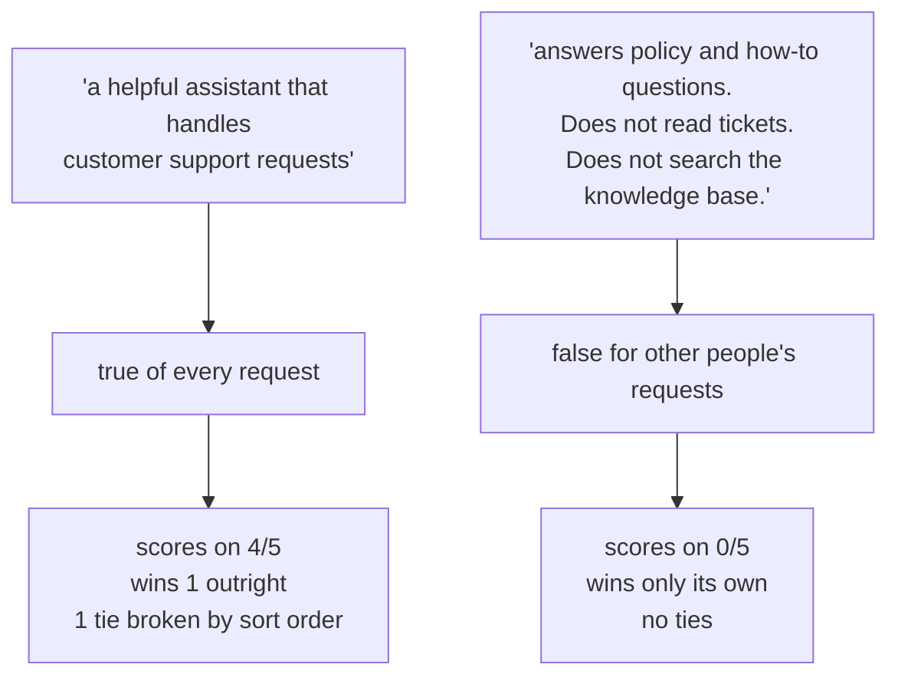

# 3.2 — The clerk whose sign said "all enquiries"

## One-line answer

A description that claims the whole job competes for the whole job: the vague generalist scored on
**four of five requests that belonged to somebody else**, took one of them outright, and won
another on an alphabetical tie-break — and none of that is the model's fault.

## The story

The vaccination centre in the school hall had four tables. Three had signs: *First dose*, *Second
dose*, *Under 18s*. The fourth said *All enquiries*.

Guess which one had the queue.

It was not that the woman on table four was better. It was that everybody arriving in the hall
read four signs, and hers was the only one that certainly applied to them. If you did not know
whether your booster counted as a second dose, *All enquiries* was correct and *Second dose* was a
guess. So people queued at four, and the three staff who could actually give injections spent the
morning watching.

At about eleven someone crossed out *All enquiries* with a marker and wrote *Lost your card? Wrong
appointment?* The queue redistributed within a few minutes. Nobody was retrained. One sign changed.

## The idea in plain language

Part 3.1 showed that the routing text lists every candidate as name plus description, and tells the
model to choose the one whose description fits. That makes description-writing a competition with
one rule: **the widest true claim wins.**

An agent described as *"a helpful assistant that handles customer support requests"* is not lying.
It does handle support requests. But so does every other agent on the list, so its description is
true of every request, and it will be a plausible answer to all of them. The specialists' narrower
descriptions are more informative and less applicable, and *less applicable* is what loses.

Three distinct harms come out of that, and they are worth separating because two of them are
invisible.

1. **It takes work it should not have.** The obvious one. A request that belonged to a specialist
   goes to the generalist, which does it worse or not at all.
2. **It creates ties.** Even where it does not win, it draws level. A tie is broken by something
   arbitrary — ordering, the model's priors, whatever came first in the prompt — and an arbitrary
   decision is one that will go differently tomorrow on the same input.
3. **It teaches the router the wrong shape.** Once a generalist is on the list, the routing prompt
   contains a colleague who claims everything, and the *contrast* between the other descriptions
   gets weaker. Every specialist now has to beat a claim that always applies.

There is a name for the deeper mistake and it is worth having: this is **describing an agent by
what it is rather than by what it selects for.** *"A helpful assistant"* is a true statement about
identity. A description's job is not to be true about identity; it is to be *false for the requests
that belong to someone else*.

## Why Sutra needs it

Read the description already in `sutra/desk/agent.py`:

```text
Triages incoming customer support tickets: explains what a ticket is
about, proposes a likely cause as a hypothesis, and recommends a
priority. Works only from ticket text supplied in the request. Does
not look anything up, and does not handle refunds, billing or account
changes.
```

That is a good description, and today is when it starts to matter. Two sentences of what it does,
one of what it does not. When tonight's build adds specialists, the desk agent becomes one entry on
a staff list, and the third sentence — *does not handle refunds, billing or account changes* — is
what stops it competing for billing's work.

If the desk's description had been *"the Sutra support assistant"*, tonight's build would route
almost everything to it, the specialists would idle, and the symptom would look like the
specialists being broken.

## The mechanism

`describe.py` puts a generalist on a roster with two specialists and scores five requests. Four of
them belong to a specific colleague; one belongs to nobody, and should be answered by the lead.

```bash
cd days/day-55-delegation-and-transfer/lab
uv run python describe.py
```

**Line by line:**

- The roster is `KB_SPECIALIST`, `ARCHIVE_SPECIALIST` and one generalist, all defined in `_desk.py`
  as a name, a description and the words that description claims.
- Each request is paired with the colleague whose job it actually is, so *wrong* is a fact about
  the fixture and not an opinion about an answer.
- Three numbers are reported. **Wrong** is who got it. **Scored on another's job** is the
  intrusion measure: how often the generalist was a live candidate for work that was not its own.
  **Tie-break** counts decisions settled by sort order rather than by score.
- The scorer is the keyword stand-in from `_desk.py`, not a model. It is measuring the descriptions
  against the requests, which is a property of the text.

Measured on 2026-09-05:

```text
generalist description:
  A helpful assistant that handles customer support requests.

  ok    what does ticket 4521 say                -> archive_specialist (owner: archive_specialist)
        kb_specialist=0, archive_specialist=2, support_assistant=1
  ok    which kb article covers the cookie fix   -> kb_specialist      (owner: kb_specialist)
        kb_specialist=4, archive_specialist=0, support_assistant=3
  ok    has this come up in the archive before   -> archive_specialist (owner: archive_specialist)
        kb_specialist=0, archive_specialist=1, support_assistant=1
  ok    explain our escalation policy            -> support_assistant  (owner: support_assistant)
        kb_specialist=0, archive_specialist=0, support_assistant=1
  WRONG the customer wants a refund              -> support_assistant  (owner: -)
        kb_specialist=0, archive_specialist=0, support_assistant=1

  routed to the wrong colleague          1/5
  generalist scored on another's job     4/5
  decided by a tie-break, not a score    1/5
```

The headline number is not the first one. Only one request was routed outright to the wrong place,
and someone reading only that line would conclude the vague description is a minor problem.

The number that matters is the second: **the generalist scored on four requests out of five**, and
four out of those five were not its job. It was a live candidate for nearly everything. Look at the
second row: `kb_specialist=4, support_assistant=3`. The specialist won by a single point on a
question that is unambiguously about the knowledge base. That is a margin, not a decision. Rewrite
one word of either description and it flips.

The third row is the tie: `archive_specialist=1, support_assistant=1` for *"has this come up in the
archive before"*. Both scored one. The archive specialist won because `archive_specialist` sorts
before `support_assistant`. That is the mechanism deciding, not the meaning — and if the generalist
had been called `assistant`, it would have won.

And the last row is the outright loss. *"The customer wants a refund"* belongs to nobody on this
roster — the correct behaviour is for the lead to answer or escalate, exactly as the desk's
`# Refusal` section says. The generalist takes it, because *customer* is in its claimed words.

Now the repair — the marker pen through the sign:

```bash
uv run python describe.py --fixed
```

**Line by line:**

- `--fixed` swaps only the generalist's description. The two specialists, the five requests and the
  scorer are byte-for-byte identical.
- The new description names what it handles (*policy and how-to questions*), what it returns, and —
  the sentence people leave out — what it does not do.

```text
generalist description:
  Answers a support question directly when no lookup is needed, for example policy and how-to questions. Does not read tickets and does not search the knowledge base.

  ok    what does ticket 4521 say                -> archive_specialist (owner: archive_specialist)
        kb_specialist=0, archive_specialist=2, support_assistant=0
  ok    which kb article covers the cookie fix   -> kb_specialist      (owner: kb_specialist)
        kb_specialist=4, archive_specialist=0, support_assistant=0
  ok    has this come up in the archive before   -> archive_specialist (owner: archive_specialist)
        kb_specialist=0, archive_specialist=1, support_assistant=0
  ok    explain our escalation policy            -> support_assistant  (owner: support_assistant)
        kb_specialist=0, archive_specialist=0, support_assistant=2
  ok    the customer wants a refund              -> -                  (owner: -)
        kb_specialist=0, archive_specialist=0, support_assistant=0

  routed to the wrong colleague          0/5
  generalist scored on another's job     0/5
  decided by a tie-break, not a score    0/5
```

Every generalist score on somebody else's request is now zero. Not lower — zero. The
knowledge-base question that was won by one point is now won by four to nothing. The tie is gone.
And the refund request, which belongs to nobody, is now routed to nobody, which is the correct
answer and the one that lets the desk's refusal policy fire.



## When it breaks

This failure has no error text, and the reason is worth stating: **nothing went wrong**. Every
component behaved correctly. The generalist was described accurately, the router followed its
instructions, and the specialists were available. The system produced a wrong result out of correct
parts, which is why it survives code review — there is no line to point at.

What you see instead is a *usage* signal, and it is not in a traceback — it is in the routing
counts. The shape to watch for, whatever the numbers turn out to be on your own system, is the
catch-all agent holding the largest share of routed requests while the specialists it was supposed
to sit behind hold small ones. The measurement above is the offline version of that: an agent that
scores on four requests out of five is an agent that will show up disproportionately in the counts.

The instinct on seeing a skew like that is to improve the specialists, or to add more of them, or
to conclude that the model is not good enough at routing. All three are wrong and all three are
expensive. The fix is thirty words in one string, and `describe.py --fixed` is what that fix does
to the numbers.

The related break is the one where somebody adds the generalist *last*, as a fallback, months
after the specialists were working. Routing quality then degrades on a day when nobody touched the
specialists, and the change that caused it is in a different file with a commit message that says
"add fallback agent".

## In production

**What a professional writes instead.** They give the catch-all agent the narrowest description on
the roster, not the widest — because a fallback should be reached by *exclusion*, not by claim. If
you genuinely need "everything else", the honest implementation is not a description; it is code:
route to the fallback when no specialist scored, which is what the `-> -` row above represents.
Making "everything else" a claim in a competition is a category error, because the competition has
no way to express *last resort*.

**What degrades at scale.** Every new specialist makes the generalist's claim relatively wider,
since the generalist's description does not change but the set of things it now overlaps does. A
roster of three with one generalist is manageable. A roster of fifteen with one generalist is a
system where one agent is a plausible candidate for fifteen jobs, and the routing distribution
skews further every quarter without a single edit.

**The failure that only appears with real traffic.** Your test requests are written in specialist
vocabulary — you wrote them while thinking about the specialist. Real users write short, general
sentences, and short general sentences are precisely where a general description wins. So the
routing distribution in production is much more skewed towards the generalist than any test set
predicts, and the gap grows as user phrasing gets less expert.

**The review comment a senior engineer leaves:** *"`support_assistant` is described as handling
customer support requests, which is what all four of these agents do. As written it is a candidate
for every request on the roster, and I'd expect it to be taking most of the traffic — check the
routing distribution before you merge. Give it a description that is false for tickets and false
for KB questions, or take it off the roster and make it the code-level fallback."*

**The interview question:** *"Your coordinator keeps picking the wrong sub-agent. What do you look
at?"* An honest answer: *"The descriptions, as a set, before I touch the coordinator's instruction.
The one I look for first is a colleague whose description is true of every request — 'a helpful
assistant that handles support requests' — because that agent is a live candidate for everyone
else's work. I measure it as intrusion rather than accuracy: how often does it score on a request
that is not its job? On our desk that was four out of five, with one specialist winning by a single
point and one decision settled by a tie-break. Narrowing that one description to say what it does
*not* do took intrusion to zero and turned a one-point win into four-to-nothing. And a genuine
catch-all should be reached by exclusion in code, not by a claim in a competition it will win.'"*

## Check yourself

```bash
cd days/day-55-delegation-and-transfer/lab
uv run python describe.py
uv run python describe.py --fixed
```

Now add a fourth colleague to the roster in `describe.py` whose description claims *"handles
anything urgent"*, give it `handles=("urgent", "customer", "now")`, and re-run both. Write down
what happens to the intrusion count in the `--fixed` run.

**Out loud, without scrolling up:** explain why "routed to the wrong colleague" is the wrong
headline metric for this failure, and say what the right one is.

**Next:** [3.3 — Writing a description that routes](3.3-writing-a-description-that-routes.md).
