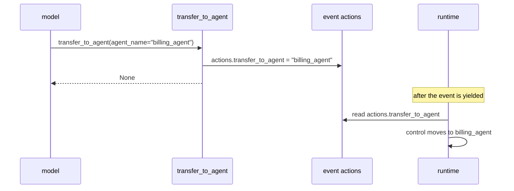

# 4.1 — Transfer is a signal, not a call

## One-line answer

`transfer_to_agent` is four lines long and does not transfer anything: it sets one field on the
tool context's actions and returns `None`, and the runtime moves control afterwards by reading that
field — which is exactly why a transfer has no return value to give you.

## The story

At the tax office you queue at the enquiries window, explain your problem, and the clerk writes
something on a small slip of paper and hands it to you. The slip says **4**.

She has not taken you to counter 4. She has not phoned counter 4. She has not, in any sense you
could observe, done anything except make a mark on paper and give it to you. What she has done is
put a fact into the system: *this person goes to 4*. The building does the rest — you walk, counter
4 reads the slip, and you are counter 4's problem now.

If you go back to her window afterwards and ask what counter 4 said, she will look at you blankly.
She never found out. She wrote a 4 on a slip; that was the entirety of her involvement.

## The idea in plain language

Day 4 built tools by hand and Day 10 turned them into functions the framework calls. Every tool so
far has had the same shape: the model asks for it, your function runs, and **what your function
returns goes back into the conversation** as the tool result.

`transfer_to_agent` breaks that shape, and it is the only tool in this curriculum so far that does.
It is declared to the model like a normal tool. The model calls it like a normal tool. And then it
returns `None`, because there is no result — the thing it does is not "produce an answer" but
"change who is answering".

The mechanism is called an **action**. Day 7 introduced events as the things the runtime yields;
every event carries an `actions` object, which is the event's side-channel for telling the runtime
to do something structural. Setting `actions.transfer_to_agent = "billing_agent"` is a note pinned
to the event that says *whoever processes this next, control belongs to billing_agent*. The runtime
reads it after the tool call completes.

Two consequences, and they are the whole reason this part exists rather than being a footnote.

**There is nothing to wait for.** A normal tool call has a result the model consumes on the next
step. This one has `None`. The model is not given anything to reason about, which is why the
framework's own injected instruction (printed in [3.1](../03-the-description-routes/3.1-the-staff-list-behind-the-counter.md))
says *"When transferring, do not generate any text other than the function call."* There is nothing
useful to say after it.

**You cannot intercept the result, because there is no result.** If you want to observe or veto a
transfer, the place to stand is the tool call itself (Day 13's `before_tool_callback`) or the event
stream, not the return value. That matters for Day 63's approval gates: an approval gate on a
transfer has to be a gate on the *decision*, because by the time control has moved, the decision is
already executed.

## Why Sutra needs it

Two concrete things tonight and later.

Tonight: it explains why your lead goes quiet. If you expected `transfer_to_agent` to behave like a
function call — hand off, get an answer, carry on — you will write a lead whose instruction says
*"summarise what the specialist found"*, and it will never do that, because it never gets a chance.
The summarising step you wanted is a call, not a transfer, and [2.1](../02-call-or-handover/2.1-a-call-comes-back.md)
is the field that selects it.

Later: Day 59's containment lab needs somewhere to stand to stop a runaway hand-off chain, and Day
63 needs somewhere to require a human's approval. Both hang off the fact that the transfer is
observable as a tool call before it is effective as a control change.

## The mechanism

`handover.py` prints the function's entire source and then runs it against a stand-in context.

```bash
cd days/day-55-delegation-and-transfer/lab
uv run python handover.py
```

**Line by line:**

- `inspect.getsource(transfer_to_agent)` prints the real function out of the installed package.
  There is no paraphrase in this part; the source is short enough to read whole.
- `FakeToolContext` provides exactly one attribute, `actions`, holding a real `EventActions`. The
  function under test touches nothing else, so a stand-in with that one attribute is a faithful
  test rather than a mock of something complicated.
- The script prints `actions.transfer_to_agent` before and after, and prints what the call
  returned.

Verified against `google-adk` 2.7.1 (`google/adk/tools/transfer_to_agent_tool.py`) and
adk.dev/workflows/collaboration/ on 2026-09-05.

Measured on 2026-09-05:

```text
--- 1. the whole of transfer_to_agent ---
def transfer_to_agent(agent_name: str, tool_context: ToolContext) -> None:
  """Transfer the query to another agent.

  Use this tool to hand off control to another agent that is more suitable to
  answer the user's query according to the agent's description.

  Args:
    agent_name: the agent name to transfer to.
  """
  tool_context.actions.transfer_to_agent = agent_name

before: None
returned: None
after:  billing_specialist
```

That is the whole of agent transfer. One assignment.

Read the signature first: `-> None`. The type annotation is the documentation. A tool that returns
`None` produces no tool result worth reading, and the framework's instruction to the model reflects
that.

Then read the body: `tool_context.actions.transfer_to_agent = agent_name`. It writes a string into
a field. It does not look the agent up, does not check that it exists, does not start it, does not
wait for it. All of that happens later, in the runtime, when it processes the event this action is
attached to.

And read the docstring, because the model reads it too — this is a `FunctionTool` built from a
plain function, so Day 10's rule applies: [the docstring is the
description](../../../day-10-function-tools/parts/01-the-form-fills-itself/1.2-the-docstring-is-the-description.md).
*"according to the agent's description"* is in the tool's own docstring as well as in the injected
instruction, which is the third time the framework tells the model that descriptions are the
routing criterion.



The dashed arrow is the point. `None` goes back to the model, and the real work happens on the
other path, after the fact, driven by a field.

## When it breaks

The break you can produce deliberately is naming an agent that does not exist. The function does
not validate — it writes whatever string it is given:

```text
before: None
returned: None
after:  billing_specialist
```

That run named `billing_specialist`, and there is no agent by that name anywhere in the script.
The function accepted it happily, because validation is not its job. Whether the runtime then finds
an agent by that name is a separate question, answered later and elsewhere, and the error surfaces
there rather than here.

This is the reason [4.2](4.2-the-enum-that-refuses-a-stranger.md) exists: the framework's defence
against an invented colleague is not in the function, it is in the *declaration* shown to the
model. A function that trusts its argument plus a schema that constrains it is a reasonable
division of labour, but it means the constraint is only as good as the schema the provider actually
enforces.

The break you will hit accidentally is different and produces no error at all: writing a lead whose
instruction expects to speak after a transfer. There is no exception for this, because nothing is
wrong. The lead's turn ended when the action fired. The instruction that says *"then summarise the
specialist's finding"* is simply never reached, and the symptom is a reply in the specialist's
voice where you expected the lead's.

## In production

**What a professional writes instead.** They observe transfers rather than trusting them. The
`before_tool_callback` from Day 13 sees the call with its arguments before it runs, which is the
single best place to log a routing decision, count hops, or refuse one — and it works because a
transfer *is* a tool call right up until the moment it takes effect.
[8.2](../08-in-production/8.2-who-decided-and-why.md) builds the record; Day 63 builds the veto.

**What degrades at scale.** The action is fire-and-forget, so nothing in the call path knows how
many transfers have already happened in this invocation. Depth and loop detection therefore cannot
be local — they need state that survives across agents, which is Day 17's session state, and a
counter incremented in the callback. Systems that skip this discover it as
[7.1](../07-failure-lab/7.1-two-counters-pointing-at-each-other.md): a loop with no odometer.

**The failure that only appears with real traffic.** Under load, transfers interleave with
everything else the runtime is doing, and the fact that the control change happens *after* the
event is processed becomes visible: your log line from inside the tool says "transferring to
billing" and the next log line is from a completely different invocation. Correlating a transfer
with its effect needs the invocation id in every line, which is Day 22's structured logging doing
the job it was built for.

**The review comment a senior engineer leaves:** *"You are catching the return value of the
transfer and branching on it. It returns `None`, always — the control change happens through
`actions`, after your code has finished. If you want to know whether the hand-off happened, look at
the event stream or hook `before_tool_callback`; if you want to prevent it, that callback is also
the only place you can."*

**The interview question:** *"What actually happens when an agent transfers to another agent?"* An
honest answer: *"Less than people expect. In ADK the tool is four lines: it assigns the target name
to `tool_context.actions.transfer_to_agent` and returns `None`. The runtime reads that action after
the event is yielded and moves control then. Two things follow. There is no return value, so a
transfer cannot be used as a question — if the caller needs an answer it has to be a single-turn
call instead. And because it is a tool call before it is a control change, the only place to
observe or veto it is the tool callback; once control has moved the decision has already
executed. That is also where I put hop counting, since the action itself carries no notion of
depth."*

## Check yourself

```bash
cd days/day-55-delegation-and-transfer/lab
uv run python handover.py
```

Now change the `agent_name` argument in `handover.py` to `"a_name_nobody_has"` and re-run. Write
down what the function did with it.

**Out loud, without scrolling up:** state what `transfer_to_agent` returns and why, and name the
one place in the request lifecycle where a transfer can still be stopped.

**Next:** [4.2 — The enum that refuses a stranger](4.2-the-enum-that-refuses-a-stranger.md).
