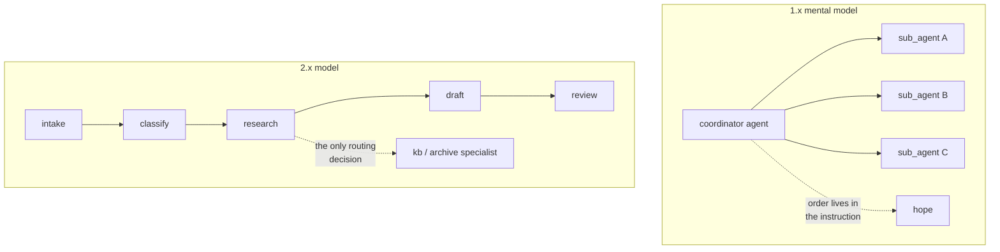

# 4.4 — From agent tree to node graph

## One-line answer

This is trap #1 in its delegation form: in 1.x an agent tree was the composition layer and
delegation was the only way to compose, whereas in 2.x the graph Workflow Runtime is the
composition layer and delegation is one thing you do *inside* it — visible in the fact that a
single-turn sub-agent is executed through `tool_context.run_node`, as a node, not as a separate
runner.

## The story

The council used to be a hierarchy and it was drawn as one, on a chart in the lobby: the chief
executive at the top, four directors below, twenty-odd heads of service below them. If you had a
problem, you found the box that seemed closest and you went to that person, and if they were not
right they sent you to their manager or across to a colleague.

Then they moved into the new building and the chart in the lobby changed to a floor plan. Planning
is on two, licensing is on two, housing is on three, and there are arrows painted on the floor
showing the route a planning application takes: reception, then desk 2A, then 2B, then upstairs to
legal, then back down.

The people did not change. The jobs did not change. What changed is what you look at to answer the
question *"where does this go next?"* — and it used to be *"who reports to whom"* and it is now
*"what does the floor plan say"*.

Somebody still occasionally leans across and asks a colleague a question. That did not stop being
possible. It just stopped being how the building is organised.

## The idea in plain language

Plan §5.1 lists four traps for anyone arriving from ADK 1.x, and this is the first:

> **Node model.** 1.x habit: agents composed only via `sub_agents` trees; workflow agents as
> special agent classes. 2.x reality: the graph **Workflow Runtime** is the composition layer:
> nodes in a graph, with agents as one node type. Port compositions to the node model; don't force
> everything through agent-tree idioms.

Applied to today's subject, that means something specific and easy to get wrong.

**In 1.x, `sub_agents` was the composition model.** If you wanted step B to happen after step A,
you made B a sub-agent of A and you wrote instructions hoping the model would delegate at the right
moment. Sequence, branching and repetition were all expressed as delegation, because delegation was
the only structural tool available. That is why 1.x tutorials are full of coordinator agents with
elaborate instructions describing a workflow in prose.

**In 2.x, the graph is the composition model.** Sequence is an edge. Branching is a route.
Repetition is a loop node. Those are Day 53's and Day 54's subjects and they are *structural* — no
model decides them, so they cannot be decided wrongly. Delegation survives, but its job has
narrowed to the thing only a model can do: **reading a request and choosing a colleague at request
time.**

The practical rule that falls out:

> If you can draw it, draw it. Delegation is for the decisions you cannot draw.

A sequence you know in advance should be an edge, not a coordinator agent instructed to "first do
this, then that". That is [1.3](../01-why-split-the-desk/1.3-three-homes-for-a-step.md)'s first
question, and it is trap #1 restated as a design rule.

## Why Sutra needs it

Day 58 builds the triage graph, and the difference decides its shape. Intake → classify → research
→ draft → review is a sequence that is true of every ticket, so it is four edges in a graph and
zero routing decisions. The delegation you learned today appears at exactly one place inside it:
the research station choosing which specialist to ask.

Get this backwards — build the five stations as a coordinator with five sub-agents and an
instruction describing the order — and you have paid five routing decisions per ticket for a
sequence that never varies, and you have made the pipeline's order a matter of model behaviour.
That is the 1.x shape, and it is what a lot of the material you will find online still teaches.

## The mechanism

The evidence that 2.x runs delegation through the node runtime is in how a single-turn sub-agent is
actually executed. `astool.py` prints the relevant lines out of the installed framework.

```bash
cd days/day-55-delegation-and-transfer/lab
uv run python astool.py
```

**Line by line:**

- `source_line(func, pattern)` finds the first line of a function's source matching a pattern, so
  the part quotes running code rather than describing it.
- `_SingleTurnAgentTool.run_async` is what ADK attaches when a sub-agent declares
  `mode="single_turn"` ([5.1](../05-agent-as-tool/5.1-the-sub-agent-that-became-a-tool.md)).
- `AgentTool.run_async` is the older, discouraged spelling, shown here for contrast.

Verified against `google-adk` 2.7.1 (`google/adk/tools/agent_tool.py`) and
adk.dev/workflows/collaboration/ on 2026-09-05.

Measured on 2026-09-05:

```text
3. where each spelling runs the sub-agent
  _SingleTurnAgentTool  return await tool_context.run_node(
  AgentTool             session_service=InMemorySessionService(),
  AgentTool             session = await runner.session_service.create_session(
  AgentTool             state_dict = {
```

One line versus three, and they say different things about where the work happens.

`_SingleTurnAgentTool` calls **`tool_context.run_node(...)`**. The sub-agent is run *as a node*, by
the same runtime that is running everything else, on a sub-branch of the current invocation. It is
inside the graph. Its events are the graph's events. That is the 2.x model: an agent is a kind of
node, and calling one is running a node.

`AgentTool` builds a **`Runner`** with a fresh `InMemorySessionService`, creates a new session and
copies state into it. The sub-agent runs in its own little world, outside the current graph, and
what comes back is whatever text it produced. That is the 1.x model preserved for compatibility,
and it is why the class's own docstring says:

```text
    Direct usage of ``AgentTool`` is discouraged. See the single-turn
    mode guide for details.
```

[5.3](../05-agent-as-tool/5.3-the-session-it-does-not-share.md) measures what that separate world
costs. Here the point is narrower: the recommended spelling is the one that runs the sub-agent as a
node, because in 2.x the graph is where things run.



## When it breaks

The break is importing 1.x shapes, and the loudest version is the one
[2.1](../02-call-or-handover/2.1-a-call-comes-back.md) already showed:

```text
Traceback (most recent call last):
  File "<string>", line 5, in <module>
AttributeError: type object 'AgentTool' has no attribute 'create'
```

That is a 1.x idiom failing at import, which is the best possible outcome.

The quiet break is a `task`-mode sub-agent inside a graph. From adk.dev/workflows/collaboration/,
checked 2026-09-05:

> The collaborative mode `task` behavior is disabled for use in graph-based workflows in ADK Python
> v2.0.0. This feature is expected to be re-enabled in a future release.

So the three modes are not interchangeable across the two composition styles: `task` works in an
agent tree and is disabled in a graph. If you have read about `task` mode and `finish_task()` and
are planning to use them in Day 58's graph, that is the sentence that stops you. 🅿️ Sutra treats
`task` mode as awareness-level for exactly this reason: it is real, it is documented, and it is not
available where this curriculum does its composition.

The third break has no error and is the most common: building a fixed sequence out of delegation.
Nothing fails. Each step happens, usually. It costs a routing decision per step
([6.1](../06-price-of-a-handoff/6.1-a-handoff-costs-a-request.md) prices that at three requests
instead of one), and once every so often the model runs the steps in a different order, and there
is no error for "the pipeline did research before classification" because there is no pipeline —
only an instruction that described one.

## In production

**What a professional writes instead.** They separate the two questions explicitly when designing:
*what always happens* goes in the graph, *what depends on the request* goes to a routing agent. The
artefact is a diagram where edges are solid and routing decisions are dashed, and the review
question is "why is this one dashed?" Every dashed line is a model call and a place to be wrong, so
each one should be defensible on its own.

**What degrades at scale.** Delegation-shaped pipelines degrade with length. A five-step sequence
expressed as delegation is five routing decisions, and if each is right ninety-five times out of a
hundred, the whole pipeline is right about seventy-seven times out of a hundred — while the same
sequence as four graph edges is right every time, because nothing was decided. The arithmetic is
unforgiving and it is the strongest argument for trap #1's rule.

**The failure that only appears with real traffic.** 1.x-shaped systems fail on the requests that
do not look like the examples the coordinator's instruction was written against. A prose workflow
in an instruction is a set of examples; real requests fall outside them and the order drifts. A
graph does not have this failure mode, because the order is not inferred.

**The review comment a senior engineer leaves:** *"This coordinator has five sub-agents and an
instruction that describes the order to run them in. That is the 1.x shape. Four of those five are
unconditional — every ticket goes through them, in that order — so they should be graph edges, and
the coordinator should keep only the one genuine choice. You will spend a quarter of the requests
and stop being able to get the order wrong."*

**The interview question:** *"What changed about multi-agent composition in ADK 2.x?"* An honest
answer: *"The composition layer moved. In 1.x the agent tree was it — you composed by nesting
`sub_agents` and expressed sequence and branching as delegation, with the order living in a
coordinator's instruction. In 2.x the graph Workflow Runtime is the composition layer and an agent
is one node type, so sequence is an edge and branching is a route, and delegation narrows to the
thing only a model can do: picking a colleague at request time. You can see it in the code — a
single-turn sub-agent is run through `tool_context.run_node`, inside the same invocation, whereas
the older `AgentTool` builds its own Runner with a fresh session, and its docstring now says direct
use is discouraged. The practical rule I use is: if you can draw it, draw it; delegation is for the
decisions you cannot draw."*

## Check yourself

```bash
cd days/day-55-delegation-and-transfer/lab
uv run python astool.py
```

Read section 3 of the output. Then, on paper, draw Day 58's five stations and mark every arrow as
either an edge or a routing decision. Count the routing decisions.

**Out loud, without scrolling up:** state trap #1 in one sentence, give the rule for when a step
should be an edge rather than a delegation, and say what `mode="task"` cannot be used inside.

**Next:** [5.1 — The sub-agent that became a
tool](../05-agent-as-tool/5.1-the-sub-agent-that-became-a-tool.md).
