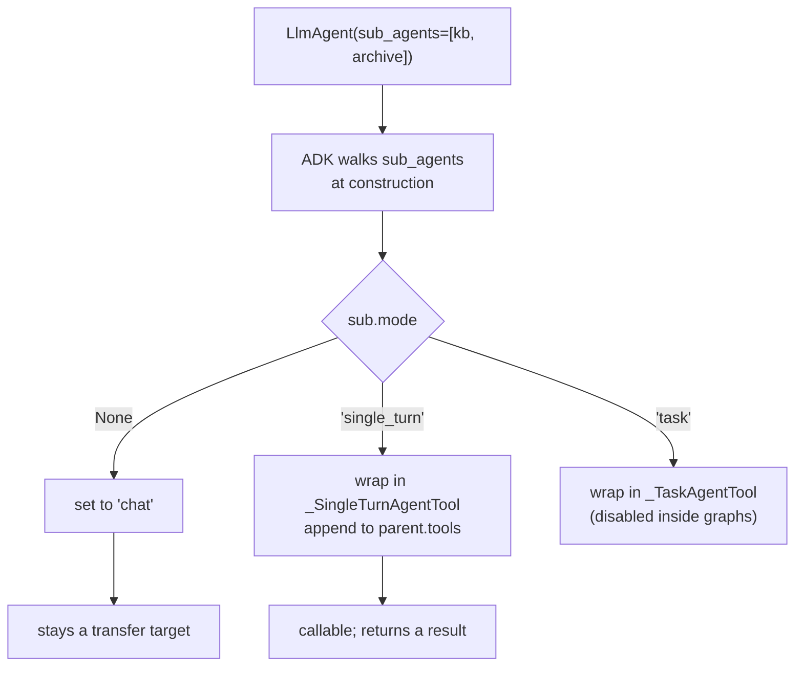

# 5.1 — The sub-agent that became a tool

## One-line answer

`mode="single_turn"` is the whole of agent-as-tool in ADK 2.7.1: the sub-agent leaves the transfer
list, ADK appends a `_SingleTurnAgentTool` named after it to the caller's `tools`, and the caller
can now ask it a question and get an answer back.

## The story

There is an internal phone on the counter at the chemist. It is not for customers, it does not have
a number pad, and it does exactly one thing: it rings the dispensary at the back.

When the pharmacist needs to know whether they have a particular strength in stock, she picks it
up, asks, listens, puts it down, and turns back to you. Thirty seconds where you were standing
there and she was not talking to you. Then she carries on with your prescription.

You have never met whoever is at the back. You do not know their name. From your side of the
counter, the pharmacist simply knew the answer.

## The idea in plain language

[2.1](../02-call-or-handover/2.1-a-call-comes-back.md) established the distinction: a call comes
back, a transfer does not. This part is the mechanism for the call.

You still attach the specialist as a sub-agent — the same `sub_agents=[...]` list. What changes is
one field on the specialist:

- `mode="chat"` (the default for a sub-agent) — a transfer target.
- `mode="single_turn"` — a tool on the parent.

ADK does the wiring when the parent is constructed. It walks `sub_agents`, and for each one in
`single_turn` mode it appends a `_SingleTurnAgentTool` wrapper to the parent's own `tools` list.
From that moment the specialist is, to the parent's model, indistinguishable in kind from
`lookup_ticket` or `search_kb`: a name, a description, an argument schema, and a result.

The framework's own description of what `single_turn` means, from `google/adk/agents/llm_agent.py`,
verified 2026-09-05:

```text
    single_turn: Agents that complete a task without chatting with the user.
```

*Without chatting with the user* is the operative phrase. A single-turn agent never speaks to the
person; it produces a result for whoever called it. That is why it is safe for it to be a tool: a
tool that talked to your user behind your back would be a very strange tool.

There is a second, quieter effect worth having now, because it is the reason to prefer this
spelling over the older one. A single-turn sub-agent runs **inside the caller's invocation**, as a
node ([4.4](../04-transfer-in-2x/4.4-from-agent-tree-to-node-graph.md) showed
`tool_context.run_node`), so its events land in the same session and the same trace as everything
else. [5.3](5.3-the-session-it-does-not-share.md) measures what the alternative costs.

## Why Sutra needs it

The desk's research step is a call, for the reason [1.3](../01-why-split-the-desk/1.3-three-homes-for-a-step.md)
gave: the drafter has a reply to write after the fact arrives. So `sutra/delegation.py` needs at
least one `mode="single_turn"` specialist, and `gate.py` fails until it finds one.

Day 57 builds a writer and a critic, and the critic is the clearest case of all: a critic that
transferred would be a critic that took over the writing.

## The mechanism

`staff.py` builds one lead with two specialists and prints what ADK did with each. Running it twice
— once with both at the default, once with `--single-turn` on the first — shows the move.

```bash
cd days/day-55-delegation-and-transfer/lab
uv run python staff.py
uv run python staff.py --single-turn
```

**Line by line:**

- `build(single_turn)` sets `mode="single_turn" if single_turn else None` on `kb_specialist` only.
  Passing `None` is passing nothing: it lets ADK apply its default, which is what most code does by
  accident.
- `lead.tools` is printed as `(class name, tool name)` pairs, so both the wrapper type and the name
  the model sees are visible.
- `_get_transfer_targets(lead)` prints the other list, so the two are side by side and the move
  between them is unmissable.

Verified against `google-adk` 2.7.1 (`google/adk/agents/llm_agent.py`,
`google/adk/tools/agent_tool.py`) and adk.dev/workflows/collaboration/ on 2026-09-05.

Measured on 2026-09-05, default:

```text
sub-agent modes
  kb_specialist        mode='chat'
  archive_specialist   mode='chat'

tools on the lead
  none

transfer targets
  ['kb_specialist', 'archive_specialist']
```

Measured on 2026-09-05, with `--single-turn`:

```text
sub-agent modes
  kb_specialist        mode='single_turn'
  archive_specialist   mode='chat'

tools on the lead
  [('_SingleTurnAgentTool', 'kb_specialist')]

transfer targets
  ['archive_specialist']
```

Three observations, in order of how easy they are to miss.

**The mode was filled in for you.** The first run passed `mode=None` and printed `'chat'`. ADK
assigns it during parent construction — the code is in `LlmAgent`'s model validator, and the
docstring says *"Default value is chat as a sub-agent, single_turn as a node in a workflow."* So an
agent's mode depends on how it was attached, and an agent you attach without thinking is a transfer
target.

**The wrapper is named after the agent.** `('_SingleTurnAgentTool', 'kb_specialist')`. The tool the
model sees is called `kb_specialist`, not `call_kb_specialist` or `kb_specialist_tool`. The agent's
name is the tool's name, which means agent names are now part of your tool namespace and a
specialist called `search` will collide with a tool called `search`.

**A sub-agent is in exactly one list.** `kb_specialist` left the transfer targets when it joined
the tools. There is no configuration where a colleague is both callable and transferable — it is
one or the other, chosen by `mode`, per sub-agent. That is a genuinely helpful constraint: the
question *"can the lead hand the whole conversation to this one?"* has a single answer you can read
off one field.



## When it breaks

The break is a name collision, and it is silent in the worst way — the later entry wins and nothing
warns you.

Because the wrapper takes the agent's name verbatim, a sub-agent named `search_kb` alongside a
function tool named `search_kb` produces two tools with one name in `lead.tools`. What the provider
does with two identically named declarations is undefined and varies; what you observe is a tool
that sometimes behaves like the function and sometimes like the agent, which is a genuinely
horrible afternoon.

The guard is one assertion, and it belongs in the quality gate rather than in your memory:

```python
names = [t.name for t in lead.tools]
assert len(names) == len(set(names)), f"duplicate tool names on {lead.name}: {names}"
```

**Line by line:**

- `lead.tools` is read *after* construction, which is the only moment the wrappers exist — they are
  appended by ADK, not by you, so an assertion written before construction would pass.
- Comparing against `set(names)` catches the collision regardless of which side it came from, agent
  or function.
- The message prints the whole list, because the useful information is which two names collided and
  you cannot tell from a count.

The second break is the one that produces no symptom until turn two: forgetting the field entirely.
You attach a specialist meaning "the lead should ask it a question", get `mode='chat'`, and the
lead hands the conversation over instead. There is no error.
[2.2](../02-call-or-handover/2.2-who-owns-the-turn.md) measures the cost at three wrong
answers in a five-turn session.

## In production

**What a professional writes instead.** They set `mode` on every sub-agent explicitly, and they
name specialists in a way that cannot collide with function tools — a consistent suffix such as
`_specialist` or `_agent` costs nothing and removes the whole class of collision. It is the same
reasoning as ADK-73's insistence on pinning the model: a field left to a default is a field nobody
decided, and this one decides whether the agent can take your conversation.

**What degrades at scale.** The parent's tool list is now assembled from two sources — the tools
you wrote and the sub-agents ADK wrapped — and only one of them is visible at the definition site.
Reading `tools=[...]` in the source tells you less than it used to. Teams that hit this start
printing the resolved list in tests, which is the same instinct as printing the assembled routing
prompt in [3.1](../03-the-description-routes/3.1-the-staff-list-behind-the-counter.md): assert on
what the model actually receives, not on what the source says.

**The failure that only appears with real traffic.** A single-turn specialist that is slow does not
just make itself slow; it blocks the caller's turn, because the caller is waiting for a result.
Under load, one slow specialist called by three parents becomes the latency of all three, and the
symptom appears in the parents' metrics rather than in the specialist's. Day 44's client-hardening
instincts — timeouts, and a fallback for the tool result — apply to a sub-agent exactly as they do
to an MCP server, and for the same reason: it is a remote call wearing a local shape.

**The review comment a senior engineer leaves:** *"Four sub-agents, no `mode` on any of them, so
all four are transfer targets and `lead.tools` is empty. The instruction says the lead should
'consult' them and then summarise, which it will never get to do. Set `mode='single_turn'` on the
three that return facts, and leave `chat` only on the one that is genuinely supposed to own the
customer."*

**The interview question:** *"How do you use one agent as a tool of another?"* An honest answer:
*"In ADK 2.7.1 you attach it as a sub-agent and set `mode='single_turn'` on it. ADK then wraps it
in a `_SingleTurnAgentTool` named after the agent and appends it to the parent's tool list, and it
drops out of the transfer targets — a sub-agent is in exactly one of those two lists. The older
`AgentTool(agent)` still exists but its own docstring says direct use is discouraged, because
single-turn mode runs the sub-agent as a node inside the caller's invocation instead of standing up
a separate runner and session. Two things I watch for: the tool takes the agent's name verbatim, so
agent names now collide with function tool names, and the default mode is `chat`, so a sub-agent
you attach without thinking can take the conversation instead of answering a question."*

## Check yourself

```bash
cd days/day-55-delegation-and-transfer/lab
uv run python staff.py --single-turn
```

Now edit `staff.py` to give `archive_specialist` the same name as `kb_specialist`, set both to
`single_turn`, and print `[t.name for t in lead.tools]`. Write down what you see.

**Out loud, without scrolling up:** name the field that turns a sub-agent into a tool, say which
list it leaves when it does, and state where the tool's name comes from.

**Next:** [5.2 — The schema the caller sees](5.2-the-schema-the-caller-sees.md).
