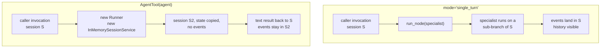

# 5.3 — The session it does not share

## One-line answer

The two spellings of agent-as-tool run the specialist in different places: `_SingleTurnAgentTool`
calls `tool_context.run_node`, keeping it inside the caller's session and trace, while `AgentTool`
stands up a fresh `Runner` over a new `InMemorySessionService` — which is why its own docstring
says direct use is discouraged.

## The story

The bank has a back office in a different building. It is a good back office and it answers
questions accurately, and it has never once seen a customer.

When the counter clerk sends a query over, she has to write down everything relevant, because the
back office cannot look up at the queue, cannot see that you have been standing there for twenty
minutes, and does not know that you already explained the whole thing at the start. It knows what
is on the form.

Down the corridor from her there is also a supervisor at a desk, in the same room, who has been
half-listening to the whole conversation. Asking the supervisor is a different kind of asking. You
do not have to explain the background, because she was there.

Both are useful. But you would not send the supervisor's question to the back office and expect
the same answer, and you would not be surprised when the back office asks something you already
told the clerk.

## The idea in plain language

Day 8 established the container: [a session holds the conversation's
events](../../../day-08-sessions-and-services/parts/01-the-session/1.1-a-conversation-with-an-address.md)
— the messages, the tool calls, the results, in order — and an agent's view of "what has happened
so far" is assembled from it.

ADK has two ways to run an agent as a tool, and the difference between them is which session the
sub-agent runs in.

**`_SingleTurnAgentTool`** — what you get from `mode="single_turn"`. It calls
`tool_context.run_node(...)`, running the specialist as a node on a sub-branch **of the caller's
own invocation**. Same session, same event stream, same trace. This is the supervisor down the
corridor.

**`AgentTool(agent)`** — the older, explicit spelling. It constructs a `Runner` with a brand-new
`InMemorySessionService`, creates a session in it, copies a filtered snapshot of state across, runs
the agent there, and returns the text. This is the back office.

The consequences of the second are worth listing plainly, because none of them is obvious from the
call site:

- The specialist sees **no conversation history**. Its session was created moments ago and contains
  only the `request` it was given.
- It sees **a copy of state**, not the state. Keys beginning `_adk` are filtered out.
- Its events are **in a different session**, so they are not in the caller's trace and not in the
  caller's session store. What comes back to the caller is the final text.
- State deltas it emits **are** forwarded back to the caller's state, which is the one thing that
  does cross the boundary.

None of that is a bug. It is a deliberate isolation boundary, and there are cases where you want
it. But it is a large behavioural difference selected by which of two spellings you typed, and most
people typing `AgentTool(agent)` are not choosing isolation — they are choosing the name they saw
in a tutorial.

## Why Sutra needs it

The desk's specialists work on tickets, and the ticket text is in the conversation. A specialist
that cannot see the conversation must be told everything in its `request` string, which is exactly
the loss [6.2](../06-price-of-a-handoff/6.2-what-the-specialist-cannot-see.md) measures at
**ten per cent of the original wording surviving to depth four**.

There is also a debugging argument that matters more than it sounds. Day 22 built structured
logging and Day 84 builds tracing. A specialist running in its own session produces events that are
not in the caller's trace, so when a support engineer asks *"why did the desk say that?"*, the step
that produced the fact is somewhere else. Keeping the specialist in the caller's session keeps the
answer in one place.

## The mechanism

`astool.py` prints the lines that decide this, straight out of the installed package.

```bash
cd days/day-55-delegation-and-transfer/lab
uv run python astool.py
```

**Line by line:**

- `source_line(func, pattern)` returns the first source line of a function matching a regex, so
  what follows is quoted code rather than a description of code.
- The four patterns pick out the one call that matters in each implementation: `run_node` for the
  single-turn wrapper; the session service, the session creation and the state copy for `AgentTool`.

Verified against `google-adk` 2.7.1 (`google/adk/tools/agent_tool.py`) on 2026-09-05.

Measured on 2026-09-05:

```text
3. where each spelling runs the sub-agent
  _SingleTurnAgentTool  return await tool_context.run_node(
  AgentTool             session_service=InMemorySessionService(),
  AgentTool             session = await runner.session_service.create_session(
  AgentTool             state_dict = {
```

One line against three. And the framework tells you which it prefers, in the class docstring of
`AgentTool` itself:

```text
  Note:
    To expose an agent as an inline tool of a parent ``LlmAgent``, prefer
    setting ``mode='single_turn'`` on the sub-agent and attaching it via
    ``sub_agents=[...]`` instead of wrapping it with ``AgentTool``. The
    framework then exposes the sub-agent as a tool automatically and runs it
    inline in the parent's session.

    Direct usage of ``AgentTool`` is discouraged. See the single-turn
    mode guide for details.
```

*Runs it inline in the parent's session* is the whole difference, stated by the framework.

Here is what `AgentTool` does with state, from the same file, because it is the part people are
most often surprised by:

```python
state_dict = {
    k: v
    for k, v in tool_context.state.to_dict().items()
    if not k.startswith("_adk")  # Filter out adk internal states
}
session = await runner.session_service.create_session(
    app_name=child_app_name,
    user_id=tool_context._invocation_context.user_id,
    state=state_dict,
)
```

**Line by line:**

- `tool_context.state.to_dict()` snapshots the caller's state. A snapshot, not a reference: later
  writes by the caller are not visible to the specialist.
- The `_adk` filter strips framework-internal keys so they do not leak into a child session that
  has its own.
- `create_session(..., state=state_dict)` seeds a **new** session with that copy. The events —
  everything anybody said — are not copied, because they belong to the old session and this is a
  new one.
- `user_id` does cross, so the specialist knows who it is acting for. That matters for Day 68: an
  isolated session is not an isolated identity.



## When it breaks

The break is a specialist that answers as if it has amnesia, and it produces no error at all.

The shape is always the same. The engineer pastes a ticket. Three turns later the lead calls the
specialist, which replies *"I do not have the ticket text — please provide it."* The lead's model,
which can see the ticket in its own history, finds this baffling and often works around it by
pasting the ticket into a follow-up call, which costs another request and sometimes loses detail.

There is a second, sharper break when you migrate. Code written against `AgentTool` may rely,
without saying so, on the specialist *not* seeing the conversation — a summariser that would
otherwise summarise its own previous output, or a critic that would be influenced by the draft's
justification. Switching that to `mode="single_turn"` changes its behaviour, silently and for
reasons that are nowhere in the diff. If a specialist's correctness depends on isolation, that is a
fact worth a comment next to the definition, because otherwise the next person will "fix" the
discouraged spelling.

And the loud break is still the 1.x idiom:

```text
Traceback (most recent call last):
  File "<string>", line 5, in <module>
AttributeError: type object 'AgentTool' has no attribute 'create'
```

`AgentTool.create()` does not exist on 2.7.1. The constructor is `AgentTool(agent,
skip_summarization=False, *, include_plugins=True, propagate_grounding_metadata=False)` — and per
the docstring above, you should mostly not be reaching for it at all.

## In production

**What a professional writes instead.** `mode="single_turn"`, by default, for every specialist that
is called rather than transferred to. `AgentTool` is reserved for the case where isolation is the
requirement rather than the accident — and when it is used, the reason goes in a comment on the
same line, because the next reader will otherwise see a discouraged API and replace it.

**What degrades at scale.** Two things, in opposite directions. Sharing the session means the
specialist's context grows with the conversation, so a long session makes every specialist call
more expensive — Day 20's compaction problem, arriving through a door you did not expect. Isolating
the session means the caller has to restate context, so cost moves into the caller's summarising
and quality moves into the caller's judgement. Neither is free; the honest engineering choice is to
know which cost you have taken. The shared-session version at least keeps the cost visible in one
place.

**The failure that only appears with real traffic.** State is a snapshot with `AgentTool`, and
snapshots are only wrong when something writes concurrently. In development, nothing does. In
production, a parallel branch writing to state while a specialist is running means the specialist
worked from a value that was already stale, and the result it returns overwrites nothing and
contradicts everything. This is Day 54's "no shared pencil" rule reappearing in the delegation
layer, and it is the strongest argument for the framework's own recommendation.

**The review comment a senior engineer leaves:** *"Why `AgentTool` here rather than
`mode='single_turn'`? The docstring says direct use is discouraged, and this specialist needs the
ticket text that is already in the conversation — with `AgentTool` it starts in an empty session
and only sees the `request` string, so the lead will end up pasting the ticket in. If you actually
want the isolation, say so in a comment and I will stop asking."*

**The interview question:** *"What does a sub-agent see when another agent calls it?"* An honest
answer: *"It depends which spelling you used, and the difference is bigger than the syntax
suggests. With `mode='single_turn'` ADK runs it through `tool_context.run_node`, so it is a node on
a sub-branch of the caller's own invocation — same session, same events, same trace, and it can see
the conversation. With the older `AgentTool` it builds a new Runner over a fresh
`InMemorySessionService`, copies a filtered snapshot of state into a brand-new session and runs it
there, so it sees the `request` string and nothing else; the events stay in that session and never
appear in your trace, though state deltas do get forwarded back. `AgentTool`'s own docstring now
says direct use is discouraged. I default to single-turn, and I only reach for the isolated version
when isolation is the actual requirement — a critic that should not see the writer's reasoning, for
instance — and then I write the reason next to it."*

## Check yourself

```bash
cd days/day-55-delegation-and-transfer/lab
uv run python astool.py
```

Then open `google/adk/tools/agent_tool.py` in your environment (the path is printed by
`python -c "import google.adk.tools.agent_tool as m; print(m.__file__)"`) and find the loop that
forwards `event.actions.state_delta` back to the caller. Write down what does and does not cross
that boundary.

**Out loud, without scrolling up:** name the two spellings of agent-as-tool, say which session each
runs the specialist in, and state the one thing that crosses the boundary in both directions.

**Next:** [5.4 — A failure that arrives as a string](5.4-a-failure-that-arrives-as-a-string.md).
