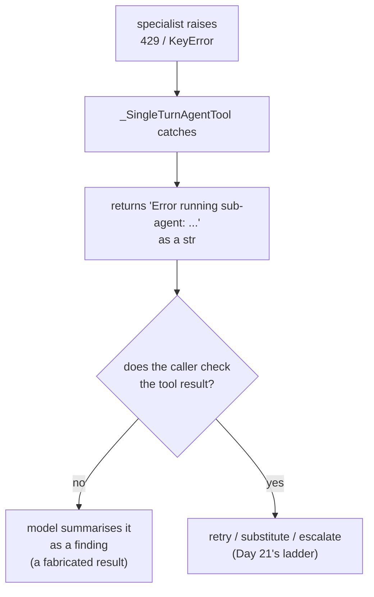

# 5.4 — A failure that arrives as a string

## One-line answer

When a sub-agent-as-tool fails, ADK catches the exception and returns its text as the tool result —
`Error running sub-agent: 429 RESOURCE_EXHAUSTED: quota exceeded...` arrives with `type=str`,
exactly like a good answer — so unless the caller checks, a quota failure gets summarised into the
reply as though it were a finding.

## The story

The joinery sends work out to a French polisher. You leave a chair, and a week later a docket comes
back stapled to the job sheet, handwritten, and the workshop reads it and carries on.

Most dockets say things like *"stripped, two coats, matched to sample"*. Some say *"could not
match, customer's stain discontinued"*. They are written on the same pad, in the same handwriting,
in the same place on the sheet. There is no red one for problems.

The good foreman reads every docket. The one who is behind glances at the sheet, sees a docket,
ticks the job as done, and the chair goes back to the customer unfinished — because the presence of
a docket looked like the presence of a result.

## The idea in plain language

Day 21 built the honest-errors discipline, and its central failure was [the swallowed
exception](../../../day-21-errors-surface-not-swallow/parts/04-failure-lab/4.1-the-swallowed-exception.md):
code that catches an error and returns something ordinary, so the caller cannot tell that anything
went wrong. Plan §5.1's trap #4 says the same thing about ADK 2.x — it surfaces exceptions through
the runtime rather than turning them into strings, so callbacks and plugins can act on them.

This part is that rule arriving from an unexpected direction. **The framework itself converts a
sub-agent's failure into a string.** Not your code. `_SingleTurnAgentTool.run_async` ends with:

```python
try:
    return await tool_context.run_node(...)
except Exception as e:
    return f"Error running sub-agent: {e}"
```

**Line by line:**

- `tool_context.run_node(...)` is the call that runs the specialist as a node
  ([5.3](5.3-the-session-it-does-not-share.md)); on the happy path its return value *is* the tool
  result.
- `except Exception` catches everything, including the `google.genai` error that carries a 429. It
  is not a bare `except:`, but for the caller the effect is the same: no exception escapes.
- `return f"..."` is the line this whole part is about. A failure leaves this function as a `str`,
  through the same door a successful answer uses.
- There is no re-raise and no status field. Nothing downstream can distinguish the two cases by
  type, only by reading the text.

That is defensible framework design. A tool result has to be *something*, the caller's model is
mid-turn, and raising out of a tool call would abort an invocation that might otherwise recover.
But it means the news of the failure travels as content, and content is exactly the channel your
caller is least able to check.

The consequence is precise: **the type no longer carries the news.** A successful answer is a
`str`. A quota exhaustion is a `str`. A crash inside the specialist is a `str`. Whatever
distinguishes them has to be read out of the text, by somebody, deliberately — and the caller's
model, which is the default reader, will happily summarise *"Error running sub-agent: KeyError:
'KB-999'"* into a customer reply as a finding about the knowledge base.

## Why Sutra needs it

The desk runs on a free tier, and 429 is not an exceptional condition there; it is Tuesday. Every
model call path in this repository is required to handle it with `retry-after` and backoff, and
Principle 10 forbids fabricating a result to cover an error. A specialist that hits its quota and
returns a sentence which the lead then paraphrases into *"the knowledge base does not appear to
have an article on this"* is a fabricated result. Nobody wrote a lie; the system produced one.

Day 58's graph has stations calling stations, and Day 59's containment lab needs failures to be
detectable before it can contain them. Detecting this one starts here.

## The mechanism

`swallow.py` runs ADK's **real** `_SingleTurnAgentTool.run_async` against a stand-in tool context
whose node run raises. Three cases: a success, a quota failure, and a bug inside the specialist.

```bash
cd days/day-55-delegation-and-transfer/lab
uv run python swallow.py; echo "exit: $?"
```

**Line by line:**

- `_SingleTurnAgentTool(kb)` is the framework's own wrapper around a real `LlmAgent`. The code
  under test is ADK's, not the lab's.
- `StubContext` supplies the three attributes the wrapper touches — `function_call_id`,
  `get_invocation_context()` and `run_node` — and its `run_node` raises when asked to. Nothing is
  mocked that is not needed, so what runs is the genuine error path.
- `looks_like_failure(result)` is the check a caller has to write: a string prefix test, because a
  string prefix is all there is to test.
- The script prints `type=` for every result, so the central claim — that success and failure share
  a type — is visible rather than asserted.

Verified against `google-adk` 2.7.1 (`google/adk/tools/agent_tool.py`) on 2026-09-05.

Measured on 2026-09-05:

```text
  ok       type=str   failed=False
           KB-104: set SameSite=None and Secure on the session cookie.
  quota    type=str   failed=True
           Error running sub-agent: 429 RESOURCE_EXHAUSTED: quota exceeded for gemini-3.7-flash, retry in 27s
  bug      type=str   failed=True
           Error running sub-agent: KeyError: 'KB-999'

  the caller did not check: 2 failure(s) will be summarised as findings
exit: 0
```

Read the `type=` column down the page. `str`, `str`, `str`.

The first row is a knowledge-base answer. The second is the free tier saying no. The third is a
missing key inside the specialist. All three arrive at the caller's model in the same slot, in the
same shape, and the only difference is the words. A model asked to *"summarise the specialist's
finding"* has been handed something to summarise in every case.

Look closely at the second row, because it is the one that costs money and trust. `429
RESOURCE_EXHAUSTED ... retry in 27s` is a *retryable* condition and the retry information is right
there in the text. Day 21's ladder — retry, substitute, escalate — is applicable, and none of it can
run, because nothing in the caller noticed there was anything to run it for.

Now the version with the check:

```bash
uv run python swallow.py --checked; echo "exit: $?"
```

**Line by line:**

- `--checked` changes nothing about the calls. The same three results come back in the same shapes.
- It changes what the caller does with them: it applies `looks_like_failure` and reports the count,
  then exits non-zero if any failed.

```text
  the caller checked and found 2 failure(s) - it can escalate
exit: 1
```

Same three results. Same three strings. The difference is entirely on the caller's side, and it is
the difference between a system that can escalate and one that cannot.



## When it breaks

The break is already above, and the reason it survives review is that the code looks fine. There is
no bare `except`, no swallowed exception in *your* code, nothing that a linter or a reviewer
grepping for `except Exception: pass` would catch. The swallowing happened one layer down, in a
library, for good reasons.

There is a second, meaner variant. `AgentTool` — the older spelling
([5.3](5.3-the-session-it-does-not-share.md)) — does not use the `Error running sub-agent:` prefix
at all. It collects `event.error_message` as the sub-agent runs and, if there is no content,
returns that message on its own:

```python
if last_content is None or last_content.parts is None:
    return last_error_message or ""
```

So with that spelling, a failure can arrive as a bare provider error message with **no prefix at
all**, or — if there is no message either — as the **empty string**. A caller checking for
`startswith("Error running sub-agent:")` will not catch it, and an empty string is the single most
summarisable thing in the world: the model fills the gap.

The lesson is that the prefix is an implementation detail of one wrapper, and a check built on it
is a check that breaks when somebody changes the spelling. What you actually need is a check the
prefix is only one input to.

## In production

**What a professional writes instead.** They stop relying on the string and give the specialist a
result shape. Day 10 established the pattern: [return a dict with a
status](../../../day-10-function-tools/parts/02-what-a-tool-returns/2.1-return-a-dict-with-a-status.md).
A specialist with an `output_schema` carrying an explicit `status` field — `"ok"` / `"not_found"` /
`"unavailable"` — gives the caller a field to branch on instead of a prefix to grep for, and it
survives a change of wrapper. The framework's error string then becomes the *last* line of defence
rather than the only one.

The other half is a callback. `after_tool_callback` (Day 13) sees every tool result before the
model does, which is the one place to normalise all of this: check for the error prefixes, check
for an empty result, convert either into a structured failure, and log it. One callback covers
every specialist, including the ones added later by someone who has not read this part.

**What degrades at scale.** Silent-failure rate. In a single-call system a specialist failure is
one bad answer. In a graph where three stations each call a specialist, the probability that at
least one call in a ticket failed silently rises with the number of calls, and the resulting reply
is confidently wrong in one paragraph out of four — which is far harder to detect than an outright
error, both for users and for evals. The metric worth having is the count of tool results matching
a failure shape, per specialist, per hour; it should be a graph you look at, not a thing you
discover.

**The failure that only appears with real traffic.** Quota. You do not hit 429 while developing,
because you are making one call at a time. You hit it at the exact moment your system is busiest,
which is also the moment when the largest number of replies are being generated from strings that
say the quota is exhausted. The correlation is the worst possible one: this failure is rarest when
you are looking and most common when you are not.

**The review comment a senior engineer leaves:** *"The lead treats the specialist's return value as
a finding. It is a string whether the specialist answered, hit a 429, or raised a `KeyError` — the
framework catches all three and returns text. Give the specialist an `output_schema` with a status
field, and put a normalising `after_tool_callback` on the lead so an unavailable specialist becomes
an escalation instead of a sentence in a customer email."*

**The interview question:** *"What happens when a sub-agent you are calling as a tool fails?"* An
honest answer: *"In ADK 2.7.1 you get a string. `_SingleTurnAgentTool` catches the exception and
returns `f'Error running sub-agent: {e}'` as the tool result, so a 429 and a real answer arrive in
the same slot with the same type, and the caller's model will summarise either one. The older
`AgentTool` is worse — it can return the bare provider error message or an empty string with no
prefix at all. So I do not rely on the text. I give specialists an `output_schema` with an explicit
status field so the caller has something to branch on, and I normalise in an `after_tool_callback`
so it covers every specialist including future ones. The thing I am protecting against is
Principle 10: a quota failure that gets paraphrased into 'no article found' is a fabricated
result, and it is the kind that only shows up under load."*

## Check yourself

```bash
cd days/day-55-delegation-and-transfer/lab
uv run python swallow.py; echo "exit: $?"
uv run python swallow.py --checked; echo "exit: $?"
```

Now add a fourth case to `FAILURES` whose message is the empty string, and decide what
`looks_like_failure` should do with it. Write down your answer before you change the function.

**Out loud, without scrolling up:** state what type a failed sub-agent call returns, explain why
checking for the `Error running sub-agent:` prefix is not enough, and name the two places to put
the real fix.

**Next:** [6.1 — A hand-off costs a request](../06-price-of-a-handoff/6.1-a-handoff-costs-a-request.md).
