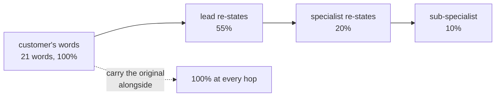

# 6.2 — What the specialist cannot see

## One-line answer

A hand-off passes a **re-statement**, not the request, and re-statement is lossy: measured across a
chain, the customer's original wording falls to **55% at one hop, 20% at two and 10% at three** —
and the first detail to go is always the one that dates the problem.

## The story

You phone about a leak. You tell the person who answers: *"There's water coming through the kitchen
ceiling, it started on Tuesday after the flat upstairs had their bathroom done, and it's worse when
they run a bath."*

She types a line and passes you to the maintenance desk. The maintenance desk has: *"Water ingress,
kitchen ceiling, first floor."*

Maintenance passes it to the contractor. The contractor has: *"Ceiling leak, kitchen."*

The contractor arrives, looks at the ceiling, and asks whether anything changed recently upstairs.
You tell him about the bathroom. He says *"ah — that'll be it"* and fixes it in twenty minutes.

Every person in that chain did their job. Nobody was careless. And the fact that solved it — that a
bathroom was fitted upstairs on Tuesday — travelled the whole way to the contractor inside your
head rather than inside the job, and only got out because he happened to ask.

## The idea in plain language

When one agent hands work to another, something has to describe the work. What that something is
depends on the shape:

- **A call with the default schema** passes one string, `request`, composed by the caller's model
  ([5.2](../05-agent-as-tool/5.2-the-schema-the-caller-sees.md)).
- **A call with an `input_schema`** passes named fields — better, because the fields are required,
  but still only the fields.
- **A transfer** passes control; the specialist sees the session, but its own instruction and its
  own idea of what matters shape what it reads out of it.
- **`AgentTool`** passes the `request` string and a copy of state, into a session with **no
  conversation history at all** ([5.3](../05-agent-as-tool/5.3-the-session-it-does-not-share.md)).

In every case except the shared-session transfer, what crosses the boundary is a *summary written
by the sender*, and a summary is a decision about what matters made by someone who is not going to
do the work.

That is the general failure, and it has a name worth using: **lossy re-statement**. It is not
forgetting. Nothing is dropped by accident. The caller writes down what it believes is relevant,
which is exactly the right thing to do and exactly the thing that loses the detail whose relevance
is not yet known.

The detail that goes first is almost always the same kind: **the incidental circumstance**. *Since
Tuesday.* *On the same machine.* *Both times in the afternoon.* These read as colour, so a
summariser drops them, and they are precisely the facts that identify a cause.

## Why Sutra needs it

Day 49's motivating scene is ticket 4521 — *"after the identity provider hands control back, our
user lands at a blank sign-in screen"* — and the archived ticket that solves it, 4188, is found
because the two share vocabulary about sign-in and cookies. If the lead re-states 4521 as *"login
problem"* before handing it to the archive specialist, the retrieval Day 49 spent a whole day
getting right is searching against three words instead of twenty.

That is the sharp version of this part: **retrieval quality is bounded by hand-off fidelity.** You
can build a perfect index and lose it in the sentence that asks the question.

## The mechanism

`depth.py` takes one real customer sentence and follows it along a chain of specialists, measuring
at each hop how much of the original wording is still present.

```bash
cd days/day-55-delegation-and-transfer/lab
uv run python depth.py
```

**Line by line:**

- `ORIGINAL` is a twenty-one-word customer sentence in the desk's own vocabulary, including the
  incidental detail *"since tuesday"*.
- `CHAIN` holds what each hop passes on. These are not degraded automatically — they are the
  summaries a careful agent would actually write, each keeping what that agent thought mattered.
  Writing them by hand is the honest way to model this, because the loss is a judgement, not a
  truncation.
- `kept(text)` is the share of the original's distinct words still present. A crude measure, and
  the right kind of crude: it counts what survived rather than judging what should have.
- `--verbatim` is the ablation. It passes the original text down the chain unchanged, so the
  measurement has a ceiling to be compared against.

Measured on 2026-09-05:

```text
original (21 words):
  after the identity provider hands control back our user lands at a blank sign-in screen on the staff portal since tuesday

  depth  answering agent        requests  words kept
  1      triage_lead                   1       100%
  2      auth_specialist               3        55%
  3      cookie_specialist             4        20%
  4      browser_specialist            5        10%
```

One hop costs nearly half the wording. Read the second row of `CHAIN` to see what a *reasonable*
summary looks like: *"user lands at a blank sign-in screen after the identity provider"*. Nothing in
that is wrong. It is a good summary. And *the staff portal* has gone, and *since tuesday* has gone.

By the third hop the request is *"blank sign-in screen after sign-on"* — twenty per cent — and by
the fourth it is *"sign-in screen problem"*, which is ten per cent and would match half the
archive.

Now the ablation:

```bash
uv run python depth.py --verbatim
```

**Line by line:**

- `--verbatim` changes exactly one thing: each hop receives `ORIGINAL` instead of the previous
  hop's summary.
- Request counts are unchanged, because passing more text does not cost another call — it costs
  tokens, which on a free tier is the cheap axis
  ([6.1](6.1-a-handoff-costs-a-request.md) established which one runs out).

```text
  depth  answering agent        requests  words kept
  1      triage_lead                   1       100%
  2      auth_specialist               3       100%
  3      cookie_specialist             4       100%
  4      browser_specialist            5       100%
```

One hundred per cent at every depth. The fix for lossy re-statement is not better summarising. It
is **not summarising**: carry the original text alongside the summary, and let the specialist read
the thing the customer actually said.



## When it breaks

There is no error, and the symptom is a good answer to a question nobody asked.

The concrete version, using the desk's own archive: the customer's sentence contains *"since
tuesday"*. Ticket 4188 in the archive is about a cookie dropped by the browser after a
`SameSite` change — and a `SameSite` change is the kind of thing that lands in a release on a
particular day. *Since tuesday* is the strongest single clue in the sentence, because it says
*something changed*, and it is dropped at the first hop because it reads as an incidental detail.

The specialist then answers a general question about blank sign-in screens, accurately, and the
answer is useless. Nobody can point at a mistake. The lead summarised well, the specialist searched
well, and the fact that would have made the search work is in a session two hops back.

The second break is the one worth watching for in review: an `input_schema` **causes** this loss
while looking like the fix. A schema with `symptom` and `product_area` is a better contract than a
free-text blob — and it is also an instruction to discard everything that is not a symptom or a
product area. If the schema has no field for *"what changed recently"*, then *"since tuesday"* has
nowhere to go, and the structure that made the call reliable made the answer worse. The repair is a
field that exists precisely to carry the unsummarised thing:

```python
class KbQuestion(BaseModel):
    """What the specialist needs, plus what the caller must not throw away."""

    symptom: str = Field(description="What the customer sees going wrong.")
    product_area: str = Field(description="One of: auth, billing, onboarding.")
    original_text: str = Field(description="The customer's own words, verbatim, unedited.")
```

**Line by line:**

- `symptom` and `product_area` are the caller's judgement, which is what makes the call routable.
- `original_text` is the ablation from `depth.py` turned into a contract. Its description says
  *verbatim, unedited* because a field described as "the customer's words" will otherwise be filled
  with a tidied version.
- It is required, not optional. An optional field for the original text is a field the caller will
  skip on the requests where it is longest, which are the requests where it matters most.

## In production

**What a professional writes instead.** They pass a **handle** rather than a summary wherever there
is somewhere to point at. The desk has ticket ids; a specialist given `ticket_id="4521"` and a tool
that reads tickets has the whole text, at full fidelity, for the cost of one lookup — and it cannot
be degraded by a chain, because it is not being carried. This is the same instinct as Day 36's
state handles in MCP: identifiers travel losslessly, prose does not. Where there is no handle,
carry the verbatim text and accept the tokens.

**What degrades at scale.** Chain length, multiplicatively. Each hop keeps roughly half, so
fidelity falls off a cliff rather than sloping: 100, 55, 20, 10 in the measurement above. Systems
grow chains one hop at a time, each addition looking harmless, and the answer quality degrades
without any single change being responsible. That is the main practical argument for the depth
limits in [8.1](../08-in-production/8.1-how-deep-is-defensible.md).

**The failure that only appears with real traffic.** Your test inputs are short and already
distilled, because you wrote them, so summarising them loses nothing — a five-word test question
survives any number of hops. Real customer text is long, redundant and full of incidental detail,
and it is *the redundancy* that carries the diagnosis. The gap between test and production is not
volume here; it is verbosity.

**The review comment a senior engineer leaves:** *"The lead is passing a one-line summary to the
research specialist, and the retrieval index was built on full ticket text. You are searching
twenty words of index against six words of query. Pass the ticket id if you have one, or add a
required `original_text` field — and either way, put the customer's wording in front of the thing
doing the matching."*

**The interview question:** *"What gets lost when one agent delegates to another?"* An honest
answer: *"The original wording, and specifically the parts that look incidental. What crosses the
boundary is a summary the caller wrote, and a summary is a judgement about relevance made before
anyone knows what is relevant. I measured a chain on our desk: 100 per cent of the customer's words
at the top, 55 after one hop, 20 after two, 10 after three — and the phrase that went first was
'since tuesday', which was the strongest clue in the sentence because it meant something had
changed. The fix is not better summarising. It is passing a handle, like a ticket id the specialist
can look up, or carrying the verbatim text in a required field alongside the summary. With the
original carried through, the same chain holds 100 per cent at every hop and costs nothing extra in
requests — only tokens, which is the axis that is not scarce on a free tier."*

## Check yourself

```bash
cd days/day-55-delegation-and-transfer/lab
uv run python depth.py
uv run python depth.py --verbatim
```

Now open `depth.py` and rewrite the depth-2 summary in `CHAIN` yourself, trying to keep as much as
you can in twelve words. Re-run and see what percentage you managed. Then say which fact you chose
to drop, and why.

**Out loud, without scrolling up:** state what actually crosses the boundary on a hand-off, name
the class of detail that is lost first, and give the two fixes that beat "summarise better".

**Next:** [7.1 — Two counters pointing at each
other](../07-failure-lab/7.1-two-counters-pointing-at-each-other.md).
