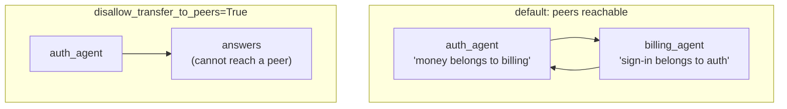

# 7.1 — Two counters pointing at each other

## One-line answer

Two specialists whose descriptions each defer to the other will pass one request between them
forever: **twelve requests spent, six each, nothing answered** — and the only reason it stopped at
twelve is a constant in the lab, because ADK 2.7.1 has no transfer-depth limit of its own.

## The story

The two windows at the vehicle registration office are marked *Documents* and *Payments*.

You are there because your registration is being refused, and you do not know why. Documents looks
at it and says the refusal is because the fee has not cleared, so that is Payments. Payments looks
at it and says the fee is unpaid because the document check failed, so that is Documents. Documents
says no, the check is blocked pending payment. Payments says the payment is blocked pending the
check.

Both are reading the same screen. Both are telling you the truth as their screen shows it. There is
no dishonesty and no incompetence anywhere in this, and you can do it four times before you
realise that nobody in this building has the job of noticing that you are going round.

## The idea in plain language

This is a **routing loop**, and the ingredients are ordinary:

1. **Two agents that can reach each other.** By default they can:
   [4.3](../04-transfer-in-2x/4.3-parents-peers-and-two-switches.md) measured peers being reachable
   with nothing configured, and measured `disallow_transfer_to_parent=True` leaving *only* the peer
   edges.
2. **Two descriptions that each defer to the other.** *"Anything about money belongs to billing."*
   *"Anything about signing in belongs to auth."* Both true, both good practice
   ([3.3](../03-the-description-routes/3.3-writing-a-description-that-routes.md) asks for exclusions
   and this is what exclusions look like), and together a trap.
3. **One request that is genuinely both.** *"The customer cannot sign in to pay their invoice."*

Nothing here is a bug. Each agent, asked in isolation, gives the correct answer about whose job this
is. The failure is a property of the pair, and no code review of either agent alone will find it.

The thing that makes this a *lab* rather than a curiosity is the third ingredient: it is not exotic.
Requests that sit across two specialists are the normal output of real users, and they are the ones
your test set does not contain, because you wrote your tests one agent at a time.

And here is the fact that determines how much it costs:

> **ADK 2.7.1 does not impose a maximum transfer depth.**

There is no `max_transfers`, no default hop cap in the transfer flow. The loop ends when a model
decides differently, when the invocation is cancelled, or when the provider stops answering. On a
free tier the third of those is the realistic one, which means the natural terminator for a routing
loop is **your daily quota**.

## Why Sutra needs it

`gate.py` fails tonight's build until `sutra/delegation.py` contains `disallow_transfer_to_peers`
and a hop cap. Both of those exist because of this part.

Day 59 is the phase's containment lab and Principle 13 is blast radius before capability. A loop
that spends a day's quota in a few seconds is the cheapest possible demonstration that a capability
without a bound is not a capability you can ship. Day 63's approval gates and Day 70's quota router
both assume somebody is already counting hops.

## The mechanism

`pingpong.py` builds two real agents with the reciprocal descriptions, uses ADK's own
`_get_transfer_targets` for reachability, and follows one request. The decision is scripted,
because the failure does not depend on which model makes it — any model that believes both
descriptions will bounce.

```bash
cd days/day-55-delegation-and-transfer/lab
uv run python pingpong.py; echo "exit: $?"
```

**Line by line:**

- `AUTH_DESCRIPTION` and `BILLING_DESCRIPTION` are reciprocal deferrals. Read them: each names the
  other as the owner of the other's subject. Neither is wrong.
- Both agents set `disallow_transfer_to_parent=True`, which is the configuration
  [4.3](../04-transfer-in-2x/4.3-parents-peers-and-two-switches.md) identified as leaving only the
  peer-to-peer edges. This is the trap arrived at by a plausible route, not by contrivance.
- `decide()` returns the other agent if it is reachable, and `None` if it is not. That is the whole
  model stand-in, and its honesty is that it *checks reachability first* — when the edge is gone,
  the agent answers.
- `ledger.spend(...)` records one request per hop, so the cost is counted rather than guessed.
- `HOP_LIMIT = 12` is the lab's stop, with a comment saying the framework does not give you one.
- The script exits non-zero when the limit is hit: an eval that can go red.

Verified against `google-adk` 2.7.1 (`google/adk/flows/llm_flows/agent_transfer.py`) on 2026-09-05.

Measured on 2026-09-05:

```text
request: 'the customer cannot sign in to pay their invoice'
hop limit: 12   disallow_transfer_to_peers=False

  hop  1  lead -> auth_agent
  hop  2  -> billing_agent
  hop  3  -> auth_agent
  hop  4  -> billing_agent
  hop  5  -> auth_agent
  hop  6  -> billing_agent
  hop  7  -> auth_agent
  hop  8  -> billing_agent
  hop  9  -> auth_agent
  hop 10  -> billing_agent
  hop 11  -> auth_agent
  hop 12  -> billing_agent

  STOPPED AT THE HOP LIMIT after 12 hops - nothing was answered

  requests spent    12
  by agent          {'auth_agent': 6, 'billing_agent': 6}
  answered          no
exit: 1
```

Twelve requests. Six each. Nothing answered.

Put that next to [6.1](../06-price-of-a-handoff/6.1-a-handoff-costs-a-request.md): a correctly
handled ticket costs one to three requests. This one ticket spent twelve and produced nothing, and
it would have kept going. At ten requests a minute, a single looping request consumes more than a
minute of the lane on its own, and a handful of them arriving together take the desk off the air.

The `by agent` line is the diagnostic you will actually use. A perfectly even split between exactly
two agents is the signature of a two-node cycle; nothing else produces it. If a routing dashboard
ever shows two specialists with identical, high hand-off counts, that is this.

Now the fix, which is one field:

```bash
uv run python pingpong.py --no-peers; echo "exit: $?"
```

**Line by line:**

- `--no-peers` sets `disallow_transfer_to_peers=True` on both agents.
- Nothing else changes: same descriptions, same request, same scripted decision function. The
  decision function still *wants* to hand over; it checks reachability and finds nobody.

```text
request: 'the customer cannot sign in to pay their invoice'
hop limit: 12   disallow_transfer_to_peers=True

  hop  1  lead -> auth_agent
  hop  1  auth_agent can reach ['(nobody)'] - it answers instead

  requests spent    1
  by agent          {'auth_agent': 1}
  answered          yes
exit: 0
```

Twelve requests to one. And the answer arrives — from `auth_agent`, which may or may not be the
ideal desk for a question that is half about invoices, but which answers, which is infinitely better
than a loop.

That trade is the whole lesson of this part. **Removing the sideways edge does not make the routing
smarter; it makes the failure bounded.** A slightly-wrong answer is a bug you can fix next week. An
unbounded loop is an outage.



## When it breaks

This part *is* the break, so what follows is the two ways it gets worse.

**A longer cycle.** Three agents that defer round a triangle produce the same loop with a `by
agent` distribution of one third each, which is harder to spot and impossible to prevent with
`disallow_transfer_to_peers` alone if the deferrals go through the parent. The general answer is a
hop counter, not a topology rule — topology handles the two-node case, counting handles all of
them.

**A loop that terminates by quota.** The realistic production ending is not a hop limit; it is:

```text
429 RESOURCE_EXHAUSTED: quota exceeded for gemini-3.7-flash, retry in 27s
```

arriving on hop forty, after which Day 21's retry ladder politely waits and tries again, and the
loop resumes. A retry policy layered on top of a loop is a loop with a sleep in it. That is worth
sitting with: **your backoff logic will faithfully keep a routing loop alive across the whole day.**
Whatever counts hops must count them across retries, which means the counter lives in session state
(Day 17), not in a local variable.

The counter itself is short, and `before_tool_callback` (Day 13) is where it goes:

```python
def cap_transfers(tool, args, context):
    """Refuse a transfer once this invocation has already made too many."""
    if tool.name != "transfer_to_agent":
        return None
    hops = context.state.get("temp:transfer_hops", 0) + 1
    context.state["temp:transfer_hops"] = hops
    if hops > MAX_HOPS:
        return {"status": "refused", "reason": f"transfer hop limit {MAX_HOPS} reached"}
    return None
```

**Line by line:**

- The name check makes this callback ignore every other tool, so it can be attached to every agent
  without thinking about what tools they have.
- `temp:` prefixes the state key so it lives for the invocation and does not persist into the next
  conversation — Day 17's scopes doing exactly the job they were built for.
- Returning a dict **short-circuits the tool**: the transfer never runs, and the model receives a
  refusal it can reason about. Returning `None` lets it proceed.
- The refusal is a `status` dict, not a raised exception, because
  [5.4](../05-agent-as-tool/5.4-a-failure-that-arrives-as-a-string.md)'s lesson cuts both ways: a
  structured refusal is something the caller can branch on, where a string is something it will
  paraphrase.
- `MAX_HOPS` is a constant you choose. Three is a defensible starting point for a desk: lead →
  specialist → one correction is a reasonable journey, and a fourth hop is a loop.

## In production

**What a professional writes instead.** Both defences, not one. Topology first —
`disallow_transfer_to_peers=True` as the default, so the graph among specialists is acyclic by
construction — and then a hop cap in a callback for the cases topology cannot see. The cap is
cheap, it is one callback attached once, and it converts an outage into a logged refusal.

**What degrades at scale.** Loops become more likely as the roster grows, because the chance that
*some* pair of descriptions defers reciprocally rises with the number of pairs, which is quadratic.
Five specialists have ten pairs. Ten have forty-five. Nobody reviews forty-five pairs of
descriptions, which is why the defence has to be structural rather than editorial.

**The failure that only appears with real traffic.** The request that starts a loop is the one that
genuinely belongs to two specialists, and it is generated by users rather than by fixtures. It is
also, reliably, the request a customer sends when they are already frustrated — the compound
problem, the one where two things went wrong together. So the loop fires disproportionately on the
tickets that matter most, and consumes the quota that the rest of the queue needed.

**The review comment a senior engineer leaves:** *"`auth_agent` says money belongs to billing and
`billing_agent` says sign-in belongs to auth. Send them 'cannot sign in to pay my invoice' and they
will pass it back and forth until the quota runs out — there is no depth limit in the framework. Set
`disallow_transfer_to_peers` on both, and add the hop counter to the shared callback so the
three-agent version is covered too."*

**The interview question:** *"How do you stop agents handing work back and forth forever?"* An
honest answer: *"Two layers, because neither is sufficient. Topology: I default specialists to
`disallow_transfer_to_peers=True`, so all routing goes through the lead and there are no cycles
among siblings — that alone turned a twelve-request loop into a single answered request when I
measured it. Then a hop counter in a `before_tool_callback` keyed on `transfer_to_agent`, storing
the count in invocation-scoped state, because a three-agent cycle through the parent gets past the
topology rule. The reason it needs to be in state rather than a local is that a 429 plus a retry
policy will resume the loop, so the counter has to survive the retry. And ADK 2.7.1 gives you
nothing here by default — there is no maximum transfer depth — so on a free tier the natural
terminator for a routing loop is your daily quota."*

## Check yourself

```bash
cd days/day-55-delegation-and-transfer/lab
uv run python pingpong.py; echo "exit: $?"
uv run python pingpong.py --no-peers; echo "exit: $?"
uv run python pingpong.py --cap 4
```

Now edit `AUTH_DESCRIPTION` so it no longer defers to billing — say what it does and what it does
not do, per [3.3](../03-the-description-routes/3.3-writing-a-description-that-routes.md) — and run
the default again. Write down how many hops you get.

**Out loud, without scrolling up:** name the three ingredients of a routing loop, say what ADK's
default transfer-depth limit is, and give the reason a hop counter has to live in session state
rather than in a local variable.

**Next:** [7.2 — The hand-over that never came back](7.2-the-handover-that-never-came-back.md).
