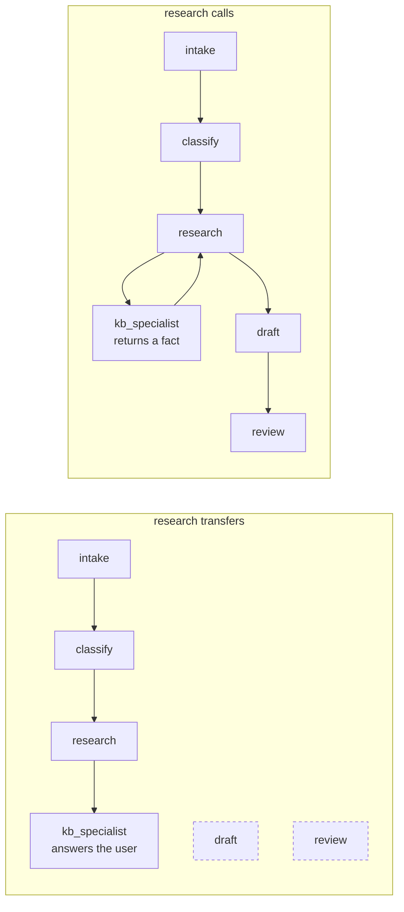

# 7.2 — The hand-over that never came back

## One-line answer

A transfer inside a pipeline does not fail loudly — it ends the pipeline: **three stations out of
five ran, zero errors were raised**, and the reply went out without the draft or the review because
control never returned to the stations that came after.

## The story

The dry cleaner's has a card that travels with your coat. Four boxes on it: *received*, *cleaned*,
*pressed*, *checked*. Each person ticks their box and the coat moves along the rail.

One Tuesday the woman doing the cleaning found a pen mark, and took the coat over to the man who
does stain removal. He got the mark out, which was the right thing to do, and hung the coat on the
rail by his bench. Then he went to lunch.

At five o'clock the coat went out to the customer: clean, stain gone, and not pressed. The card had
three ticks on it. Nobody looked at the fourth box, because nothing in the shop is designed to
notice a box that has not been ticked — the coat was on the rail with the finished ones, so it was
finished.

The stain removal was a success. The coat was creased.

## The idea in plain language

[2.2](../02-call-or-handover/2.2-who-owns-the-turn.md) showed what a stuck transfer does to a
*conversation*: the customer ends up at the wrong desk for the next several turns. This part is the
same mechanism doing something worse to a *pipeline*.

Day 53's and Day 54's graph runs stations in order. A station that hands over does not return, so
the stations after it never run. And critically:

- **No exception is raised.** Nothing went wrong. An agent decided to transfer, and transferring is
  a supported thing to do.
- **Output is still produced.** The specialist answers, so there is a reply. It is a coherent,
  fluent, well-formed reply.
- **The missing work is invisible.** There is no gap in the output where the draft should be — the
  specialist's answer occupies that space perfectly well.

That combination is the definition of a **silent partial success**, and it is the most expensive
failure shape in this whole day, because every signal your monitoring has says the ticket was
handled.

The confusion that causes it is one word. Somebody wanted the research station to *consult* a
specialist, attached the specialist as a sub-agent, and did not set `mode`. The default is `chat`
([5.1](../05-agent-as-tool/5.1-the-sub-agent-that-became-a-tool.md)), so what they built was a
hand-over.

## Why Sutra needs it

Day 58 builds exactly this pipeline: intake, classify, research, draft, review. The research
station is the one that consults a specialist, and it is the third of five. If that consultation is
a transfer, Day 58's demo produces a reply that looks fine and has never been reviewed — which
matters a great deal by Day 63, where the review station is where a human approval gate is going to
live.

An approval gate on a station that does not run is not an approval gate. It is a diagram.

## The mechanism

`stalled.py` runs the five stations and lets the research station ask its question either way.

```bash
cd days/day-55-delegation-and-transfer/lab
uv run python stalled.py; echo "exit: $?"
```

**Line by line:**

- `STATIONS` is the Day 58 pipeline in order, and `CONTRIBUTION` names what each one adds to the
  outgoing reply — so "did it run" is checked by looking for its contribution rather than by
  trusting a flag.
- `holder` starts as `"pipeline"`. The loop stops when it is anything else, which is the entire
  mechanism of a transfer expressed in one variable: control left, so the loop is over.
- The research station spends a request for the specialist either way. The shapes differ in what
  happens next, not in whether the specialist ran.
- `errors raised` is printed as a literal `0` because that is the point of the part: there is
  nothing to catch.
- The script exits non-zero when stations are missing, so it is an eval and not a report.

Measured on 2026-09-05:

```text
research asks by transfer

  intake     ran
  classify   ran
  research   ran
  draft      DID NOT RUN
  review     DID NOT RUN

  reply contains:
    - ticket text attached
    - priority: high
    - similar ticket: 4188
    - kb_specialist answered the user directly

  stations run        3/5
  requests spent      4
  errors raised       0
  missing stations    ['draft', 'review']
exit: 1
```

Read `reply contains` as though you were the support engineer receiving it. Ticket text, a
priority, a similar ticket, and an answer from the knowledge-base specialist. That is a useful
message. Nothing about it announces that it is two thirds of a process.

Now read the two lines under it together: **`stations run 3/5`** and **`errors raised 0`**. Those
two facts in the same output is the whole subject of this part. A monitoring system watching for
errors sees a clean run. A monitoring system watching for output sees output. Only a system that
counts *stations* sees anything wrong, and nobody counts stations until the first time this
happens.

The fix, again, is one word:

```bash
uv run python stalled.py --call; echo "exit: $?"
```

**Line by line:**

- `--call` makes the research station's consultation a call: the specialist's answer becomes a fact
  in the pipeline rather than a reply to the user.
- Nothing else changes. Same stations, same specialist, same request for it.

```text
research asks by call

  intake     ran
  classify   ran
  research   ran
  draft      ran
  review     ran

  reply contains:
    - ticket text attached
    - priority: high
    - similar ticket: 4188
    - kb fix: SameSite=None; Secure
    - reply drafted quoting KB-104
    - reply checked and approved

  stations run        5/5
  requests spent      6
  errors raised       0
  missing stations    none
exit: 0
```

Five stations out of five, and — the honest part — **six requests instead of four**. The correct
version costs half as much again. That is
[6.1](../06-price-of-a-handoff/6.1-a-handoff-costs-a-request.md)'s arithmetic arriving in a
concrete place: the broken pipeline is cheaper, and if you were tuning on cost alone you would
choose it.



## When it breaks

This part is the break. What follows is how you would find it if it were already in production and
nobody had read this.

The symptom that reaches you is a complaint, not an alert: *"the replies stopped being proofread"*,
or *"we're getting the research but not the draft"*. It arrives days later, from a human, because
no machine noticed.

The diagnostic that finds it in one look is **the author of the final event**. Every event carries
its author (Day 7). In a healthy run of this pipeline the last event is authored by `review`. In
the broken run it is authored by `kb_specialist`. One field, and it distinguishes the two cases
perfectly:

```python
def assert_pipeline_completed(events, expected_last="review"):
    """A pipeline that ended somewhere else did not finish, however good the reply reads."""
    authors = [e.author for e in events if e.author]
    if authors[-1] != expected_last:
        raise AssertionError(
            f"pipeline ended at {authors[-1]!r}, expected {expected_last!r}; ran: {authors}"
        )
```

**Line by line:**

- `e.author` is the agent that produced the event, which is the only field that distinguishes "the
  review station approved this" from "a specialist answered instead".
- Filtering on truthiness skips framework events with no author, which would otherwise make the
  last element unreliable.
- It **raises** rather than returning a status, because this is a test-time assertion — the
  production version of the same check is a metric, and
  [8.2](../08-in-production/8.2-who-decided-and-why.md) is where it belongs.
- The message prints the whole author list, because knowing it ended at `kb_specialist` is half the
  answer and knowing that `draft` never appears is the other half.

## In production

**What a professional writes instead.** They make completion explicit rather than inferred. The
pipeline asserts its own terminal station — the last event's author, or a state key that only the
review station sets — and a ticket that reaches the user without it is an incident, not a variation.
That check costs nothing and it is the only thing standing between you and a silent partial
success.

The structural half of the fix is the rule from
[2.2](../02-call-or-handover/2.2-who-owns-the-turn.md), stated as a constraint: **nothing inside a
pipeline may transfer.** A station consults with a call. If a station genuinely needs to hand the
customer to somebody — a refund dispute mid-triage — that is an exit from the pipeline and should
be modelled as one, with the pipeline recording that it stopped and why.

**What degrades at scale.** The probability that at least one ticket takes the transfer path rises
with volume, and the tickets that take it are not random — they are the ones where the request was
ambiguous enough for the model to think a hand-over was warranted. So the missing-review tickets
are systematically the harder ones, which is precisely the population where the review station was
most valuable.

**The failure that only appears with real traffic.** In development you check the output by reading
it, and a three-station reply reads fine. Nobody reads a hundred replies. The check has to be
mechanical before volume arrives, because after volume arrives the only detector is a customer.

**The review comment a senior engineer leaves:** *"The research station's specialist has no `mode`,
so it is a transfer target. When it fires, `draft` and `review` never run and nothing raises — you
will ship an unreviewed reply and the run will look clean. Set `mode='single_turn'`, and add an
assertion that the last event's author is `review` so the next person who does this finds out from
CI instead of from a customer."*

**The interview question:** *"What is the worst failure mode you have hit in a multi-agent
pipeline?"* An honest answer: *"A station that transferred instead of calling, which silently
truncated the pipeline. Three of five stations ran, zero errors were raised, and a reply still went
out — the specialist answered the user directly, so the output looked complete and the missing
draft and review left no gap. Cost monitoring made it worse, because the broken path spent four
requests where the correct one spends six. The structural fix was making it a single-turn call, and
the detection fix was asserting the author of the final event: a healthy run ends at the review
station, and a truncated one ends at whatever specialist took over. Since then my rule is that
nothing inside a pipeline is allowed to transfer — if control genuinely has to leave, that is an
exit and it gets recorded as one."*

## Check yourself

```bash
cd days/day-55-delegation-and-transfer/lab
uv run python stalled.py; echo "exit: $?"
uv run python stalled.py --call; echo "exit: $?"
```

Now move the specialist consultation from `research` to `draft` in `stalled.py` and re-run the
transfer version. Write down how many stations run, and say whether the reply that goes out is more
or less dangerous than before.

**Out loud, without scrolling up:** explain why a truncated pipeline raises no error and still
produces output, and name the single field that distinguishes a completed run from a truncated one.

**Next:** [8.1 — How deep is defensible](../08-in-production/8.1-how-deep-is-defensible.md).
