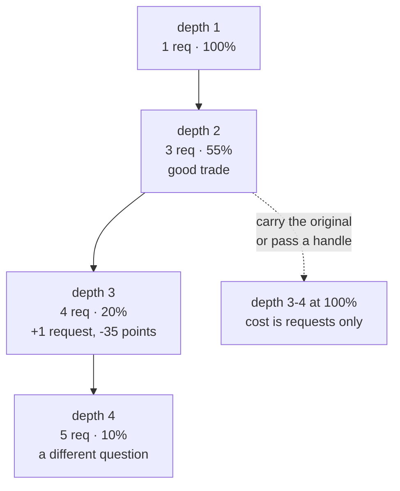

# 8.1 — How deep is defensible

## One-line answer

Two hops is the working limit for a delegation chain, and the measurement says why: at depth 2 you
have spent **3 requests and kept 55% of the customer's words**, at depth 3 it is **4 and 20%**, at
depth 4 **5 and 10%** — cost rises linearly while fidelity falls off a cliff.

## The story

The first time I tried to get a pothole fixed I phoned the council, who gave me highways, who gave
me the depot, who gave me the contractor, who told me to phone the council because the work order
has to come from them.

Four numbers. Everybody polite, everybody correct about whose job the *next* bit was. And by the
fourth call I was describing "a hole in the road on Ashcombe Road" rather than what I had said
first time round, which was that the edge of the resurfacing patch from the water works had sunk
and was collecting water and a cyclist had come off it.

The cyclist was the reason it got fixed, eventually. He was not in the version that reached the
contractor.

## The idea in plain language

Chain depth is the number of hand-offs between the agent that received the request and the agent
that finally does the work. Depth 1 is one agent. Depth 2 is a lead and a specialist. Depth 3 adds
a sub-specialist.

Two costs grow as depth grows, and the reason a limit exists is that they grow *differently*.

**Requests grow linearly.** Each hop is a model call, and the arithmetic is
[6.1](../06-price-of-a-handoff/6.1-a-handoff-costs-a-request.md)'s. Predictable, budgetable,
annoying.

**Fidelity falls geometrically.** Each hop keeps roughly half of what it received, because each hop
re-states ([6.2](../06-price-of-a-handoff/6.2-what-the-specialist-cannot-see.md)). Halving compounds:
half, then a quarter, then an eighth.

That asymmetry is the whole argument. If both costs grew linearly you could trade one against the
other and pick a depth by budget. They do not. Cost is a slope and quality is a cliff, so there is a
depth past which you are paying more for an answer to a question that has been eroded into a
different question.

Two further costs, which do not show in a measurement but decide arguments in real reviews:

**Debuggability.** At depth 2, "why did it say that?" has two agents to inspect. At depth 4 it has
four, in three sessions if any of them used `AgentTool`
([5.3](../05-agent-as-tool/5.3-the-session-it-does-not-share.md)), and the fact that produced the
answer is two summaries away from the sentence that requested it.

**Failure surface.** Every hop can fail as a string
([5.4](../05-agent-as-tool/5.4-a-failure-that-arrives-as-a-string.md)), so a four-deep chain has four
places for a silent failure and each one gets summarised by the layer above.

## Why Sutra needs it

Day 58's graph is five stations deep as a *pipeline*, which is fine — a pipeline is edges, and an
edge carries the full context forward because nothing is re-stated. The depth that matters is
delegation depth *inside* a station, and the target for the desk is two: the station, and one
specialist.

That number is also the input to Day 59's containment work and to
[7.1](../07-failure-lab/7.1-two-counters-pointing-at-each-other.md)'s hop cap. You cannot choose
`MAX_HOPS` without having decided what depth is defensible, and "three" is the defensible answer for
a desk precisely because it allows one correction on top of the intended two.

## The mechanism

`depth.py` follows one customer sentence down a chain and reports both costs together, which is the
only way to see the asymmetry.

```bash
cd days/day-55-delegation-and-transfer/lab
uv run python depth.py
```

**Line by line:**

- The request count here is the **hand-off chain**: one request per agent in the chain, plus one for
  the agent that finally answers. That is the transfer shape.
  [6.1](../06-price-of-a-handoff/6.1-a-handoff-costs-a-request.md) counts the *call* shape, which is
  more expensive at every depth — a two-level call chain is five requests, not three — so treat this
  column as the floor rather than the bill.
- `kept()` is the share of the original's distinct words present at that hop.
- The two columns are printed side by side deliberately. Read separately, each looks manageable.

Measured on 2026-09-05:

```text
original (21 words):
  after the identity provider hands control back our user lands at a blank sign-in screen on the staff portal since tuesday

  depth  answering agent        requests  words kept
  1      triage_lead                   1       100%
  2      auth_specialist               3        55%
  3      cookie_specialist             4        20%
  4      browser_specialist            5        10%
```

Requests: 1, 3, 4, 5. Words kept: 100, 55, 20, 10.

Going from depth 1 to depth 2 costs two extra requests and buys you a specialist, at the price of
nearly half the wording. That is usually a good trade: a specialist with 55% of the words and the
right tools beats a generalist with 100% and none.

Going from 2 to 3 costs **one** extra request and loses **thirty-five percentage points** of
fidelity — from 55% to 20%. The cost is almost nothing and the loss is most of what remained. That
is where the line is, and it is visible in the table rather than a matter of taste.

Going from 3 to 4 barely matters, because there was nothing left to lose. *"Sign-in screen
problem"* is not a question about ticket 4521 any more; it is a question about sign-in screens.

The ablation says the cliff is not inevitable:

```bash
uv run python depth.py --verbatim
```

**Line by line:**

- `--verbatim` carries the original text unchanged to every hop, exactly as
  [6.2](../06-price-of-a-handoff/6.2-what-the-specialist-cannot-see.md) recommends.
- The request column is unchanged, because carrying more text costs tokens rather than calls.

```text
  depth  answering agent        requests  words kept
  1      triage_lead                   1       100%
  2      auth_specialist               3       100%
  3      cookie_specialist             4       100%
  4      browser_specialist            5       100%
```

So the honest form of the rule is not *"never go deeper than two"*. It is:

> **Depth is limited by re-statement, not by hops.** If you carry the original faithfully — a
> verbatim field, or better, a handle the specialist can look up — depth costs requests and nothing
> else. If you re-state at each hop, two is the limit and three is already too far.



## When it breaks

The break is a chain that grew one hop at a time, each addition defensible on its own.

There is rarely a moment where somebody proposes a four-deep delegation chain. What happens is that
the KB specialist starts needing a lookup of its own, so it gets a sub-specialist, and that is one
hop added to a chain that was two. Six months later a fifth is added the same way. Every individual
pull request added one hop for a good reason, and nobody ever reviewed the chain.

The signal that it has happened is the shape of the complaints. Answers stop being *wrong* and start
being *generic* — technically correct, unobjectionable, and not about this ticket. That is exactly
what a 10%-fidelity question produces: a good answer to the general form of your problem.

The cheap detector is an assertion on depth, in the same callback that caps hops:

```python
def cap_depth(tool, args, context):
    """Refuse a hand-off that would take this invocation past the defensible depth."""
    if tool.name != "transfer_to_agent":
        return None
    depth = context.state.get("temp:chain_depth", 1) + 1
    context.state["temp:chain_depth"] = depth
    if depth > MAX_DEPTH:
        return {"status": "refused", "reason": f"chain depth {depth} exceeds {MAX_DEPTH}"}
    return None
```

**Line by line:**

- It is the same shape as [7.1](../07-failure-lab/7.1-two-counters-pointing-at-each-other.md)'s hop
  cap, and in practice it is the same callback — depth and hop count are different questions
  (a loop revisits agents, a deep chain does not) but they share a counter and a refusal path.
- `temp:` scopes it to the invocation, so a long conversation does not accumulate depth across
  unrelated turns.
- Returning a `status` dict refuses the tool without raising, so the model receives something it can
  act on rather than an error the framework converts to a string.
- `MAX_DEPTH` is a constant with a comment giving the reason. A number with no reason gets raised
  the first time somebody hits it.

## In production

**What a professional writes instead.** They flatten. When a specialist needs a second specialist,
the first question is whether the *lead* should be calling both — two calls at depth 2 rather than a
chain at depth 3. That costs the same requests, keeps both specialists one hop from the original
text, and puts both results in front of the agent that will use them. Chains are attractive because
they look like separation of concerns; in a system where context degrades per hop, breadth is
almost always better than depth.

**What degrades at scale.** Depth interacts badly with everything else in this day. Deeper chains
mean more places for a silent string failure
([5.4](../05-agent-as-tool/5.4-a-failure-that-arrives-as-a-string.md)), more pairs of descriptions
that might defer reciprocally ([7.1](../07-failure-lab/7.1-two-counters-pointing-at-each-other.md)),
more sessions to correlate in a trace, and a larger multiplier on retries. None of those is the
headline cost, and together they are why depth feels worse in production than the arithmetic
predicts.

**The failure that only appears with real traffic.** Short test inputs survive any depth — a
six-word question re-stated is still the same six words. The cliff is a property of long, redundant,
detail-carrying real text, so a deep chain passes every test you have and degrades on exactly the
tickets that needed the detail. The correlation is the wrong way round again: depth hurts most on
the hardest tickets.

**The review comment a senior engineer leaves:** *"This makes the KB specialist call a
sub-specialist, which puts the answering agent three hops from the customer's words. Can the lead
call both instead? Same request count, both specialists see the original text, and you can put the
two results side by side. If it genuinely has to be a chain, pass the ticket id down so the bottom
agent can read the real text rather than your summary of my summary."*

**The interview question:** *"How many layers of agent delegation is too many?"* An honest answer:
*"Two is my working limit, and the reason is that the two costs grow differently. Requests grow
linearly — I measured 1, 3, 4, 5 for depths one to four. Fidelity falls geometrically, because every
hop re-states: 100 per cent of the customer's words, then 55, then 20, then 10. Going from two to
three cost one extra request and thirty-five points of fidelity, which is the worst trade in the
table. But the real rule is that depth is limited by re-statement rather than by hops — if I carry
the original text verbatim or pass a handle the bottom agent can look up, the same chain holds 100
per cent at every depth and only costs requests. So my first move when someone wants a third layer
is to flatten it: have the lead call both specialists instead of chaining them. Same cost, both of
them one hop from the real text."*

## Check yourself

```bash
cd days/day-55-delegation-and-transfer/lab
uv run python depth.py
uv run python depth.py --verbatim
```

Now add a fifth link to `CHAIN` with a summary of your own, and re-run. Write down the requests and
the words kept, then decide what you would tell a colleague who proposed it.

**Out loud, without scrolling up:** state how requests and fidelity each grow with depth, name the
hop where the trade turns bad, and give the condition under which a deeper chain is acceptable.

**Next:** [8.2 — Who decided, and why](8.2-who-decided-and-why.md).
