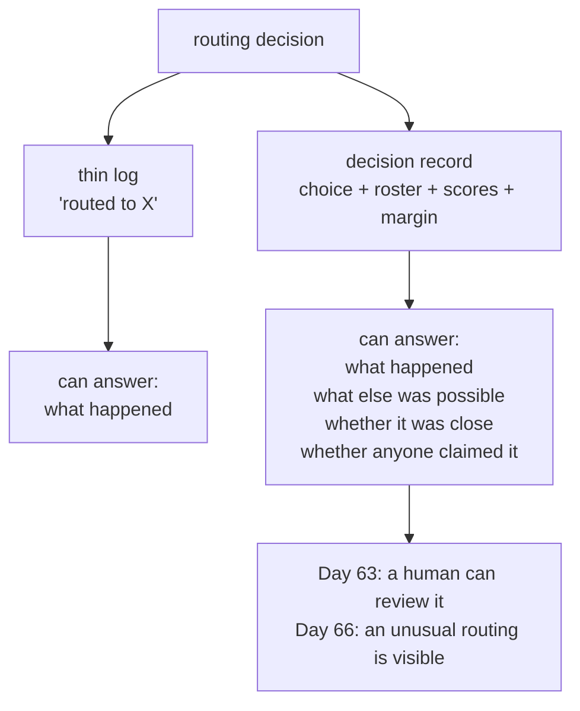

# 8.2 — Who decided, and why

## One-line answer

A routing decision that logs only its outcome cannot be reviewed: the record has to carry the
roster, the scores and the **margin**, because a decision won by zero is a tie-break wearing a
decision's clothes — and one of four routings in the lab is exactly that.

## The story

The allotment committee allocates plots from a waiting list, and for years the minutes said things
like *"Plot 14 allocated to Mrs Okafor."* That was all. One line per plot.

Then somebody complained that they had been passed over, and the committee discovered it could not
answer. Not because anything improper had happened — because the minutes recorded the outcome and
nothing else. Who else was considered? On what basis? Was it close?

They changed the form. Now each allocation records the shortlist, the criteria, the score against
each, and a box marked *margin*. Most allocations are clear and the box says something like *"next
applicant 8 points behind"*. Occasionally it says *"tied on all criteria, decided by list order"* —
and that line is the one the committee actually looks at, because a tie is where a policy is
missing.

## The idea in plain language

Day 22 established the discipline: [one JSON object per line, so a record can be
queried](../../../day-22-structured-logging/parts/01-a-line-you-can-query/1.2-one-json-object-per-line.md),
so events are logged as structured records with fields rather than as sentences.

A routing decision is a *decision*, and decisions have a specific requirement that ordinary events
do not: they have to be **defensible after the fact**, by somebody who was not there. That means
the record cannot be the outcome alone.

Three fields, and the third is the one nobody thinks of:

1. **What was chosen.** The outcome. Every log has this.
2. **What else was available.** The roster at the moment of deciding. Without it you cannot tell
   whether the right colleague was even on the list — and rosters change, so "who was available in
   March" is not answerable from today's code.
3. **The margin.** How much better the winner was than the runner-up. This is the field that
   separates a decision from a coin toss, and it is the one that tells you where to spend your next
   hour of description-writing.

The margin matters because of what [3.2](../03-the-description-routes/3.2-the-clerk-whose-sign-said-all-enquiries.md)
measured: routing failures do not usually look like a wrong answer. They look like a decision that
was always going to go either way, going the other way today. A system with a hundred routings and
no margin recorded cannot distinguish ninety confident decisions and ten coin tosses from a hundred
mediocre ones.

## Why Sutra needs it

Two things depend on this directly.

**Day 63's approval gates.** An approval gate asks a human to authorise something. The human's first
question is *why is this being asked of me?*, and the answer is a chain of decisions — this ticket
was routed to billing, which proposed a refund. If the routing step recorded only "billing", the
human is approving a conclusion whose reasoning does not exist.

**Day 66's threat model.** Prompt injection against a multi-agent system works by influencing a
routing decision — text in a ticket that persuades the lead to hand the conversation to the agent
with the dangerous tool. The evidence for that attack is a routing decision that went an unusual way
on an unusual input, and you can only see "unusual" if you recorded what usual looks like.

## The mechanism

`audit.py` builds one decision record per routed request and reports how many were decided by a
tie.

```bash
cd days/day-55-delegation-and-transfer/lab
uv run python audit.py
```

**Line by line:**

- `record(request)` scores every member of the roster, sorts, and returns a dict with the request,
  the choice, the score, the runner-up and its score, the margin, and the full roster in ranked
  order.
- `chosen` is `None` when nothing scored, which is a real outcome and has to be representable —
  *"nobody claimed this"* is the case that reaches the lead's refusal, and a record that cannot
  express it will silently attribute the request to whoever came first.
- `json.dumps(entry)` writes one JSON object per line. That is Day 22's shape: greppable, and
  loadable into anything.
- The tie count is computed from the margin, so it is derived from the record rather than tracked
  separately — a number you can recompute from the log is a number you can trust.

Measured on 2026-09-05:

```text
{"request": "what does ticket 4188 say", "chosen": "archive_specialist", "score": 2, "runner_up": "billing_specialist", "runner_up_score": 0, "margin": 2, "roster": ["archive_specialist", "billing_specialist", "kb_specialist"]}
{"request": "which article covers the samesite cookie fix", "chosen": "kb_specialist", "score": 4, "runner_up": "archive_specialist", "runner_up_score": 0, "margin": 4, "roster": ["kb_specialist", "archive_specialist", "billing_specialist"]}
{"request": "the customer wants a refund on the invoice", "chosen": "billing_specialist", "score": 2, "runner_up": "archive_specialist", "runner_up_score": 0, "margin": 2, "roster": ["billing_specialist", "archive_specialist", "kb_specialist"]}
{"request": "has anything like this come up before", "chosen": null, "score": 0, "runner_up": "billing_specialist", "runner_up_score": 0, "margin": 0, "roster": ["archive_specialist", "billing_specialist", "kb_specialist"]}

  decisions with margin 0 (a tie-break, not a decision)   1
```

Three confident decisions and one that is not a decision at all.

The fourth line is the interesting one. *"Has anything like this come up before"* is a perfectly
ordinary support question — it is close to the sentence Day 49 built the whole retrieval index for —
and **nobody scored on it**. `chosen` is `null`, and the margin is zero because zero minus zero is
zero.

That single record is worth more than the three above it. It says the roster has a gap: there is a
class of request that no colleague claims. The fix is not a better router. It is either a
description that claims it (the archive specialist plausibly should) or an agent that does not exist
yet. Neither of those is discoverable from a log that records outcomes.

Now the version most systems actually have:

```bash
uv run python audit.py --thin
```

**Line by line:**

- `--thin` logs one line per decision: the outcome, nothing else. This is not a strawman; it is what
  `logger.info(f"routed to {agent}")` produces, and it is what most delegation code logs.

```text
  routed to archive_specialist
  routed to kb_specialist
  routed to billing_specialist
  routed to None

  decisions with margin 0 (a tie-break, not a decision)   1
  the thin log cannot tell you which ones those were
```

The tie count is still printed, because the script computed it. **The log cannot.** Four lines that
each look equally authoritative, one of which represents a decision that was never made. And
`routed to None` — the most informative event in the batch — reads as a bug rather than as a
finding.



## When it breaks

There is no error. That is the pattern for this whole section, and here it is at its purest: the
thin log works perfectly, forever, until the day somebody asks a question it cannot answer.

The realistic version is an incident review. A refund went out that should not have. The question
is *why did this ticket reach the billing agent?*, and the log says `routed to billing_specialist`.
Three things you now cannot establish:

- **Whether the archive specialist was even on the roster that day.** Rosters change with deploys.
  The code you are reading is not the code that ran.
- **Whether it was close.** A margin of four is a decision to defend. A margin of zero is a policy
  gap that will recur.
- **Whether the ticket text was unusual.** Without the request in the record, you cannot check the
  input that produced the decision — which is exactly what a prompt-injection review needs.

The record has to be written at the moment of deciding, because none of it can be reconstructed
afterwards. `before_tool_callback` on `transfer_to_agent` is where it goes — the same hook
[7.1](../07-failure-lab/7.1-two-counters-pointing-at-each-other.md) uses for the hop cap, and for
the same reason: it is the one place that sees the decision before it takes effect.

One caution about the field this part is named for. The lab computes a margin because its stand-in
scorer produces numbers. A real model does not hand you a score for each candidate, so `margin` is
not a field you can always fill. What you *can* always record is everything else — the request, the
roster, the chosen name, the depth, the hop count — and you can approximate confidence by asking
the router for a one-line reason as part of a structured output
([Day 12](../../../day-12-structured-output/parts/01-the-shape-on-the-way-out/1.1-a-shape-on-the-answer.md)),
which is a weaker signal honestly labelled rather than a number invented to fill a column.

## In production

**What a professional writes instead.** One structured record per routing decision, emitted from
the tool callback, carrying at minimum: invocation id, the deciding agent, the chosen agent, the
full roster, the request text (or a reference to it), the hop number and the chain depth. The
invocation id is what lets Day 84's tracing stitch a chain of decisions into one story, and the hop
number is what makes [7.1](../07-failure-lab/7.1-two-counters-pointing-at-each-other.md)'s loop
visible in a dashboard rather than in a customer complaint.

**What degrades at scale.** Records that were written for debugging get used for compliance, and
then the fields you did not include become the fields you cannot add retroactively. The
asymmetry is stark: adding a field costs one line today and cannot be backfilled tomorrow. That
argues for recording more than you presently need at the decision point specifically — not
everywhere, but here, because a decision is the thing somebody will ask about later.

**The failure that only appears with real traffic.** Tie-heavy routing is invisible at low volume
because a handful of coin tosses land correctly by chance. It shows up as a *rate*: the share of
decisions with no clear winner, tracked over time. That number rises every time somebody adds an
agent whose description overlaps an existing one, and it is the earliest available signal that the
roster needs the treatment in
[3.3](../03-the-description-routes/3.3-writing-a-description-that-routes.md).

**The review comment a senior engineer leaves:** *"`logger.info(f'routing to {name}')` is not enough
for a step that decides which agent gets the customer. Emit a record with the roster and the request
alongside the choice, from the tool callback so it fires for every agent. When we get asked why a
refund happened, 'billing' is not an answer, and we cannot reconstruct the roster from a deploy
three weeks ago."*

**The interview question:** *"What would you log about a multi-agent system that you would not log
about a single agent?"* An honest answer: *"The routing decisions, as decisions rather than as
outcomes. A single agent's log tells you what it did; a multi-agent log has to tell you why this
agent was the one doing it, and that means recording the roster that was available, the request
that produced the choice, the hop number and the depth — not just the name that won. The field I
push for hardest is some measure of how close it was, because routing failures do not look like
wrong answers, they look like near-ties going the other way today. Where the router is a model I
cannot get real scores, so I ask for a one-line reason in a structured output and label it as the
weak signal it is rather than inventing a confidence number. And I emit it from the tool callback on
`transfer_to_agent`, because that is the one place that sees every hand-off before it takes
effect."*

## Check yourself

```bash
cd days/day-55-delegation-and-transfer/lab
uv run python audit.py
uv run python audit.py --thin
```

Now add a fifth request to `REQUESTS` that you expect to tie, run it, and check the margin. Then
write the one sentence you would add to a description to break that tie.

**Out loud, without scrolling up:** name the three fields a routing record needs beyond the outcome,
say which one is hardest to fill honestly with a real model, and explain why the record has to be
written at decision time.

**Next:** the day's parts are done. Read the paper they came from:
[`papers/01-contract-net-protocol.md`](../../papers/01-contract-net-protocol.md).
