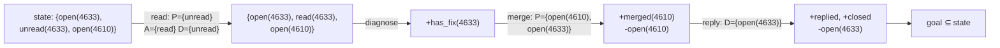

# 01 — Strips: a new approach to the application of theorem proving to problem solving

> **Strips: A new approach to the application of theorem proving to problem solving**
> `doi:10.1016/0004-3702(71)90010-5` · *Artificial Intelligence* **2**(3–4), 189–208 · 1971
> <https://doi.org/10.1016/0004-3702(71)90010-5>
>
> Verified on 2026-09-05 against the record at
> `https://api.crossref.org/works/10.1016/0004-3702(71)90010-5`, which is where the title, journal,
> volume, pages and year above are copied from. The record capitalises the acronym as **Strips**;
> the paper and the fifty years of literature after it write **STRIPS**, so both spellings appear
> here on purpose — the citation as registered, the prose as everyone writes it. The publisher's
> own page redirects to a host that returns no readable body, so the registration record is the
> source. Row in [`docs/PAPERS.md`](../../../docs/PAPERS.md).

## One-line answer

STRIPS said that a plan can be **searched for mechanically** if you stop describing the world in
general logic and instead describe it as a **set of facts**, with each action written as three lists
— what must be true, what becomes true, and what stops being true.

## The story

Imagine you can answer any question about a building, correctly, and you cannot do anything.

Somebody asks: *is the store room door locked?* You check, and you say yes. *Does the small brass key
open it?* You check, and you say yes. *Is the brass key in the drawer in the front office?* Yes.

Every answer is right. You are, in the most literal sense, a machine for establishing whether things
are true.

Now somebody says: *get me the box from the store room.*

And nothing happens. Because the three true things you just established do not, by themselves, tell
you to walk to the front office, open the drawer, take the key, walk to the store room, unlock the
door and pick up the box. Knowing that the key opens the door is not the same kind of thing as
deciding to go and get it.

That was the field's position at the end of the 1960s. There were systems that could prove things —
genuinely, impressively, about hard statements — and asking one of them for a *sequence of actions*
did not work. Not because the proofs were weak, but because a proof is about what is true and a plan
is about what to do, and nobody had a way to write the second question so that machinery built for
the first could answer it.

## The idea in plain language

STRIPS' contribution is a **representation**, and everything else follows from it.

**A state is a set of facts.** Not a formula, not a description — a set. `open(4633)`,
`unread(4633)`. If a fact is in the set it is true; if it is not in the set, it is not true. That
second half is a real commitment and it has a name in the literature, the *closed-world assumption*:
absence means false, rather than unknown.

**An action is three lists of facts.**

| List | What it says |
| --- | --- |
| **precondition** | facts that must be in the state for this action to be possible |
| **add list** | facts this action puts into the state |
| **delete list** | facts this action takes out of the state |

That is the whole thing, and the delete list is the half that people forget and the half that makes
it work.

Here is why. Before STRIPS, the hard part of describing an action was not saying what it changed — it
was saying what it **did not** change. Open a door and the walls are still there, the key is still
brass, the box is still in the room. Writing all of that out, per action, is impossible, and leaving
it out means a system that cannot conclude anything survived the action. The field called this the
**frame problem**.

The three-list representation is an answer to it, and the answer is a *rule about interpretation
rather than a set of extra facts*: **everything not in the delete list is unchanged.** You do not
state what persists. Persistence is the default, and the delete list is the exception. That
convention is now known as the STRIPS assumption.

The consequence is that applying an action to a state is a set operation — remove the delete list,
add the add list — which is cheap, exact and mechanical. And once applying an action is cheap, you
can **search**: try actions whose preconditions hold, get new states, keep going until the goal facts
are all present. The sequence of actions that got you there is the plan.

## Why Sutra needs it

Two parts of this day run on it directly.

Part [1.1](../parts/01-what-a-plan-is/1.1-a-plan-is-a-list-not-a-paragraph.md) argues that a plan
must be a data structure rather than a paragraph, and this is the document that first made that a
technical position rather than a preference: STRIPS is where "write the actions in a fixed checkable
form" was shown to *buy* something, namely that a machine can then search for the plan.

Part [5.1](../parts/05-the-second-edition/5.1-let-the-seam-out-or-recut-the-cloth.md) decides whether
to patch a failed plan or rewrite it, and the information it needs — which other steps rested on the
step that died — is exactly what preconditions and delete lists record. That part's patch is a
substring match over arguments precisely *because* Sutra's `Step` has no precondition field, and its
*In production* section asks for the missing edges. The paper is where those edges come from.

Later: Day 60's replay needs to know which steps can be re-executed, which is a question about what
each step deletes; Day 63's approval gate needs to know what an action changes, which is its add and
delete lists under a different name.

## The mechanism

The method, written out rather than paraphrased.

**A state** is a set of ground facts. The initial state is given; the goal is another set of facts,
and a state satisfies the goal when the goal is a subset of it.

**An operator** is `⟨P, A, D⟩` — precondition, add list, delete list — all sets of facts. An operator
is *applicable* in state `S` when `P ⊆ S`. Applying it gives:

```
S' = (S \ D) ∪ A
```

**Line by line:**

- `S \ D` — set difference. Remove what this action makes untrue. This is the delete list doing the
  frame problem's work: nothing else in `S` is touched, so everything else persists by construction.
- `∪ A` — set union. Add what this action makes true.
- The order matters when a fact is in both `D` and `A`: deleting first and adding second means the
  fact survives. That is a convention, and it is the conventional one.
- There is no reasoning here. No inference, no proof. Applying an action is two set operations, and
  that cheapness is what makes the search in the next paragraph possible at all.

**The search.** STRIPS itself used *means-ends analysis*: look at the difference between the current
state and the goal, choose an operator whose add list reduces that difference, and if its
preconditions do not hold, make the preconditions a new sub-goal and recurse. The demo below uses
plain breadth-first search over states instead, which finds the same plans and is far easier to read;
means-ends analysis is what makes it tractable on large domains, and it is the half of the paper the
field later replaced (see *In production*).



## The paper in one demo

Two files. The whole feature is the three-list operator and the set-based state; the ablation switch
removes the delete list and nothing else.

```text
lab/papers/strips/
├── strips.py   # State, Operator, plan(), validate()  — the paper
└── demo.py     # one ticket, four operators, both runs — the domain
```

**`strips.py`** — the representation and a search over it:

```python
USE_DELETE_LIST = True

State = frozenset[str]


@dataclass(frozen=True)
class Operator:
    """An action, described by what must be true, what becomes true, and what stops being true."""

    name: str
    precondition: frozenset[str]
    add: frozenset[str]
    delete: frozenset[str]

    def applicable(self, state: State) -> bool:
        return self.precondition <= state

    def apply(self, state: State) -> State:
        """The successor state. The delete list is the half the ablation removes."""
        after = set(state)
        if USE_DELETE_LIST:
            after -= self.delete
        after |= self.add
        return frozenset(after)
```

**Line by line:**

- `State = frozenset[str]` — a state is a set and it is immutable, so a state that has been put in
  the `seen` set cannot be changed by anything that later reaches it.
- `self.precondition <= state` is the subset operator. *Applicable* is one comparison; this is the
  whole of "can I do this here?".
- `after -= self.delete` then `after |= self.add` is `(S \ D) ∪ A`, in the order described above.
- `if USE_DELETE_LIST` is the **ablation switch** and it is the only conditional in the file. Turn it
  off and the planner keeps every fact for ever — a planner that has no way to say a thing stopped
  being true.

```python
def plan(start: State, goal: frozenset[str], operators: list[Operator], limit: int = 6):
    """Breadth-first search over states. Returns (plan, states_explored) or (None, explored)."""
    seen: set[State] = {start}
    frontier: list[tuple[State, list[Operator]]] = [(start, [])]
    explored = 0
    while frontier:
        state, path = frontier.pop(0)
        explored += 1
        if goal <= state:
            return path, explored
        if len(path) >= limit:
            continue
        for op in operators:
            if not op.applicable(state):
                continue
            nxt = op.apply(state)
            if nxt in seen:
                continue
            seen.add(nxt)
            frontier.append((nxt, [*path, op]))
    return None, explored
```

**Line by line:**

- `frontier.pop(0)` — breadth-first, so the first plan found is a shortest one. Both arms of the
  ablation therefore find plans of the same length, which is what makes the comparison fair.
- `goal <= state` — the goal is satisfied when it is a subset. One comparison again.
- `seen` holds states, not paths, so two different action sequences reaching the same state are
  explored once. **This is where the ablation does its damage invisibly**: without delete lists,
  states only ever grow, so fewer of them coincide and the ones the search visits are not the ones
  the world would be in.
- `limit` caps the plan length so a domain with no solution terminates.

```python
def validate(start: State, path: list[Operator], exclusive: list[tuple[str, str]]) -> list[str]:
    """Execute the plan for real, always honouring delete lists, and report contradictions.

    The validator is the world. It never skips a delete list, whatever the planner believed, which
    is the only way an ablation of the planner can be observed rather than assumed.
    """
    state = set(start)
    for op in path:
        if not op.precondition <= state:
            return [f"step {op.name} ran with {sorted(op.precondition - state)} not true"]
        state -= op.delete
        state |= op.add
    return [f"{a} and {b} are both true" for a, b in exclusive if a in state and b in state]
```

**Line by line:**

- The validator **always** applies delete lists, whatever `USE_DELETE_LIST` says. It is standing in
  for reality, and reality does not have a flag.
- `if not op.precondition <= state` catches a plan whose steps cannot actually be executed in order —
  which is precisely what a planner that cannot represent "no longer true" will produce.
- `sorted(op.precondition - state)` names the missing facts, so the failure says *which* assumption
  did not hold rather than that something did not.
- The `exclusive` check catches the other shape of the same bug: a final state holding two facts that
  cannot both be true.

**`demo.py`** — the domain. One ticket, one duplicate, four operators. The operator that matters is
`merge`, which needs the parent ticket to still be **open**, and `reply`, which is what closes it:

```python
OPERATORS = [
    Operator(
        f"read({TICKET})",
        frozenset({f"unread({TICKET})"}),
        frozenset({f"read({TICKET})"}),
        frozenset({f"unread({TICKET})"}),
    ),
    Operator(
        f"diagnose({TICKET})",
        frozenset({f"read({TICKET})"}),
        frozenset({f"has_fix({TICKET})"}),
        frozenset(),
    ),
    Operator(
        f"reply({TICKET})",
        frozenset({f"has_fix({TICKET})", f"open({TICKET})"}),
        frozenset({f"replied({TICKET})", f"closed({TICKET})"}),
        frozenset({f"open({TICKET})"}),
    ),
    Operator(
        f"merge({DUPLICATE})",
        frozenset({f"open({DUPLICATE})", f"open({TICKET})"}),
        frozenset({f"merged({DUPLICATE})"}),
        frozenset({f"open({DUPLICATE})"}),
    ),
]
```

**Line by line:**

- `read` deletes `unread` and adds `read`. Without the delete, a state can hold both, which is not a
  state the world can be in.
- `diagnose` has an **empty delete list**, which is allowed and common: reading a ticket carefully
  makes something true and unmakes nothing.
- `reply` deletes `open(4633)`. This one line is the whole experiment: replying closes the ticket.
- `merge` requires `open(4633)` — you cannot merge a duplicate into a ticket that has been closed.
  So `merge` **must** come before `reply`, and the only thing in the representation that can express
  that is `reply`'s delete list.

```bash
cd days/day-56-planning-and-replanning/lab/papers/strips
uv run python demo.py; echo "exit: $?"
```

**Line by line:**

- Run from inside `lab/papers/strips/`, because `demo.py` imports `strips` as a top-level module.
- No flag means `USE_DELETE_LIST` keeps its module default of `True` — the paper as published.
- `echo "exit: $?"` because the validator's verdict is the exit code, which makes the ablation an
  eval rather than a demonstration.

Measured on 2026-09-05:

```text
delete list ON (STRIPS as published)

  start : ['open(4610)', 'open(4633)', 'unread(4633)']
  goal  : ['merged(4610)', 'replied(4633)']
  plan  : read(4633) -> diagnose(4633) -> merge(4610) -> reply(4633)
  states explored : 8
  validator : consistent
exit: 0
```

Now the ablation — the same planner with the delete list switched off:

```bash
uv run python demo.py --no-delete; echo "exit: $?"
```

**Line by line:**

- `--no-delete` sets `strips.USE_DELETE_LIST = False` before planning, and changes nothing else: the
  same operators, the same start state, the same goal, the same search.
- The validator is unaffected by the flag, so the plan the ablated planner produces is executed
  against a world that still honours delete lists — which is what makes the failure observable.

Measured on 2026-09-05:

```text
delete list OFF

  start : ['open(4610)', 'open(4633)', 'unread(4633)']
  goal  : ['merged(4610)', 'replied(4633)']
  plan  : read(4633) -> diagnose(4633) -> reply(4633) -> merge(4610)
  states explored : 8
  validator : INCONSISTENT
    step merge(4610) ran with ['open(4633)'] not true
exit: 1
```

**Same four actions. Same eight states explored. Same plan length. Different order, and the second
one does not work.**

With delete lists, the planner knows that replying closes 4633, so it cannot schedule `merge` after
`reply` — `merge` requires `open(4633)` and that fact is gone. The order is forced, and the plan is
correct.

Without them, `open(4633)` never leaves the state, so the planner believes it can merge after
replying. Breadth-first search finds a four-step plan and returns it. The validator — which is the
world, and which always honours delete lists — executes it and stops: `merge(4610) ran with
['open(4633)'] not true`.

That is the paper's contribution isolated to one line of code. Not a speed difference, not a
heuristic: **a planner without a way to say that a fact stopped being true produces plans that cannot
be executed**, and it produces them confidently, at the same cost, with the same search.

Zero model calls, no network, no API key.

## When it breaks

The representation buys its power with assumptions, and each one is a place the claim does not hold.

**The closed world.** A fact not in the set is false. That is fine for a blocks world and wrong for a
support desk: *no fact says ticket 4610 is a duplicate* and *ticket 4610 is known not to be a
duplicate* are different situations, and STRIPS cannot tell them apart. Every real system that adopted
this representation had to decide what to do about the difference, and most decided by accident.

**Determinism.** An operator has one outcome. Real actions fail, partially succeed, or succeed with a
different result — and the whole of section
[4](../parts/04-when-a-plan-dies/4.1-a-shop-shut-for-lunch-and-a-shop-closed-down.md) of this day is
about that. STRIPS has no representation for a contradiction; a plan is found, and executing it is
somebody else's problem.

**A static world.** Nothing changes except by the planner's own actions. Part
[4.4](../parts/04-when-a-plan-dies/4.4-the-plan-that-outlived-the-world.md) is exactly this
assumption failing: a colleague closed a ticket while the plan was executing, and no operator in
anybody's model did that.

**Complete and correct knowledge of the initial state.** You must be able to write down every
relevant fact before planning starts, which for a six-ticket fixture is easy and for an archive is
the thing that makes planning-from-the-request miss what it cannot name — part
[2.2](../parts/02-two-ways-to-decide/2.2-deciding-once-from-the-whole-request.md)'s `KB-104` miss is
this limitation wearing modern clothes.

**And the scale it was measured at.** The domains were small: rooms, boxes, a robot. Applying the
same search to a domain with thousands of facts and hundreds of operators does not work as written,
which is what the next fifty years of the field was largely about.

## In production

**What survived.**

The **representation** survived completely, and it survived far outside AI planning. Preconditions,
add lists and delete lists are the vocabulary the whole field still uses; the standard planning
description language, PDDL, is a direct descendant, and every planning competition since has been run
on formats you would recognise immediately from this paper. The **STRIPS assumption** — everything
not deleted persists — is so completely absorbed that it is rarely credited: it is simply how people
describe actions.

More relevantly for this curriculum, the representation survived in places that have nothing to do
with planners. A database migration with an `up` and a `down` is add and delete lists. An
infrastructure-as-code resource with a set of preconditions and a declared post-state is the same
shape. Every system that decides whether an operation is *safe to apply here* is asking
`precondition ⊆ state`.

**What did not.**

**Means-ends analysis**, the search method, was replaced. It does not scale, and the planning
community's progress from the 1990s onward came from elsewhere: heuristic search with automatically
derived heuristics, and compilation of planning problems into satisfiability. The paper's *method*
is a historical answer; the paper's *representation* is what those later systems all take as input.
That split — the encoding outlived the algorithm — is the most useful thing to carry away from it.

**Classical planning itself**, as a way of building agents, largely did not survive contact with
messy domains, for the reasons in *When it breaks*. The world was not static, the knowledge was not
complete, and actions were not deterministic. Which is why this day's Sutra planner is a language
model rather than a search: a model does not need a complete formal model of the world, and pays for
that with the ability to write a plan that is confidently impossible.

**What this day takes from it.** Not the search. The discipline: **write the actions down in a form
something other than the planner can check**. Sutra's `Step` has an action from a closed set and an
argument, and part [5.1](../parts/05-the-second-edition/5.1-let-the-seam-out-or-recut-the-cloth.md)'s
*In production* section asks for the field it is missing, which is the precondition. Fifty-five years
later, the thing to steal is still the encoding.

## Check yourself

```bash
cd days/day-56-planning-and-replanning/lab/papers/strips
uv run python demo.py; echo "exit: $?"
uv run python demo.py --no-delete; echo "exit: $?"
```

Now add a fifth operator to `demo.py` — `reopen(4633)`, with `closed(4633)` as its precondition,
`open(4633)` in its add list and `closed(4633)` in its delete list — and re-run both arms. Write down
what the no-delete arm does with it.

**Out loud, without scrolling up:** state what this paper actually claimed, and say what we do
differently now — which half of it is in every planning system you will meet, and which half the
field replaced.

**Next:** back to the hub, [`LESSON.md`](../LESSON.md), for §11 and the commit.
