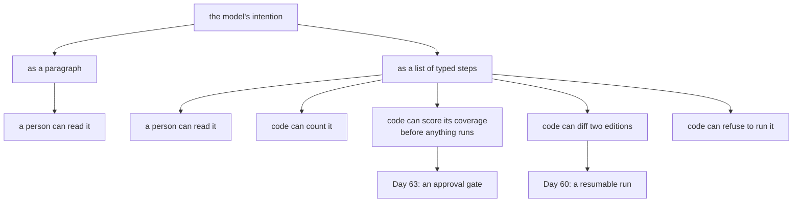

# 1.1 — A plan is a list, not a paragraph

## One-line answer

A plan is a **data structure** — an ordered set of steps with named fields — and the moment you
write it as prose instead, you lose the four things a plan is for: counting it, checking its
coverage, differencing two editions of it, and deciding whether it may run.

## The story

A wardrobe arrives in a flat cardboard box. You open it and there are two pieces of paper inside.

The first is a printed sheet. At the top there is a picture of every part laid out on the floor,
each one with a letter beside it, and a small table saying how many screws of each size are in the
bag. Below that are twelve numbered drawings. Step four says: *fix panel C to panel A using two of
the 40 mm screws.*

The second piece of paper is a note somebody at the shop has written by hand, because a customer
complained the printed sheet was confusing. It says: *"Start with the sides, then put the back on,
and don't forget the little screws go in the shelf brackets, the long ones are for the frame."*

Both pieces of paper describe the same wardrobe. Now try to answer three questions with each of
them.

*How many steps is this?* The printed sheet says twelve. The note — you have to read it, decide
what counts as a step, and argue with yourself.

*Have I done everything?* On the printed sheet you tick numbers off. On the note you re-read it and
hope.

*Is there a screw left over?* The printed sheet has a parts table you can count against. The note
mentions "little screws" and "long ones", and you are now holding a screw that is neither.

The note is not wrong. It is a perfectly accurate description of how to build the wardrobe. It is
just not something you can *check*.

## The idea in plain language

An agent that is about to do several things can decide them in either of those two shapes, and this
day is about what follows from the choice.

A **plan** is the agent's answer to "what are you going to do?" — and there are two ways it can
give that answer:

- **As prose.** A paragraph the model wrote: *"First I'll read ticket 4521 and 4610 to see whether
  they're the same problem, then I'll check 4633..."* This is what a model produces if you ask it
  to think out loud and nobody says otherwise.
- **As data.** An ordered list of objects, each with named fields, drawn from a fixed vocabulary of
  actions. This is what you get if you ask for a specific shape and refuse anything else.

The words are the same. What differs is what the *rest of your program* can do with them.

Three terms, defined once, because the whole day uses them:

- A **step** is one unit of work in a plan: an action, the thing it acts on, and the reason it is
  there. Part [1.2](1.2-what-a-step-has-to-carry.md) is about exactly those three fields.
- The **planner** is whatever produced the plan. Today it is a deterministic function in the lab;
  in Sutra it will be a model call.
- The **executor** is what walks the steps and does them. Section
  [3](../03-walking-the-plan/3.1-the-executor-is-a-loop-with-a-list.md) builds it.

The claim of this part is narrow and it is worth stating precisely, because it is easy to over-claim
here. A typed plan is **not** more correct than a prose plan. The model that wrote it is the same
model, and if it forgot half the request it forgot half the request in both shapes. What a typed
plan gives you is **inspectability**: it can be counted, scored, differenced and gated by code that
is not the model. The paragraph can only be read by a person, and only after the fact.

Day 12 made this argument once already, for a different reason. Structured output turned a model's
answer into a form so that code could act on it. A plan is that same move, applied to the model's
*intentions* rather than to its conclusions.

## Why Sutra needs it

Three later days each need the plan to be data, and none of them can be built on a paragraph.

**Day 60**, durable execution, has to save a half-finished run and pick it up again after the
process dies. What it saves is the plan and a cursor into it. You cannot store a cursor into a
paragraph. Part [3.3](../03-walking-the-plan/3.3-a-plan-that-outlives-its-process.md) writes that
file today so that Day 60 has something to make durable.

**Day 63**, approval gates, has to show a human what is about to happen and get a yes or a no. The
thing it shows is the plan, rendered as a card with the irreversible steps marked. Part
[6.2](../06-in-production/6.2-the-plan-somebody-reads-first.md) builds that card, and it is a
function of the plan's fields — it cannot be built by grepping a paragraph for verbs.

**Phase 12**, evals, has to score the plan separately from the execution. *Did the plan cover the
request?* is a different question from *did the steps succeed?*, and only the first one can be
answered before anything runs. Part [1.3](1.3-the-plan-you-can-read-before-it-runs.md) scores it.

## The paper behind it

> **Strips: A new approach to the application of theorem proving to problem solving**
> `doi:10.1016/0004-3702(71)90010-5` · *Artificial Intelligence* 2(3–4), 189–208 · 1971
> <https://doi.org/10.1016/0004-3702(71)90010-5>

It claimed that a plan can be searched for mechanically if — and only if — the world and the actions
are written in a fixed, checkable form: a state as a set of facts, and an action as three lists of
facts. The representation is the contribution.

Taught in [`papers/01-strips.md`](../../papers/01-strips.md), which you read **after** the parts.

## The mechanism

`shape.py` puts the same intent on the screen twice, as a paragraph and as steps, and then asks four
questions of each.

```bash
cd days/day-56-planning-and-replanning/lab
uv run python shape.py
```

**Line by line:**

- `cd` into `lab/` first, because every script in this day imports `_world.py` and `_model.py` as
  top-level modules. Run them from the repository root and you get `ModuleNotFoundError: No module
  named '_world'`.
- `shape.py` with no flag prints the comparison. The three flags — `--validate`, `--score`,
  `--diff` — belong to parts [1.2](1.2-what-a-step-has-to-carry.md) and
  [1.3](1.3-the-plan-you-can-read-before-it-runs.md), and each one is a different question you can
  only ask of the typed version.
- Nothing here calls a model. The "planner" is `_model.planner`, a scoring function, for reasons
  part [2.2](../02-two-ways-to-decide/2.2-deciding-once-from-the-whole-request.md) sets out in
  full.

Measured on 2026-09-05:

```text
as prose:

  First I'll read ticket 4521 and ticket 4610 to see whether they're the same problem, then I'll check 4633 as well since it looks like a duplicate, and finally I'll look up whatever knowledge base article covers the fix and write the customer a reply.

as data:

  1. lookup_ticket  4521       # read ticket 4521
  2. lookup_ticket  4610       # read ticket 4610
  3. lookup_ticket  4633       # read ticket 4633

four questions, asked of each:

  question                     prose                        data
  how many steps is it?        count the sentences and argue 3
  does it cover the request?   read it and hope             3/4 of ['4521', '4610', '4633', 'KB-104']
  what changed since v1?       diff two paragraphs          a set difference, exactly
  may it run?                  a human reads it             a rule over a closed field
```

Read the two versions before reading the table.

The paragraph is the better English. It reads well, it explains itself, and if you handed it to a
colleague they would know what you meant. It also mentions **four** things to do and the typed plan
has three steps, which is a real disagreement between them and one this part is not going to
resolve — part [2.3](../02-two-ways-to-decide/2.3-the-two-strategies-miss-different-things.md) is
where that gets measured.

What matters here is the third column. Every answer in it is produced by a line of ordinary Python
over a list of objects. `len(plan.steps)` is 3. `{s.argument for s in plan.steps} & required` is a
set intersection. The diff of two editions is `a - b` and `b - a`. None of that is available for the
paragraph, and no amount of careful prose makes it available.

Here is the shape the typed plan actually has, as it is defined in `lab/_world.py`:

```python
@dataclass(frozen=True)
class Step:
    action: str
    argument: str
    why: str

    def __str__(self) -> str:
        return f"{self.action}({self.argument})"


@dataclass(frozen=True)
class Plan:
    goal: str
    steps: tuple[Step, ...]

    def __len__(self) -> int:
        return len(self.steps)
```

**Line by line:**

- `@dataclass(frozen=True)` makes both immutable. A plan that a step can edit while it is running is
  a plan you cannot compare against what actually happened, and section
  [5](../05-the-second-edition/5.1-let-the-seam-out-or-recut-the-cloth.md) needs to hold two
  editions side by side. Replanning produces a *new* `Plan`; it never mutates the old one.
- `action`, `argument`, `why` — three fields, and part [1.2](1.2-what-a-step-has-to-carry.md) argues
  for each of them separately.
- `steps: tuple[Step, ...]` rather than `list`, for the same immutability reason. A tuple also makes
  the plan hashable, which matters the moment you want to check whether the replanner has produced
  an edition it has produced before — that is part
  [5.4](../05-the-second-edition/5.4-two-plans-taking-turns.md).
- `goal: str` is the request restated in one line. It is the only prose in the structure and it
  earns its place: it is what the answer check in part
  [6.1](../06-in-production/6.1-every-step-ran-and-nothing-was-answered.md) is measured against.
- `__str__` returning `action(argument)` is not decoration. Every table in this day identifies a
  step by that string, and having one definition of it means a log line, a diff and an approval card
  all name the same step the same way.
- `__len__` so that `len(plan)` is the step count. Small, and it is the difference between a
  document that says "count the sentences and argue" and one that says `3`.



## When it breaks

The failure is not that the paragraph is wrong. It is that the paragraph is *nearly* structured, so
somebody writes a parser for it.

The realistic version: a model is asked for a plan, produces a numbered list in markdown, and
somebody writes `re.findall(r"^\d+\.\s*(.+)$", text, re.M)` to pull the steps out. It works on
Monday. On Tuesday the model writes `1)` instead of `1.` and the plan silently has zero steps. The
executor loops over an empty list, completes without doing anything, and reports success — which is
part [6.1](../06-in-production/6.1-every-step-ran-and-nothing-was-answered.md)'s failure arriving a
day early and by a different road.

There is also a break you can reach on purpose right now. A frozen dataclass will not let a step be
edited in place:

```text
Traceback (most recent call last):
  File "<string>", line 4, in <module>
  File "<string>", line 4, in __setattr__
dataclasses.FrozenInstanceError: cannot assign to field 'argument'
```

That is `Step("lookup_ticket", "4521", "read it").argument = "4610"`, and it is the guard doing its
job. The natural instinct when a step turns out to be wrong is to fix it where it stands; the whole
argument of section [5](../05-the-second-edition/5.1-let-the-seam-out-or-recut-the-cloth.md) is that
you produce a *new edition* instead, precisely so that the old one still exists to be compared
against.

## In production

**What a professional writes instead.** The teaching version above is three plain fields. A real
one is a schema the model is *constrained* to fill — in this project that means Day 12's structured
output, with `action` as an enumerated type rather than a free string, so that
`Step("investigate", ...)` cannot be constructed at all and part
[1.2](1.2-what-a-step-has-to-carry.md)'s fourth row becomes impossible instead of merely detected.
Two more fields usually appear: a **step id**, so that one step can name another as its input rather
than relying on position, and a **plan version**, because the plan will be stored (Day 60) and read
back by code that has moved on.

**What degrades at scale.** Plans get big, and a plan with forty steps is not forty times more
useful than one with four — it is a plan nobody reads, which quietly forfeits the entire benefit
this part is about. Two things follow. Cap the step count in the schema and treat a planner that
wants more as a signal to decompose the request instead. And store the plan **beside** the run
rather than inside the transcript: a forty-step plan re-sent on every turn is Day 50's top-k problem
wearing different clothes.

**The failure that only appears with real traffic.** Free-text `argument` fields turn into a second
protocol. Somebody starts writing `argument="4521,4610"` for a comparison — which is exactly what
this lab does — and three weeks later there is a step somewhere with `argument="4521, 4610 (check
the duplicate too)"`, and the splitter that handled the first case produces a ticket id with a
bracket in it. The comma-separated field is a design debt from the moment it is written.

**The review comment a senior engineer leaves:** *"This plan is a list of strings. Make `action` an
enum and give every step an id, because the moment step 3 needs step 1's output you will otherwise
express that as 'the step before', and then you can never reorder, parallelise or resume."*

**The interview question:** *"Why bother making the plan structured, when the model can just say what
it is going to do?"* An honest answer: *"Because everything I want to do with the plan is done by
code that is not the model. I score coverage before it runs, I show it to a human for approval, I
store it with a cursor so a killed run can resume, and I diff edition one against edition two to see
what the failure taught the planner. Every one of those is a set operation over fields. On a
paragraph, all four become 'a person reads it carefully', which is not a control — it is a hope. The
part people get wrong is thinking the structure makes the plan better. It does not. The same model
writes the same mistakes into a typed plan. What structure buys is that the mistakes are now
visible to something other than a careful reader."*

## Check yourself

```bash
cd days/day-56-planning-and-replanning/lab
uv run python shape.py
```

Now count the distinct actions the paragraph describes, and compare that to the three steps in the
typed plan. Write the difference down — you will need it in part
[2.3](../02-two-ways-to-decide/2.3-the-two-strategies-miss-different-things.md), where it turns out
not to be a bug in the printer.

**Out loud, without scrolling up:** name the four questions you can ask of a typed plan and cannot
ask of a paragraph, and say which of them Day 63 depends on.

**Next:** [1.2 — What a step has to carry](1.2-what-a-step-has-to-carry.md).
