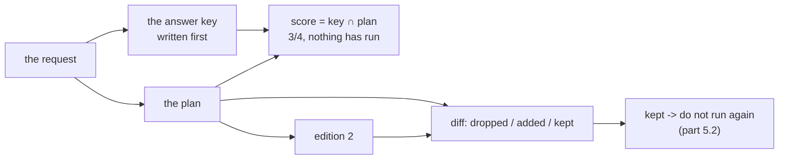

# 1.3 — The plan you can read before it runs

## One-line answer

A plan can be **scored against the request before a single step executes** — this one comes back
`3/4`, missing the knowledge base article — and two editions of a plan can be **differenced exactly**,
which together are the only two checks in this whole day that cost nothing at all.

## The story

You want the bathroom re-tiled. A man comes round, measures, and posts you a quote two days later.

It is one page. It lists: strip the old tiles, cart away the rubble, level the wall, tile 4.2 square
metres, grout, seal round the bath. Beside each line there is a price. At the bottom there is a
total, and a line saying the price does not include replacing the pipework if the wall turns out to
be wet behind the old tiles.

You read it at the kitchen table. Nobody has touched your bathroom.

And sitting there you notice something: there is no line for the little window recess. You ring him.
He says yes, that is another half metre, here is a revised quote. The second quote arrives and you
put the two side by side, and what you are looking for is not the whole document — it is the two
lines that changed.

That is the entire value of a quote, and it has nothing to do with tiling. A quote is a description
of work that is **checkable before the work happens**, and comparable against another description of
the same work. If he had turned up on Monday with a van and started, you would have found out about
the window recess on Wednesday, with the wall already stripped.

## The idea in plain language

Two checks, both free, both impossible on a paragraph.

**Scoring the plan.** You have a request. You have an answer key: the things a run must touch to
have covered that request. You have a plan. The score is a set intersection — how many of the
required things does this plan actually visit? No step runs. No ticket is read. No model is called.

Two terms, defined here because the rest of the day uses them:

- **Coverage** — how much of the request the plan addresses. Measured *before* execution.
- **The answer key** — the list of things a correct run must touch, written down in advance. In this
  lab it is derived from `ANSWER_KEY` in `_world.py`, which pairs each ticket with the article that
  answers it. Day 50 used exactly this device under the name *gold set*, and for exactly the same
  reason: a number you compute against something you wrote afterwards is not a measurement.

Coverage is not correctness. A plan can cover every part of a request and still be a bad plan — the
steps could be in an impossible order, or the arguments could be wrong. What coverage catches is the
one failure that is both common and completely invisible at run time: **the part of the request that
nothing in the plan is going to look at**. That failure produces no error. It produces a confident
answer to two thirds of a question.

**Differencing two editions.** When a plan fails and the planner writes a second edition, the
interesting object is not edition two. It is the difference between them: what was dropped, what was
added, what survived. That difference *is* what the failure taught the planner, expressed exactly.
On two paragraphs it is a reading exercise; on two sets of steps it is `a - b` and `b - a`.

## Why Sutra needs it

Section [5](../05-the-second-edition/5.1-let-the-seam-out-or-recut-the-cloth.md) is entirely about
producing a second edition of a plan, and it needs the diff twice. Once to show that the replanner
actually dropped the disproved step rather than reshuffling; and once as a **guard** — part
[5.4](../05-the-second-edition/5.4-two-plans-taking-turns.md) catches two editions that take turns
undoing each other, and the way you catch that is by noticing you have seen this plan before, which
requires comparing plans as values.

The score is needed sooner than that. Part
[2.3](../02-two-ways-to-decide/2.3-the-two-strategies-miss-different-things.md) is the day's central
measurement and it is a coverage table. Everything in section 2 is this check, run on different
plans.

## The mechanism

Two modes of `shape.py`. First, the score:

```bash
cd days/day-56-planning-and-replanning/lab
uv run python shape.py --score
```

**Line by line:**

- `--score` computes coverage for the plan the deterministic planner produces from the standing
  request. It runs no steps: read the last line of the output and check that claim against what the
  script does.
- The requirement set comes from `_model.required(request)`, which reads the ticket ids literally
  named in the request and then looks each one up in `ANSWER_KEY`. That indirection is the point —
  a reader of the request could not name `KB-104`, and the answer key can, which is what makes it an
  answer key rather than a restatement.

Measured on 2026-09-05:

```text
request : Compare tickets 4521 and 4610 and tell me whether 4633 is the same underlying bug, then find the knowledge base article with the fix.
must cover (4): 4521, 4610, 4633, KB-104
plan covers      : 4521, 4610, 4633
plan misses      : KB-104
score            : 3/4

Nothing has run. No ticket was read, no article opened, no model called.
```

**Three out of four, and the missing one is the fix.** The plan reads all three tickets the request
names and never opens the article that says what to do about them. A support agent handed the output
of this plan would get a well-researched description of a problem and no answer.

That is a serious defect, and it was found for free, before anything executed. There is no version of
this discovery that is cheaper.

*Why* the planner missed it is a genuinely interesting question and it is not this part's — part
[2.3](../02-two-ways-to-decide/2.3-the-two-strategies-miss-different-things.md) takes it apart. What
this part claims is only that you can find out **now**.

Second, the diff:

```bash
uv run python shape.py --diff
```

**Line by line:**

- `--diff` builds two editions of a plan by hand and differences them. They are hand-written rather
  than generated because this part is about the operation, not about the replanner that will use it
  in section [5](../05-the-second-edition/5.1-let-the-seam-out-or-recut-the-cloth.md).
- The comparison is over `str(step)` — the `action(argument)` form from
  [1.1](1.1-a-plan-is-a-list-not-a-paragraph.md) — so two steps count as the same step when they do
  the same thing, regardless of their `why`. That is a decision, not an accident: a revised
  explanation of an unchanged action is not a change to the plan.

Measured on 2026-09-05:

```text
v1 (3 steps): lookup_ticket(4521), lookup_ticket(9999), search_kb(KB-104)
v2 (3 steps): lookup_ticket(4521), search_kb(KB-104), compare(4521,4610)

  dropped : lookup_ticket(9999)
  added   : compare(4521,4610)
  kept    : lookup_ticket(4521), search_kb(KB-104)
```

Both editions have three steps. A count-based check would report no change at all. The diff reports
the two lines that matter and the two that did not move, which is the same shape as the second
tiling quote: you do not re-read the document, you look at what changed.

The `kept` line is the one worth pausing on. Those two steps were already executed under edition
one. Knowing that they survived into edition two is what lets the executor **not run them again** —
which is part [5.2](../05-the-second-edition/5.2-the-work-already-paid-for.md), and which costs one
set intersection.



## When it breaks

The score breaks by being trusted as a correctness measure. It is not one, and the lab will tell you
so if you ask it the right way.

Consider a plan made of a single step, `search_kb(KB-104)`, against the same request. Its coverage
is `1/4`. Now consider a plan of four steps that reads all four required things **in an order where
the comparison happens before either ticket has been read**. Its coverage is `4/4` — a perfect score
for a plan that compares two tickets it has not opened. Part
[3.2](../03-walking-the-plan/3.2-what-a-step-is-allowed-to-see.md) is that failure in full.

There is also a break in the answer key itself, and it is the one that quietly invalidates
everything built on top. The key here is derived from the request:

```python
def required(request: str) -> set[str]:
    named = {i for i in ids_in(request) if not i.startswith("KB-")}
    return named | {ANSWER_KEY[t] for t in named if t in ANSWER_KEY}
```

**Line by line:**

- `ids_in(request)` finds identifiers literally written in the request text. If a request describes a
  problem without naming a ticket — which is most real requests — `named` is empty and the whole
  requirement set is empty.
- An empty requirement set makes the score `0/0`, and `len(want & covered)/len(want)` on an empty
  `want` is a division by zero waiting to happen, or worse, a "perfect" score for a plan that does
  nothing.
- The `if t in ANSWER_KEY` guard means a ticket the key does not know about contributes no article.
  So the key silently gets weaker as the archive grows, and nothing announces it.

Ask for the score on a request that names nothing:

```text
request : The customer says they keep getting logged out. What should I tell them?
must cover (0):
plan covers      : -
plan misses      : none
score            : 0/0
```

`0/0`, `misses: none`. A plan that does nothing scores as well as a plan that does everything, and
the report says *none missed*, which reads as success. This is the answer key failing open, and it is
the reason Day 50 insisted that a gold set is written by a person and checked, rather than derived.

## In production

**What a professional writes instead.** The score is not printed; it is a **gate**. The plan is
scored against the key and a plan below threshold does not execute — it goes back to the planner
with the missing items named, or to a human. That is a cheap, deterministic check standing in front
of an expensive, non-deterministic one, which is the shape Day 31 built the whole quality gate
around. They also refuse to let the key be derived from the same text the planner reads: the key
comes from a labelled set maintained separately, because a key computed from the request cannot
catch a planner that misread the request.

**What degrades at scale.** The diff over `action(argument)` strings stops being enough once steps
carry ids and dependencies. Two editions can contain the same actions in a different order with
different inputs threaded between them, and a set difference reports nothing changed. The production
version diffs on step id plus resolved inputs, and it reports **reorderings** as changes, because a
reordering is exactly what part
[6.3](../06-in-production/6.3-the-step-you-cannot-take-back.md) shows can turn a safe plan into an
unsafe one.

**The failure that only appears with real traffic.** Coverage scores drift upward and stop meaning
anything, because the answer key is maintained by the same people who tune the planner. When a
question is missed, the tempting fix is to adjust the key. Day 50 met this exactly once and the
countermeasure is the same: the key is written before the tuning starts and changing it is a
reviewed change, not a convenience.

**The review comment a senior engineer leaves:** *"This reports `0/0` and calls it `misses: none`. A
requirement set that can be empty needs to fail loudly rather than score perfectly — otherwise the
first request that does not name a ticket id passes the gate you are about to build on top of this."*

**The interview question:** *"How do you know whether a plan is any good before you run it?"* An
honest answer: *"I score its coverage against an answer key. For each request I have a set of things
a correct run must touch, and the score is the intersection with the plan's steps. It costs nothing
— no model call, no execution — and it catches the failure that is otherwise invisible: a plan that
never looks at part of the request. On my own archive that check found a plan scoring three out of
four where the missing item was the knowledge base article with the actual fix, so the run would
have produced a thorough description of the problem and no answer. What it does not tell me is
whether the plan is correct — I had a four-out-of-four plan that compared two tickets before reading
either of them. Coverage is about omission. Ordering and dependencies are a separate check."*

## Check yourself

```bash
cd days/day-56-planning-and-replanning/lab
uv run python shape.py --score
uv run python shape.py --diff
```

Now edit `REQUEST` in `shape.py` so it names ticket `4702` as well, re-run `--score`, and write down
what happens to both the requirement set and the score.

**Out loud, without scrolling up:** say what coverage does and does not measure, and give the example
of a plan that scores perfectly and is still wrong.

**Next:** [2.1 — Deciding with your eyes on the last thing you
read](../02-two-ways-to-decide/2.1-deciding-with-your-eyes-on-the-last-thing.md).
