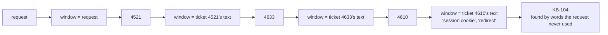

# 2.1 — Deciding with your eyes on the last thing you read

## One-line answer

A reactive loop chooses its next step by looking at **the most recent observation**, which means the
request itself is out of view from step two onwards — and on the standing three-part request it
covers **4 of 4**, because following the trail happened to work.

## The story

You go to the market to buy the week's food. You did not write a list; you know what you need.

You start at the vegetable stall because it is nearest. The tomatoes look good so you take a kilo.
The man beside him has coriander, which goes with tomatoes, so that goes in the bag too. Behind him
someone is frying something that smells excellent and you stop, and while you are standing there you
notice they sell the good chilli powder, so you buy that. On the way out there is a stack of
mangoes at a price that will not last.

You get home with a full bag and a real sense of achievement, and there is no rice.

Here is the thing worth noticing, and it is not the obvious one. You did not forget the rice because
you are careless. You forgot it because **at every single moment you were making a sensible
decision about what was in front of you.** Coriander after tomatoes is right. Chilli powder when you
are standing at the spice stall is right. Every step was locally correct and the sequence went
somewhere you did not intend, because after the first stall you were no longer deciding from *the
week's food*. You were deciding from *the last stall*.

## The idea in plain language

A **reactive loop** — the think→act→observe loop that Day 3 built by hand — works like this:

1. Look at what you have got.
2. Decide the single next thing to do.
3. Do it.
4. Look at what came back, and go to 1.

The whole loop turns on the word "look". What, exactly, is the agent looking at when it decides step
two?

In the honest version, it is looking at the conversation so far, which includes the request. But the
request is now one item among several, and the most recent item — the thing it just read — is the
loudest. Day 19 measured a version of this: material in the middle of a long context is used less
reliably than material at the edges. By step four the original request is well inside the middle.

So the practical behaviour of a reactive loop is: **decide from the last observation.** That is not
a bug in any implementation. It is what "react" means. The loop is reacting.

This is worth being precise about because the reduction in this day's lab makes it exact.
`_model.reactive` scores its candidate actions against a **window**, and the window starts as the
request and is then *replaced* by whatever the last step returned:

```python
window = request
...
    _, observation = run_step(step, world)
    window = observation  # the window moves; the request is gone
```

**Line by line:**

- `window` is the only text the chooser sees. Everything else about the two strategies in this day
  is identical — same candidate list, same scoring function, same stopping rule.
- `window = observation` is the whole of "reactive", in one assignment. The request is not
  down-weighted or summarised; it is simply no longer what is being read.
- `run_step` returns `(outcome, text)`; only the text becomes the window, which is why a step that
  fails leaves the chooser reading an error message.

That single line is what part [2.2](2.2-deciding-once-from-the-whole-request.md) changes, and
nothing else.

## Why Sutra needs it

Sutra already has a reactive loop and will keep it. Day 3 built it, and the triage flow Day 58
assembles has stages inside it that are exactly this shape — a research step that looks something
up, reads what came back, and decides whether to look up one more thing.

What this part is for is knowing **what that shape cannot see**. A reactive stage handed a request
with three parts in it is a reactive stage that may answer two of them, and the failure will not
appear in any log, because every step it took was a step it was pleased with. Part
[2.3](2.3-the-two-strategies-miss-different-things.md) measures exactly when that happens.

## The paper behind it

> **ReAct: Synergizing Reasoning and Acting in Language Models**
> `arXiv:2210.03629` · 2022 · <https://arxiv.org/abs/2210.03629>

It claimed that interleaving reasoning traces with actions beats doing either alone — the model
thinks about what it just saw, acts, and thinks again.

Taught on Day 3, in
[`papers/01-react.md`](../../../day-03-loop-hand-rolled/papers/01-react.md).

## The mechanism

Run the reactive chooser on a request with three distinct parts in it.

```bash
cd days/day-56-planning-and-replanning/lab
uv run python cover.py --reactive
```

**Line by line:**

- `--reactive` runs only the reactive arm. Without it you get the planner, which is part
  [2.2](2.2-deciding-once-from-the-whole-request.md).
- The `must cover` line is the answer key from part
  [1.3](../01-what-a-plan-is/1.3-the-plan-you-can-read-before-it-runs.md), computed before either
  strategy runs.
- `requests` counts model calls the strategy would have made: **one per step**, because a reactive
  loop asks the model what to do next, every time.
- `stopped` reports why the loop ended, which turns out to matter more than the number of steps —
  part [2.3](2.3-the-two-strategies-miss-different-things.md) leans on it.

Measured on 2026-09-05:

```text
request: Compare tickets 4521 and 4610 and tell me whether 4633 is the same underlying bug, then find the knowledge base article with the fix.
must cover (4): 4521, 4610, 4633, KB-104
  reactive   requests 4  steps 4
             visited  lookup_ticket(4521), lookup_ticket(4633), lookup_ticket(4610), search_kb(KB-104)
             covered  4/4   missed: none
             stopped  turn budget of 4 spent
```

**Four out of four.** The reactive loop covered the whole request, including the knowledge base
article — and this is the result that makes the day honest, because it is not the result the story
about the rice predicts.

Look at the order it visited things in. The request names 4521, then 4610, then 4633. The loop went
4521, then **4633**, then 4610. That is the trail, not the list: after reading 4521 — *"signed out
mid-form... onboarding form... single sign-on"* — the candidate that looked most like what it had
just read was 4633, whose text says *"onboarding form loses data"*. 4610 came third, on the strength
of vocabulary rather than because the request had named it.

And then the fourth step, which is the one worth the whole part. It found `KB-104`. **Nothing in the
request could have led it there.** The request says "the knowledge base article with the fix" — it
does not say which article, and no word in that phrase appears in KB-104's text. The loop found the
article because by step four it was reading a ticket about session cookies and redirects, and
KB-104 is *about* session cookies and redirects.

That is the thing a reactive loop is genuinely good at, stated precisely: **it can use vocabulary it
did not have when it started.** Reading gives it words, and the words find the next thing. A
strategy that decides everything up front has only the words in the request.



## When it breaks

Raise the turn budget and nothing improves. That is the failure, and it is not the one people expect.

On a four-part request the same loop covers 4 of 6. The obvious diagnosis is that it ran out of
turns — it stopped at `turn budget of 4 spent`. So give it more:

```bash
uv run python cover.py --reactive --shapes --budget 10
```

Measured on 2026-09-05, the four-part arm:

```text
request: Look at tickets 4521, 4610, 4633 and 4815 and say which of them share a root cause, then find the knowledge base article for each group.
must cover (6): 4521, 4610, 4633, 4815, KB-104, KB-131
shape: four parts
  reactive   requests 5  steps 4
             visited  lookup_ticket(4521), lookup_ticket(4633), lookup_ticket(4610), search_kb(KB-104)
             covered  4/6   missed: 4815, KB-131
             stopped  nothing left that resembles the last observation
```

Ten turns available. It used four and **stopped on its own**, and the reason it gives is the whole
answer: *nothing left that resembles the last observation.*

Ticket 4815 is about export rate limits. The request named it explicitly. But by the time the loop
had finished following the sign-in trail, its window was a ticket about cookies, and 4815 has
nothing in common with cookies. It did not run out of budget. **It ran out of relevance to a
question it could no longer see.**

This is the failure with teeth, because more budget is the fix everyone reaches for and it changes
nothing. Run it at 6, 8 and 10 turns and the answer is identical: 4 of 6, missing 4815 and KB-131,
every time.

## In production

**What a professional writes instead.** They stop relying on the loop to remember the request and
put it somewhere the loop cannot lose it. In practice that is a short **pinned goal** re-stated in
the system instruction on every turn, plus an explicit checklist of the request's parts carried in
state and ticked off — which is, note, a plan wearing a disguise. If you find yourself doing that to
a reactive loop, part [2.2](2.2-deciding-once-from-the-whole-request.md) is the thing you are
reinventing.

**What degrades at scale.** Cost, linearly and unavoidably. Every step is a model call, so a request
that needs eight steps costs eight requests, and on this project's free tier of 20 generate requests
per day that is two and a half requests' worth of work in a whole day. Part
[2.4](2.4-what-a-plan-costs-in-requests.md) prices this properly.

**The failure that only appears with real traffic.** The drop is silent and it is
correlated with request complexity, which means it is invisible in aggregate exactly the way Day
50's fragmentation was. Simple one-part requests — the majority of traffic — are answered perfectly
by a reactive loop. The multi-part requests are the ones a support desk gets when something is
genuinely wrong, and those are the ones that quietly come back two-thirds answered. Your average
metric goes up while your hardest cases stop working.

**The review comment a senior engineer leaves:** *"This loop reads the request once and then never
again. Add a coverage check at the end against the parts of the request, or you will ship something
that answers the first thing it sees and reports success."*

**The interview question:** *"When does a ReAct-style loop drop part of a request?"* An honest
answer: *"When the request has several parts that are not related to each other. The loop decides
each step from the last observation, so it follows whichever thread it pulled first, and a part of
the request that shares no vocabulary with that thread never becomes the most attractive next step.
I measured it on a four-part request: it covered four of six and stopped by itself, saying there was
nothing left that resembled what it had just read. Raising the turn budget from four to ten changed
nothing — same four items — which is the point, because more turns is the fix people try first. The
other half of the honest answer is that on a three-part request where the parts *were* related, the
same loop got four out of four and found a knowledge base article the request could not have named,
because reading the tickets gave it the vocabulary. Reacting is not the weak option. It is the
option that follows the evidence."*

## Check yourself

```bash
cd days/day-56-planning-and-replanning/lab
uv run python cover.py --reactive
uv run python cover.py --reactive --shapes --budget 10
```

Now open `_model.py` and find the single line that makes the loop reactive. Comment it out, re-run,
and say what strategy you have just built.

**Out loud, without scrolling up:** explain why raising the turn budget did not help, and name the
one thing a reactive loop can do that a plan written from the request alone cannot.

**Next:** [2.2 — Deciding once, from the whole request](2.2-deciding-once-from-the-whole-request.md).
