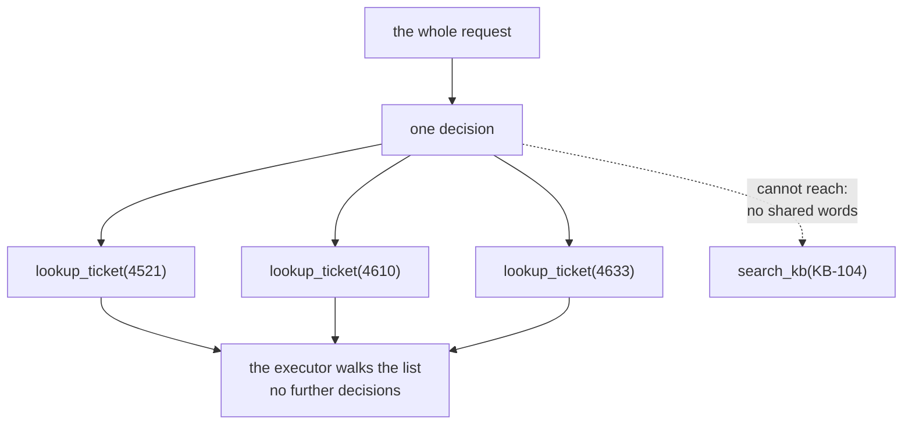

# 2.2 — Deciding once, from the whole request

## One-line answer

Plan-and-execute changes exactly one thing about the reactive loop — the chooser reads **the whole
request** instead of the last observation — and that one change costs **one model call instead of
four** and covers every part the request names, and only those.

## The story

The exam paper is put face down on the desk and you are told to turn it over.

Everybody starts writing. One person does not: she reads all five questions first, all the way to
the end, before her pen touches the answer booklet. It takes a little while and it looks like she is
falling behind.

What she finds is this. Question 5 is worth thirty marks and needs the graph paper, which is at the
back and which nobody has noticed. Question 2 asks for something question 4 already makes you
calculate, so if she does 4 first she gets 2 nearly free. And question 3 is a variant of one she has
done before, so it is quick and she should not spend twenty minutes on it.

None of that is available to the person who started writing on question 1. Not because they are
slower or worse — because at the moment they decided what to do, question 5 was still face down in
their mind.

The cost of reading first is real: a few minutes of not writing. What it buys is that the *shape* of
the whole task is known before any of it is committed to.

## The idea in plain language

**Plan-and-execute** separates two jobs that a reactive loop does together:

- **Deciding** — one pass over the whole request that produces the complete list of steps.
- **Doing** — walking that list.

The deciding happens once, at the start, with everything in view. The doing does not need judgement
at all, in the sense that matters here: once the plan says `lookup_ticket(4610)`, looking up 4610 is
a function call.

Three consequences follow, and they are the argument for the whole strategy:

1. **Coverage is bounded by the request rather than by the trail.** Every part of the request is in
   view at decision time, so a part cannot be lost by being unrelated to whatever got read first.
2. **The expensive thing happens once.** One model call produces N steps. The reactive loop pays a
   model call *per step*. Part [2.4](2.4-what-a-plan-costs-in-requests.md) prices that.
3. **There is an artefact.** The plan exists as an object before anything happens, which is what
   made everything in section [1](../01-what-a-plan-is/1.3-the-plan-you-can-read-before-it-runs.md)
   possible — scoring, differencing, approving, resuming.

And there is a cost, stated now rather than buried later, because a part that only argues one side is
not teaching a trade-off. **A plan is a prediction, and predictions go stale.** Everything decided at
the start was decided without the information that execution produces. Section
[4](../04-when-a-plan-dies/4.4-the-plan-that-outlived-the-world.md) is about what that does.

The lab makes the difference between the two strategies exact, and it is one line. Here is the whole
planner:

```python
def planner(request: str, world: World) -> tuple[Plan, Trace]:
    trace = Trace("planning")
    trace.requests = 1  # one model call, and only one, whatever the request contains
    trace.stopped = "the request had no more parts to plan for"
    mentioned = ids_in(request)
    scored = [(score(c, request, mentioned), c) for c in candidates(world)]
    chosen = [c for value, c in sorted(scored, key=lambda p: (-p[0], p[1].argument)) if value > 0]
    steps = tuple(Step(c.action, c.argument, c.why) for c in chosen)
    trace.picks = list(steps)
    return Plan(goal=request.strip(), steps=steps), trace
```

**Line by line:**

- `score(c, request, mentioned)` — the window is `request`, and it never changes. Compare with part
  [2.1](2.1-deciding-with-your-eyes-on-the-last-thing.md)'s `window = observation`. That is the
  entire difference between the two strategies in this lab, and it is deliberate: if they differed
  in six ways, nothing measured afterwards would be attributable to any one of them.
- `trace.requests = 1` is not an approximation. A planner is one call whether the request has two
  parts or twelve, which is why part [2.4](2.4-what-a-plan-costs-in-requests.md)'s table has a
  constant column in it.
- `candidates(world)` is the same function the reactive chooser uses — every ticket and every
  article, in a fixed order.
- `sorted(..., key=lambda p: (-p[0], p[1].argument))` sorts by score descending, then by identifier,
  so the plan is **reproducible**. A planner whose output depends on dictionary ordering cannot be
  diffed against yesterday's, and part
  [1.3](../01-what-a-plan-is/1.3-the-plan-you-can-read-before-it-runs.md) needs that diff.
- `if value > 0` is the plan's only inclusion rule: a candidate that shares nothing with the request
  is not a step. This is what makes the plan cover *the request* rather than the archive.
- `Plan(goal=request.strip(), ...)` keeps the request verbatim as the goal, because part
  [6.1](../06-in-production/6.1-every-step-ran-and-nothing-was-answered.md) checks the finished run
  against it.

**This is a reduction, not a model.** No language model wrote this plan; a scoring function did. What
it faithfully reproduces is the *structural* property of planning — deciding from the whole request,
once — and the request arithmetic that follows. What it cannot tell you is how a real model behaves,
and nothing in this day claims it does. Every number in section 2 is a claim about the strategy, not
about Gemini.

## Why Sutra needs it

The triage flow Day 58 assembles is not one request; it is five stages. But the *investigation* a
support agent actually asks for — *"are these three tickets the same bug, and what do we do about
it?"* — is one multi-part request, and it is the shape that reaches the desk when something is
genuinely wrong.

More immediately: everything in sections
[3](../03-walking-the-plan/3.1-the-executor-is-a-loop-with-a-list.md),
[5](../05-the-second-edition/5.1-let-the-seam-out-or-recut-the-cloth.md) and
[6](../06-in-production/6.1-every-step-ran-and-nothing-was-answered.md) needs a plan object to
exist. The executor walks one, the replanner produces a second one, the approval card renders one.
None of those has anything to hold onto until this part produces the artefact.

## The mechanism

```bash
cd days/day-56-planning-and-replanning/lab
uv run python cover.py
```

**Line by line:**

- No flag runs the planner arm alone. `--reactive` was part
  [2.1](2.1-deciding-with-your-eyes-on-the-last-thing.md); `--shapes` runs both and is part
  [2.3](2.3-the-two-strategies-miss-different-things.md).
- The request, the answer key and the scoring function are all identical to the reactive run. Only
  the window moved.

Measured on 2026-09-05:

```text
request: Compare tickets 4521 and 4610 and tell me whether 4633 is the same underlying bug, then find the knowledge base article with the fix.
must cover (4): 4521, 4610, 4633, KB-104
  planning   requests 1  steps 3
             visited  lookup_ticket(4521), lookup_ticket(4610), lookup_ticket(4633)
             covered  3/4   missed: KB-104
             stopped  the request had no more parts to plan for
```

**One request instead of four.** That is the headline and it is exactly what the strategy promises:
the decision was made once, and it produced three steps.

Look at the steps. `4521`, `4610`, `4633` — in the order the request names them, all three of them,
none of them missed. On the coverage of *what the request said*, planning is perfect: every ticket
named is a step.

And it missed `KB-104`, which is where the fix is.

That is not a defect in this planner. It is the strategy's boundary, and it is worth stating exactly
because it is the thing the exam story does not prepare you for. The request says *"find the
knowledge base article with the fix."* It does not say **which** article. No word in that sentence
appears in KB-104's text, which is about cookies, redirects and `SameSite`. A chooser reading only
the request has no way to reach it.

The reactive loop found it — by reading a ticket first and picking up the vocabulary. Planning
cannot do that, because planning is over before any reading happens.

**A plan can only contain what the request's own words can reach.** That sentence is the honest
statement of this strategy's limit, and part
[2.3](2.3-the-two-strategies-miss-different-things.md) is the measurement that makes it a finding
rather than an observation.



## When it breaks

The break is a plan of zero steps, and it happens whenever the request describes a problem instead of
naming records — which is how a person actually writes.

```bash
uv run python shape.py --score
```

with `REQUEST` changed to a sentence that names nothing:

```text
request : The customer says they keep getting logged out. What should I tell them?
must cover (0): 
plan covers      : -
plan misses      : none
score            : 0/0

Nothing has run. No ticket was read, no article opened, no model called.
```

Every number reads like success. `misses: none`. The requirement set is empty because the request
names no identifiers, and the plan is empty because no candidate shares an informative word with a
sentence made mostly of stopwords.

An empty plan is a run that completes instantly, does nothing, and reports no error. Part
[6.1](../06-in-production/6.1-every-step-ran-and-nothing-was-answered.md) is where that becomes a
guard; here it is enough to notice that the strategy fails **quietly and early**, and that the
reactive loop does not fail this way — it would at least go and read something.

## In production

**What a professional writes instead.** They do not plan from the request alone. The planner is given
the request *plus a small amount of retrieved context* — which on this project is Days 49 and 50's
retriever, run before planning, so that the planner's window contains the vocabulary the archive
uses. That directly fixes the `KB-104` miss above: an article retrieved for the request is an
identifier the planner can then name. It is also why this day sits after Phase 7 rather than before
it.

**What degrades at scale.** Planning is one call, but it is a *big* one — the whole request, the
tool vocabulary, and any retrieved context, in one prompt. On a large tool catalogue the prompt
grows faster than the plan does, and Day 51's caching arithmetic becomes the thing that decides
whether planning is actually cheaper. The number to watch is not calls; it is calls times prompt
size.

**The failure that only appears with real traffic.** Plans get *longer* than the work needs, because
a planner scoring candidates against a request will happily include anything vaguely related. On a
big archive that is a plan with fifteen steps where four would do, and every extra step is a tool
call, a row in the transcript and a thing that can fail. The countermeasure is a step cap in the
schema plus the coverage score from part
[1.3](../01-what-a-plan-is/1.3-the-plan-you-can-read-before-it-runs.md) — if coverage is already
complete at step four, steps five to fifteen are cost without benefit.

**The review comment a senior engineer leaves:** *"The planner never sees the archive, so it can only
plan against words the user happened to type. Retrieve first, then plan — otherwise every request
phrased in the customer's language instead of ours produces a plan with nothing in it."*

**The interview question:** *"What does plan-and-execute buy you over a reactive loop?"* An honest
answer: *"One decision instead of one per step, so it is one model call rather than four on my
measurement, and the decision is made with the whole request in view so no part of it can be lost by
being unrelated to whatever got read first. It also produces an artefact — a list I can score before
running, show to a human for approval, store with a cursor and resume. What it buys you nothing on
is anything the request's own words cannot reach. My planner covered every ticket the request named
and missed the knowledge base article with the actual fix, because the request said 'the article with
the fix' and that phrase has no words in common with the article. The reactive loop found it, by
reading a ticket first and using the vocabulary it picked up. So the real answer is that planning is
strong on omission and weak on discovery, and the fix is to retrieve before you plan."*

## Check yourself

```bash
cd days/day-56-planning-and-replanning/lab
uv run python cover.py
uv run python cover.py --reactive
```

Now edit the standing `REQUEST` in `cover.py` to name `KB-104` explicitly, re-run the planner arm,
and write down what the coverage becomes and why.

**Out loud, without scrolling up:** state the one line of code that separates planning from reacting,
and name the class of thing a plan written from the request alone can never contain.

**Next:** [2.3 — The two strategies miss different things](2.3-the-two-strategies-miss-different-things.md).
