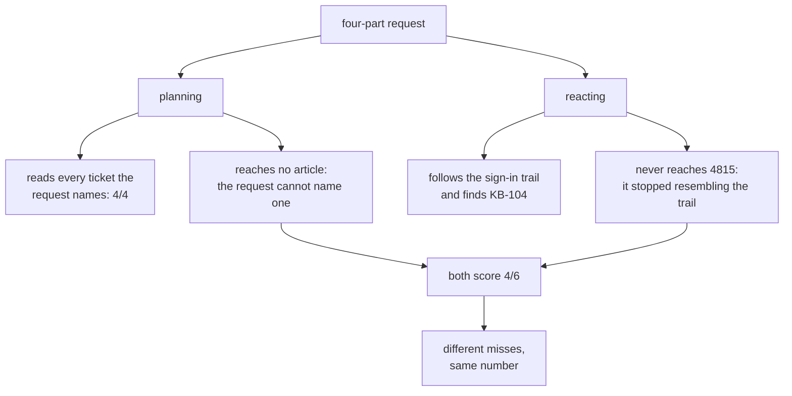

# 2.3 — 💥 The two strategies miss different things

## One-line answer

On the same four-part request both strategies score **4 out of 6** — and they miss **completely
different things**: planning misses both knowledge base articles because the request could not name
them, reacting misses a ticket the request named outright because it stopped resembling the trail.

## The story

Two people are looking for a set of keys in the same house.

The first one works the rooms. Bedroom, then bathroom, then kitchen, then living room, then hall —
every room, in order, whether or not it feels likely. She is thorough and she is slow, and when she
has finished she can tell you with confidence that the keys are not in any of those five rooms.

The second one thinks about it and says: *I came in, I put the shopping down, I went to answer the
phone.* He goes to the kitchen counter, sees the shopping bag, sees a receipt he had forgotten
about, remembers he went out to the car again for the second bag, and goes to check the car. He is
following the thread of what actually happened.

They both fail to find the keys, and this is the part that matters: **they fail differently.**

She never checked the car, because the car is not a room in the house and it was not on her list.

He never checked the bathroom, because nothing about the shopping led there — and the keys are in
the bathroom, because he took them upstairs when he went to wash his hands and put them on the
shelf.

If you had to send one of them, you would want to know which kind of missing thing you were dealing
with. And if you could send both, you would.

## The idea in plain language

Parts [2.1](2.1-deciding-with-your-eyes-on-the-last-thing.md) and
[2.2](2.2-deciding-once-from-the-whole-request.md) each ended with a limit, and they are not the
same limit. Put side by side, the two strategies have **complementary blind spots**:

- **Planning misses what the request cannot name.** Its window is the request, so a thing that exists
  in the archive but shares no vocabulary with the request is unreachable. Call this a **discovery**
  failure.
- **Reacting misses what the trail does not touch.** Its window is the last observation, so a part
  of the request that is unrelated to the thread it followed becomes unreachable — even though it
  was named. Call this a **coverage** failure.

This matters because the usual framing of this trade-off is *plan-and-execute is better for
multi-part work*, and that framing is a half-truth that will cost somebody a week. Planning is
better at **not omitting what you asked for**. It is *worse* at finding what you did not know to
ask for. Those are different jobs, and which one you need is a property of the request, not a
preference.

And the score does not tell them apart. That is the finding this part exists for: **two strategies
scoring identically can be wrong about entirely different things**, and a coverage number with no
`missed` column beside it hides that completely. Day 50 met the same shape — `hit@k` and
`answered@k` agreeing on a number and disagreeing on what it meant — and the countermeasure is
identical: never report the aggregate without the list.

## Why Sutra needs it

Day 58 assembles the triage graph and has to decide, for each stage, whether that stage plans or
reacts. Getting that wrong in either direction produces a system that is silently bad at one class
of ticket.

The *research* stage is the one this part decides. A support agent's question — *"has anything like
this happened before, and what did we do?"* — is a discovery question. It is asking for something the
agent cannot name, which is exactly where planning is weakest and reacting is strongest. Whereas the
*intake* stage, which has to make sure every part of a multi-part customer complaint is recorded, is
a coverage question.

Same graph, two stages, two different answers, and the reason is in the table below rather than in
anybody's taste.

## The mechanism

Run both strategies over three request shapes with the same answer key.

```bash
cd days/day-56-planning-and-replanning/lab
uv run python cover.py --shapes
```

**Line by line:**

- `--shapes` runs the one-part, three-part and four-part requests through **both** arms. The three
  requests are constants at the top of `cover.py` and the answer key for each is computed by
  `required()` before either strategy runs.
- Both arms share `candidates()`, `score()` and the answer key. The only difference is the window,
  which is the point of the reduction (part
  [2.2](2.2-deciding-once-from-the-whole-request.md)).
- Read the `missed` and `stopped` lines, not the `covered` fraction. The fraction is the number this
  part is arguing against.

Measured on 2026-09-05:

```text
request: Ticket 4702 has a blank invoice PDF. What is the fix?
must cover (2): 4702, KB-118
shape: one part
  planning   requests 1  steps 2
             visited  lookup_ticket(4702), search_kb(KB-118)
             covered  2/2   missed: none
             stopped  the request had no more parts to plan for
  reactive   requests 4  steps 4
             visited  lookup_ticket(4702), search_kb(KB-118), lookup_ticket(4610), lookup_ticket(4521)
             covered  2/2   missed: none
             stopped  turn budget of 4 spent

request: Compare tickets 4521 and 4610 and tell me whether 4633 is the same underlying bug, then find the knowledge base article with the fix.
must cover (4): 4521, 4610, 4633, KB-104
shape: three parts
  planning   requests 1  steps 3
             visited  lookup_ticket(4521), lookup_ticket(4610), lookup_ticket(4633)
             covered  3/4   missed: KB-104
             stopped  the request had no more parts to plan for
  reactive   requests 4  steps 4
             visited  lookup_ticket(4521), lookup_ticket(4633), lookup_ticket(4610), search_kb(KB-104)
             covered  4/4   missed: none
             stopped  turn budget of 4 spent

request: Look at tickets 4521, 4610, 4633 and 4815 and say which of them share a root cause, then find the knowledge base article for each group.
must cover (6): 4521, 4610, 4633, 4815, KB-104, KB-131
shape: four parts
  planning   requests 1  steps 4
             visited  lookup_ticket(4521), lookup_ticket(4610), lookup_ticket(4633), lookup_ticket(4815)
             covered  4/6   missed: KB-104, KB-131
             stopped  the request had no more parts to plan for
  reactive   requests 4  steps 4
             visited  lookup_ticket(4521), lookup_ticket(4633), lookup_ticket(4610), search_kb(KB-104)
             covered  4/6   missed: 4815, KB-131
             stopped  nothing left that resembles the last observation
```

Three shapes, and each one says something different.

**One part: both perfect, and one of them wasted half its budget.** Both reach 2 of 2. Planning did
it in two steps and one request; the reactive loop did it in four steps and four requests, and its
last two steps — reading 4610 and 4521, which are sign-in tickets — had nothing to do with a blank
invoice PDF. That is the cost of following a trail on a request that had no trail to follow.

**Three parts: reacting wins, 4/4 against 3/4.** Planning got every ticket and missed the article.
Reacting got everything, because the parts of this request were *related* — all three tickets are
sign-in problems — so the trail led to the article, as part
[2.1](2.1-deciding-with-your-eyes-on-the-last-thing.md) traced.

**Four parts: a dead heat that is not a dead heat.** Both score 4 of 6. Now read what each one
missed:

| | planning | reacting |
| --- | --- | --- |
| score | 4/6 | 4/6 |
| missed | `KB-104`, `KB-131` | `4815`, `KB-131` |
| missed a thing the request **named** | no | **yes — 4815** |
| missed a thing only reading could find | **yes — both articles** | one (`KB-131`) |
| stopped because | the request had no more parts | nothing resembled the last observation |

Planning read every one of the four tickets the request explicitly named, in order, and then
stopped, because a planner has nothing left to do once the request is exhausted. Its two misses are
both articles — both **discovery** failures.

Reacting followed the sign-in thread, found the sign-in article, and then had nothing that resembled
a cookie ticket, so it stopped. Its misses are a rate-limit ticket that was **named in the request**
and the rate-limit article behind it — one **coverage** failure and one discovery failure downstream
of it.

**The identical score is the trap.** A dashboard reporting "coverage 67%" for both strategies has
told you nothing about which one to ship for this workload. The `missed` column is the entire
finding.



## When it breaks

The measurement itself has a limit, and it is the honest thing to state before anyone builds on it.

**The reactive loop wins the three-part case partly by luck.** Its four turns were exactly enough,
and the trail happened to run through all three tickets before reaching the article. Change the
request so the unrelated ticket comes first and the same loop follows a different thread. The
finding that survives is not *"reacting scores higher on three-part requests"* — it is *"reacting's
score depends on which thread it pulls first, and planning's does not."* One of those is a property;
the other is one run.

**And both strategies are a reduction.** No model wrote either plan. The claim being made is
structural — about which text the chooser reads — and the numbers are the arithmetic of that
structure over one small archive of six tickets and four articles. A real planner would sometimes
name an article it had seen in training; a real reactive loop would sometimes summarise the request
back into its own window and recover. Neither of those is modelled here, and neither changes the
shape of the two failure modes.

What would break the finding is a request whose parts are all related *and* all named. Both
strategies should then reach everything, and the choice between them collapses to cost — which is
part [2.4](2.4-what-a-plan-costs-in-requests.md).

## In production

**What a professional writes instead.** They do not choose. The shape that actually ships is
**plan, then react within a step** — a plan from the whole request for coverage, with the steps that
are open-ended ("find the article that explains this") executed as a small reactive loop that gets
to use what it reads. That is not a compromise; it is each strategy doing the job it is good at, and
it is the shape section [5](../05-the-second-edition/5.1-let-the-seam-out-or-recut-the-cloth.md)
formalises under a different name — because a replan *is* the plan getting to use what execution
learned.

**What degrades at scale.** The coverage failure gets worse with request length and the discovery
failure gets worse with archive size. A team that measures on short requests over a small corpus
will conclude planning is fine, ship it, and meet the discovery failure a year later when the
knowledge base has ten thousand articles and no request ever names one.

**The failure that only appears with real traffic.** Aggregate coverage goes *up* while the system
gets worse at the questions that matter. Simple requests dominate the traffic and both strategies
handle them, so the mean is flattering. The multi-part investigation — the ticket that has been
escalated twice — is where the misses live, and it is a small fraction of volume and a large
fraction of the reason the desk exists.

**The review comment a senior engineer leaves:** *"Both arms report 4 of 6 and you have shipped the
one with the nicer graph. They are not equivalent: one of them skipped a ticket the customer
explicitly asked about. Break the coverage metric out by whether the missed item was named in the
request — a miss on something we were told about is a different severity from a miss on something we
had to find."*

**The interview question:** *"How would you choose between ReAct and plan-and-execute?"* An honest
answer: *"By what kind of missing I can least afford. I measured both on the same requests with the
same answer key, and on a four-part request they both scored four out of six and missed different
things. Planning read every ticket the request named and reached neither knowledge base article,
because the request said 'the article with the fix' and could not name one. Reacting found the
article — it picked up the vocabulary by reading a ticket — and never reached a ticket the request
named outright, because that ticket had nothing in common with the thread it was following. So
planning fails by omitting what you did not say; reacting fails by omitting what you did. If the
request is a checklist, plan. If it is a search, react. If it is both, which most real
investigations are, plan for coverage and let the open-ended steps react — and either way report the
list of what was missed, not the fraction, because the fraction was identical and the fraction is
what would have made me ship the wrong one."*

## Check yourself

```bash
cd days/day-56-planning-and-replanning/lab
uv run python cover.py --shapes
```

Now edit the four-part request in `cover.py` so that `4815` is named **first** instead of last,
re-run, and write down whether the reactive arm's misses change.

**Out loud, without scrolling up:** name the two kinds of missing, say which strategy suffers which,
and explain why an identical coverage score for both is a reason to look harder rather than a reason
to stop.

**Next:** [2.4 — What a plan costs in requests](2.4-what-a-plan-costs-in-requests.md).
