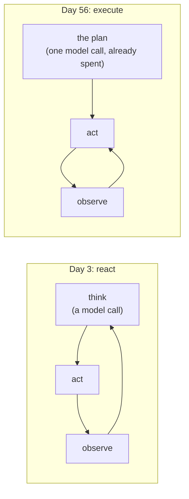

# 3.1 — The executor is a loop with a list in its hand

## One-line answer

The executor is Day 3's think→act→observe loop with the *thinking* removed — it walks a list that
was decided in advance, and on the five-step plan below it completes all five while making **zero**
decisions.

## The story

You are cooking for six people and you have written the order of things on a card, because you have
done this before and you know what happens if you do not.

*Onions in first, low. While they go, boil the water. Chicken in when the onions turn. Rice into the
water when the chicken is sealed. Cream at the end, off the heat.*

Now you are standing at the stove and the card is propped against the tin. And the striking thing —
the thing that makes the card worth writing — is that you are not deciding anything any more. You
are looking at the next line and doing it. When the onions turn, you do not weigh up whether the
chicken or the rice should go next. The card says chicken. The card decided that twenty minutes ago,
at the table, with all six people and the whole meal in mind.

Cooking without the card is not harder because the steps are harder. It is harder because you are
deciding and cooking at the same time, with a hot pan, and the pan is the loudest thing in the room.

## The idea in plain language

An **executor** is the thing that walks a plan. Given a `Plan` — the object from part
[1.1](../01-what-a-plan-is/1.1-a-plan-is-a-list-not-a-paragraph.md) — it takes the steps in order and
performs each one.

Compare it with the loop Day 3 built by hand, in
[`days/day-03-loop-hand-rolled/`](../../../day-03-loop-hand-rolled/LESSON.md). That loop was:

1. **Think** — ask the model what to do next.
2. **Act** — do it.
3. **Observe** — read what came back.
4. Repeat.

The executor is the same loop with step 1 deleted. It does not think, because the thinking has
already happened, once, in the planner. What is left is act, observe, repeat.

That deletion is the whole reason planning costs one request instead of four (part
[2.4](../02-two-ways-to-decide/2.4-what-a-plan-costs-in-requests.md)). It is also why the executor is
the boring part of this day, and being boring is a feature: a component that makes no decisions is a
component that cannot make them wrongly, and it can be tested without a model.

Two properties follow immediately, and both get their own parts:

- The executor needs to decide **what each step can see** — its own argument only, or also what the
  earlier steps produced. That is part [3.2](3.2-what-a-step-is-allowed-to-see.md).
- Because the executor holds a position in a list, that position is **saveable**. That is part
  [3.3](3.3-a-plan-that-outlives-its-process.md), and it is what Day 60 will build durability on.

There is a third property that this part is careful *not* to claim. The executor does not check
whether the plan is working. It runs the steps. Section
[4](../04-when-a-plan-dies/4.1-a-shop-shut-for-lunch-and-a-shop-closed-down.md) is where it learns to
notice, and until then a step that fails and a step that succeeds are treated exactly alike.

## Why Sutra needs it

Day 58 builds the triage graph and every stage in it is an executor of this shape: something decided
the order, and the stage walks it. More specifically, this loop is what part
[3.4](3.4-the-same-executor-as-an-adk-workflow.md) rewrites as an ADK dynamic workflow — the same
five lines, expressed so that ADK's runtime can see each step as a node. You cannot understand the
framework version without having written the plain one, which is Principle 4 at the scale of a
section.

## The mechanism

```python
def walk(plan: Plan, world: World, carry: bool) -> list[str]:
    """Run every step in order, returning the results collected so far.

    `carry` is the whole experiment. When it is False each step is handed only its own argument,
    which is what a plan literally says. When it is True each step is also handed the results of
    the steps before it, which is what the plan silently assumed.
    """
    done: list[str] = []
    for i, step in enumerate(plan.steps, 1):
        visible = len(done) if carry else 0
        outcome, text = run_step(step, world)
        mark = {OK: "ok", HICCUP: "hiccup", CONTRADICTION: "CONTRADICTION"}[outcome]
        head = text.split(".")[0][:58]
        print(
            f"  {i}/{len(plan)} {str(step):<20} sees {visible} earlier result(s)  {mark:<14} {head}"
        )
        if outcome == OK:
            done.append(f"{step}: {text}")
    return done
```

**Line by line:**

- `for i, step in enumerate(plan.steps, 1)` — the entire executor is this line. Everything else is
  reporting. A loop over a list, starting the count at 1 so the printed positions match the plan a
  human read.
- `run_step(step, world)` is the hands, defined once in `_world.py`. It dispatches on
  `step.action` — the closed set from part
  [1.2](../01-what-a-plan-is/1.2-what-a-step-has-to-carry.md) — which is why this loop needs no
  `if` ladder of its own and no model.
- `outcome, text = ...` — two return values, not one. The executor cares about the outcome and the
  caller cares about the text, and collapsing them into a single string is how a failure ends up
  being reported as a result. Section
  [4](../04-when-a-plan-dies/4.1-a-shop-shut-for-lunch-and-a-shop-closed-down.md) is built on this
  split.
- `if outcome == OK: done.append(...)` — only successful steps contribute evidence. A step that
  contradicted produced text, and that text is an error message, and an error message in the
  evidence pile is how an agent ends up explaining a traceback to a customer.
- `visible = len(done) if carry else 0` is not part of the executor. It is the experiment that part
  [3.2](3.2-what-a-step-is-allowed-to-see.md) runs, sitting inside the loop so both versions are the
  same code.
- The function returns `done` rather than printing a conclusion, because what to do with the
  evidence is the caller's decision and part
  [6.1](../06-in-production/6.1-every-step-ran-and-nothing-was-answered.md) has strong opinions about
  it.

```bash
cd days/day-56-planning-and-replanning/lab
uv run python walk.py
```

**Line by line:**

- No flag: every step sees only its own argument. The `--carry` arm is part
  [3.2](3.2-what-a-step-is-allowed-to-see.md).
- The plan is a constant at the top of `walk.py` — five steps, hand-written rather than produced by
  the planner, so that this part is about the walking and not about the planning.

Measured on 2026-09-05:

```text
goal: Compare 4521 and 4610, check 4633, find the fix.
plan: 5 steps, carry=False

  1/5 lookup_ticket(4521)  sees 0 earlier result(s)  ok             Signed out mid-form
  2/5 lookup_ticket(4610)  sees 0 earlier result(s)  ok             Session drops on redirect
  3/5 compare(4521,4610)   sees 0 earlier result(s)  ok             compared 4521 and 4610
  4/5 lookup_ticket(4633)  sees 0 earlier result(s)  ok             Onboarding form loses data
  5/5 search_kb(KB-104)    sees 0 earlier result(s)  ok             Cookies dropped on cross-site redirect

  completed 5 of 5 steps
```

Five steps, five successes, zero model calls, and — the point — **zero decisions**. Nothing in that
run chose anything. The order came from the plan, the actions came from the plan, the arguments came
from the plan. The executor supplied the `for`.

That is what makes it testable. There is no sampling here, no temperature, no prompt. Run it a
hundred times and you get this output a hundred times, which means the triage flow's execution half
can have ordinary unit tests — and Principle 11 wants tests that can go red for a reason you
control.



## When it breaks

The executor's defining property — it does not think — is also its failure mode, and the run above
already contains it.

Look at step 3. `compare(4521,4610)` ran with `sees 0 earlier result(s)` and reported `ok`. It
compared two tickets it had not been given the contents of. And step 5 searched for `KB-104`, an
article nothing in the plan had mentioned before, and reported `ok`.

Neither is an error. Both are the executor doing exactly its job: the plan said to compare, so it
compared. The plan did not say *compare these two texts*, because a plan is a list of actions and
the dependencies between them were in the planner's head.

There is a harder version, and you can reach it deliberately. Give the executor a plan whose action
is not in the closed set:

```text
  1/1 investigate(4521)    sees 0 earlier result(s)  CONTRADICTION  unknown action 'investigate'
```

That is `run_step` falling through to its last line. It does not raise — it returns a contradiction
with a message — and that is a deliberate choice this lab makes so that section 4 can classify
failures rather than catch exceptions. It is worth naming the trade: a system that returns errors as
values needs every caller to check, and a caller that forgets has swallowed a failure. Plan §5.1's
**trap #4** is the ADK version of exactly this argument — 2.x surfaces exceptions through the
runtime precisely so that nothing can quietly turn a failure into a string — and part
[3.4](3.4-the-same-executor-as-an-adk-workflow.md) is where this loop has to face it.

## In production

**What a professional writes instead.** The loop stays this small; what grows around it is
bookkeeping. A real executor records, per step: when it started, when it ended, what it was given,
what it returned, and which attempt this was. That record is not for debugging — it is the input to
Day 60's replay and Day 63's audit trail, and it is far cheaper to write from the start than to
retrofit. They also make the executor take the step-runner as a parameter rather than importing it,
so the whole thing can be tested against a stub without a world at all.

**What degrades at scale.** A `for` loop is serial, and a plan whose steps are independent is a plan
that could have been three times faster. Day 54 built the parallel machinery; the thing it needs
from a plan is a statement of which steps depend on which, and this executor has no such statement —
it has an order, which is a much stronger claim than a dependency and a much weaker one to plan
with.

**The failure that only appears with real traffic.** Long plans meet timeouts. A five-step plan over
local dictionaries finishes instantly; a five-step plan where two steps are network calls to a
ticketing system will, eventually, have a step that hangs. A `for` loop with no per-step timeout
hangs with it, and the run that was going to be resumable (part
[3.3](3.3-a-plan-that-outlives-its-process.md)) is instead a process nobody can kill cleanly. Every
step gets a deadline; ADK's node decorator takes a `timeout` for exactly this reason, as part
[3.4](3.4-the-same-executor-as-an-adk-workflow.md) shows.

**The review comment a senior engineer leaves:** *"This executor only appends on `OK` — good — but it
carries on to the next step regardless of what happened. Decide explicitly what a failure means:
stop, skip, or replan. Right now the behaviour is 'skip', by accident, and skipping is almost never
what you want on a plan where step 4 depended on step 2."*

**The interview question:** *"What is an executor, in a plan-and-execute agent?"* An honest answer:
*"Day 3's loop with the thinking taken out. It walks the plan's steps in order and performs each
one, and it makes no decisions at all — which is the whole reason planning costs one model call
instead of one per step. It is also the part I can actually unit-test, because with the plan fixed
the execution is deterministic. The thing people underestimate is what it does *not* do: mine
happily ran a comparison of two tickets it had never been handed the text of, and reported success,
because the plan said compare and the executor's job is to do what the plan says. Dependencies
between steps are not something an executor can infer from an ordered list, and that is the next
problem rather than a bug in this one."*

## Check yourself

```bash
cd days/day-56-planning-and-replanning/lab
uv run python walk.py
```

Now add a sixth step to `PLAN` in `walk.py` with an action that is not in `ACTIONS`, re-run, and
write down what the executor did with it — and what you think it *should* have done.

**Out loud, without scrolling up:** name the step of Day 3's loop that the executor deletes, and say
what that deletion buys and what it costs.

**Next:** [3.2 — What a step is allowed to see](3.2-what-a-step-is-allowed-to-see.md).
