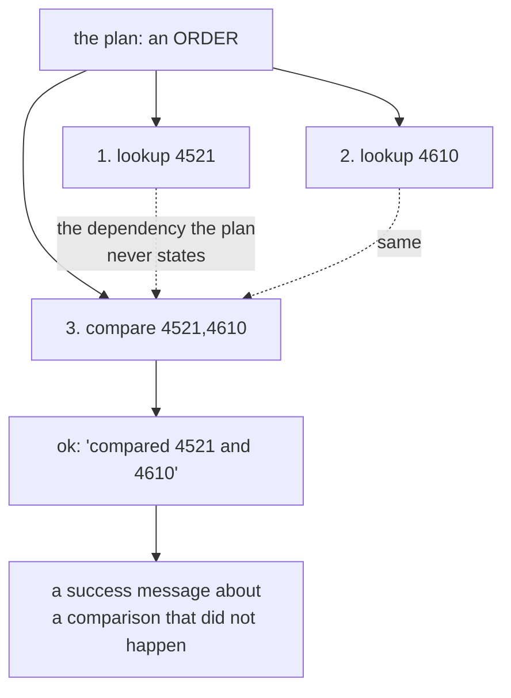

# 3.2 — What a step is allowed to see

## One-line answer

A plan states an **order**, not a set of **dependencies** — so step 3 can compare two tickets it was
never handed and report `ok`, and the only difference between a run where each step sees nothing and
one where each step sees everything is a single number in the executor.

## The story

You need a copy of your land record, so you go to the office with the yellow board outside.

Window 1 takes your application, staples a receipt to it, writes a number in a register, and points
you at window 2. Window 2 opens the file, reads the receipt, stamps something, adds a page, and
points you at window 3. Window 3 reads what is in the file, signs, and hands you the copy.

Nobody at window 3 has spoken to anybody at window 1. What the clerk at window 3 knows is *exactly
what is in the folder in front of them*. If window 2 forgot to add the page, window 3 does not
notice the absence — it signs what is there.

Now watch what happens on a bad day. Window 2 is at lunch, so somebody helpfully sends you straight
to window 3. Window 3 reads the folder, finds a receipt and no stamped page, and — because the
clerk is busy and the folder looks broadly right — signs it anyway. You leave with a document that
went through the whole process and is missing the thing that made it valid.

The order was followed. The folder is what carried the information, and nothing in the order said
what had to be *in* it.

## The idea in plain language

A plan is an ordered list. Order says *when*. It does not say *what a step needs*.

Those two are different claims and it is worth being blunt about how different:

- **Order:** step 3 runs after step 2.
- **Dependency:** step 3 needs step 2's output.

Every dependency implies an order. No order implies a dependency. When you write a plan as a list,
you write down the weaker claim and hope the stronger one comes with it.

So the executor has to make a decision the plan does not make for it: **what does a step get handed?**
There are two honest answers and one dishonest one.

- **Only its own argument.** Clean, testable, and it means a step like *compare these two tickets*
  cannot actually compare anything, because it has an argument naming two ids and no ticket text.
- **Its argument plus everything earlier steps produced.** This is what a plan usually *means*, and
  it works, and it grows: by step ten the accumulated evidence is large, and Day 19's *Lost in the
  Middle* problem applies to it the same way it applies to any long context.
- **Its argument plus whatever it can reach** — a shared mutable dictionary that any step may read
  or write. This is the dishonest one. It works immediately, and it makes the plan's dependency
  structure unknowable, which forfeits parallelism (Day 54), resumption (part
  [3.3](3.3-a-plan-that-outlives-its-process.md)) and replay (Day 60) all at once.

The lab runs the first two arms so the difference is visible, and the visible difference is
deliberately tiny: **one number in one column**. That is the point of the experiment. The plan is
byte-identical in both runs. The steps are identical. The world is identical. What changes is what
the executor threads through, and the run looks almost the same either way — which is exactly why
this bug survives review.

## Why Sutra needs it

Day 54 built parallel and loop composition, and the thing a parallel branch needs is a guarantee
that two steps do not depend on each other. An ordered list cannot provide that guarantee. If the
triage graph is ever going to research three tickets at the same time — and Day 58's research stage
is the obvious candidate — the plan has to say which steps are independent, and today's `Step` does
not have a field for it.

Part [3.3](3.3-a-plan-that-outlives-its-process.md) needs the same information for a different
reason: resuming at step 3 is only safe if you know what step 3 required, and can prove you still
have it.

## The mechanism

Run the same plan twice, changing nothing but what the executor threads through.

```bash
cd days/day-56-planning-and-replanning/lab
uv run python walk.py
uv run python walk.py --carry
```

**Line by line:**

- The two commands run the **same** `PLAN` constant against the **same** `World`. `--carry` flips
  one boolean, which controls the `visible` number and nothing else in the loop.
- `sees N earlier result(s)` is the column to read. In the first run it is `0` on every line. In the
  second it is the count of successful steps so far.
- Both runs report `completed 5 of 5`, which is the finding: **the outcome column cannot tell you
  which run you are looking at.**

Measured on 2026-09-05, without `--carry`:

```text
  1/5 lookup_ticket(4521)  sees 0 earlier result(s)  ok             Signed out mid-form
  2/5 lookup_ticket(4610)  sees 0 earlier result(s)  ok             Session drops on redirect
  3/5 compare(4521,4610)   sees 0 earlier result(s)  ok             compared 4521 and 4610
  4/5 lookup_ticket(4633)  sees 0 earlier result(s)  ok             Onboarding form loses data
  5/5 search_kb(KB-104)    sees 0 earlier result(s)  ok             Cookies dropped on cross-site redirect

  completed 5 of 5 steps
```

and with it:

```text
  1/5 lookup_ticket(4521)  sees 0 earlier result(s)  ok             Signed out mid-form
  2/5 lookup_ticket(4610)  sees 1 earlier result(s)  ok             Session drops on redirect
  3/5 compare(4521,4610)   sees 2 earlier result(s)  ok             compared 4521 and 4610
  4/5 lookup_ticket(4633)  sees 3 earlier result(s)  ok             Onboarding form loses data
  5/5 search_kb(KB-104)    sees 4 earlier result(s)  ok             Cookies dropped on cross-site redirect

  completed 5 of 5 steps
```

Ten lines of output and **one column differs.** Every outcome is `ok` in both. Every step ran in
both. Both runs report five of five completed and both would exit zero.

Now look at line 3 in the first run. `compare(4521,4610)` — `sees 0 earlier result(s)` — `ok`.

Two tickets were read on lines 1 and 2. Their text went into the executor's `done` list. And the
comparison step was handed none of it, compared nothing, and said it had compared 4521 and 4610.
Here is what it actually did, in `_world.run_step`:

```python
    if step.action == "compare":
        ids = [i.strip() for i in step.argument.split(",")]
        missing = [i for i in ids if i not in world.tickets]
        if missing:
            return CONTRADICTION, f"cannot compare; unknown ticket(s) {missing}"
        return OK, f"compared {' and '.join(ids)}"
```

**Line by line:**

- `step.argument.split(",")` — the ids come from the *argument string*, which is the design debt part
  [1.2](../01-what-a-plan-is/1.2-what-a-step-has-to-carry.md) flagged, arriving on schedule.
- `if i not in world.tickets` checks that the ids **exist**. That is the only check. Existence is not
  the same as having been read, and this line is where those two get confused.
- `return OK, f"compared {...}"` — the success message names the ids and claims a comparison. There
  is no comparison in this function. There is a membership test and a formatted string.
- Nothing here reads `done`, because `run_step` is not given it. The dependency lived in the
  planner's intention and never made it into the data.

That is not a bug in `run_step`; it is a faithful implementation of what the plan says. The plan says
*compare 4521 and 4610*. It does not say *using the text you read in steps 1 and 2*, because there
is no field in which to say that.



## When it breaks

It breaks by reporting success, which is the worst way for anything to break, and part
[4.3](../04-when-a-plan-dies/4.3-the-step-that-worked-and-told-you-nothing.md) is the general form
of that failure.

There is a sharper version available in the plan you already have. Reorder it — put `compare` at
step 1, before either ticket has been looked up:

```text
  1/5 compare(4521,4610)   sees 0 earlier result(s)  ok             compared 4521 and 4610
```

Still `ok`. The comparison is now *first*, before anything at all has been read, and it still
reports having compared two tickets. The membership test passes because both tickets exist in the
archive, and existence was never the question.

The version that does fail is the one where the ticket does not exist:

```text
  1/1 compare(4521,9999)   sees 0 earlier result(s)  CONTRADICTION  cannot compare; unknown ticket(s) ['9999']
```

Which tells you something uncomfortable: the only dependency this system can enforce is *the thing
you named exists*, and the only reason that error appears at all is that `9999` is not in the
archive. Every dependency that is about **sequence** rather than **existence** is unchecked.

## In production

**What a professional writes instead.** Every step gets an **id**, and every step declares the ids it
consumes:

```text
  s1  lookup_ticket  4521       needs: []
  s2  lookup_ticket  4610       needs: []
  s3  compare        -          needs: [s1, s2]
```

The executor then hands step 3 exactly `{s1: ..., s2: ...}` and nothing else, and refuses to run a
step whose `needs` are not all satisfied. Three things fall out of that one change: the executor can
run `s1` and `s2` in parallel because they need nothing (Day 54); it can resume at `s3` because it
can check whether `s1` and `s2`'s outputs are still in hand (part
[3.3](3.3-a-plan-that-outlives-its-process.md)); and a plan whose step 3 needs a step that does not
exist is rejected at plan time by the validator from part
[1.2](../01-what-a-plan-is/1.2-what-a-step-has-to-carry.md).

**What degrades at scale.** The "hand it everything" arm is the one people ship, and it degrades
quietly. Accumulated evidence grows with every step, it is re-sent on every model call inside the
plan, and by step twelve the useful item is in the middle of a large block — which Day 19's
*Lost in the Middle* work measured as the least reliably used position, and which Day 50 met again
as the cost of a large `k`. Explicit `needs` is also the fix for that: a step that declares two
inputs is sent two inputs.

**The failure that only appears with real traffic.** The shared-dictionary version is the one that
gets written under time pressure, and its failure arrives the first time two steps run
concurrently and write the same key. Day 54 measured that race. What makes it specifically nasty
here is that the plan looks correct and the race is in the executor, so every debugging effort goes
to the planner.

**The review comment a senior engineer leaves:** *"`compare` takes its inputs from a comma-separated
string and checks only that the ids exist. It will happily report a successful comparison of two
tickets nobody has read. Give steps ids and declare inputs — otherwise 'ok' on this step means
nothing at all."*

**The interview question:** *"Your plan is an ordered list of steps. What is it not telling you?"* An
honest answer: *"Which steps depend on which. Order is a much weaker statement than dependency, and
if you only have the order you cannot parallelise, you cannot safely resume in the middle, and you
cannot check that a step got what it needed. I ran the same five-step plan twice, once with each
step seeing only its own argument and once with each step seeing every earlier result, and both runs
reported five of five successful — the only difference in the output was a counter I added for the
experiment. In the first run a comparison step reported 'compared 4521 and 4610' having been handed
neither ticket. The fix is not to make the executor pass everything; it is to give steps ids and
have each step declare its inputs, so the executor can refuse to run one whose inputs are missing."*

## Check yourself

```bash
cd days/day-56-planning-and-replanning/lab
uv run python walk.py
uv run python walk.py --carry
```

Now move the `compare` step to the front of `PLAN` in `walk.py`, run it again, and write down what
the executor reported.

**Out loud, without scrolling up:** state the difference between an order and a dependency, and say
which one a list of steps records.

**Next:** [3.3 — A plan that outlives its process](3.3-a-plan-that-outlives-its-process.md).
