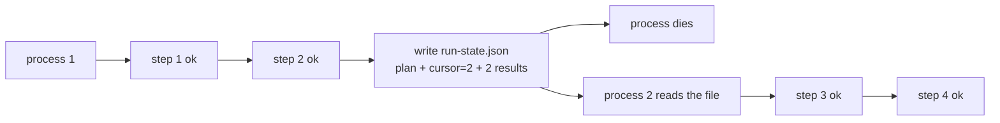

# 3.3 — A plan that outlives its process

## One-line answer

Because the plan is data and the executor's position in it is an integer, a half-finished run is
**957 bytes of JSON** you can open in a text editor — and a second process picks it up at step 3 and
finishes without re-running steps 1 and 2.

## The story

You are painting the spare room and you are four walls into a job that needs two coats.

Your brother-in-law arrives to help, and you have to go and collect someone from the station. So on
your way out you write on the back of an envelope and leave it on the tin:

*First coat done on all four walls. Ceiling not touched. Second coat next, start with the wall by
the window because it dried first. Don't open the new tin, there's enough in the old one.*

He reads it and carries on. He does not repaint the first coat. He does not have to ask you
anything.

Now imagine the note said *"I've done a fair bit, carry on."* He would have to work out what was
done by looking at the walls, which sounds fine until you remember that a first coat and a second
coat look identical when both are dry.

The note works because it says **where you stopped** and **what is already finished**. Those are two
different pieces of information and the note needs both.

## The idea in plain language

A run of a plan has exactly three pieces of state:

1. **The plan** — the steps, in order.
2. **The cursor** — how far through it you are. An integer.
3. **The results so far** — what the completed steps produced.

Write those three things down and the run is portable. A different process, on a different day, can
read them and continue. Nothing else about the run needs to survive: not the loop variable, not the
call stack, not the process.

This is only possible because of part
[1.1](../01-what-a-plan-is/1.1-a-plan-is-a-list-not-a-paragraph.md). A cursor is an index, and you
can only index into a list. Into a paragraph, "how far through are you" has no answer you can store.

Two terms, because Day 60 and Day 61 will use them constantly:

- **Checkpoint** — the written-down state of a run at a moment. What this part produces.
- **Resume** — starting from a checkpoint rather than from the beginning.

And one distinction that this part can state and cannot yet solve. Resuming is safe when the steps
already completed did not change anything outside the process. Steps that only *read* — looking up a
ticket, searching the knowledge base — can be skipped on resume with no consequence. A step that
*sent* something cannot be undone, and the question of whether it should be re-run on resume is a
genuinely hard one. Part
[6.3](../06-in-production/6.3-the-step-you-cannot-take-back.md) is about that class of step, and
Day 60 is where idempotency answers it properly.

## Why Sutra needs it

Day 60 opens Phase 9 with durable execution and Day 61 does checkpoints in ADK. Phase 9's gate is
*kill it mid-run; it resumes; a human approved the write* — and the thing that gets killed and
resumed is a triage run, which is a plan being walked.

Everything Day 60 builds needs a checkpoint format to make durable. This part writes the smallest
honest version of that format today, so that Day 60 starts from a file it can criticise rather than
from a blank page.

Day 63's approval gate needs the same mechanism for a different reason. When a plan pauses to wait
for a human, the run may wait for hours. Holding a process open for hours is not an option, so the
run is checkpointed and the approval arrives later — waiting is a state, not a blocked function
call.

## The mechanism

Start a run and stop it deliberately part-way through.

```bash
cd days/day-56-planning-and-replanning/lab
uv run python resume.py --start
```

**Line by line:**

- `--start` executes with `stop_after=2`, which is a stand-in for the process dying. It is a
  parameter rather than a real crash because this part is about the *format*; Day 60 does the real
  kill, and Day 65 does it with a signal.
- The state is written **after** the executor stops, to `run-state.json` beside the script.
- `--clean` removes the file, so the demo can be re-run from the top.

Measured on 2026-09-05:

```text
goal: Compare 4521 and 4610, then find the fix.

  step 1/4 lookup_ticket(4521) -> ok
  step 2/4 lookup_ticket(4610) -> ok

  process dies here. run-state.json holds cursor=2 and 2 result(s).
  run-state.json is 957 bytes of plain JSON you can open and read.
```

**957 bytes.** That is the whole of a half-finished agent run. Open it:

```json
{
  "goal": "Compare 4521 and 4610, then find the fix.",
  "steps": [
    {
      "action": "lookup_ticket",
      "argument": "4521",
      "why": "read the first ticket"
    },
    {
      "action": "lookup_ticket",
      "argument": "4610",
      "why": "read the second ticket"
    },
```

Now the second process:

```bash
uv run python resume.py --resume
```

**Line by line:**

- `--resume` reads the file, rebuilds the `Plan` from the step dictionaries, and calls the same
  `execute_from` the first run used — with `cursor` from disk instead of `0`.
- There is no special "resume mode" in the executor. Resuming is the ordinary loop started at a
  different index, which is the property that makes it worth having a cursor at all.

Measured on 2026-09-05:

```text
resumed from run-state.json: cursor at step 3 of 4, 2 result(s) already in hand

  step 3/4 compare(4521,4610) -> ok
  step 4/4 search_kb(KB-104) -> ok

  finished at step 4 of 4; 4 result(s) total
  the first two steps were not run again
```

Steps 1 and 2 did not run. The run finished with four results, two of which were carried across from
a process that no longer exists.

The code that makes the state portable is worth reading, because it is where the design decisions
are:

```python
def to_json(plan: Plan, cursor: int, done: list[str]) -> str:
    """The whole run, as text. This is the artefact Day 60 will make durable."""
    return json.dumps(
        {
            "goal": plan.goal,
            "steps": [
                {"action": s.action, "argument": s.argument, "why": s.why} for s in plan.steps
            ],
            "cursor": cursor,
            "done": done,
        },
        indent=2,
    )
```

**Line by line:**

- The plan is written out **in full**, not by reference. A checkpoint that points at a plan stored
  somewhere else is a checkpoint that breaks when that somewhere else changes — and a planner is
  not deterministic, so "re-plan it on resume" would produce a different plan.
- `cursor` is an `int` and it is the position of the **next** step, not the last completed one. Off
  by one here means either a step is skipped or a step is done twice, and the second one is the
  expensive mistake.
- `done` carries the results, so the resumed process has the evidence the first one gathered. Note
  what this costs: the checkpoint grows with every completed step, and on a long plan over large
  documents it grows fast. Day 60 has to deal with that; this part only has to make it visible.
- `indent=2` because a checkpoint nobody can read is a checkpoint nobody can debug, and the whole
  argument of section [1](../01-what-a-plan-is/1.1-a-plan-is-a-list-not-a-paragraph.md) is about
  being able to look at things.
- **What is missing** is the interesting part: there is no run id, no timestamp, and no version
  stamp. All three are in the *In production* section below, and their absence here is the setup
  for the failure in the next section.



## When it breaks

Resume the same checkpoint twice.

```bash
uv run python resume.py --start
uv run python resume.py --resume
uv run python resume.py --resume
```

Measured on 2026-09-05, the second resume:

```text
resumed from run-state.json: cursor at step 5 of 4, 4 result(s) already in hand


  finished at step 4 of 4; 4 result(s) total
  the first two steps were not run again
```

Exit code `0`.

Read the first line. **`cursor at step 5 of 4`** — a position past the end of the plan. The loop
condition `while cursor < len(plan.steps)` is false immediately, so nothing runs, and the script
reports `finished at step 4 of 4` and exits successfully.

Nothing is corrupted and no result is lost. That is exactly what makes it dangerous: **a completed
run is indistinguishable from a resumable one, and resuming it looks like success.**

Nothing in `run-state.json` says this run is over. There is no `status` field, so "already finished"
is not a state the format can represent — it has to be *inferred* from the cursor, and the only
place that inference happens is a loop condition that silently does nothing.

On a single machine with one terminal that is a curiosity. On a queue that redelivers a job because
a worker was slow, it is two workers each believing they have picked up a live run, each reporting
success, and neither able to tell that the other one did the work. Everything read-only is merely
wasteful; a step that sends something would send it twice. That is why Day 60's subject is
idempotency and not merely resumption.

## In production

**What a professional writes instead.** Four fields this checkpoint does not have, each fixing
something specific:

| Field | Fixes |
| --- | --- |
| `run_id` | Two resumes of the same run, and the *"is this the run I think it is?"* question |
| `status` | `running` / `done` / `failed`, so a completed run cannot be resumed at all — the bug above |
| `schema_version` | The code changed between checkpoint and resume, which is Day 61's subject |
| `updated_at` | A checkpoint nobody has touched for a day is a stuck run, and something should notice |

They also write the checkpoint **atomically** — to a temporary file, then rename — because a process
that dies *during* the write leaves a truncated JSON file, and a truncated checkpoint is worse than
no checkpoint: it looks resumable.

**What degrades at scale.** The `done` list. Every completed step appends its full result text, so
the checkpoint grows through the run, and on a plan whose steps return documents it grows fast. The
production move is to store results **by reference** — the checkpoint holds ids, the results live in
a store — which trades a smaller checkpoint for a second thing that has to still be there on resume.

**The failure that only appears with real traffic.** Two workers pick up the same checkpoint.
Nothing in a file on disk prevents it, and the moment your runs are in a queue rather than in a
terminal it will happen — a worker is slow, the job is redelivered, and now two processes are
executing the same plan from the same cursor. Everything read-only is merely wasteful. Any step that
sends something happens twice. That is the reason Day 60's subject is idempotency and not just
resumption.

**The review comment a senior engineer leaves:** *"This writes the checkpoint after the step. If the
process dies between the step succeeding and the write, the step is done and the cursor says it is
not, so on resume it runs again. Write the intent before and the result after, or make every step
idempotent — but pick one and say which, because right now the answer is 'whichever way it crashed'."*

**The interview question:** *"How would you make an agent run resumable?"* An honest answer: *"Make
the plan data, then the run is three things: the plan, an integer cursor and the results so far. I
wrote that to JSON and it was under a kilobyte for a four-step run, and a second process read it,
started at step three and finished without re-running the first two. What I got wrong the first time
is instructive — my checkpoint had no run id and no status, so resuming an already-finished run
'succeeded': it printed a cursor of step five of four, ran nothing, and exited zero. Nothing was
corrupted, which is what makes it bad; a completed run was indistinguishable from a resumable one. A
checkpoint needs an identity and a terminal state or it cannot tell a resume from a re-run.
And the deeper problem is that resumption is only free for steps that read. Any step that sent
something needs an idempotency key, because two workers pulling the same checkpoint off a queue is
not a hypothetical."*

## Check yourself

```bash
cd days/day-56-planning-and-replanning/lab
uv run python resume.py --clean
uv run python resume.py --start
cat run-state.json
uv run python resume.py --resume
```

Now run `--resume` a second time, write down the cursor it reports and the exit code, and say which
of the four fields in the production table would have made it refuse.

**Out loud, without scrolling up:** name the three pieces of state a run consists of, and say which
one of them only exists because the plan is a list.

**Next:** [3.4 — The same executor as an ADK workflow](3.4-the-same-executor-as-an-adk-workflow.md).
