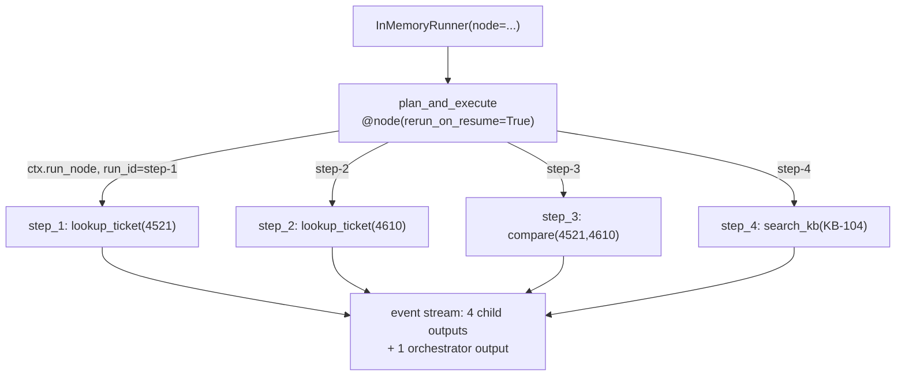

# 3.4 — The same executor as an ADK workflow

## One-line answer

ADK 2.x expresses a plan-walking executor as a **dynamic workflow** — an `async` function decorated
`@node(rerun_on_resume=True)` that calls `ctx.run_node()` once per step — and the same four steps run
through it with **zero model calls**, because a node is a unit of work and not a unit of
intelligence.

## The story

There are two ways to get across a city you do not know well.

One is the bus. The route is printed on the side and on the board at every stop: it goes from the
depot, along the main road, past the hospital, over the bridge, and terminates at the market. It
does that today, it did it yesterday, and you can read the whole thing before you get on. If you
want to know whether this bus passes the hospital, you look at the board.

The other is an auto. You tell the driver where you want to go and he decides at each junction. Left
here because the flyover is jammed, right there because there is a wedding on the next road. You
cannot read the route in advance because it does not exist in advance — it is being made as you go.

Neither is better. If you take the bus somewhere the bus does not go, no amount of good driving
helps. And if the roads change hourly, a printed board is a description of yesterday.

The thing to notice is that **the route being printable is a property you either have or you do
not**, and it is decided before anybody moves.

## The idea in plain language

Day 53 introduced the **graph Workflow Runtime**: nodes joined by edges, drawn before anything runs.
That is the printed route. It is the right shape for most of a system, and Day 58's triage graph is
built that way.

A plan is the other case. Its steps exist only at run time — the planner produced them from this
request, a moment ago — so there are no edges to draw in advance. You cannot build a graph node for
step 3 of a plan that has not been written yet.

ADK 2.x calls this a **dynamic workflow**, and its shape is:

- a normal `async` Python function, so ordinary control flow works: `for step in plan.steps`, `while
  not done`;
- decorated with `@node`, so the runtime knows it is a node;
- calling **`ctx.run_node(child, node_input)`** to execute each step as a child node, and awaiting the
  result.

Two terms defined here because they are ADK-specific and this is where they first bite:

- **Orchestrator** — the outer function. It decides what to run; it does not do the work itself.
- **`rerun_on_resume`** — a property of a node saying what happens when a run is interrupted and
  later resumed. Set to `True`, the node body **re-runs from the top** and already-completed children
  are skipped. The live documentation is explicit that an orchestrator calling `ctx.run_node` must
  set it.

**Trap #1 (plan §5.1) is what this part is avoiding**, and it is worth naming in words. In ADK 1.x
you would have reached for a workflow *agent* class and composed with `sub_agents`. In 2.x the graph
Workflow Runtime is the composition layer and agents are one node type among several — a plain
function is another. This executor has no agent in it at all, which in the 1.x mental model is a
strange sentence and in the 2.x one is unremarkable.

**Verified against `https://adk.dev/graphs/dynamic/` on 2026-09-05**, and against the installed
`google-adk==2.7.1` by introspection:

```bash
python -c "from google.adk.workflow import node; import inspect; print(inspect.signature(node))"
python -c "from google.adk import Context; import inspect; print(inspect.signature(Context.run_node))"
```

**Line by line:**

- The first command confirms `node` exists in `google.adk.workflow` and prints its real parameters,
  including `rerun_on_resume`, `timeout`, `retry_config` and `parameter_binding`. Principle 8: the
  signature comes from the installed package, not from memory.
- `Context` is imported from `google.adk` directly — **not** from `google.adk.workflow`, where it
  does not exist. That is a real import error waiting for anybody who guesses, and it is in *When it
  breaks* below.
- Run these before writing any of today's ADK code. If either signature has moved, stop and amend
  (Principle 14) rather than adapting quietly.

## Why Sutra needs it

Day 58 builds the triage graph as a static graph, because its five stages are known in advance. But
the *research* stage inside it is a plan: the tickets to look at depend on the ticket that arrived.
So the triage graph will contain a dynamic node, and this part is where that node's shape is
established.

Day 61 needs it more directly. `rerun_on_resume` is the mechanism behind pause and resume in ADK,
and part [3.3](3.3-a-plan-that-outlives-its-process.md) hand-rolled the same idea as a cursor in a
JSON file. Meeting the framework version *after* the hand-rolled one is Principle 4 at the scale of a
section: you now know what the framework is doing for you, because you did it yourself two parts ago.

## The mechanism

```python
@node(rerun_on_resume=True)
async def plan_and_execute(ctx: Context, node_input: str) -> str:
    """Walk a plan by calling one child node per step.

    `rerun_on_resume=True` is required by the docs for any orchestrator that calls
    `ctx.run_node`: on resume the body re-runs from the top and already-completed children are
    skipped, which is the mechanism Day 61 will take apart properly.
    """
    done: list[str] = []
    for i, step in enumerate(PLAN.steps, 1):
        result = await ctx.run_node(
            node(do_step, name=f"step_{i}", parameter_binding="node_input"),
            {"action": step.action, "argument": step.argument, "why": step.why},
            run_id=f"step-{i}",
        )
        print(f"  {i}/{len(PLAN)} {step} -> {result}")
        done.append(str(result))
    return f"{len(done)} step(s) executed for goal: {node_input}"
```

**Line by line:**

- `@node(rerun_on_resume=True)` — the decorator makes this function a node. `rerun_on_resume=True` is
  **required** for an orchestrator that calls `ctx.run_node`: the docs state that on resume the body
  re-runs from the top and already-completed child activations are skipped automatically. Compare
  part [3.3](3.3-a-plan-that-outlives-its-process.md), where *you* had to store a cursor and skip.
- `async def` with `ctx: Context` first and `node_input: str` second. `ctx` is the handle to the
  runtime; `node_input` is what the run was started with — here, the goal.
- `for i, step in enumerate(PLAN.steps, 1)` — **ordinary Python control flow.** That is the whole
  reason a dynamic workflow exists. In a static graph this loop would have to be edges, and there
  are no edges for steps that did not exist when the graph was drawn.
- `await ctx.run_node(...)` — always awaited directly. The installed docstring is explicit that
  wrapping it in `asyncio.create_task()` means the task runs unsupervised, errors are silently
  swallowed and it is not cancelled when the parent is interrupted. Swallowed errors are plan §5.1's
  **trap #4** exactly, so this is not a style note.
- `node(do_step, name=f"step_{i}", ...)` — `node` used as a *function* rather than a decorator, to
  wrap a plain callable and give it a per-step name. The underscore in `step_{i}` is load-bearing;
  see *When it breaks*.
- `parameter_binding="node_input"` — binds the child function's parameters **by name from the input
  dict**. The default is `"state"`, which binds them from `ctx.state` instead. Getting this wrong is
  the second error below.
- `run_id=f"step-{i}"` — a stable identity for each child run, so events can be correlated across
  runs. The documentation requires a custom `run_id` to contain at least one non-numeric character,
  to avoid colliding with auto-generated ids; `step-1` satisfies that and a bare `1` would not.
- The child, `do_step`, is a plain `async def` that calls the same `run_step` from `_world.py` that
  part [3.1](3.1-the-executor-is-a-loop-with-a-list.md) used. **No agent, no model.**

```bash
cd days/day-56-planning-and-replanning/lab
uv run python dynamic.py
```

**Line by line:**

- `InMemoryRunner(node=plan_and_execute, ...)` is the 2.x entry point for running a node, as opposed
  to `InMemoryRunner(agent=...)` for a single agent. A node is what the runtime drives.
- The script iterates `runner.run_async(...)` and collects each event's `output`, which is how you
  read what a workflow produced.

Measured on 2026-09-05:

```text
  1/4 lookup_ticket(4521) -> ok: Signed out mid-form. Customer fills the onboardi
  2/4 lookup_ticket(4610) -> ok: Session drops on redirect. After the identity pr
  3/4 compare(4521,4610) -> ok: compared 4521 and 4610
  4/4 search_kb(KB-104) -> ok: Cookies dropped on cross-site redirect. Set Same

  output: ok: Signed out mid-form. Customer fills the onboardi
  output: ok: Session drops on redirect. After the identity pr
  output: ok: compared 4521 and 4610
  output: ok: Cookies dropped on cross-site redirect. Set Same
  output: 4 step(s) executed for goal: Compare 4521 and 4610, then find the fix.
```

**Five outputs for four steps.** Each child node emits its own output event, and then the
orchestrator emits one of its own. That is worth noticing because it is the difference between the
hand-rolled loop and this one: the plain `for` loop in part
[3.1](3.1-the-executor-is-a-loop-with-a-list.md) produced print statements, and this one produces
**events the runtime can see**. Everything Phase 13 does with tracing, and everything Day 61 does
with resumption, works off that stream.

And the whole run cost **zero model calls.** Every node is a function. A node in ADK 2.x is a unit
of work; an agent is one kind of node, not the definition of one.



## When it breaks

Both of these were hit while writing this part, on 2026-09-05, against `google-adk==2.7.1`.

**A node name is a Python identifier.** The obvious name for the child of step 1 is `step-1`:

```text
pydantic_core._pydantic_core.ValidationError: 1 validation error for FunctionNode
name
  Value error, Node name 'step-1' must be a valid Python identifier. [type=value_error, input_value='step-1', input_type=str]
    For further information visit https://errors.pydantic.dev/2.13/v/value_error
```

The hyphen is the problem. It is worth noting that the *`run_id`* rule points the other way — a
custom `run_id` must contain a non-numeric character — so `name=f"step_{i}"` with `run_id=f"step-{i}"`
is not an inconsistency in the lab, it is two different rules being satisfied.

**`parameter_binding` decides where the arguments come from.** Write the child as
`async def do_step(node_input: dict)` and pass the dict, and you get:

```text
ValueError: Missing value for parameter "node_input" of function "step_1". It was not found in
node_input and has no default value.
```

The message reads like a contradiction until you know the rule. With `parameter_binding="node_input"`
the framework does not hand the dict to a parameter *called* `node_input` — it unpacks the dict and
binds **by name**, so the function must be `async def do_step(action: str, argument: str, why: str)`.
The fix is one signature.

And one you can reach without running anything, because the import is the natural guess:

```text
ImportError: cannot import name 'Context' from 'google.adk.workflow' (.../site-packages/google/adk/workflow/__init__.py)
```

`Context` lives at `google.adk`, not in the `workflow` submodule where `node`, `Workflow` and `Edge`
live. Confirm it rather than remembering it:

```bash
python -c "from google.adk import Context; print(Context)"
python -c "from google.adk.workflow import node, Workflow, Edge; print(node)"
```

**Line by line:**

- Two imports, two lines, run before writing code that depends on them. This is Principle 8's
  cheapest possible form.
- If either fails, the day's ADK section is wrong and the fix is to check `https://adk.dev/graphs/`
  and amend, not to hunt for a working import by trial.

## In production

**What a professional writes instead.** They pass `timeout` and `retry_config` to `node`, both of
which the installed signature accepts, so a step that hangs is a step that fails rather than a run
that stops. They also do not let the orchestrator's plan be a module-level constant as `dynamic.py`
does — the plan arrives as `node_input` or is read from state, because a hard-coded plan cannot be
resumed against a different request and cannot be tested with two different plans.

**What degrades at scale.** `rerun_on_resume=True` means the orchestrator body **re-executes from the
top** on every resume. Everything in that body outside `ctx.run_node` therefore runs again — every
log line, every counter, every side effect. An orchestrator that increments a metric at the top of
its loop will over-count on every resume, and nothing will look wrong. The rule is that an
orchestrator body should be *pure* apart from its `run_node` calls, and Day 61 takes this apart
properly.

**The failure that only appears with real traffic.** The docstring warns about it in one sentence:
`ctx.run_node` awaited directly is supervised, and wrapped in `asyncio.create_task()` it is not —
errors are silently swallowed and the task is not cancelled when the parent is interrupted. The
temptation to wrap it arrives the first time somebody wants two steps to run at the same time, which
is a reasonable thing to want and the wrong way to get it. Day 54 built the supported way.

**The review comment a senior engineer leaves:** *"This orchestrator does its printing and its
bookkeeping in the loop body with `rerun_on_resume=True`. Every resume replays all of it. Move
anything with an effect into a child node, or your logs will tell you a four-step plan ran nine
steps."*

**The interview question:** *"When would you use a dynamic workflow instead of a graph?"* An honest
answer: *"When the steps are decided at run time. A graph's edges are drawn before anything runs,
which is right for a pipeline whose stages I know — my triage flow is intake, classify, research,
draft, review, and that is a graph. A plan is the opposite: the planner produced the steps a moment
ago from this request, so there are no edges to draw. ADK's dynamic workflow is an async function
with the `@node` decorator that calls `ctx.run_node` per step, so I get ordinary Python control flow
and the runtime still sees each step as a node with its own events. The thing I would flag is
`rerun_on_resume=True`, which is required for any orchestrator that calls `run_node` and means the
body re-runs from the top on resume with completed children skipped — so the body has to be free of
side effects or you double-count them. And a node is not an agent: every node in mine is a plain
function and the whole run costs zero model calls."*

## Check yourself

```bash
cd days/day-56-planning-and-replanning/lab
uv run python dynamic.py
python -c "from google.adk import Context; import inspect; print(inspect.signature(Context.run_node))"
```

Now change `name=f"step_{i}"` to `name=f"step-{i}"` in `dynamic.py`, run it, read the `ValidationError`
in full, and put it back.

**Out loud, without scrolling up:** say why a plan cannot be a static graph, and state what
`rerun_on_resume=True` obliges you to keep out of the orchestrator's body.

**Next:** [4.1 — A shop shut for lunch and a shop closed
down](../04-when-a-plan-dies/4.1-a-shop-shut-for-lunch-and-a-shop-closed-down.md).
