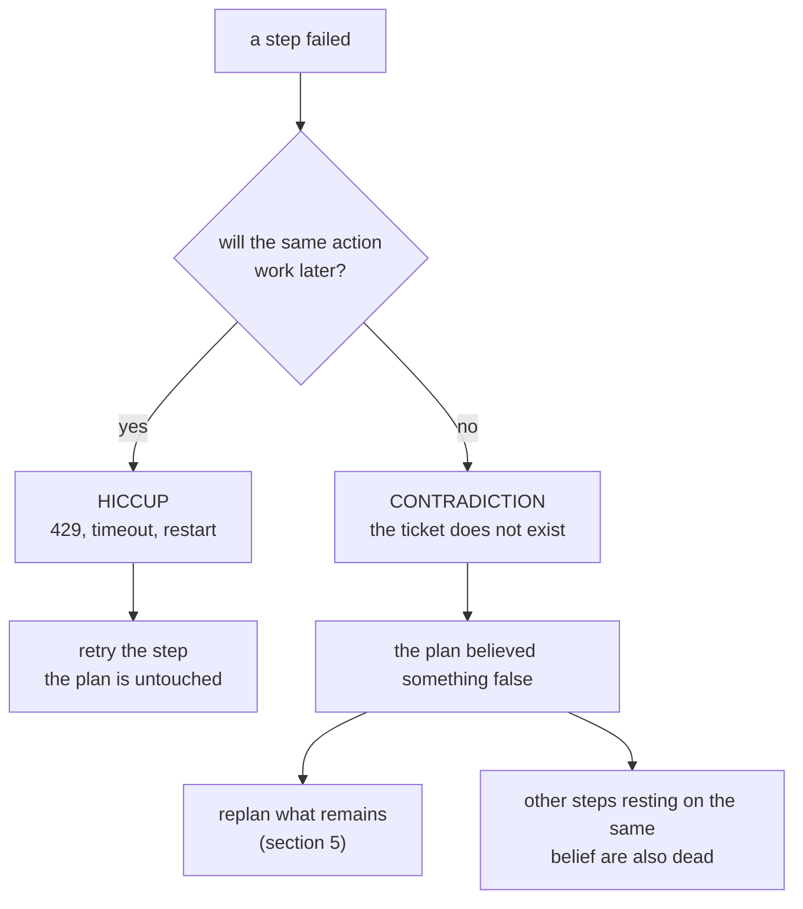

# 4.1 — A shop shut for lunch and a shop closed down

## One-line answer

A failed step is one of two completely different things — a **hiccup**, which a retry fixes, or a
**contradiction**, which no retry can ever fix — and of the six steps in the lab exactly one is the
first kind and three are the second.

## The story

You walk down to the shop at the corner for a bag of cement and the shutter is down.

There is a handwritten card taped to it: *back at 3*.

You go home, have lunch, come back at ten past three, and buy your cement. The shutter being down
was not information about cement. It was information about the time of day.

Two streets over there is another shop, and last month you walked to that one for the same thing and
the shutter was down there too. No card. You came back the next morning and it was still down. You
asked the man at the tea stall and he said they had shut down in April; the family moved.

You could go back to that second shutter every day for a year.

The two shutters look identical. Standing in front of one, the question that decides what you do
next is not *how hard did this fail* — both failed exactly the same amount — it is **will the same
action work later?**

## The idea in plain language

When a step in a plan fails, there are two kinds of failure and they need opposite responses.

- A **hiccup** is a failure of the moment. The service was rate-limited, the network dropped, the
  database was mid-restart. The step is fine. The world was busy. **Retry the step; the plan is
  untouched.**
- A **contradiction** is a failure of an assumption. The ticket does not exist. The article was
  renamed. The two things you were told to compare are not both real. **The step will never work, and
  the plan that contains it is built on something false.**

The word "contradiction" is doing real work here and is worth keeping. The step did not merely fail
— it *contradicted* something the plan believed. When the planner wrote `lookup_ticket(9999)`, it
believed ticket 9999 existed. That belief is now known to be false, and the belief may have been
load-bearing for other steps too.

That is the whole reason this distinction is the front half of replanning. A hiccup tells you
nothing about the plan. A contradiction is **information about the plan**, and section
[5](../05-the-second-edition/5.1-let-the-seam-out-or-recut-the-cloth.md) is about what to do with it.

The mistake to avoid is the one every system makes first: treating every failure as a hiccup,
because retrying is easy and classifying is work. Part
[4.2](4.2-retrying-a-contradiction.md) measures what that costs.

There is a third outcome — the step succeeded and told you nothing — and it is deliberately **not**
in this part, because it is not a failure at all as far as any of this machinery can see. Part
[4.3](4.3-the-step-that-worked-and-told-you-nothing.md) is about it.

## Why Sutra needs it

Day 44 hardened Sutra's MCP client with retries and timeouts, and Day 21 established that errors
surface rather than get swallowed. Both of those deal with hiccups, and neither of them has anything
to say about a contradiction — retrying a missing ticket with exponential backoff is exponential
patience applied to a fact.

Day 59 closes Phase 8 with runaway agents and containment, and a retry storm is one of the four
runaways it has to contain. The cheapest way not to have a retry storm is not to retry things that
cannot succeed, which is this part.

## The mechanism

`run_step` returns a two-tuple whose first element is the outcome, and there are three possible
values, not two:

```python
OK = "ok"
HICCUP = "hiccup"
CONTRADICTION = "contradiction"
```

**Line by line:**

- Three constants, defined once in `_world.py`, so no part of the lab compares against a string
  literal. A typo in `"contradiciton"` would otherwise be a silently-never-true branch.
- They are strings rather than an enum only because this is a teaching lab and the printed tables
  read better; the *In production* section says what to use instead.
- The important design point is that there are **three**. A boolean `succeeded` cannot express this,
  and an exception cannot either — an exception says something went wrong, and the question here is
  what *kind*.

```bash
cd days/day-56-planning-and-replanning/lab
uv run python classify.py
```

**Line by line:**

- `classify.py` runs six steps against the real world and prints the outcome of each, plus what that
  outcome deserves.
- The sixth case passes `flaky={"4610"}` to `run_step`, which makes that argument fail transiently
  once. That is how the lab produces a 429 without a network: a set of arguments that fail on their
  first attempt and clear afterwards.

Measured on 2026-09-05:

```text
step                     outcome         text                                         deserves
lookup_ticket(4521)      ok              Signed out mid-form. Customer fills the on   nothing; carry on
lookup_ticket(9999)      contradiction   no ticket with id '9999'                     replan what remains; retrying cannot make this true
search_kb(KB-104)        ok              Cookies dropped on cross-site redirect. Se   nothing; carry on
search_kb(KB-999)        contradiction   no article with id 'KB-999'                  replan what remains; retrying cannot make this true
compare(4521,9999)       contradiction   cannot compare; unknown ticket(s) ['9999']   replan what remains; retrying cannot make this true
lookup_ticket(4610)      hiccup          429 Too Many Requests on 4610; retry-after   retry this step; the plan is untouched

  2 ok, 1 hiccup, 3 contradiction
```

**One hiccup and three contradictions.** That ratio is the argument for classifying at all. If
failures were mostly hiccups, "retry everything" would be a reasonable policy with a small waste
tax. They are not.

Look at row 5 particularly, because it is the one that shows why a contradiction is information
about the *plan* rather than about the step. `compare(4521,9999)` failed — and 4521 is fine. The
step that failed is not the step whose assumption was wrong; the false belief was `9999 exists`, and
it has now taken down a second step that had nothing wrong with it. A retry of `compare` is
pointless, and so is a retry of anything else in the plan that mentions 9999. That is exactly the
reasoning part [5.1](../05-the-second-edition/5.1-let-the-seam-out-or-recut-the-cloth.md) automates.

Here is where the classification actually happens:

```python
    if step.action == "lookup_ticket":
        body = world.tickets.get(step.argument)
        if body is None:
            return CONTRADICTION, f"no ticket with id {step.argument!r}"
        return OK, body
```

**Line by line:**

- `world.tickets.get(...)` returning `None` is a **fact about the world**, not about the request that
  went to fetch it. That is what makes it a contradiction rather than a hiccup, and it is the whole
  of the classification rule: *did the world answer, and say no?*
- `{step.argument!r}` uses `repr` so the identifier appears quoted — `'9999'` — which matters when
  the argument is an empty string or has trailing whitespace, and the message would otherwise read
  `no ticket with id `.
- The hiccup, by contrast, is produced **before** any lookup happens, by the `flaky` check at the top
  of `run_step`. A transient failure is one where you never found out whether the thing exists,
  which is a genuinely different position to be in.



## When it breaks

The classification is a guess, and there is a category it gets wrong in the dangerous direction.

**A permission error looks like a contradiction and is not.** `no ticket with id '4521'` and *"you
are not allowed to see ticket 4521"* arrive at this code identically if the ticketing system returns
an empty result for records you cannot read — which many do, deliberately, so that an attacker
cannot enumerate ids. The plan then replans around a ticket that exists, and the agent tells a
support engineer there is no such ticket. It is confidently, plausibly wrong, and there is no error
anywhere.

**And a long outage looks like a contradiction too.** If the ticket service is down and returns
empty rather than raising, every lookup is a contradiction, the replanner drops every step, and the
run completes having decided that the entire archive does not exist.

Both of those come from the same root: this classifier infers the kind of failure from **the shape of
the answer**, and the answer for "not there", "not allowed" and "not available" is the same shape.

You can watch the second one happen. Empty the world's tickets and run the plan:

```text
  1/4 lookup_ticket(4521) -> contradiction
  2/4 lookup_ticket(4610) -> contradiction
  3/4 compare(4521,4610) -> contradiction
  4/4 search_kb(KB-104) -> ok
```

Three contradictions in a row, no exception, no traceback, and a run that will now replan itself
into a plan about the knowledge base alone. The signal that this is an outage rather than four
independent false beliefs is *the rate*, and nothing in this part looks at rates.

## In production

**What a professional writes instead.** They do not infer the kind from the message; they get it from
the transport. HTTP gives it away — `429` and `503` are hiccups, `404` is a contradiction, `403` is
neither and must be escalated rather than replanned around. So the step result carries a structured
error with a code, and the classifier is a table over codes with an explicit `unknown` branch that
escalates rather than guessing. `OK`/`HICCUP`/`CONTRADICTION` becomes an `enum.StrEnum`, so a
mistyped comparison is a `mypy` error rather than a branch that is never taken.

**What degrades at scale.** The clean two-way split stops being clean. A timeout is a hiccup on
attempt one and probably a contradiction by attempt five; a `429` with a `retry-after` of 60 seconds
is a hiccup you cannot afford. The production shape is a hiccup with a **budget** — retry while the
budget lasts, then reclassify as a contradiction and let the plan deal with it. Day 72 builds that
ladder properly.

**The failure that only appears with real traffic.** Correlated contradictions, exactly as above. In
testing, a missing ticket is one missing ticket. In production, a missing ticket usually means an
index rebuild is halfway through, and it arrives in hundreds. A classifier that looks at one step at
a time will replan hundreds of runs into nonsense, cheerfully, and the first sign is a support queue
full of confident denials. The countermeasure is a circuit breaker on the *rate* of contradictions
from one source — which is Day 59's containment machinery, applied here.

**The review comment a senior engineer leaves:** *"Everything that is not a success is being sorted
into two buckets by string matching on the tool's own message. Return a structured error from the
tool and switch on the code — and add a third bucket for 'I don't know', because a 403 is neither
retryable nor a fact about the world, and right now it becomes a fact about the world."*

**The interview question:** *"A step in your plan failed. What do you do?"* An honest answer: *"First
I decide which of two things it was. A hiccup — a 429, a timeout — means the step is fine and the
world was busy, so I retry the step and the plan is untouched. A contradiction — the ticket does not
exist — means the plan believed something false, and no amount of retrying makes it true, so the
right move is to revise the plan. In my own lab, six steps produced one hiccup and three
contradictions, so 'retry everything' would have been wrong three times out of four. The subtlety I
would raise is that a contradiction is information about the plan and not just the step: one of my
failures was a comparison of two tickets where only one was missing, so a perfectly good step died
of somebody else's false belief. And the way this classification goes wrong in production is a
permission error or an outage that returns empty — it looks exactly like 'does not exist', and the
agent then confidently reports that a real ticket is not there. That is why the error should carry a
status code rather than a message you pattern-match."*

## Check yourself

```bash
cd days/day-56-planning-and-replanning/lab
uv run python classify.py
```

Now add a seventh case to `CASES` in `classify.py` that is a hiccup on an argument that also does not
exist, and write down which outcome wins and why.

**Out loud, without scrolling up:** give the one question that separates a hiccup from a
contradiction, and name the two real-world failures that answer it wrongly.

**Next:** [4.2 — Retrying a contradiction](4.2-retrying-a-contradiction.md).
