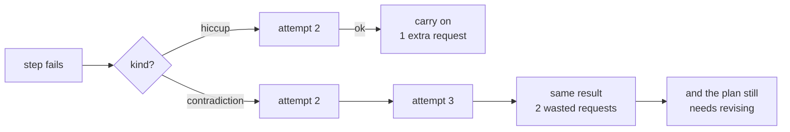

# 4.2 — Retrying a contradiction

## One-line answer

The hiccup clears on attempt 2 and the three contradictions are **identical on all three attempts** —
so a blanket retry policy spends two extra requests per contradiction to learn exactly what the first
attempt already said.

## The story

You are trying to return something and the address on the receipt is a house at the end of a lane.

You ring the bell. Nothing. You wait, ring again. Nothing. You step back and look up at the windows,
and ring a third time, holding it longer, because a longer ring might carry further into the house.

A woman walking past stops and says: *"They moved out in March. It's empty."*

Every one of those three rings was a reasonable thing to do while you believed somebody lived there.
None of them was going to work, and the third one was not more likely to work than the first. What
you needed was not a longer ring. It was the sentence from the woman.

The interesting thing is that ringing twice is a perfectly good policy for a house somebody lives in.
People are in the shower. The bell is quiet. Persistence is right — right up until the moment the
building is empty, at which point persistence is the only thing standing between you and finding out.

## The idea in plain language

Part [4.1](4.1-a-shop-shut-for-lunch-and-a-shop-closed-down.md) named the two kinds of failure. This
part is about what happens when you do not tell them apart and apply the easy policy to both.

The easy policy is **retry with backoff**, and it is easy for a good reason: Day 44 built it into
Sutra's MCP client, Day 21 established that errors surface, and Addendum 02 requires that every model
call path handles `429` with `retry-after` and backoff. Retrying is not sloppiness. It is the correct,
mandated response — to a hiccup.

Applied to a contradiction, the same policy has three costs, and they are worth separating because
only the first one is obvious:

1. **Wasted requests.** Every retry of a step that cannot succeed is a request spent learning
   nothing. On a free tier of twenty a day, that is measurable in tickets not handled.
2. **Wasted time before the useful action.** The plan needs revising, and every retry is delay before
   the revision starts. With exponential backoff — 1s, 2s, 4s, 8s — three retries of a dead step is a
   quarter of a minute of deliberately doing nothing about a problem you already have the answer to.
3. **A false signal.** A system that retries everything cannot report *why* things fail, because its
   metric is attempts and its attempts are dominated by things that were never going to work. You
   lose the ability to notice that contradictions are rising, which is exactly the signal part
   [4.1](4.1-a-shop-shut-for-lunch-and-a-shop-closed-down.md) said would tell you about an outage.

The rule this part argues for is short: **retry a hiccup; classify a contradiction and hand it to the
replanner.** The measurement below is what makes it a rule rather than an opinion.

## Why Sutra needs it

Day 59 has to contain a **retry storm** — the runaway where every layer retries the layer below, so
three retries at three layers is twenty-seven attempts. The largest single contributor to a retry
storm is retrying things that can never succeed, because those retries always run to their full
budget: a hiccup stops the ladder early by succeeding, and a contradiction never does.

Day 72 builds the honest backoff ladder — `retry-after`, 1→2→4→8s, escalate after N. This part is
what tells that ladder which failures it is allowed to be applied to.

## The mechanism

```bash
cd days/day-56-planning-and-replanning/lab
uv run python classify.py --retry
```

**Line by line:**

- `--retry` takes each failing case from part
  [4.1](4.1-a-shop-shut-for-lunch-and-a-shop-closed-down.md) and attempts it three times, printing
  the outcome of each attempt.
- The `remaining = set()` line after the first attempt is what makes a hiccup transient: the flaky
  set is cleared, so a second attempt on the same argument finds a world that is no longer busy. That
  is a stand-in for a `429` clearing, and it costs no network.
- Three attempts rather than two, because two attempts cannot distinguish "cleared on retry" from
  "cleared eventually" and the shape of the table is the argument.

Measured on 2026-09-05:

```text
Retrying each failing step three times, and counting how many succeed.

step                     kind            attempt 1       attempt 2       attempt 3
lookup_ticket(9999)      contradiction   contradiction   contradiction   contradiction
search_kb(KB-999)        contradiction   contradiction   contradiction   contradiction
compare(4521,9999)       contradiction   contradiction   contradiction   contradiction
lookup_ticket(4610)      hiccup          hiccup          ok              ok
```

Read the last row first, because it is the row that justifies retrying at all. `lookup_ticket(4610)`
failed, was retried, and **worked**. One extra request bought a step that would otherwise have taken
down the plan. Any policy that does not retry this is worse than one that does.

Now read the three rows above it. Nine attempts. Nine identical results. Attempt 3 of
`lookup_ticket(9999)` returned exactly what attempt 1 returned, and cost exactly as much.

**Six wasted requests to learn nothing**, on a six-step plan, on a free tier of twenty requests a
day. And that is with a modest retry count of three; a system with five retries wastes twelve.

The row worth looking at hardest is the third: `compare(4521,9999)`. It is retried three times and
fails three times, and 4521 exists. Nothing about `compare` is broken. It is being retried because
its *inputs* were wrong, and no number of attempts changes an input. This is the clearest case that
retry is the wrong tool — the thing that needs to change is the plan, and the plan is not what is
being retried.

The policy this suggests is two lines:

```python
if outcome == HICCUP:
    retry(step)
elif outcome == CONTRADICTION:
    replan(plan, failed=step, reason=text)
```

**Line by line:**

- Two branches, both explicit. There is no `else` that quietly does one or the other, because a
  third outcome should be a loud failure rather than a default.
- `retry(step)` takes the **step**. The plan is not involved and does not change; this is a local
  repair.
- `replan(plan, failed=step, reason=text)` takes the **plan**, the step that died and why. All three
  are needed: section [5](../05-the-second-edition/5.1-let-the-seam-out-or-recut-the-cloth.md)'s
  replanner has to know what was believed, what disproved it, and what else was resting on it.
- Note what is *not* here: a retry of a contradiction with a longer backoff, and a replan on a
  hiccup. The second of those is the mirror-image mistake and it is worse, because it burns a
  planning request to route around a service that was busy for a second.



## When it breaks

The mirror-image mistake is the one that actually reaches production, because it is invisible.

Classify a hiccup as a contradiction and the system does not fail — it **replans**. A perfectly good
step is dropped from the plan because the service was busy for one second, the second edition routes
around a ticket that exists, and the run finishes with an answer that is missing something. No error
is raised, no retry budget is exceeded, and the log says the replanner did its job.

That is the failure this part cannot demonstrate with a table, because there is no output to show:
the run succeeds. What it costs is one request more than a retry would have, and one piece of
evidence.

And there is a break in the classification's own foundation, visible in the measurement above. Look
at how the hiccup is produced:

```text
429 Too Many Requests on 4610; retry-after: 2
```

`retry-after: 2` is in the message, and nothing in this lab reads it. The lab retries immediately.
A real client that ignores `retry-after` and retries immediately gets another `429`, and another,
and has now built the retry storm Day 59 exists to contain — while classifying correctly at every
step. **Classifying right and retrying wrong is still wrong**, which is why this part hands the
ladder itself to Day 72 rather than pretending three immediate attempts is a policy.

## In production

**What a professional writes instead.** The retry lives in the client, not in the executor —
Day 44 put it there for Sutra's MCP calls, and the executor's job is to receive an already-retried
result and route it. That keeps the backoff in one place, where `retry-after` is honoured and jitter
is applied. The executor sees a hiccup only when the client has exhausted its budget, and at that
point the honest reclassification is *this is now a contradiction*, because for the purposes of this
plan it will not succeed.

**What degrades at scale.** Retry budgets multiply through layers. The tool retries, the client
retries, the executor retries, and each is individually reasonable at three. Day 59 measures what
that becomes. The discipline that holds is **one retrying layer**, named, with the others explicitly
passing failures through.

**The failure that only appears with real traffic.** Retries are correlated. The reason your request
got a `429` is that everyone's did, so every run retries at the same moment, and the retry wave is
larger than the original wave. Without jitter this is self-amplifying, and it is why every real
backoff ladder randomises. The lab's immediate retry is the pathological version of this and is
called out above rather than hidden.

**The review comment a senior engineer leaves:** *"The `retry-after` header is in the failure message
and nothing reads it. Either honour it or stop retrying — an immediate retry against a rate limiter
is not a retry, it is a second request into the same closed door, and you will find this the day
traffic doubles."*

**The interview question:** *"What is wrong with just retrying everything?"* An honest answer: *"It
applies the right policy to the wrong kind of failure. I measured six failing steps three times
each: the one transient failure cleared on attempt two, which is exactly what retrying is for, and
the three contradictions returned byte-identical results on all three attempts — six requests spent
to learn what the first attempt already said, on a free tier of twenty a day. The one I would point
at is a comparison step that failed because one of its two inputs did not exist: nothing about that
step is retryable, because what is wrong is the plan's belief, not the call. And the mistake in the
other direction is worse and quieter — classify a busy service as a contradiction and you replan
around a ticket that exists, and the run succeeds with a hole in it. There is no error to find
afterwards, which is why the classification wants a status code rather than a guess."*

## Check yourself

```bash
cd days/day-56-planning-and-replanning/lab
uv run python classify.py
uv run python classify.py --retry
```

Now count the requests a five-retry policy would spend on the three contradictions above, and write
that number next to the free-tier daily limit from part
[2.4](../02-two-ways-to-decide/2.4-what-a-plan-costs-in-requests.md).

**Out loud, without scrolling up:** say what a retry does to a contradiction, and describe the
mirror-image mistake and why it is harder to notice.

**Next:** [4.3 — The step that worked and told you nothing](4.3-the-step-that-worked-and-told-you-nothing.md).
