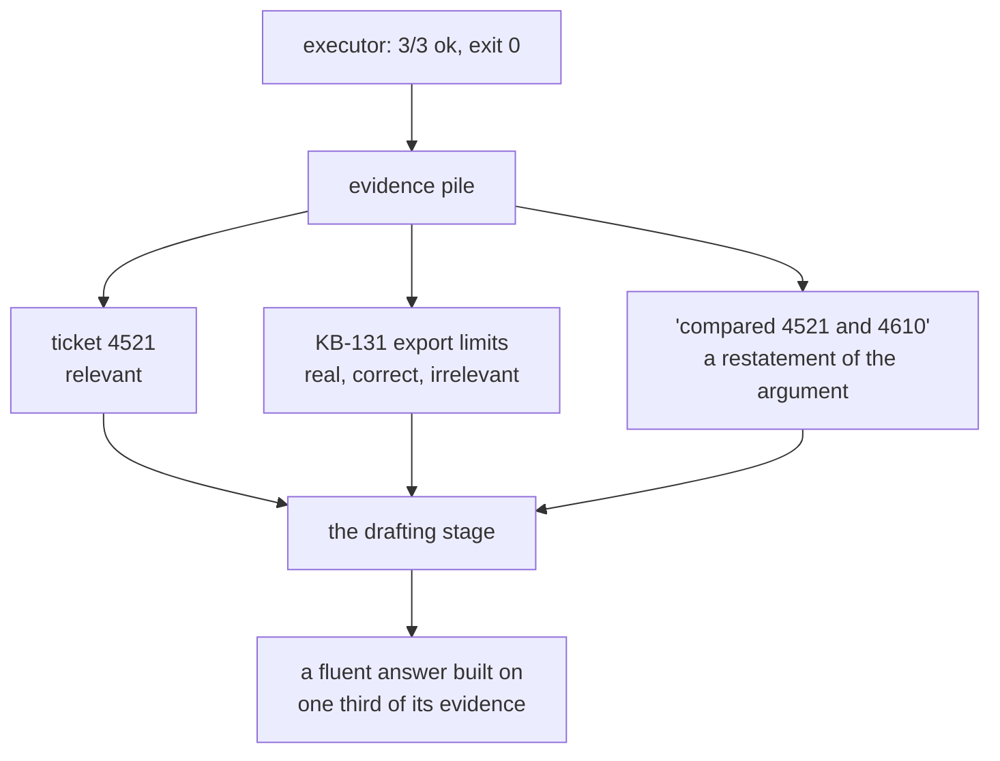

# 4.3 — 💥 The step that worked and told you nothing

## One-line answer

Three steps succeed, the executor reports **3 of 3**, and only **1 of 3** returned anything the goal
could use — a failure with no error, no exit code and no way for an executor whose definition of
failure is *"the step raised"* to see it.

## The story

You are looking for a house in an area you do not know and the lane numbers have stopped making
sense.

You stop a man on a scooter and ask where 14B is.

He says: *"Yes yes, that side."* He waves at roughly half the horizon and drives off.

The exchange worked. You asked a question, a human being answered you politely and promptly, and
nobody was rude. If you were counting interactions you would count one successful interaction.

You still do not know where the house is. You know slightly less than you did, in fact, because you
have now committed to a direction on no evidence.

Ask two more people, get two more *"that side"*s, and you have three successful conversations and a
growing confidence that is not attached to anything.

## The idea in plain language

Part [4.1](4.1-a-shop-shut-for-lunch-and-a-shop-closed-down.md) split failures into two kinds. This
part is about a third outcome that is not a failure at all by any mechanical definition:

**The step ran, returned real data, and the data has nothing to do with the goal.**

There is no error. No exception, no non-zero status, no empty result. `search_kb("KB-131")` returns
a genuine knowledge base article, correctly, quickly. The article is about export rate limits and
the goal is about a customer losing an onboarding form.

This is worth separating from the two failures in part 4.1 because the responses are all different:

| Outcome | Detectable by | Response |
| --- | --- | --- |
| hiccup | the error | retry the step |
| contradiction | the error | replan around the false belief |
| **uninformative success** | **nothing the executor owns** | **check the result against the goal** |

The third row is the one this day keeps coming back to. An executor's definition of failure is *the
step raised*, and every mechanism built on that definition — retry, replan, escalate — is blind to a
step that did not raise.

And the consequence is not "one wasted step". It is that the uninformative result **goes into the
evidence pile** and is handed to whatever writes the final answer, alongside the results that were
useful. A model given one relevant ticket and two irrelevant facts will write a fluent paragraph
using all three, because that is what it is for.

Day 50 met the same shape from the retrieval side. Its `hit@k` said the right document was found
and its `answered@k` said the returned text did not contain the answer, and the gap between them was
the whole day. This is that gap, one layer up: **the step succeeded and the run is no better off.**

## Why Sutra needs it

Part [6.1](../06-in-production/6.1-every-step-ran-and-nothing-was-answered.md) is the whole-run
version of this failure — every step succeeded and the question is unanswered — and it is the guard
Sutra actually ships. This part is the per-step version, and it is here because the run-level check
cannot tell you *which* step let you down, and the per-step check can.

Day 58's triage graph has a research stage whose entire job is to gather evidence for the drafting
stage. If research can succeed while gathering nothing useful, the draft stage receives a full
evidence pile and a hopeless question, and it will still write a reply — confidently, to a customer.
Principle 10 says errors surface and are never covered by a fabricated result; an uninformative
success is the most polite possible way to break that principle.

## The mechanism

The lab runs a three-step plan against a goal, and adds one column the executor does not have: did
the returned text contain any word the goal needs?

```python
GOAL_WORDS = {"form", "onboarding", "session", "cookie", "sign", "redirect"}


def useful(text: str) -> bool:
    """True when the returned text contains any word the goal actually needs."""
    lowered = text.lower()
    return any(word in lowered for word in GOAL_WORDS)
```

**Line by line:**

- `GOAL_WORDS` is written **with the goal**, before the plan. That ordering is the only thing that
  makes this a check rather than a rationalisation, and it is the same discipline as Day 50's gold
  set and part [1.3](../01-what-a-plan-is/1.3-the-plan-you-can-read-before-it-runs.md)'s answer key.
- `any(word in lowered ...)` — substring matching, deliberately crude. This is the weakest possible
  version of the check and it is still enough to catch the failure, which is the point: the
  objection *"a real relevance check is hard"* is true and does not excuse having none.
- It returns a `bool` per step rather than a score, because what this part needs to show is a count
  — one of three — and part [6.1](../06-in-production/6.1-every-step-ran-and-nothing-was-answered.md)
  is where it becomes a run-level verdict with an exit code.

```bash
cd days/day-56-planning-and-replanning/lab
uv run python silent.py --useless
```

**Line by line:**

- `--useless` runs the three-step plan. The other arm, `--stale`, is part
  [4.4](4.4-the-plan-that-outlived-the-world.md) and is a different silent failure.
- The plan is hand-written at the top of `silent.py`, with `search_kb(KB-131)` chosen deliberately:
  KB-131 is a real article, so this is not a missing-record failure in disguise.

Measured on 2026-09-05:

```text
goal: Why does the customer keep losing the onboarding form?

  1/3 lookup_ticket(4521)  ok     informative=True  Signed out mid-form. Customer fills the onboarding f
  2/3 search_kb(KB-131)    ok     informative=False Export rate limits are contractual. Raising one need
  3/3 compare(4521,4610)   ok     informative=False compared 4521 and 4610

  steps that succeeded : 3/3
  steps that told you  : 1/3
```

**Three of three succeeded. One of three said anything.**

Every `outcome` column reads `ok`. Nothing raised. The exit code is zero. A dashboard counting step
success rate reports 100%.

Take the two failing rows separately, because they fail for different reasons and both are common.

**Row 2 fetched the wrong thing correctly.** `KB-131` exists and its text is accurate — export rate
limits genuinely are contractual. It is simply not about onboarding forms. This is the planner's
mistake surfacing at execution time, and note that part
[1.3](../01-what-a-plan-is/1.3-the-plan-you-can-read-before-it-runs.md)'s coverage check would *also*
have missed it, because coverage asks whether the plan touched the required things and this plan
touched a knowledge base article. It touched the wrong one.

**Row 3 returned a summary of its own arguments.** `compared 4521 and 4610` contains no information
that was not already in the step. This is part
[3.2](../03-walking-the-plan/3.2-what-a-step-is-allowed-to-see.md)'s dependency failure arriving as
evidence: the step was handed no ticket text, so it had nothing to compare, so it reported the fact
of having been asked.

Now put yourself downstream. The drafting stage receives three results. One is a real ticket about a
customer being signed out mid-form. Two are about export rate limits and a comparison. It will write
something, and the something will be fluent, and one third of its evidence will be load-bearing.



## When it breaks

The check itself breaks in the direction that makes it useless, and it is worth seeing rather than
assuming.

`useful()` is substring matching over six words. Give it a result that mentions a goal word in
passing and it passes. `KB-140` — *"Mail deliverability. Ask the customer to allowlist the sending
domain."* — contains none of the six, so it would be caught. But an article that happened to contain
the word `session` while being about something else entirely would sail through, and the check would
report `informative=True` for a step that told you nothing.

The other direction is worse in practice. Set the goal words too tightly and every step is
uninformative, the guard fires on every run, and within a week somebody disables it. A relevance
check with a false-positive rate nobody has measured is a check with a short life.

So the honest statement of this part's limit: **the detection is crude and the phenomenon is real.**
The three-of-three-succeeded, one-of-three-informative result does not depend on the quality of
`useful()` — you can read the three result texts yourself and get the same answer. What depends on
it is whether this can be *automated*, and at this quality it cannot be. Part
[6.1](../06-in-production/6.1-every-step-ran-and-nothing-was-answered.md) moves the check to the
run level, where it is a single judgement about a whole goal rather than six words against every
step, and where it is honest enough to ship.

## In production

**What a professional writes instead.** They do not check relevance per step with a word list. Two
things replace it. First, a **contract per action**: `search_kb` must return an article whose subject
matches the classification the run is working under, and that is a comparison of two fields rather
than a search for words. Second, an **evidence budget with attribution** — the final answer must cite
which results it used, and a result cited by nothing is flagged. That second one turns an
undetectable problem into a countable one, and it is the same move Day 50 made when it added a
second column.

**What degrades at scale.** Irrelevant-but-successful results accumulate, and they are cheap
individually and expensive together. Twenty steps producing twelve useful results means the drafting
prompt carries eight irrelevant blocks, which is Day 50's top-k dilution and Day 19's *Lost in the
Middle* problem arriving through a different door. The evidence pile needs a filter for the same
reason a retrieval result needs a `k`.

**The failure that only appears with real traffic.** It is invisible in aggregate, and it is
correlated with exactly the questions you care about. A simple ticket produces a plan whose steps are
obviously right, and everything is informative. A hard ticket — the one that has been escalated
twice — produces a plan with speculative steps in it, and those are the ones that come back
uninformative. So the failure rate is highest on the tickets where the cost of a confident wrong
answer is highest, and your step success rate is 100% throughout.

**The review comment a senior engineer leaves:** *"Every step here returns `ok` and two of the three
returned nothing usable. Add a per-result usefulness signal — even a weak one — and put it in the
log, because right now the only place this shows up is in a customer's reply and you will hear about
it from them."*

**The interview question:** *"What kinds of failure does a retry not fix?"* An honest answer: *"The
one that isn't a failure. I ran a three-step plan where every step returned `ok` and the executor
reported three of three, and only one of the three results contained anything the goal needed — one
step fetched a real knowledge base article about the wrong subject, and another returned a summary of
its own arguments. There is nothing for a retry or a replan to act on, because nothing went wrong by
any definition the executor owns. It is the same gap I met on the retrieval day: the document was
found and the text did not contain the answer. The fix is a second column — check the result against
the goal, not just the outcome against zero — and the honest caveat is that a good relevance check is
hard, so I would run it at the level of the whole run rather than per step, where it is one judgement
instead of six brittle ones."*

## Check yourself

```bash
cd days/day-56-planning-and-replanning/lab
uv run python silent.py --useless
```

Now change `GOAL_WORDS` in `silent.py` to include `limits`, re-run, and write down what happens to the
`informative` column — and whether the run got any better.

**Out loud, without scrolling up:** name the three outcomes a step can have, say which of them the
executor can detect, and explain why the third one is worse than a step that raised.

**Next:** [4.4 — The plan that outlived the world](4.4-the-plan-that-outlived-the-world.md).
