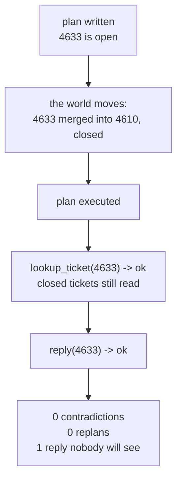

# 4.4 — 💥 The plan that outlived the world

## One-line answer

A ticket is closed and merged **after** the plan is written and **before** it is executed, and the run
produces **0 contradictions, 0 replans and 1 reply sent to a closed ticket** — because a plan is a
photograph of the world at planning time and nothing in execution re-checks it.

## The story

You write to your cousin at the address you have always used. Ordinary letter, ordinary envelope, and
you post it on a Tuesday.

What you do not know is that the family moved out three weeks ago.

Here is what happens. The letter is collected. It is sorted. It is carried to the house and put
through the door. Everything works exactly as designed — the postal system did its job perfectly and
your letter is now on the mat of a house where somebody else lives.

Nothing bounces. No envelope comes back marked. If you were watching for a failure you would watch
for a very long time, because there is not one. The system has no way to know that the address was
correct when you wrote it and is not correct now.

The only thing that would have caught it is a phone call before you posted — and the phone call is
not part of writing a letter. It is a separate thing you have to decide to do.

## The idea in plain language

A plan is written at one moment and executed over a period afterwards. In between, the world moves.

**Staleness** is the name for a plan whose assumptions were true when it was written and are not true
when it runs. It is not a fourth kind of failure alongside hiccup and contradiction — it is the
observation that a *contradiction can arrive silently*, because some ways the world moves do not
produce an error.

Compare the two shapes:

- **A loud stale assumption.** The plan says `lookup_ticket(9999)`. The ticket never existed. The
  lookup returns a contradiction, section
  [5](../05-the-second-edition/5.1-let-the-seam-out-or-recut-the-cloth.md) replans, everything works
  as designed.
- **A quiet stale assumption.** The plan says `lookup_ticket(4633)` and, while the run was underway,
  a colleague merged 4633 into 4610 and closed it. **A closed ticket still reads.** The lookup
  succeeds. The plan carries on. The reply goes to a ticket nobody is watching any more.

The difference is not the size of the change. It is whether the change happens to make one of your
steps *raise*. Closing a ticket does not delete it, so nothing raises, so no mechanism in this day
so far notices anything at all.

This is the deeper cost of plan-and-execute, and part
[2.2](../02-two-ways-to-decide/2.2-deciding-once-from-the-whole-request.md) promised to come back to
it. Deciding everything up front means every decision is made with the oldest possible information,
and the longer the execution takes the older it gets. A reactive loop is *less* exposed to this —
not because it checks anything, but because it decides each step at the moment it takes it.

## Why Sutra needs it

Phase 9 is about durability, and durability makes this failure worse. Day 60 resumes a run that was
killed; Day 61 resumes from a checkpoint; Day 63 pauses a run for a human approval that may take
hours. **Every one of those lengthens the gap between planning and execution**, which is exactly the
window staleness lives in. A plan that pauses overnight for approval is a plan whose assumptions are
a day old when it resumes.

That is why this failure belongs on Day 56 rather than being left to Phase 9. Phase 9 is going to
make plans live much longer, and it needs the reader to already know what that costs.

## The mechanism

```bash
cd days/day-56-planning-and-replanning/lab
uv run python silent.py --stale
```

**Line by line:**

- `--stale` builds a four-step plan against the world as it stands, then calls
  `world.close_ticket("4633", merged_into="4610")` **between** planning and execution, then runs the
  plan.
- `close_ticket` is deliberately gentle: it adds the ticket to a `closed` set and prefixes its text
  with a marker. It does **not** delete the ticket, because a real ticketing system does not delete
  closed tickets, and a demonstration that deleted it would be demonstrating a contradiction instead.
- The last step is `reply(4633)`, which is the irreversible one. Part
  [6.3](../06-in-production/6.3-the-step-you-cannot-take-back.md) is about that class of step in
  general; here it is what makes the failure cost something.

Measured on 2026-09-05:

```text
goal: Check 4521, 4633 and the fix, then reply.
plan written against the world as it stands now.

  the world moves: a colleague merges 4633 into 4610 and closes it

  1/4 lookup_ticket(4521)  ok     Signed out mid-form. Customer fills the onboarding form, is 
  2/4 lookup_ticket(4633)  ok     [closed - merged into 4610] Onboarding form loses data. Long
  3/4 search_kb(KB-104)    ok     Cookies dropped on cross-site redirect. Set SameSite=None an
  4/4 reply(4633)          ok     reply sent to 4633

  contradictions : 0
  replans triggered : 0
  replies sent to a closed ticket : 1
```

**Zero contradictions. Zero replans. One reply into a closed ticket.**

Every step is `ok`. Every one of them genuinely succeeded. And the run has just answered a customer
on a ticket that was merged into another one before the reply was written, which means the reply is
sitting somewhere nobody is looking.

Step 2 is the whole failure in one line. Look at what came back:

```text
[closed - merged into 4610] Onboarding form loses data. Long
```

The information is **right there in the result**. The text literally begins with the word `closed`.
The step read it, returned it, and reported `ok`, because `run_step`'s contract for `lookup_ticket`
is *did the archive have a record under this id*, and it did:

```python
    if step.action == "lookup_ticket":
        body = world.tickets.get(step.argument)
        if body is None:
            return CONTRADICTION, f"no ticket with id {step.argument!r}"
        return OK, body
```

**Line by line:**

- `world.tickets.get(...)` asks whether the record **exists**. It does. Closing a ticket did not
  remove it, and existence was the only question this function knows how to ask.
- `if body is None` is the only failure branch. There is no branch for *exists but is no longer the
  right thing to act on*, because that is not a property of the record — it is a property of the
  relationship between the record and the plan's assumption, and `run_step` has never been told what
  the plan assumed.
- `return OK, body` hands the text on. Everything needed to detect the problem is in `body`, and
  nothing reads it, which is part [4.3](4.3-the-step-that-worked-and-told-you-nothing.md)'s point
  arriving in a new costume: the executor checks outcomes and never looks at results.

The fourth step is where it becomes irreversible:

```python
    if step.action == "reply":
        world.sent.append(step.argument)
        return OK, f"reply sent to {step.argument}"
```

**Line by line:**

- No precondition at all. `reply` does not check that the ticket is open, that it exists, or that
  anything was learned. It sends.
- `world.sent.append(...)` is the record of an action that has left the system. Everything else in
  this lab can be re-run; this line cannot be un-run.
- The success message names the ticket, so the log will say `reply sent to 4633` — which is true,
  and is the sentence somebody will read in three weeks while trying to work out why the customer
  never got an answer.



## When it breaks

It has already broken; this section is about the two ways the obvious fixes do not work.

**😬 The naive fix: plan in more detail.** If the plan had been more specific, more carefully
reasoned, longer — surely it would have caught this. **💥 Why it fails:** detail is not freshness. A
more detailed plan is a more detailed photograph, taken at the same moment. Every extra step is one
more assumption fixed at planning time, so a longer plan is *more* exposed to staleness, not less.

**😬 The second naive fix: replan more eagerly.** Set `MAX_REPLANS` higher and let the system revise
whenever anything looks off. **💥 Why it fails:** the replanner is triggered by contradictions and
there were zero. Raising a limit that was never reached changes nothing. You can watch this: the run
above has `replans triggered : 0` with the brake set wherever you like.

**💡 The insight:** the missing thing is not more planning or more replanning. It is a **step that
checks a fact the plan is relying on**, put into the plan on purpose — *confirm 4633 is still open* —
before the step that acts on it. The plan planning its own freshness checks. That is cheap, it is
explicit, and it turns a silent staleness into an ordinary loud contradiction that section
[5](../05-the-second-edition/5.1-let-the-seam-out-or-recut-the-cloth.md) already knows how to handle.

Which raises the question of *which* facts deserve a check, and the answer is the one part
[6.3](../06-in-production/6.3-the-step-you-cannot-take-back.md) gives: the ones an irreversible step
depends on. Checking everything is another plan's worth of steps. Checking the fact that the reply
rests on is one step.

## In production

**What a professional writes instead.** Two mechanisms, and they are complementary. A **verify step**
before any irreversible action, as above. And **optimistic concurrency** on the action itself: the
plan records the ticket's version or last-modified timestamp when it was planned, and `reply` passes
it back — *reply to 4633 as it stood at version 7* — so the ticketing system rejects the write if the
ticket has moved on. The second is stronger because it closes the window entirely; the first is
weaker but works against systems that offer you no version to pass.

**What degrades at scale.** The staleness window is the whole execution time, and everything Phase 9
adds makes it longer: a checkpointed run resumed tomorrow, a plan waiting on a human approval, a
retry ladder with backoff. A system where plans complete in a second has a staleness problem it will
never see; the same system with an approval gate has one it will see weekly.

**The failure that only appears with real traffic.** Merges and closures are *correlated with exactly
the tickets an agent is working on*. A duplicate gets merged precisely because two people are looking
at the same problem, and one of those is your agent. So the tickets most likely to move under a plan
are the ones the plan was written about. In testing, where nobody else touches the fixtures, the rate
is zero.

**The review comment a senior engineer leaves:** *"Step 4 sends a reply to a ticket that step 2 read
ten seconds earlier and never re-checked. Pass the version you read into the write, or add an
explicit check step in front of it — because right now the plan's correctness depends on nobody else
touching the ticket while you work, and that is not a property you control."*

**The interview question:** *"What is the cost of planning everything up front?"* An honest answer:
*"The plan is a photograph of the world at planning time and execution is the world walking out of
frame. The version that hurts is not the loud one — a ticket that never existed just raises and gets
replanned. It is the quiet one. I ran a plan where a ticket was merged and closed between planning
and execution: the lookup succeeded, because a closed ticket still reads, and the run finished with
zero contradictions, zero replans, and a reply sent to a ticket nobody was watching. Everything
returned `ok`. The fix is not more detail in the plan or a higher replan limit — the replanner was
never triggered, so raising its limit does nothing — it is a verify step in front of the irreversible
action, or better, passing the version you read into the write so the other system refuses it. And
the reason I would raise this early is that durability makes it worse: every hour a plan spends
paused for a human approval is an hour of assumptions ageing."*

## Check yourself

```bash
cd days/day-56-planning-and-replanning/lab
uv run python silent.py --stale
```

Now add a `lookup_ticket("4633")` step immediately before the `reply` in `STALE`, run it again, and
say what would have to change in `run_step` for that check to actually catch anything.

**Out loud, without scrolling up:** explain why a closed ticket does not produce a contradiction, and
name the two production mechanisms that close the staleness window.

**Next:** [5.1 — Let the seam out, or re-cut the
cloth](../05-the-second-edition/5.1-let-the-seam-out-or-recut-the-cloth.md).
