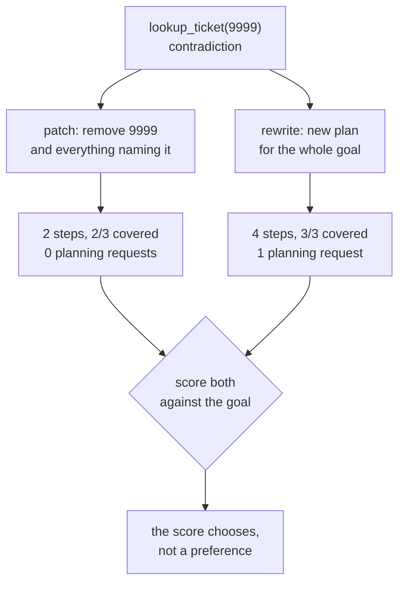

# 5.1 — Let the seam out, or re-cut the cloth

## One-line answer

A contradiction can be repaired by **dropping the dead step and everything that depended on it** or by
**writing a new plan for the whole goal** — and on the same failure the patch covers 2 of 3 required
things and the rewrite covers 3 of 3, because the dead step was the only route to the third.

## The story

You take a shirt to the tailor because it does not fit across the shoulders.

He looks at it, turns it inside out, and finds there is enough cloth folded into the seam. Twenty
minutes, and it fits. The shirt is the same shirt.

You take a second shirt with the same complaint, and this time he turns it inside out and there is
nothing there — the seam was cut close. He says he can do it, but it means opening the whole back
panel and cutting a new one, and you should decide whether the shirt is worth it.

He did not choose between those two answers. **The cloth chose.** One shirt had a margin folded into
it and the other did not, and no amount of skill turns the second case into the first.

That is the shape of every decision in this part. Whether a plan can be patched is a property of
what failed, not of how good your replanner is.

## The idea in plain language

A contradiction (part
[4.1](../04-when-a-plan-dies/4.1-a-shop-shut-for-lunch-and-a-shop-closed-down.md)) means the plan
believed something false. There are two ways to produce a second edition:

- **Patch.** Drop the dead step, drop anything that depended on it, keep the rest. Cheap, minimal,
  and it preserves the plan a human may already have approved.
- **Rewrite.** Throw the remaining plan away and write a new one for the whole goal, informed by the
  failure. Expensive — it is another planning request — and it can reach things the patch cannot.

The question that decides between them is whether the dead step was **load-bearing**: was it the only
route to some part of the goal?

- If the dead step was one of several routes — a redundant lookup, a nice-to-have check — patching
  loses nothing.
- If the dead step was the only step that was ever going to reach part of the goal, patching produces
  a plan that runs cleanly and cannot succeed. It will complete, report all steps green, and answer
  two thirds of the question. That is part
  [6.1](../06-in-production/6.1-every-step-ran-and-nothing-was-answered.md)'s failure, manufactured
  on purpose by a repair that looked frugal.

And "load-bearing" is not something you can read off the failure message. It is a property of the
plan relative to the goal, which means the only way to answer it is to **score both candidate
editions against the goal before choosing** — which you can do, for free, because of part
[1.3](../01-what-a-plan-is/1.3-the-plan-you-can-read-before-it-runs.md).

That is the useful move in this part, and it is worth stating as a rule: **produce both candidate
editions, score both, and let the score choose.** Neither answer is right in general.

## Why Sutra needs it

Part [2.4](../02-two-ways-to-decide/2.4-what-a-plan-costs-in-requests.md) measured that planning's
cost advantage disappears at three editions. A patch is **not another planning request** — it is a
set operation over the plan you already have — so it is the cheap repair, and preferring it wherever
it is adequate is what keeps the edition count down and the strategy affordable.

Day 63 adds the other reason. Once a plan has been approved by a human, a rewrite is a *new* plan and
therefore needs a new approval; a patch that only removes steps arguably does not. Those two are very
different for an on-call engineer at 3am, and the distinction only exists if the system can do both.

## The paper behind it

> **Strips: A new approach to the application of theorem proving to problem solving**
> `doi:10.1016/0004-3702(71)90010-5` · *Artificial Intelligence* 2(3–4), 189–208 · 1971
> <https://doi.org/10.1016/0004-3702(71)90010-5>

It represented an action by what must be true before it, what becomes true after it, and what stops
being true — which is precisely the information you need to decide whether removing one step breaks
the steps after it.

Taught in [`papers/01-strips.md`](../../papers/01-strips.md).

## The mechanism

```python
def patched(plan: Plan, index: int) -> Plan:
    """Repair the plan by dropping the dead step and every step that depended on it."""
    dead = plan.steps[index].argument
    kept = tuple(s for j, s in enumerate(plan.steps) if j != index and dead not in s.argument)
    return Plan(goal=plan.goal, steps=kept)
```

**Line by line:**

- `dead = plan.steps[index].argument` — the false belief is about the **argument**, not the step. The
  plan believed `9999` was a ticket; that belief may appear in several steps.
- `if j != index and dead not in s.argument` drops the dead step **and every other step that mentions
  the same argument**. That second clause is the whole of the repair: `compare(4521,9999)` has to go
  too, and nothing in its own failure message would have told you so.
- `dead not in s.argument` is substring matching over the comma-joined argument string — the design
  debt from part [1.2](../01-what-a-plan-is/1.2-what-a-step-has-to-carry.md) again. With per-action
  argument types this would be a set membership test and would not, for example, also drop a step
  whose argument was `19999`.
- A **new** `Plan` is returned. Nothing is mutated, so the old edition survives for the diff in part
  [1.3](../01-what-a-plan-is/1.3-the-plan-you-can-read-before-it-runs.md) and for the loop guard in
  part [5.4](5.4-two-plans-taking-turns.md).

```bash
cd days/day-56-planning-and-replanning/lab
uv run python patch.py
```

**Line by line:**

- `patch.py` runs the original plan until it contradicts, then builds **both** candidate editions and
  scores each against the three things the goal requires.
- The rewrite is hand-written rather than generated, because this part is about choosing between two
  editions and not about how the second one is produced.

Measured on 2026-09-05:

```text
goal: Compare 4521 with 9999, then find the fix and reply.
v1: lookup_ticket(4521), lookup_ticket(9999), compare(4521,9999), search_kb(KB-104)
failed at step 2: lookup_ticket(9999) -> no ticket with id '9999'

  patch  (2 steps): lookup_ticket(4521), search_kb(KB-104)
  rewrite(4 steps): lookup_ticket(4521), lookup_ticket(4610), compare(4521,4610), search_kb(KB-104)

  patch    covers 2/3 of ['4521', '4610', 'KB-104']
  rewrite  covers 3/3 of ['4521', '4610', 'KB-104']
```

**The patch went from four steps to two.** It dropped `lookup_ticket(9999)` because it died, and
`compare(4521,9999)` because it rested on the same false belief — and note that the comparison step
had not failed yet. It was going to, and the patch removed it before it could.

That is the patch working correctly. It is also the patch producing a plan that **cannot reach the
goal**: 2 of 3, missing `4610`.

The rewrite covers 3 of 3, because it does the thing a patch structurally cannot — it **adds** a step.
A patch can only remove. When the false belief was the only route to part of the goal, removal leaves
a hole and there is nothing in the remaining plan to fill it.

Here the goal wanted a comparison against a second ticket, `9999` was supposed to be that ticket, and
`4610` is the real one. Nothing in the original plan mentions 4610, so no rearrangement of the
original plan's steps can reach it.

So on this failure the answer is *rewrite*, and it is worth being clear that this is a fact about
this failure and not a general preference. Had the dead step been a redundant knowledge base lookup
with another article already in the plan, the patch would have scored 3 of 3 at no cost and the
rewrite would have spent a planning request to arrive at the same place.



## When it breaks

The patch's dependency rule is a string match, and it is wrong in both directions.

**It removes too much.** `dead not in s.argument` drops any step whose argument *contains* the dead
one. If the dead ticket were `461` and the plan also contained `lookup_ticket(4610)`, the patch would
silently delete a perfectly good step, because `"461" in "4610"` is true. The resulting plan runs
cleanly and is missing a ticket nobody removed on purpose.

**It removes too little.** The rule only catches steps that *name* the dead argument. A step that
depended on the dead step's **output** — the real dependency, from part
[3.2](../03-walking-the-plan/3.2-what-a-step-is-allowed-to-see.md) — is invisible to it, because that
dependency was never written down. Here is a plan where the patch produces something worse than
useless:

```text
v1: lookup_ticket(9999), search_kb(KB-104), reply(4521)
failed at step 1: lookup_ticket(9999) -> no ticket with id '9999'

  patch  (2 steps): search_kb(KB-104), reply(4521)
```

The patch kept `reply(4521)`. The reply was going to be *about* whatever ticket 9999 turned out to
be, and that ticket does not exist — so the second edition now sends a customer a reply built on one
knowledge base article and nothing else, and it does so with every step green.

The plan never recorded that the reply depended on the lookup. Order said the lookup came first;
order is not dependency; and a repair that reasons about a plan can only reason about what the plan
wrote down.

## In production

**What a professional writes instead.** The plan carries dependencies — step ids and a `needs` list —
and the patch becomes a graph operation: remove the dead node and everything **reachable from it**.
That is correct rather than approximate, it catches the `reply` case above, and it cannot delete
`4610` because of a substring. This is the same missing field that part
[3.2](../03-walking-the-plan/3.2-what-a-step-is-allowed-to-see.md) wanted for parallelism and part
[3.3](../03-walking-the-plan/3.3-a-plan-that-outlives-its-process.md) wanted for resumption, which is
worth noticing: three different problems, one absent field.

**What degrades at scale.** Patching gets more attractive as plans get longer, and more dangerous.
On a twenty-step plan a rewrite is expensive and throws away nineteen good steps, so the pressure is
all towards patching — and a twenty-step plan is exactly where the transitive dependency you did not
record is most likely to matter. The discipline that holds is: patch freely when the plan has real
dependency edges, and rewrite by default when it does not.

**The failure that only appears with real traffic.** Repeated patching. Each patch is individually
reasonable and the plan gets shorter every time, so after three contradictions you have a two-step
plan that runs perfectly and answers almost nothing. Nobody notices, because every run is green. The
countermeasure is the coverage score from part
[1.3](../01-what-a-plan-is/1.3-the-plan-you-can-read-before-it-runs.md), applied to the *patched*
edition and treated as a gate: a patch that drops coverage below threshold is not a repair, it is a
quiet abandonment, and it should escalate rather than execute.

**The review comment a senior engineer leaves:** *"The patch decides what to drop by substring
matching the failed argument against every other step's argument. That will delete `4610` when `461`
fails and it will keep a `reply` that depended on the step you just removed. Put real dependencies in
the plan, or always rewrite — do not pretend a string match is a dependency graph."*

**The interview question:** *"A step in your plan fails. Do you fix the step or write a new plan?"* An
honest answer: *"It depends on whether the dead step was the only route to part of the goal, and the
useful thing is that you can find out cheaply — build both candidate editions and score each against
the goal before running either, because scoring is free. On my measurement the patch went from four
steps to two and covered two of the three things the goal needed, and the rewrite covered three of
three, because the failed step was supposed to supply a second ticket and only a new plan could name
a different one. A patch can only remove; when the hole is in the middle of the goal, removal is not
a repair. What I would flag is that a patch is only as good as the dependencies the plan wrote down.
Mine matched on the failed argument as a string, which both over-deletes and under-deletes — it would
drop `4610` if `461` failed, and it kept a reply step that depended entirely on the lookup I had just
removed. Real dependency edges make the patch a graph reachability question instead of a guess."*

## Check yourself

```bash
cd days/day-56-planning-and-replanning/lab
uv run python patch.py
```

Now change `ORIGINAL` in `patch.py` so the dead step is a second knowledge base lookup that the plan
does not depend on, re-run, and write down which edition wins now.

**Out loud, without scrolling up:** say what a patch can never do that a rewrite can, and name the
one field whose absence makes the patch a guess.

**Next:** [5.2 — The work already paid for](5.2-the-work-already-paid-for.md).
