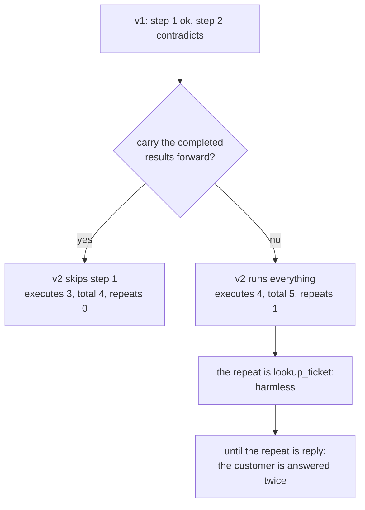

# 5.2 — The work already paid for

## One-line answer

A replanner handed the completed results executes **4 steps total with 0 repeats**; the same
replanner starting from nothing executes **5 with 1 repeat** — and when the repeated step is one that
sends something, "1 repeat" is a customer receiving the same reply twice.

## The story

You go to the photocopy shop with a stack of papers for an application. Ten pages, two copies each.
You pay, he runs them, you put them in your bag.

Back at the office you find out the form has changed and there is a new annexure you also need
copied. So you go back.

You do not hand him the whole stack again. You hand him the annexure. The twenty pages in your bag
are done; they are still valid; you paid for them and they are in your hand.

If you did hand him the whole stack again he would copy it, cheerfully, and charge you for it. He has
no way of knowing what is in your bag. **The only thing that stops the work being done twice is that
you told him what you already had.**

## The idea in plain language

When a plan fails part-way and a second edition is produced, some steps have already run
successfully. Their results are in hand. Those results are **sunk capital**: they cost requests, they
cost time, and they are still true.

There are two things you can do with them, and the difference is one argument:

- **Carry them forward.** Hand the completed results to the second edition, and skip any step whose
  work is already done.
- **Start clean.** Run the second edition from the top.

Starting clean is what happens by default, because it is what you get if you do not think about it —
a new plan is a new plan, and the executor walks it from index zero.

The cost of starting clean has two components, and only the first is obvious:

1. **Repeated work.** Requests spent, time spent, on results you already had.
2. **Repeated *effects*.** This is the one that matters. A repeated `lookup_ticket` is waste. A
   repeated `reply` is a second message to a customer. A repeated write is a duplicate row.

That second component is why this part exists on a day about planning rather than being left to Day
60. Replanning is the first mechanism in this curriculum that can cause the same step to run twice
in a single run, and it does so *by design*, without any crash or retry involved.

Two terms, defined here because Phase 9 leans on both:

- **Idempotent** — an action that has the same effect whether you do it once or five times. Reading
  a ticket is idempotent. Sending a reply is not.
- **At-least-once** — a guarantee that something happens, possibly more than once. It is what you get
  from any system that retries or replans, and it is only safe when paired with idempotency.

## Why Sutra needs it

Day 60's subject is durable execution — resume, replay, idempotency — and it will meet this exact
problem from a different direction: a run killed and resumed can re-execute a step. Part
[3.3](../03-walking-the-plan/3.3-a-plan-that-outlives-its-process.md) already showed a checkpoint
with no run identity happily "resuming" a finished run.

Replanning gets there first, and without any crash. That is worth the reader knowing before Phase 9,
because it makes idempotency a *planning* concern rather than an infrastructure concern that somebody
else will handle.

## The mechanism

The lab runs the same contradiction twice, changing only whether the completed results are carried
into the second edition.

```python
def arm(label: str, second: Plan, keep_done: bool) -> None:
    """Run v1 to its contradiction, then v2, counting how many steps actually executed."""
    world = World()
    done: list[str] = []
    _, step, reason = execute(ORIGINAL, world, done)
    executed_v1 = len(done)
    carried = list(done) if keep_done else []
    before = len(carried)
    execute(second, world, carried)
    executed_v2 = len(carried) - before
    repeats = len({d.split(":")[0] for d in done} & {c.split(":")[0] for c in carried[before:]})
```

**Line by line:**

- `carried = list(done) if keep_done else []` is the entire experiment. One expression. Everything
  else — the plan, the world, the second edition — is identical between the two arms.
- `execute(second, world, carried)` passes `carried` **into** the executor, and `execute` skips any
  step already present in it:
  `if str(step) in {d.split(":")[0] for d in done}: continue`. That skip is what carrying the work
  forward actually means in code.
- `executed_v2 = len(carried) - before` counts what the second edition really ran, rather than how
  many steps it contained. A four-step edition that skips one executes three.
- `repeats` intersects the step names from v1 with the step names v2 *added*, so it counts steps
  that ran in both editions. That is the number this part is about.

```bash
cd days/day-56-planning-and-replanning/lab
uv run python patch.py --sunk
```

**Line by line:**

- `--sunk` runs the two arms above back to back against a fresh `World` each time, so neither arm
  can be affected by what the other did.
- Without the flag, `patch.py` is part
  [5.1](5.1-let-the-seam-out-or-recut-the-cloth.md)'s patch-against-rewrite comparison.

Measured on 2026-09-05:

```text
The same contradiction, replanned twice: once carrying the completed work, once not.

carrying the completed work forward:
  v1 completed 1 step(s), then lookup_ticket(9999) -> no ticket with id '9999'
  v2 was handed 1 completed result(s) and executed 3 step(s)
  steps executed in total : 4
  steps executed twice    : 0

starting the new edition from nothing:
  v1 completed 1 step(s), then lookup_ticket(9999) -> no ticket with id '9999'
  v2 was handed 0 completed result(s) and executed 4 step(s)
  steps executed in total : 5
  steps executed twice    : 1

Completed steps are paid for. A replanner that is not told about them buys them
again, and on a step that sends a reply it does the thing twice.
```

**Four steps against five, and one repeat.** On a four-step plan with a single completed step, that
is a 25% overhead — and it grows exactly as far as the run had got before it failed. A plan that
contradicts at step eight of ten, replanned from nothing, re-executes seven successful steps.

The repeat here is `lookup_ticket(4521)`, which is harmless: reading a ticket twice costs a request
and changes nothing in the world. That is the *lucky* case, and it is why this failure is so easy to
ship. Every step in this lab except one is idempotent, so "start clean" looks like a performance
question.

It stops being a performance question the moment the repeated step is `reply`. The world object
records what has been sent, and a repeat appends a second entry: the customer gets the same message
twice, from a system that thinks it answered them once.

There is a second, quieter benefit to carrying the work forward, and it is the one this part would
argue for even if requests were free. **The replanner should see the results.** A second edition
written in ignorance of what the first edition learned is not really a replan — it is a retry of the
planning step. The whole reason to replan rather than re-plan-from-scratch is that execution
produced information, and information that is not passed forward is information that was not
gathered.



## When it breaks

The skip is a string match on the step, and it is exactly as strong as that sounds:

```python
if str(step) in {d.split(":")[0] for d in done}:
    continue  # already paid for
```

**Line by line:**

- `str(step)` is `action(argument)` from part
  [1.1](../01-what-a-plan-is/1.1-a-plan-is-a-list-not-a-paragraph.md). Two steps are "the same" when
  they name the same action and argument.
- `d.split(":")[0]` recovers the step name from the stored result string `"step: text"`. Note the
  fragility: a result whose *text* contains a colon still parses correctly here only because the
  split takes the first field, and a step whose printed form contained a colon would break it
  outright.
- `continue` skips without recording anything, so a plan that skipped six steps and a plan that ran
  none look identical afterwards.

The failure this produces is a step that **should** run twice and does not. Consider a plan that
looks up a ticket, waits for something to change, and looks it up again — a poll. Both steps are
`lookup_ticket(4633)`. The second one is skipped as already done, the plan proceeds on data it
deliberately intended to refresh, and part
[4.4](../04-when-a-plan-dies/4.4-the-plan-that-outlived-the-world.md)'s staleness failure has been
introduced by the mechanism meant to save work.

The mirror of that is equally real: two steps that happen to have the same action and argument, and
genuinely are the same work, but which the plan wrote at different points because they were about
different things — a knowledge base lookup for the classification and the same lookup for the draft.
One gets skipped and everything is fine, and nobody can tell you whether that was correct.

The root cause is the same one part
[3.2](../03-walking-the-plan/3.2-what-a-step-is-allowed-to-see.md) named: **the step has no
identity**. `action(argument)` is a description of work, not a name for an occurrence of it.

## In production

**What a professional writes instead.** Steps carry ids, and completed work is keyed by id rather
than by shape. Then two identical lookups at different points in the plan are two different steps,
the poll works, and the skip is exact. Alongside that, any step with an effect carries an
**idempotency key** — a value derived from the run and the step, sent to the downstream system, which
rejects a second call with the same key. That converts "we try hard not to run it twice" into "it
cannot happen twice", and it is the only version that survives Day 60's crash-and-resume.

**What degrades at scale.** The carried results are the checkpoint from part
[3.3](../03-walking-the-plan/3.3-a-plan-that-outlives-its-process.md), and they grow with every
completed step. On a long plan over large documents, passing them into every subsequent edition means
the planning prompt grows through the run — so the replan that was supposed to be cheap gets more
expensive exactly as the run gets longer. The production move is to pass **summaries plus references**
to the planner and full results only to the steps that need them.

**The failure that only appears with real traffic.** Duplicate side effects are invisible to the
system that causes them and extremely visible to the customer. Your logs say one run, one reply. The
customer's inbox says two. Nothing in the run is red, and the report arrives through support rather
than through monitoring, which means it arrives days later attached to an angry ticket.

**The review comment a senior engineer leaves:** *"Completed steps are matched by
`action(argument)`. Two lookups of the same ticket at different points in the plan are not the same
step, and one of them is a deliberate refresh. Give steps ids, and put an idempotency key on
anything with a side effect — 'we skip it if we already did it' is not a guarantee, it is a
coincidence that holds until somebody writes a plan with a poll in it."*

**The interview question:** *"When you replan, what happens to the work already done?"* An honest
answer: *"You carry it forward, both because it is paid for and because the whole point of replanning
is that execution taught you something — a second edition written without the first edition's results
is just a retry of the planner. I measured it: carrying the results meant four steps executed with
no repeats, and starting the new edition from nothing meant five with one repeat, on a plan that had
only completed one step before it failed. The repeat in my case was a ticket lookup, which is
harmless, and that is exactly why this ships broken — almost every step is idempotent until one of
them sends a reply, and then one repeat is a customer answered twice by a system that thinks it
answered them once. The fix is step ids so completed work is keyed by identity rather than by shape,
and an idempotency key on anything with an effect, because skipping is a best effort and a key is a
guarantee."*

## Check yourself

```bash
cd days/day-56-planning-and-replanning/lab
uv run python patch.py --sunk
```

Now add a `reply` step to `ORIGINAL` in `patch.py` before the failing step, re-run both arms, and
print `world.sent` at the end of each. Write down the difference.

**Out loud, without scrolling up:** name the two costs of starting a second edition from nothing, and
say which one your logs will never show you.

**Next:** [5.3 — The brake, and the sentence it prints](5.3-the-brake-and-the-sentence-it-prints.md).
