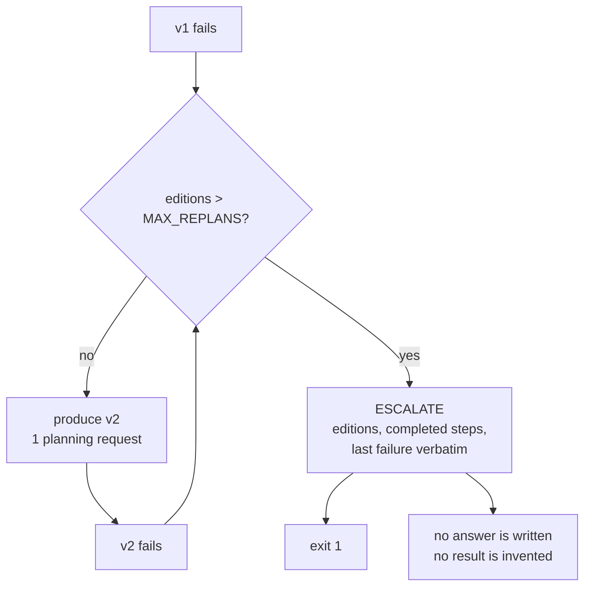

# 5.3 — The brake, and the sentence it prints

## One-line answer

`MAX_REPLANS = 1` stops the second edition from becoming a third, and what it produces is not a
crash but a **sentence** — an escalation naming the edition count, the completed steps and the last
failure — with exit code `1`, because Principle 10 says a system that cannot answer says so.

## The story

The building has a generator, and once a month somebody tests it.

The routine is fixed. Press start. It cranks. If it does not catch, it cranks again. Third time, if
it still has not caught, the panel stops trying and a red lamp comes on with a buzzer.

The buzzer is the whole design. A generator that kept cranking would flatten its starter battery,
and then when the power actually went out it would have neither a working starter nor anyone aware
that anything was wrong. Three attempts and a lamp means: *this needs a person, and here is what we
know.*

Nobody thinks the buzzer fixed the generator. It did not. What it did was convert an unbounded
problem into a bounded one with a named owner.

## The idea in plain language

A replan produces a second edition. A second edition can also fail, which produces a third. Nothing
in the machinery built so far stops that, and part
[5.4](5.4-two-plans-taking-turns.md) shows what it looks like when it does not stop.

The **brake** is a maximum number of editions. In this project it is one:

```python
MAX_REPLANS = 1
```

**Line by line:**

- A module-level constant, not a parameter with a default, so there is exactly one place in the
  system that says how many editions are allowed and it is greppable.
- It counts **replans**, not editions: `1` means one revision, so two plans in total. Naming it for
  the thing being limited rather than for the total is what stops an off-by-one argument later.
- It is an `int` and it is compared with `>`, so `0` is a legal, meaningful setting — a system that
  escalates on the first contradiction, which the run below shows.

That number is not a preference and it is not round-number thinking. Part
[2.4](../02-two-ways-to-decide/2.4-what-a-plan-costs-in-requests.md) measured where planning stops
being cheaper than reacting: at three editions with judgement steps in the plan, planning costs five
requests against reacting's four. **One replan is the last edition on the cheap side of that table**,
and the comment beside the constant should say so.

There is a second argument for a low brake and it is stronger than the cost one. A task that needs a
third plan is not being planned badly — it is being **understood** badly. The planner has now been
told twice what went wrong and produced a plan that failed twice. A third attempt from the same
planner with the same information is not more likely to work; it is the same ring of the doorbell
from part [4.2](../04-when-a-plan-dies/4.2-retrying-a-contradiction.md), one level up.

So the brake's job is not to make the plan succeed. It is to make the failure **finite and honest**,
which is Principle 10 exactly: *errors surface, escalate and are logged; never fabricate a result to
cover an error.*

And that means the interesting half of this part is not the counter. It is the sentence the counter
produces.

## Why Sutra needs it

Day 59 closes Phase 8 by containing runaway agents, and part
[5.4](5.4-two-plans-taking-turns.md) is a runaway: two plans that take turns for ever. The brake is
the containment, and Day 59's argument — that a guard has to be **outside** the thing it guards — is
already true here. `MAX_REPLANS` is checked by the executor, not by the planner. A planner that could
decide how many more times to replan would be a planner deciding whether to stop, which is the one
question you cannot delegate to the component that is failing.

Day 62 and 63 pick up the other end. An escalation needs somewhere to go and someone to receive it,
and what they receive is the sentence this part writes.

## The mechanism

```python
        if editions > max_replans:
            print()
            print(
                f"  ESCALATE: {editions} plan edition(s) could not reach the goal. "
                f"{completed_total} step(s) completed. Last failure: {reason}. "
                f"A human should look; nothing was answered and nothing was invented."
            )
            return 1
```

**Line by line:**

- `if editions > max_replans` is checked **before** producing the next edition, so the brake spends
  no request to discover it has been reached.
- The message names **three** things, and each is there for a different reader: `editions` says how
  hard the system tried, `completed_total` says what is already in hand so the human does not repeat
  it, and `reason` is the last failure, verbatim, so nobody has to go and reproduce it.
- *"nothing was answered and nothing was invented"* is the Principle 10 clause. It is not decoration:
  the alternative behaviour — summarising whatever partial evidence exists into a plausible reply —
  is what an agent does by default, and it is the thing this sentence exists to refuse.
- `return 1` — a non-zero exit code, so the escalation is visible to a script and not only to a
  reader. An escalation that exits zero is a log line, and log lines are not read.
- What is **not** in the message: an apology, a guess at what the human should do, or the word
  "unfortunately". The reader is on call.

```bash
cd days/day-56-planning-and-replanning/lab
uv run python brake.py; echo "exit: $?"
```

**Line by line:**

- `brake.py` runs a goal that cannot be reached, so the escalation is the correct outcome rather than
  a bug being demonstrated.
- `echo "exit: $?"` prints the exit code, which is half the point of this part.

Measured on 2026-09-05:

```text
MAX_REPLANS = 1

  v1: 2 steps, 0 completed, stopped at lookup_ticket(9999) -> no ticket with id '9999'
  v2: 2 steps, 0 completed, stopped at search_kb(KB-999) -> no article with id 'KB-999'

  ESCALATE: 2 plan edition(s) could not reach the goal. 0 step(s) completed. Last failure: no article with id 'KB-999'. A human should look; nothing was answered and nothing was invented.
exit: 1
```

Two editions, then a stop. The run is over, and what it produced is a sentence a person can act on:
two attempts, nothing completed, and the exact failure text.

Now set the brake to zero:

```bash
uv run python brake.py --max 0; echo "exit: $?"
```

**Line by line:**

- `--max 0` overrides the module constant for this run only, which is how a policy number should be
  explorable without editing the file it lives in.
- The exit code is printed again, because the difference between the two runs is meant to be in the
  edition count and **not** in how the run ends.

Measured on 2026-09-05:

```text
MAX_REPLANS = 0

  v1: 2 steps, 0 completed, stopped at lookup_ticket(9999) -> no ticket with id '9999'

  ESCALATE: 1 plan edition(s) could not reach the goal. 0 step(s) completed. Last failure: no ticket with id '9999'. A human should look; nothing was answered and nothing was invented.
exit: 1
```

**`--max 0` is a system with no replanning at all** — the first contradiction escalates. It is worth
running because it is a real configuration and not a broken one: for a plan whose steps all touch
production, escalating on the first surprise is a defensible policy, and it is what part
[6.3](../06-in-production/6.3-the-step-you-cannot-take-back.md) would argue for.

The two runs differ in one number and produce the same *kind* of output. That is the property to
notice: the brake is a dial, and every setting of it produces an honest report rather than a
different failure mode.



## When it breaks

The brake breaks by being raised, and it is raised for a reason that always sounds good at the time.

An escalation is an interruption. Somebody is paged, or a ticket lands in a queue, and the fastest
way to make that stop is to give the system another go. `MAX_REPLANS = 1` becomes `3`, the
escalations drop, and everyone is pleased.

What has actually happened is two things, neither of which shows up in the metric that improved.
From part [2.4](../02-two-ways-to-decide/2.4-what-a-plan-costs-in-requests.md)'s table, three
editions with judgement steps is five requests against reacting's four — **planning has quietly
become the more expensive strategy**, and nothing announces it. And the runs that now "succeed" on
edition three are runs where the planner was wrong twice, which is not a strong basis for trusting
the third.

The other way it breaks is subtler and this lab shows it plainly: look at the escalation message
above. `0 step(s) completed`. The brake fired correctly and the human is being handed **nothing** —
two failed plans and a message. Compare with a run that had completed six steps before it got stuck,
where the same sentence hands over real work in progress.

The value of an escalation is proportional to what it hands over, and a system that escalates early
with nothing done is only marginally better than one that gives up. That is not an argument for a
higher brake; it is an argument for the escalation carrying the completed results, which is what
part [5.2](5.2-the-work-already-paid-for.md)'s carried work is for.

## In production

**What a professional writes instead.** The escalation is not a `print`. It is a structured event —
Day 22's logging — carrying the run id, the goal, every edition of the plan, the completed results
and the failure, so that the human opens a record rather than reading a terminal. The escalation is
also **routed**: to a queue, a channel, a person on a rota, which is Day 62's subject. And the
constant carries its provenance:

```python
MAX_REPLANS = 1  # price.py --replan, 2026-09-05: at 3 editions with judgement steps,
# planning costs 5 requests against reactive's 4. One replan is the last cheap edition.
```

**Line by line:**

- The number, then the command that produced it, then the date. Anyone who wants to raise it can
  re-run the command and see what they are trading.
- Two lines of comment for a one-token constant is the right ratio for a number that is a policy.
  Day 50 made the same argument about `TOP_K`, and today's `lab/gate.py` fails the day on a bare
  `MAX_REPLANS` with no dated comment, for exactly this reason.

**What degrades at scale.** Escalations are only useful if somebody reads them, and the rate scales
with traffic. A system escalating 2% of runs at ten runs a day is a person glancing at a queue; at
ten thousand runs a day it is two hundred escalations and nobody looks at any of them. Past that
point the escalation needs to be *aggregated* — a hundred escalations with the same last failure is
one incident — which is a reporting problem, not a planning one, and it is the reason the failure
text has to be structured rather than prose.

**The failure that only appears with real traffic.** Escalation is the correct behaviour and it is
the behaviour that gets a system switched off. The first time a support desk sees "a human should
look" on a ticket a competitor's tool would have answered — badly, but answered — the pressure to
make the agent guess is real and it comes from people who are not wrong to want an answer. The
defence is to make the escalation useful rather than to make it rarer: hand over the completed steps
and the exact failure, so the human is finishing a job rather than starting one.

**The review comment a senior engineer leaves:** *"`MAX_REPLANS = 1` with no comment. Put the
measurement and the date next to it. Otherwise the first person to get paged raises it to five, the
escalations stop, and nobody will ever know that the planner is now wrong four times before it
succeeds."*

**The interview question:** *"What stops an agent replanning for ever?"* An honest answer: *"A
counter checked by the executor rather than by the planner, because you cannot ask the component
that is failing to decide when to stop. Mine is set to one, and the number came from a measurement
rather than from taste: I priced planning against reacting as the edition count grows, and at three
editions with judgement steps in the plan, planning costs more than the thing it replaced — so one
replan is the last edition that still pays for itself. What matters more than the counter is what it
produces. It does not crash and it does not answer: it prints how many editions were tried, how many
steps completed, and the last failure verbatim, and it exits non-zero. The sentence says explicitly
that nothing was invented, because the default behaviour of a language model handed partial evidence
is to write a confident answer out of it, and that is the failure the brake exists to prevent rather
than the loop."*

## Check yourself

```bash
cd days/day-56-planning-and-replanning/lab
uv run python brake.py; echo "exit: $?"
uv run python brake.py --max 0; echo "exit: $?"
```

Now run `uv run python brake.py --max 3` and write down how many planning requests were spent before
the escalation, then look up that number in part
[2.4](../02-two-ways-to-decide/2.4-what-a-plan-costs-in-requests.md)'s table.

**Out loud, without scrolling up:** say why the brake is checked by the executor and not the planner,
and name the three things the escalation message must carry.

**Next:** [5.4 — Two plans taking turns](5.4-two-plans-taking-turns.md).
