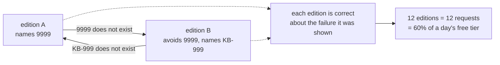

# 5.4 — 💥 Two plans taking turns

## One-line answer

With the brake off, two editions that each fix the other's complaint alternate for **twelve
editions** — twelve planning requests, more than half a day's free-tier quota, zero steps completed
— and every single edition is a locally correct response to the failure it was shown.

## The story

You are walking down a narrow corridor and someone is coming the other way.

You step to your left to let them past. At the same moment they step to their right, which is the
same side, so you are still facing each other.

You both apologise and step the other way. Same result.

You do it a third time and now you are both laughing, because it has become obvious that neither of
you is doing anything wrong. Every single step is the correct, courteous response to where the other
person is standing *at that instant*. The problem is not in any of the moves. It is that you are both
moving in response to the other, with no memory of the previous move.

The thing that breaks it is one of you stopping and standing still. Not a better move — no move.

## The idea in plain language

An **oscillation** is a replan loop where each edition is a reasonable response to the failure it was
shown, and the sequence never terminates.

It is worth being precise about why this happens, because "the planner is stupid" is the wrong
diagnosis and leads to the wrong fix.

The replanner is given three things (part
[5.2](5.2-the-work-already-paid-for.md)): the goal, the completed results, and **the failure that
just occurred**. It is not given the failures that occurred before that one. So when edition A fails
because `9999` does not exist, the replanner produces edition B which avoids `9999` — correctly. And
when edition B fails because `KB-999` does not exist, the replanner produces an edition avoiding
`KB-999`, which is edition A again — also correctly.

**Each edition is right about the failure it was shown and wrong about the run.** That is the same
sentence as part
[2.1](../02-two-ways-to-decide/2.1-deciding-with-your-eyes-on-the-last-thing.md)'s reactive loop —
locally correct decisions, globally wrong sequence — arriving one level up. The replanner is a
reactive loop over plans, and it has exactly the reactive loop's blind spot: **it decides from the
last observation.**

Which gives you the two possible fixes immediately:

- **Bound it.** The brake from part [5.3](5.3-the-brake-and-the-sentence-it-prints.md). Does not make
  the plan correct; makes the failure finite.
- **Give it memory.** Pass every previous edition and every previous failure, not just the last one.
  Better, and it costs prompt size on every replan.

The lab does the first, because Phase 8's gate is containment and because the second one still needs
the first behind it.

## Why Sutra needs it

Day 59 closes Phase 8 on runaway agents, and this is one of the four shapes: a loop whose steps are
individually cheap and which never terminates. It is the *quiet* runaway — nothing crashes, nothing
errors, each edition is plausible — and the only visible symptom is quota disappearing.

That matters here specifically because of what a replan costs. Part
[2.4](../02-two-ways-to-decide/2.4-what-a-plan-costs-in-requests.md) established that a planning
request is the expensive one; twelve of them is not twelve cheap iterations of a loop, it is twelve
of the twenty generate requests this project gets in a day, spent on one ticket, producing nothing.

## The mechanism

```bash
cd days/day-56-planning-and-replanning/lab
uv run python brake.py --oscillate; echo "exit: $?"
```

**Line by line:**

- `--oscillate` runs the same pair of editions twice: once with `max_replans=99` and a hard cap of
  twelve to stop the demonstration, and once with `MAX_REPLANS = 1`.
- The two editions, `A` and `B`, are constants at the top of `brake.py`. A names a ticket that does
  not exist; B avoids that ticket and names an article that does not exist. Neither is a strawman:
  each is exactly what a replanner given only the other's failure would produce.
- The cap of twelve exists so the demonstration terminates. **The cap is not the brake** — it is the
  thing standing in for "you noticed and pressed Ctrl-C", and the run reports it separately so the
  two cannot be confused.

Measured on 2026-09-05:

```text
Two editions that each undo the other, with the brake off (cap 12):

  v1: 2 steps, 0 completed, stopped at lookup_ticket(9999) -> no ticket with id '9999'
  v2: 2 steps, 0 completed, stopped at search_kb(KB-999) -> no article with id 'KB-999'
  v3: 2 steps, 0 completed, stopped at lookup_ticket(9999) -> no ticket with id '9999'
  v4: 2 steps, 0 completed, stopped at search_kb(KB-999) -> no article with id 'KB-999'
  v5: 2 steps, 0 completed, stopped at lookup_ticket(9999) -> no ticket with id '9999'
  v6: 2 steps, 0 completed, stopped at search_kb(KB-999) -> no article with id 'KB-999'
  v7: 2 steps, 0 completed, stopped at lookup_ticket(9999) -> no ticket with id '9999'
  v8: 2 steps, 0 completed, stopped at search_kb(KB-999) -> no article with id 'KB-999'
  v9: 2 steps, 0 completed, stopped at lookup_ticket(9999) -> no ticket with id '9999'
  v10: 2 steps, 0 completed, stopped at search_kb(KB-999) -> no article with id 'KB-999'
  v11: 2 steps, 0 completed, stopped at lookup_ticket(9999) -> no ticket with id '9999'
  v12: 2 steps, 0 completed, stopped at search_kb(KB-999) -> no article with id 'KB-999'

  gave up after 12 editions without a brake

The same two editions with MAX_REPLANS = 1:

  v1: 2 steps, 0 completed, stopped at lookup_ticket(9999) -> no ticket with id '9999'
  v2: 2 steps, 0 completed, stopped at search_kb(KB-999) -> no article with id 'KB-999'

  ESCALATE: 2 plan edition(s) could not reach the goal. 0 step(s) completed. Last failure: no article with id 'KB-999'. A human should look; nothing was answered and nothing was invented.
exit: 1
```

Read the twelve lines and notice what is **not** in them.

No traceback. No exception. No timeout. No 429. Nothing is red. Every line reads exactly like the
first line of a run that is about to succeed — a plan, an execution, a contradiction, a replan.
There is no moment at which anything went wrong in a way a monitor would catch.

The only signal is the pattern, and the pattern is only visible **because twelve lines are printed
next to each other**. Split those twelve editions across twelve log entries in a production log with
other traffic interleaved, and there is no pattern to see. Somebody has to think to ask *how many
editions did this run produce?*, and nobody asks that until the quota is gone.

**Twelve planning requests.** Against this project's free tier of twenty generate requests per day
per model, one ticket has consumed sixty per cent of the day and answered nothing. The second arm
costs two.

And the closing point, which is the honest one: the brake did not fix anything. Both arms end with a
goal that was never reachable — `9999` and `KB-999` do not exist and no plan will make them exist.
What the brake changed is that the failure is now **two requests and a sentence** instead of an open
loop. Part [5.3](5.3-the-brake-and-the-sentence-it-prints.md)'s claim, demonstrated: containment
makes a failure finite and honest; it does not make it a success.



## When it breaks

The brake bounds this loop and there is a family of loops it does not bound.

The oscillation above is a **cycle of length two** and it is visible in the printed editions. Now
imagine a replanner that produces a slightly different plan every time — edition three is A with one
extra step, edition five is A with a different `why` — none of them repeating exactly, all of them
failing for the same reason. A brake counting editions still stops it, which is the argument for the
brake. But a smarter guard that looked for *repeated plans* would not fire, because no plan repeats.

That matters because "detect the repeat" is the fix people reach for first, and it is the fix this
lab's own data structures invite: `Plan` is frozen and its steps are a tuple, so plans are hashable,
so you could keep a set of editions seen and stop on a collision. It would catch this exact demo and
miss the version with cosmetic variation.

You can see the difference by changing one thing. Give `B` a third step that does nothing, so that
the alternation is between three distinct plans rather than two:

```text
  v1: 2 steps, 0 completed, stopped at lookup_ticket(9999) -> no ticket with id '9999'
  v2: 3 steps, 0 completed, stopped at search_kb(KB-999) -> no article with id 'KB-999'
  v3: 2 steps, 0 completed, stopped at lookup_ticket(9999) -> no ticket with id '9999'
```

Same loop, and a set of seen plans now needs two full cycles to notice instead of one. Add enough
variation and it never notices at all, while a counter is unaffected.

**A counter is a worse detector and a better guard**, and that is the general lesson: containment
should depend on as little as possible about the shape of what it is containing. Day 59 makes this
argument for every guard in Phase 8.

## In production

**What a professional writes instead.** Both: a counter as the guard, and memory as the fix. The
replanner is given every previous edition and every previous failure, so the loop above cannot form —
an edition told *"you tried A, it failed on 9999; you tried B, it failed on KB-999"* has the
information to conclude that the goal is unreachable and to say so. That costs prompt size on every
replan, which is the trade, and it is why the counter stays behind it: memory reduces the rate of
oscillation and does not make it impossible.

**What degrades at scale.** The cost is per run and the visibility is per fleet. One run spending
twelve requests is a bad afternoon; a hundred runs a day each spending twelve is a quota that
disappears every morning before anybody is awake, with no error anywhere. The metric that catches
it is **editions per run**, tracked as a distribution rather than a mean — the mean stays near one
while a small tail eats everything.

**The failure that only appears with real traffic.** Oscillation is triggered by ambiguity in the
*world*, not by a bug in the planner, and real archives are full of ambiguity: two tickets that each
say they are a duplicate of the other, an article that was split into two and both halves reference
the original id. In a fixture, entities are clean. In a real ticketing system, the loop has fuel.

**The review comment a senior engineer leaves:** *"There is no bound on the replan loop and the
individual editions look fine, so nothing here will ever page anybody — it will just quietly consume
the day's quota. Cap the editions, and log the count on every run, because 'editions per run' is the
only number that would have shown you this."*

**The interview question:** *"Tell me about a loop that was hard to detect."* An honest answer:
*"Replanning oscillation. My replanner is given the goal, the completed work and the failure that
just happened — and only that failure. So when edition A failed on a missing ticket it produced
edition B avoiding that ticket, and when B failed on a missing article it produced A again. I ran it
with the brake off and it alternated for twelve editions, which on this project's free tier of
twenty requests a day is sixty per cent of the quota spent on one ticket for nothing. The reason it
is hard to detect is that there is no error: every line looks like the first line of a run that is
about to succeed, and the pattern is only visible if you print the editions next to each other or
track editions-per-run as a metric. The fix I would ship is both a cap and memory — pass every
previous edition and failure to the replanner so it can conclude the goal is unreachable. And I
would keep the cap even after adding the memory, because I also tried detecting repeated plans, and
a replanner that varies its output cosmetically defeats that while a counter is unaffected."*

## Check yourself

```bash
cd days/day-56-planning-and-replanning/lab
uv run python brake.py --oscillate; echo "exit: $?"
```

Now change the cap in `brake.py`'s `run()` from `12` to `40`, re-run the first arm, and write down
what that number would have cost in free-tier days.

**Out loud, without scrolling up:** explain why each edition in the loop is individually correct, and
say why a counter is a better guard than a detector that looks for a repeated plan.

**Next:** [6.1 — Every step ran and nothing was
answered](../06-in-production/6.1-every-step-ran-and-nothing-was-answered.md).
