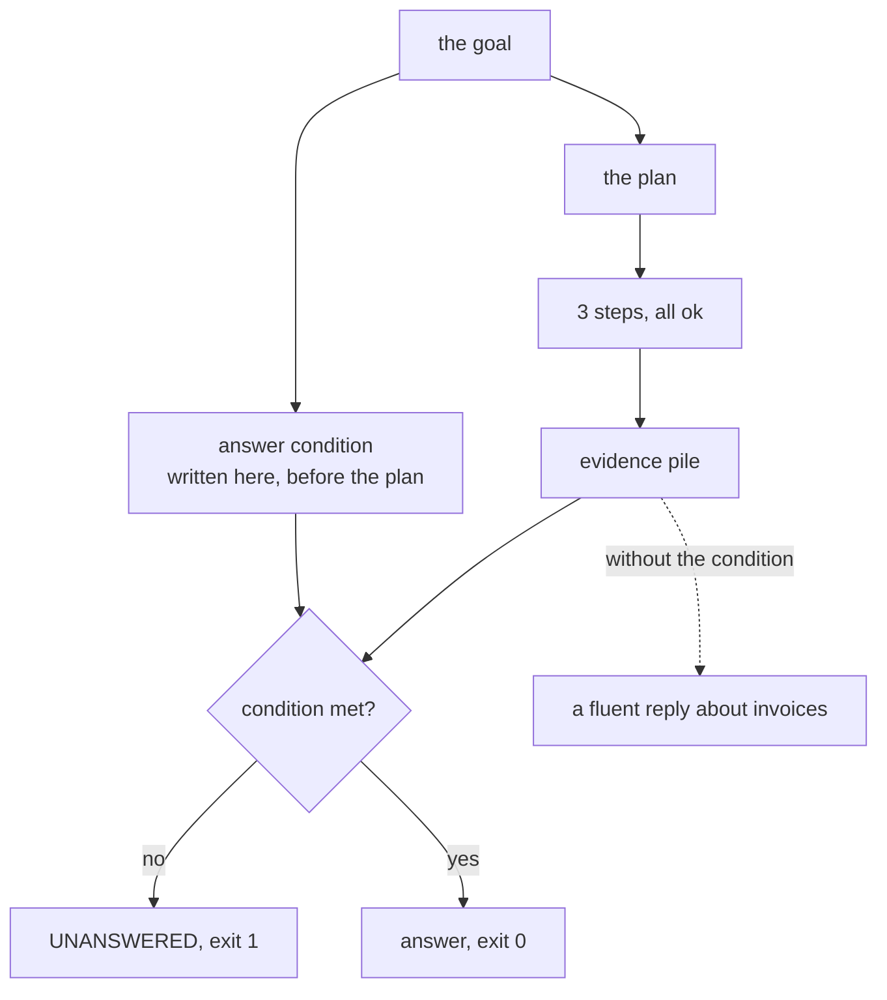

# 6.1 — 💥 Every step ran and nothing was answered

## One-line answer

A run completes **3 of 3 steps** with exit code `0` and has not answered its goal — and the only
thing that catches it is a condition written down **with the goal, before the plan**, which turns the
same run into exit `1` and the word `UNANSWERED`.

## The story

The move is finished. Every box is in the new flat, the van has gone, and the man with the clipboard
has ticked all forty-one items off his list and asked you to sign.

You sign, because he is right. Forty-one boxes went on the van and forty-one boxes came off it.
Nothing is missing, nothing is broken, and by every measure the job is complete.

It is now nine at night and you want a cup of tea, and the kettle is in one of the forty-one boxes.
Six of them say KITCHEN. You open all six. It is not in those.

Nothing failed. The list was complete and correctly executed. The thing you actually wanted from the
day — to be able to make a cup of tea in your new flat — was never on the list, so nothing that
tracked the list could tell you it had not happened.

## The idea in plain language

Part [4.3](../04-when-a-plan-dies/4.3-the-step-that-worked-and-told-you-nothing.md) showed a single
step that succeeded and returned nothing useful. This is the same failure at the level of the whole
run, and it is the one that reaches a customer.

**Every step succeeded. The goal was not reached.**

There is no mechanism built anywhere in this day that catches it:

| Mechanism | Why it does not fire |
| --- | --- |
| retry (part [4.2](../04-when-a-plan-dies/4.2-retrying-a-contradiction.md)) | nothing failed |
| replan (section [5](../05-the-second-edition/5.1-let-the-seam-out-or-recut-the-cloth.md)) | no contradiction |
| the brake (part [5.3](../05-the-second-edition/5.3-the-brake-and-the-sentence-it-prints.md)) | one edition was enough |
| coverage (part [1.3](../01-what-a-plan-is/1.3-the-plan-you-can-read-before-it-runs.md)) | the plan touched things; they were the wrong things |

Every one of those watches the **plan** or the **steps**. None of them watches the **goal**.

So the missing thing is a fifth check, and it has to be of a different kind: an **answer condition**
— a statement, written down with the goal, of what must be true of the collected evidence for the
goal to have been answered.

The ordering is the entire discipline. The condition is written **with the goal, before the plan
exists**. Written afterwards it is a description of what the run happened to produce, which will
pass, always. Day 50 said the same thing about its gold set and part
[1.3](../01-what-a-plan-is/1.3-the-plan-you-can-read-before-it-runs.md) said it about the answer key;
this is the third time in two days that the rule *write the check before the thing it checks* has
been the whole of the fix, and that repetition is not an accident.

And then the honest consequence: when the condition is not met, the system must **say so**. Not
summarise the evidence it has. Not produce a partial answer with a hedge. Say that the goal was not
reached. That is Principle 10 — *never fabricate a result to cover an error* — applied to the case
where there is no error to cover, which is the hardest version of it.

## Why Sutra needs it

Day 58's triage graph ends in a draft and a review, and the draft stage is a model handed an evidence
pile. Every failure in this day arrives there in the same shape: a pile of successful results. The
model will write a reply from whatever it is given, fluently, because that is what it does.

The Phase 8 gate is a triage graph working end to end, and "working" has to mean something more than
"every stage returned". This part is the check that makes the difference sayable.

Day 63's approval gate depends on it too, in a way that is easy to miss. A human asked to approve a
reply built on evidence that does not answer the question has been handed the failure rather than
protected from it — and if the system already knows the goal was not met, the right thing to put in
front of the human is that sentence, not a draft.

## The mechanism

```python
GOAL = "Is the customer's onboarding data being lost because of the sign-in redirect?"

# The answer condition: what must appear in the collected evidence for the goal to be answered.
# It is written with the goal, before the plan, which is the only order in which it is honest.
MUST_CONTAIN = ("cookie", "redirect")
```

**Line by line:**

- `MUST_CONTAIN` sits immediately under `GOAL` in the file, above `PLAN`. The physical ordering in
  the source is doing real work: anybody editing this file to make a failing run pass has to move
  the condition past the goal it belongs to, and that is a visible thing to do in a diff.
- Two terms, not one. A single required word is usually satisfied by accident; two related ones are
  a much weaker accident. This is not a threshold anybody tuned — it is the smallest condition that
  states what an answer to *this* question would have to mention.
- It is a tuple of strings because this is the crudest possible version and the crudest possible
  version already catches the failure. The *In production* section says what replaces it.

```bash
cd days/day-56-planning-and-replanning/lab
uv run python notgoal.py; echo "exit: $?"
```

**Line by line:**

- No flag: the run reports what the **executor** knows, which is outcomes and a count.
- `echo "exit: $?"` is the whole point of the command. The verdict of this part is an exit code, and
  a check whose result is only prose cannot be a gate.

Measured on 2026-09-05:

```text
goal: Is the customer's onboarding data being lost because of the sign-in redirect?

  1/3 lookup_ticket(4633)  ok
  2/3 lookup_ticket(4702)  ok
  3/3 compare(4633,4702)   ok

  steps completed : 3/3
  exit code the executor would report : 0

Every step succeeded. The run is a success by every measure the executor owns, and
an agent handed this evidence will write a fluent answer about invoices.
exit: 0
```

**Three of three, exit zero.** Look at what the run actually gathered: ticket 4633, which is about an
onboarding form; ticket 4702, which is about a blank invoice PDF; and a comparison of the two.

The plan was wrong — 4702 has nothing to do with sign-in — and nothing about that wrongness is
detectable from outcomes. Every step did what it was told, correctly.

Now the same run with the condition applied:

```bash
uv run python notgoal.py --check; echo "exit: $?"
```

**Line by line:**

- `--check` adds the answer condition and nothing else. The plan, the world and the steps are
  identical to the run above, which is what makes the exit code the only thing that moved.

Measured on 2026-09-05:

```text
  steps completed : 3/3
  exit code the executor would report : 0
  answer condition : ['cookie', 'redirect']
  found in evidence: nothing
  goal answered    : False

  UNANSWERED: every step completed and the goal was not reached. The honest report
  is this sentence, not a summary of three successful steps.
exit: 1
```

**`found in evidence: nothing`.** Neither `cookie` nor `redirect` appears anywhere in what three
successful steps returned. The run has gathered evidence about invoices in answer to a question about
sign-in.

The exit code moved from `0` to `1`, and that is the whole deliverable of this part. The check is
four lines of `notgoal.py`, quoted here together because the reporting sits between them:

```python
    blob = " ".join(evidence).lower()
    found = [w for w in MUST_CONTAIN if w in blob]
    answered = len(found) == len(MUST_CONTAIN)
    return 0 if answered else 1
```

**Line by line:**

- `" ".join(evidence)` — the condition is checked against **all** the evidence together, not per
  step. A goal can legitimately be answered by two steps that each supply half of it, and a per-step
  check would reject that.
- `.lower()` before matching, so the condition does not silently depend on how a ticket was
  capitalised.
- `len(found) == len(MUST_CONTAIN)` — **all** the terms, not any. A condition satisfied by one term
  out of two is the sort of near-miss that produces a confident partial answer, which is the thing
  being prevented.
- `return 0 if answered else 1` — the verdict is an exit code, so it is enforceable by a script and
  by CI. Principle 11 wants a check that can go red; this one goes red on the run above and green
  when the plan is right.



## When it breaks

The check breaks in the direction that gets it deleted.

Substring matching over two words is a blunt instrument. A run that answered the question perfectly
using the word `cookies` would pass — `cookie` is a substring — but one that answered it using
`SameSite` and `session` and never wrote either required word would be reported `UNANSWERED` when it
had in fact answered.

That is a **false alarm**, and false alarms are how a guard dies. A check that fires on good runs is
switched off within a fortnight by somebody who is not being careless — they are being reasonable,
because a check that is wrong sometimes and blocking always is worse than no check.

The other direction is quieter. Make the condition too loose — a single common word — and it passes
on everything, including the invoice run above. Then the check is still in the codebase, still green,
still reported as coverage, and it is measuring nothing.

So this part's honest position is that **the phenomenon is certain and the detector is weak**. You
can read the three results from the run above and see for yourself that the question is unanswered;
that does not depend on `MUST_CONTAIN`. What depends on it is whether the judgement can be automated,
and at this quality it can only be automated for goals whose answers have unavoidable vocabulary.

The number that decides whether a guard like this survives is its false-alarm rate, and nothing in
this lab measures it — there are not enough goals here to measure it against. Phase 12 is where a
check like this gets a proper evaluation set.

## In production

**What a professional writes instead.** Three things replace the word list, in increasing order of
cost. A **structured answer**: the run must produce a typed conclusion — `cause`, `evidence_refs`,
`confidence` — and a run that cannot fill `cause` has not answered, which is a schema check rather
than a text search. **Citations**: every claim in the answer names the step result it came from, and
an answer with no citations is unanswered by construction. And a **judge** — a second model call
scoring the answer against the goal, which is Phase 12's subject and which costs a request per run,
so it is used on samples rather than on everything.

**What degrades at scale.** The condition has to be written per goal, and a system that handles a
thousand kinds of question cannot have a thousand hand-written conditions. What survives is
conditions per **goal type** — a "root cause" question always requires a cause and a citation; a
"what is our policy" question always requires a policy document reference — which is a much smaller
set and is maintainable. That grouping is the same move Day 58's classify stage makes, which is why
these two days fit together.

**The failure that only appears with real traffic.** The unanswered run is worse than the failed run
and it is *rated* better. A support agent who receives "I could not determine this" goes and looks
themselves. A support agent who receives a confident, fluent paragraph about invoice templates in
answer to a sign-in question sends it to the customer, and the cost lands two steps away from
anything you are monitoring. Systems get graded on how often they produce an answer, and this failure
produces one every time.

**The review comment a senior engineer leaves:** *"The run reports success on the basis that no step
raised. Add an answer condition next to the goal and make it the exit code — and put the condition
above the plan in the file, so that anybody weakening it to make a run pass has to do it visibly."*

**The interview question:** *"How do you know your agent actually answered the question?"* An honest
answer: *"You cannot get it from the steps. I have a run where all three steps returned `ok`, the
executor reported three of three and the exit code was zero, and the evidence it gathered was a
ticket about a blank invoice in answer to a question about sign-in. Nothing catches that: retry needs
a failure, replan needs a contradiction, and the coverage check I run before execution only asks
whether the plan touched the required things — this plan touched things, they were the wrong things.
So there has to be a separate check on the goal, and the discipline that makes it real is writing the
condition down with the goal before the plan exists, because a condition written afterwards always
passes. When it fails the system says UNANSWERED and exits non-zero rather than summarising three
successful steps, which is the part people find hardest to ship, because an honest 'I don't know'
scores worse on every metric than a confident wrong answer. The caveat I would give is that my
detector is two substrings and its false-alarm rate is what decides whether it survives contact with
a team — in production it should be a typed conclusion with citations rather than a word list."*

## Check yourself

```bash
cd days/day-56-planning-and-replanning/lab
uv run python notgoal.py; echo "exit: $?"
uv run python notgoal.py --check; echo "exit: $?"
```

Now change `PLAN` in `notgoal.py` to look up `4610` instead of `4702`, re-run with `--check`, and
write down which of the two required words shows up and whether the run passes.

**Out loud, without scrolling up:** name the four mechanisms from this day that do not fire on this
failure, and say why the answer condition has to be written before the plan.

**Next:** [6.2 — The plan somebody reads first](6.2-the-plan-somebody-reads-first.md).
