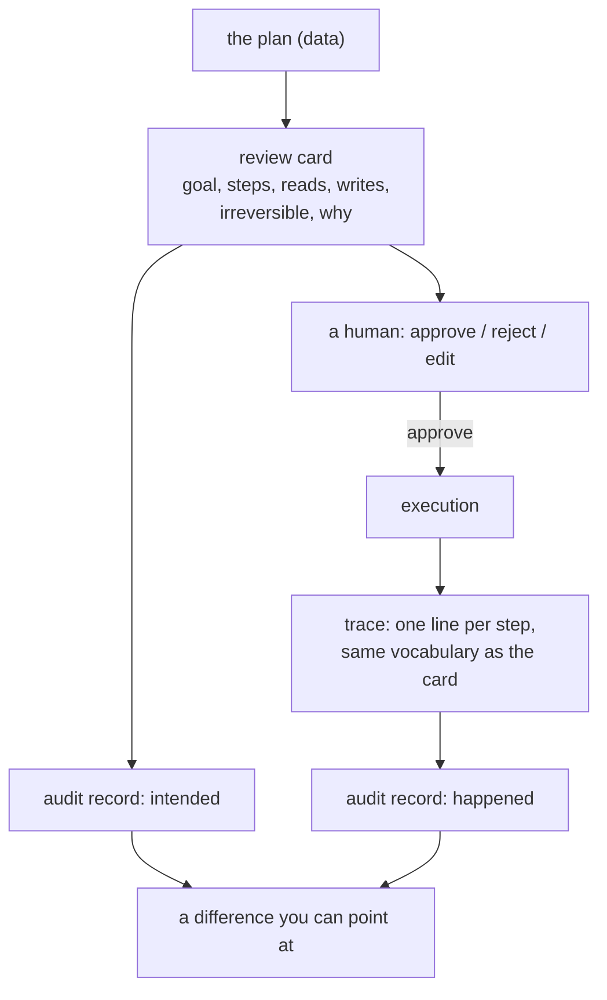

# 6.2 — The plan somebody reads first

## One-line answer

Because the plan is data, a review card — **what it reads, what it writes, which step leaves the
system** — is a function of the plan alone, computed before anything runs, and that card is exactly
what Day 63 turns into an approval gate.

## The story

You are transferring money to a builder and you have typed the account number off a photograph of an
invoice.

Before the app will send it, a screen comes up. It shows the amount, the name on the account, the
last four digits, and the reference you typed. There is one button that says confirm and one that
says back.

You read the name. It is not quite the name you expected — it is the builder's company rather than
his own name — and you stop for a second, check the invoice, and it is right.

The screen did not verify anything. It did not phone the bank or check the builder is real. All it
did was **show you what is about to happen, in the same order the machine is going to do it**, at the
last moment when stopping is free.

And notice what makes that screen possible: the transfer is a record with fields. Amount, payee,
reference. If a transfer were a sentence you wrote to your bank in an email, there would be no screen
— there would be an email, and somebody reading it later.

## The idea in plain language

Everything in section [1](../01-what-a-plan-is/1.1-a-plan-is-a-list-not-a-paragraph.md) was about the
plan being data so that **code** could act on it. This part is the same property serving a different
reader: the plan being data means a **person** can be shown a summary that is generated rather than
written.

A review card answers three questions a reviewer actually has, and each is a set operation over the
plan's fields:

- **What will this read?** The arguments of every non-writing step.
- **What will this change?** The arguments of every writing step.
- **What cannot be undone?** The steps whose action is in the irreversible set — part
  [6.3](6.3-the-step-you-cannot-take-back.md)'s subject.

Plus one thing that is not computed: the `why` of each step, from part
[1.2](../01-what-a-plan-is/1.2-what-a-step-has-to-carry.md). The three questions above tell the
reviewer *what*; only the `why` tells them whether it *should*. This is where that field, the one
everybody deletes, earns its keep.

The card is not a safety mechanism on its own. It is the **rendering**; Day 63 supplies the policy
that decides which plans need one and Day 64 builds the gate that blocks on it. What this part
establishes is that the rendering is free — no model call, no execution, no extra structure — because
the plan already contains everything the card shows.

There is a second reader worth naming, and it arrives after the run rather than before it: the
**trace**. The same fields that make a card make a log where every line names the step that produced
it, and where the plan sits above the log saying what was *supposed* to happen. A reactive agent's
log has the same lines and no plan above them, so nothing in it says what was intended — which means
nothing in it can show you a departure from the intention.

## Why Sutra needs it

Day 63 designs approval gates and Day 64 builds one. Both need an artefact to put in front of a
person, and neither can build it from a paragraph.

Phase 13 needs the other half. Day 84 wires OpenTelemetry across the app, and what makes a trace of a
planned run readable is that each span can carry the step that produced it — action, argument, `why`
— rather than an opaque model turn. That is the same three fields again.

## The mechanism

```python
def card(plan: Plan) -> None:
    """Everything a person needs to say yes or no, and nothing else."""
    risky = [s for s in plan.steps if s.action in IRREVERSIBLE]
    print("PLAN FOR APPROVAL")
    print(f"  goal      : {plan.goal}")
    print(f"  steps     : {len(plan)}")
    for i, step in enumerate(plan.steps, 1):
        flag = "  <- leaves this system" if step.action in IRREVERSIBLE else ""
        print(f"    {i}. {step.action:<14} {step.argument:<8} {step.why}{flag}")
    print(f"  irreversible steps : {len(risky)} ({', '.join(str(s) for s in risky) or 'none'})")
    print(f"  reads      : {sorted({s.argument for s in plan.steps if s.action != 'reply'})}")
    print(f"  writes     : {sorted({s.argument for s in plan.steps if s.action == 'reply'})}")
```

**Line by line:**

- `IRREVERSIBLE` is a module-level set — `{"reply"}` — so the classification of an action lives in one
  place and part [6.3](6.3-the-step-you-cannot-take-back.md) uses the same one. A card that decided
  for itself what counted as risky would drift from the executor that enforces it.
- `plan.goal` first, because a reviewer approving a list of actions without the goal is being asked
  to check consistency against nothing.
- The `why` is printed **last on each line and unpadded**, so it reads as a sentence rather than a
  column. It is the part a person reads; everything before it is the part they scan.
- `flag` marks the irreversible step inline **and** it is counted separately below. Both, deliberately:
  the inline marker is for the reviewer reading the list, the count is for the reviewer who is going
  to approve forty of these today and needs to know instantly whether this one matters.
- `reads` and `writes` are derived by filtering on `action`, and the filter is `!= "reply"` — a
  string comparison that is correct today and is exactly what the `IRREVERSIBLE` set exists to
  replace. It is left this way to be visible: the *In production* section says why it is a bug
  waiting.
- `sorted({...})` — a set, so a ticket read twice appears once, and sorted so two runs of the same
  plan produce the same card. A card that reorders between renderings cannot be diffed.
- The function takes only `plan`. No world, no context, no execution. That signature is the claim of
  this part.

```bash
cd days/day-56-planning-and-replanning/lab
uv run python review.py
```

**Line by line:**

- No flag renders the card. It takes no world and runs no step, so the command is safe to run
  against a plan you have not decided to execute — which is the property an approval gate needs.

Measured on 2026-09-05:

```text
PLAN FOR APPROVAL
  goal      : Answer the customer on 4633 about the lost onboarding form.
  steps     : 3
    1. lookup_ticket  4633     read what the customer actually reported
    2. search_kb      KB-104   the article the sign-in tickets point at
    3. reply          4633     send the answer to the customer  <- leaves this system
  irreversible steps : 1 (reply(4633))
  reads      : ['4633', 'KB-104']
  writes     : ['4633']

  approve / reject / edit

Nothing has run. This card is a function of the plan alone, which is only possible
because the plan is data. Day 63 turns this card into an approval gate.
```

A reviewer can answer *should this happen?* from eight lines. They can see that it will read one
ticket and one article, that it will send one message, and that the message is the only thing that
leaves the system. And they can see **why** each step is there, in the words the planner used.

Now the same run afterwards:

```bash
uv run python review.py --trace
```

**Line by line:**

- `--trace` executes the same `PLAN` constant and prints one line per step. Same plan, same
  vocabulary, so the card above and this trace can be read side by side.

Measured on 2026-09-05:

```text
seq   step                   outcome  evidence
1     lookup_ticket(4633)    ok       Onboarding form loses data. Long form, submi
2     search_kb(KB-104)      ok       Cookies dropped on cross-site redirect. Set 
3     reply(4633)            ok       reply sent to 4633
```

Three lines, each naming the step that produced it. Put the card above this trace and you have the
two halves of an audit record: **what was intended** and **what happened**, in the same vocabulary,
so a difference between them is a difference you can point at.

That is the property a reactive agent cannot offer. Its trace has these same three lines. What it
does not have is the card, because there was never a moment at which the whole intention existed.



## When it breaks

The card lies as soon as the plan changes after it is shown.

Nothing in this lab connects the card to the execution. `card(plan)` renders, and later
`run(plan)` executes, and there is no mechanism asserting that they saw the same object. Section
[5](../05-the-second-edition/5.1-let-the-seam-out-or-recut-the-cloth.md) makes that gap real: a
contradiction produces a **second edition**, and the second edition was never on the card. A reviewer
approved four steps; the run executes a different four.

That is the classic time-of-check-to-time-of-use bug, and it is the one Day 64 has to solve properly.
The fix is not to re-show the card on every replan — that is an approval request every time anything
goes wrong, which is how approval fatigue is manufactured. It is to decide, per policy, which changes
invalidate an approval: a patch that only **removes** steps arguably does not; a rewrite that adds an
irreversible step certainly does. Part
[5.1](../05-the-second-edition/5.1-let-the-seam-out-or-recut-the-cloth.md)'s distinction between a
patch and a rewrite turns out to be an approval question as much as a cost one.

There is a second, blunter break in the code above. `reads` is computed as *everything that is not a
reply*:

```python
    print(f"  reads      : {sorted({s.argument for s in plan.steps if s.action != 'reply'})}")
```

**Line by line:**

- `s.action != "reply"` is a **blocklist of one**, hard-coded, in a function whose whole purpose is
  to tell a person what will change.
- The day somebody adds a `close_ticket` action, it appears in `reads` and not in `writes` — silently
  — and the card tells a reviewer that a plan which closes a customer's ticket only reads things.
- The `IRREVERSIBLE` set three lines above is right there and is not used for this. That
  inconsistency is the bug: two places decide what counts as a write, and only one of them gets
  updated.

A card that is wrong is worse than no card, because it is a card somebody trusted.

## In production

**What a professional writes instead.** The action's properties live with the action, not in the
card: each action declares `reads`, `writes` and `reversible` as part of its definition, and the card
is generated from those declarations. Adding a new action then forces the question *what does this
change?* at the point of definition, where the person adding it knows the answer, rather than in a
rendering function they will never open. This is the same argument part
[1.2](../01-what-a-plan-is/1.2-what-a-step-has-to-carry.md) made for the closed set, extended one
field further.

They also render **the diff, not the plan**, on re-approval. A reviewer who has already approved
edition one and is being asked about edition two should be shown what changed — which is free, from
part [1.3](../01-what-a-plan-is/1.3-the-plan-you-can-read-before-it-runs.md) — because a reviewer
re-reading four unchanged steps to find the one new one is a reviewer who will stop reading.

**What degrades at scale.** Card length. Three steps is a card; twenty steps is a screen nobody
reads, and the approval becomes a reflex. The production shape is a **summary card** — counts, the
writes, the irreversible steps, the goal — with the full step list one click away. That is not
laziness; it is the recognition that the value of an approval is what the approver actually took in.

**The failure that only appears with real traffic.** Approval fatigue, and it is measurable. When the
same reviewer sees forty cards a day and thirty-nine are routine, the fortieth is approved at the
same speed as the others. This is Day 62's subject and it is a design constraint rather than a people
problem: the number of cards a system generates is a thing the system chooses, and choosing to gate
everything is choosing to gate nothing.

**The review comment a senior engineer leaves:** *"The card computes `reads` as everything that is not
a reply. Derive it from the action definitions instead — the first time someone adds an action that
writes, this card will tell an approver it only reads, and they will believe it because you gave them
a card."*

**The interview question:** *"How do you get a human to approve what an agent is about to do?"* An
honest answer: *"You show them the plan, and that is only possible because the plan is a data
structure — the card is a function of the plan's fields with no execution and no model call behind
it. Mine shows the goal, the steps with the planner's own reason for each, what it will read, what it
will write, and which step leaves the system, and a reviewer can decide from eight lines. The part
people skip is the reason field on each step: the rest of the card tells you what will happen and
only that tells you whether it should. The hard problem is not rendering the card, it is that the
plan can change after it is approved — a replan produces a second edition nobody approved, which is
time-of-check-to-time-of-use. You cannot re-approve on every replan without destroying the approval's
value through sheer volume, so the policy has to say which changes invalidate an approval. Removing
steps usually does not; adding an irreversible one always does."*

## Check yourself

```bash
cd days/day-56-planning-and-replanning/lab
uv run python review.py
uv run python review.py --trace
```

Now add a fourth step to `PLAN` in `review.py` with a new action `close_ticket`, re-run the card, and
write down which line of it is now wrong.

**Out loud, without scrolling up:** name the three questions a review card answers, say which field
answers *should this happen*, and explain what a replan does to an approval.

**Next:** [6.3 — The step you cannot take back](6.3-the-step-you-cannot-take-back.md).
