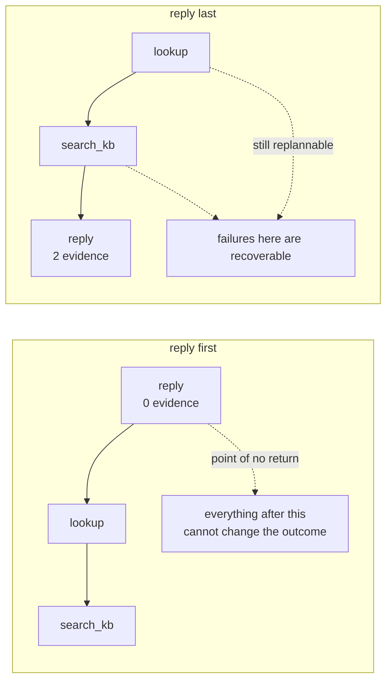

# 6.3 — The step you cannot take back

## One-line answer

Every repair in this day — retry, patch, rewrite, resume — assumes the step can be run again, and one
class of step cannot: moving the reply from position 1 to position 3 changes **nothing** about the
actions and turns a plan that answers a customer on zero evidence into one that answers on two.

## The story

You are in a group with fourteen people in it — the flat owners, the secretary, the man who arranges
the water tanker — and somebody has said something about the lift repairs that is wrong.

You type a reply. It is sharper than you meant, because you have typed it twice already today in your
head. You press send.

Two seconds later you see it sitting there in the group, in your own name, and you understand exactly
how it reads.

You delete it. The app says *this message was deleted*.

Eleven people have already read it. The message is gone and the reading is not, and the little grey
line saying a message was deleted is now its own small announcement. There is no version of the next
five minutes in which the message was not sent.

## The idea in plain language

An action is **reversible** if doing it and then undoing it leaves the world as it was. Reading a
ticket is reversible in the strongest sense: it leaves no trace to undo. Writing a row is often
reversible — delete the row. Sending a message to a person is not, and no amount of engineering makes
it so, because the irreversible part happened in somebody's head.

Every mechanism this day has built quietly assumes reversibility:

| Mechanism | What it assumes |
| --- | --- |
| retry (part [4.2](../04-when-a-plan-dies/4.2-retrying-a-contradiction.md)) | running the step again is free |
| patch (part [5.1](../05-the-second-edition/5.1-let-the-seam-out-or-recut-the-cloth.md)) | dropping a step un-does its effect |
| carry forward (part [5.2](../05-the-second-edition/5.2-the-work-already-paid-for.md)) | a repeated step is merely wasteful |
| resume (part [3.3](../03-walking-the-plan/3.3-a-plan-that-outlives-its-process.md)) | re-running from a cursor is safe |

Every row is true for a lookup and false for a reply. That is the whole subject of this part, and the
practical response to it is not a new mechanism. It is **ordering**.

If the irreversible step is last, then every failure before it is a failure you can still replan out
of, and the point of no return has not been passed. If it is first, the plan has spent its
irreversibility before it has learned anything, and every clever repair downstream is repairing
something that no longer matters.

That is a property of the plan, and it is checkable at plan time by looking at positions.

## Why Sutra needs it

Day 63 designs approval gates and its central question is *what needs a human, and why*. This part is
the answer to the second half: what needs a human is the step that cannot be undone, and the reason
is that a gate in front of a reversible action buys you very little — you could always fix it
afterwards — while a gate in front of an irreversible one is the only chance anybody gets.

Day 60's idempotency is the other half. Ordering makes the irreversible step *late*; idempotency
makes it *safe to attempt twice*. You need both, because part
[5.2](../05-the-second-edition/5.2-the-work-already-paid-for.md) showed a replan re-running a step
with no crash involved at all.

## The mechanism

Two plans with the same three actions and the same goal, differing only in position.

```python
IRREVERSIBLE = {"reply"}
```

**Line by line:**

- A set of **action names**, not of steps. Irreversibility is a property of the kind of thing, decided
  once, at the same level as the closed set from part
  [1.2](../01-what-a-plan-is/1.2-what-a-step-has-to-carry.md).
- It is a set rather than a flag on `Step`, so a planner cannot mark its own step reversible. The
  same argument as part [5.3](../05-the-second-edition/5.3-the-brake-and-the-sentence-it-prints.md)'s
  brake: the component being constrained does not get to set the constraint.
- One element today. The `IRREVERSIBLE` set growing is the thing that should force a conversation,
  which is why part [6.2](6.2-the-plan-somebody-reads-first.md) wants the card generated from it.

```bash
cd days/day-56-planning-and-replanning/lab
uv run python irreversible.py
```

**Line by line:**

- No flag runs `EARLY`, the plan with the reply first. `--ordered` runs `LATE`, which holds the same
  three steps in a different order.
- The `evidence available` column is `i - 1` — the number of steps that ran before this one. It is
  the number the whole part turns on.

Measured on 2026-09-05:

```text
goal: Tell the customer what is wrong with their sign-in.

  1/3 reply(4633)          ok   IRREVERSIBLE  evidence available: 0
  2/3 lookup_ticket(4633)  ok                 evidence available: 1
  3/3 search_kb(KB-104)    ok                 evidence available: 2

  replies sent : ['4633']
  irreversible step at position 1 of 3

  The reply went out first, with zero pieces of evidence behind it. Replanning
  cannot help here: a plan can be revised, and a sent message cannot.
```

**`evidence available: 0`** on the step that sends. The customer has been answered before the ticket
was read.

Everything is `ok`. There is no failure here to retry, no contradiction to replan, and part
[6.1](6.1-every-step-ran-and-nothing-was-answered.md)'s answer condition would very possibly pass,
because the run *does* eventually gather the cookie-and-redirect evidence — in steps 2 and 3, after
the reply went out.

Now the same three actions, reordered:

```bash
uv run python irreversible.py --ordered
```

**Line by line:**

- `--ordered` selects `LATE`. Compare its `steps` tuple with `EARLY`'s in the source: the three
  `Step` objects are the same objects in a different order.

Measured on 2026-09-05:

```text
  1/3 lookup_ticket(4633)  ok                 evidence available: 0
  2/3 search_kb(KB-104)    ok                 evidence available: 1
  3/3 reply(4633)          ok   IRREVERSIBLE  evidence available: 2

  replies sent : ['4633']
  irreversible step at position 3 of 3

  Same three actions, same goal, one different order. The irreversible step is now
  last, so every earlier failure is still a failure you can replan out of.
```

Same actions. Same arguments. Same goal. Same `replies sent`. **One different order**, and the reply
now goes out on two pieces of evidence instead of none.

The check that distinguishes them is two lines and runs before anything happens:

```python
    irreversible_at = [i for i, s in enumerate(plan.steps, 1) if s.action in IRREVERSIBLE]
    print(f"  irreversible step at position {irreversible_at[0]} of {len(plan)}")
```

**Line by line:**

- `enumerate(plan.steps, 1)` — positions, one-based, matching how the card in part
  [6.2](6.2-the-plan-somebody-reads-first.md) numbers them, so a reviewer and a checker are talking
  about the same step 3.
- The result is a **list**, not a first index, because more than one irreversible step is itself the
  interesting case — a plan that sends two messages has two points of no return and the second one
  cannot be reasoned about without the first.
- This is a plan-time check: it needs no world and no execution, so it belongs beside the coverage
  score in part [1.3](../01-what-a-plan-is/1.3-the-plan-you-can-read-before-it-runs.md) and can be a
  gate on the same terms.



## When it breaks

The rule *put the irreversible step last* is not always available, and pretending it is would be the
wrong lesson.

Some goals genuinely require an irreversible action in the middle. *"Ask the customer which browser
they are using, then look up the matching article, then reply"* has a message going out at step 1 —
it is the whole point of step 1 — and no reordering fixes that, because the information the plan needs
is behind the message.

So the honest rule is weaker and more useful: **every irreversible step should be preceded by
everything that could have changed whether to take it.** Sometimes that is the whole plan, which
means last. Sometimes it is two steps.

And there is a failure the position check cannot see at all. Run the ordered arm and look at the
final line: `replies sent : ['4633']`. Now look at part
[4.4](../04-when-a-plan-dies/4.4-the-plan-that-outlived-the-world.md)'s stale run, whose last line
was the same. In both cases the reply went out last, after the evidence, exactly as this part
recommends — and in the stale case the ticket had been closed and merged in between.

**Ordering does not make an irreversible step correct. It makes it late.** Being late is what buys
the chance to be correct, and the check that takes that chance is the verify step part
[4.4](../04-when-a-plan-dies/4.4-the-plan-that-outlived-the-world.md) argued for: confirm the fact the
irreversible action rests on, immediately before taking it.

Two mechanisms, in order, and neither substitutes for the other.

## In production

**What a professional writes instead.** Three things, and they compose. **A validator at plan time**
that refuses a plan whose irreversible step precedes the steps it depends on — which needs the
dependency edges part [3.2](../03-walking-the-plan/3.2-what-a-step-is-allowed-to-see.md) asked for,
the fourth problem solved by that one absent field. **An idempotency key** on the action itself, so a
replan or a resume that reaches it twice sends once (Day 60). And **a gate** in front of it, because
a step that cannot be undone is the definition of a step worth a human's attention (Days 63 and 64).

**What degrades at scale.** The set of irreversible actions grows and nobody notices. It starts as
`{"reply"}`; then somebody adds `close_ticket`, then `refund`, then `notify_manager`, and each is
added by someone thinking about their own feature rather than about the plan-level invariant. Within
a year there are irreversible steps scattered through plans with no ordering discipline at all. The
countermeasure is that irreversibility is declared on the **action definition**, so adding an action
means answering the question.

**The failure that only appears with real traffic.** Partial irreversibility. A step that sends a
message to an internal queue looks reversible in testing — you can drain the queue — and is
irreversible in production because something on the other end already acted on it. The boundary of
"your system" is not where the code ends, and the actions that cross it are not always the ones with
obvious names.

**The review comment a senior engineer leaves:** *"`reply` is at position 1 of this plan. Nothing
downstream can affect what the customer already received, so every retry, replan and resume in this
codebase is doing nothing for the only step that mattered. Order irreversible actions last, and add a
plan-time check that fails the plan if one appears before the steps it depends on."*

**The interview question:** *"What breaks when an agent's plan has a side effect in it?"* An honest
answer: *"Every recovery mechanism you have. Retry assumes running it again is free, patching assumes
dropping a step undoes it, resume assumes re-running from a cursor is safe — all true for a lookup,
all false for a message that has been sent. The cheapest fix is ordering, and it is remarkably
cheap: I ran the same three actions with the reply first and with the reply last, and the actions,
arguments and goal were identical. With it first, the customer was answered on zero pieces of
evidence; with it last, on two. Nothing else changed. What I would be careful about is over-claiming
for that: ordering makes the step late, it does not make it right. I had a run where the reply was
correctly last, after all the evidence, and the ticket had been merged and closed in the meantime —
so late still needs a verify step immediately before it, and ideally an idempotency key so a replan
that reaches it twice only sends once."*

## Check yourself

```bash
cd days/day-56-planning-and-replanning/lab
uv run python irreversible.py
uv run python irreversible.py --ordered
```

Now add `"compare"` to the `IRREVERSIBLE` set in `irreversible.py`, re-run both arms, and write down
what the position check reports — and whether you agree with it.

**Out loud, without scrolling up:** name the four mechanisms from this day that assume reversibility,
and give the case where *put it last* is not available.

**Next:** [6.4 — 🅿️ Plan repair, hierarchy and search](6.4-plan-repair-hierarchy-and-search.md).
