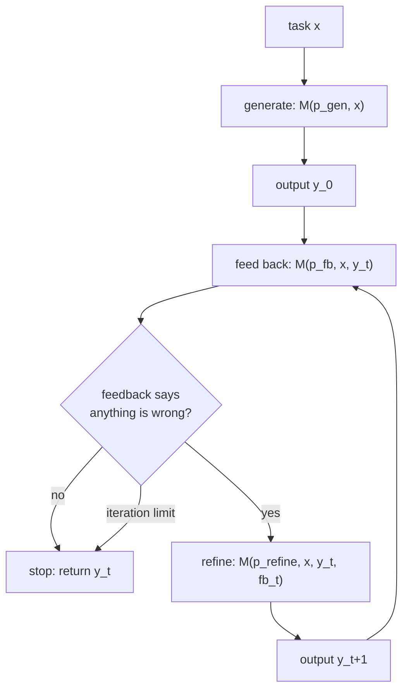

# Self-Refine: Iterative Refinement with Self-Feedback

## One-line answer

One model, asked in three separate turns to write, then to say what is wrong with what it wrote,
then to rewrite using that list, produces better output than the same model asked once — and the
paper's own numbers say the gain comes from the **feedback step**, not from the extra attempts.

## The story

A student finishes a written paper with time to spare and reads it through again.

The first read changes nothing. They know what they meant, so they see what they meant, and every
sentence looks like the sentence they intended to write. The page and the intention have become the
same object in their head.

Then the invigilator says a sentence that has been said in examination halls for a very long time:
*"Check your answers against the question."*

So the student does something different. Instead of reading the paper, they read the **question**,
and next to each part of it they write a tick or a cross on the corner of the desk. Part (a): tick.
Part (b): tick. Part (c) asks for two examples. They wrote one.

Nothing arrived from outside. No teacher marked anything. The same head that missed it on the first
read caught it on the second — and the only thing that changed was that the second read was **against
something**, and produced a list, and the list was then acted on.

That is the whole paper. The interesting question, which the paper asks and answers, is when this
works and when it is a student reading their own paper and feeling reassured.

## The idea in plain language

Three terms first, because the paper's title uses all of them.

**Refinement** is rewriting something you have already written, rather than starting again. The
second version is produced *from* the first, not instead of it.

**Feedback** is a statement about a specific piece of work saying what is wrong with it. It is not a
score and it is not an opinion; the paper's feedback is text that names problems.

**Self-feedback** means the feedback comes from the same model, with the same weights, that produced
the work. Nobody trains anything, nobody adds a second model, and there is no human in the loop.

The method is three prompts to one model, in a cycle:

1. **Generate.** Produce an answer to the task.
2. **Feed back.** Given the task and that answer, say what is wrong with it.
3. **Refine.** Given the task, the answer and the feedback, produce a better answer.

Then go back to step 2 with the new answer, and stop when the feedback says there is nothing left or
a limit is reached. No gradient is computed, no weights change, nothing is trained. It is a prompting
pattern, and that is why it landed in so many systems so quickly: it costs nothing but calls.

The paper reports this across seven tasks — dialogue responses, mathematical reasoning, code, and
others — and finds roughly a **20% absolute** improvement on average over generating once, with both
human raters and automatic metrics preferring the refined output.

## Why Sutra needs it

Day 57 is built on a claim that is easy to state and awkward to defend: **generation and judgement
are different jobs and belong in different heads**. [3.1](../parts/03-the-critic/3.1-a-check-you-never-ran-cannot-fail.md)
measures the mechanism behind it — a writer grading its own draft passes every check it never
thought to run, and the desk's own fixture shipped four drafts out of four with twelve of twenty
rubric lines failing.

This paper is the strongest published argument on the *other* side. It says one head is enough, as
long as you make it look twice and make the second look produce a list. If that is true in general,
then Sutra's Writer↔Critic pair is spending a second agent's worth of design for nothing, and
[5.1](../parts/05-does-it-help/5.1-did-the-critic-actually-help.md)'s arithmetic — sixteen model
calls to move eight rubric lines to twenty — is money badly spent.

So this document is here to be argued with, and Principle 4 says to read it **after** building the
pair rather than before: you have now watched a self-grader pass its own draft, so you can hold both
results at once instead of believing whichever you met first. The honest resolution is in *When it
breaks*, and it is not "the paper is wrong".

Day 63's approval-gate design leans on the same seam from the safety side: when a check must be
independent, and when a second look by the same party is enough.

## The mechanism

The loop, written out. `M` is one model; the three prompts differ only in what they ask for.



Four details in the method that are easy to skim past and are the whole reason it works.

**The three prompts are different prompts.** The feedback prompt is not "is this good?" — it asks for
*specific, actionable* feedback, with few-shot examples showing what specific and actionable look
like. The paper is explicit that this matters: generic feedback produces no improvement, because a
refinement step given nothing to change changes nothing.

**The history is carried.** The refine step sees the task, the previous output *and* the feedback.
It is not a fresh generation; it is an edit with a reason attached.

**The stopping condition comes out of the feedback itself.** The model is prompted so that its
feedback can say the output is acceptable, and that is the signal to stop. There is also a hard
iteration limit, because a stopping condition produced by the thing being stopped is not reliable —
which is exactly [4.2](../parts/04-stopping/4.2-the-brake-belongs-to-the-graph.md)'s argument,
arrived at from the other direction.

**It is inference-time only.** No supervised data, no reinforcement learning, no fine-tuning. That
is the claim that made the paper cheap to adopt, and it is also the claim that limits it, because
nothing about the model's ability to judge has changed between step 1 and step 2.

## The paper in one demo

Two files. The loop, and a stand-in for the model it calls.

```text
lab/papers/self-refine/
├── model.py     # a deterministic stand-in for the one model, and the evaluator
└── refine.py    # the paper's loop, and the ablation switch
```

What is simulated is the **model**, not the method: `refine.py` is the paper's cycle, and it calls
`model.py` at exactly the three points where the paper calls a language model. That is what lets this
run on any machine with no key and no quota (Addendum 02), and it is why the output below is pasted
from a run rather than left as a `TODO`.

The stand-in has one property, and it is the one the paper's result depends on: a generator writes
from the intent it currently holds, and told nothing new it writes the same thing again.

```python
# model.py - the three roles Self-Refine asks of one model, made deterministic.
REQUIRED = ("symptom", "when", "who")

FACTS = {
    "symptom": "the export file is empty",
    "when": "since the Tuesday release",
    "who": "three accounts on the shared plan",
}

INITIAL_INTENT = ("symptom",)

CALLS = {"generate": 0, "feedback": 0}


def generate(holding: tuple[str, ...]) -> str:
    """Write the summary from the facts currently held. Deterministic in `holding`."""
    CALLS["generate"] += 1
    ordered = [key for key in REQUIRED if key in holding]
    return "Bug: " + ", ".join(FACTS[key] for key in ordered) + "."


def feedback(summary: str) -> tuple[str, ...]:
    """Read the summary and say which required facts are not in it. The paper's middle step."""
    CALLS["feedback"] += 1
    return tuple(key for key in REQUIRED if FACTS[key] not in summary)


def score(summary: str) -> int:
    """How many required facts the summary carries. The evaluator, not the model."""
    return sum(FACTS[key] in summary for key in REQUIRED)
```

**Line by line:**

- `REQUIRED` is the task's success condition, held separately from the generator. The generator never
  reads it; only `feedback` and `score` do. If the generator could read it, the demo would prove
  nothing, because the first attempt would already be perfect.
- `INITIAL_INTENT` is `("symptom",)` — one fact out of three. This is the state the paper's step 1
  starts from: a first attempt that is not wrong, just incomplete.
- `generate` is deterministic in `holding` and in nothing else. That is the property that makes the
  ablation meaningful: calling it again without changing `holding` cannot produce a different answer,
  so any improvement in the full run has to have come through `holding`, which only feedback writes to.
- `feedback` returns the *keys that are missing*, not a score and not a paragraph. This is the paper's
  "specific, actionable" requirement reduced to its smallest honest form.
- `score` is the evaluator and is deliberately not part of the loop. A method that is allowed to read
  its own grader is not being measured.
- `CALLS` counts model calls, because the ablation has to hold them equal.

```python
# refine.py - the loop from the paper, and the switch that turns its contribution off.
MAX_ITERATIONS = 3


def self_refine(use_feedback: bool) -> tuple[str, list[str]]:
    """The loop from the paper. With `use_feedback` false, the middle step is skipped."""
    holding = model.INITIAL_INTENT
    summary = model.generate(holding)
    trail = [f"iteration 0: {summary!r}  (score {model.score(summary)}/3)"]

    for step in range(1, MAX_ITERATIONS + 1):
        if use_feedback:
            missing = model.feedback(summary)
            if not missing:
                trail.append(f"iteration {step}: feedback found nothing missing, stopping")
                break
            holding = holding + missing
            trail.append(f"iteration {step}: feedback says missing {list(missing)}")
        else:
            trail.append(f"iteration {step}: no feedback, regenerating from the same intent")
        summary = model.generate(holding)
        trail.append(f"            -> {summary!r}  (score {model.score(summary)}/3)")

    return summary, trail
```

**Line by line:**

- `holding = model.INITIAL_INTENT` then one `generate` before the loop: that is step 1 of the paper,
  outside the cycle, exactly as the method states it.
- `if not missing: break` is the paper's own stopping condition — the feedback step is what decides
  the loop is finished, not a counter.
- `holding = holding + missing` is the refine step. The feedback is *carried into* the next
  generation rather than thrown away, which is the difference between refining and retrying.
- The `else` branch is the ablation, and it is written to be **unfair to the paper on purpose**: it
  still calls `generate` on every iteration. Removing feedback *and* the extra calls would compare
  two different compute budgets and prove nothing about feedback.
- `MAX_ITERATIONS = 3` is the hard limit that sits outside the model's judgement.

Run it. Measured on 2026-09-05:

```text
$ uv run python refine.py
Self-Refine, feedback ON

  iteration 0: 'Bug: the export file is empty.'  (score 1/3)
  iteration 1: feedback says missing ['when', 'who']
              -> 'Bug: the export file is empty, since the Tuesday release, three accounts on the shared plan.'  (score 3/3)
  iteration 2: feedback found nothing missing, stopping

  final:            'Bug: the export file is empty, since the Tuesday release, three accounts on the shared plan.'
  score:            3/3
  generate calls:   2
  feedback calls:   2
```

Now the ablation — the same loop with the middle step removed and the generation calls left running:

```text
$ uv run python refine.py --ablate
Self-Refine, feedback OFF (ablation)

  iteration 0: 'Bug: the export file is empty.'  (score 1/3)
  iteration 1: no feedback, regenerating from the same intent
              -> 'Bug: the export file is empty.'  (score 1/3)
  iteration 2: no feedback, regenerating from the same intent
              -> 'Bug: the export file is empty.'  (score 1/3)
  iteration 3: no feedback, regenerating from the same intent
              -> 'Bug: the export file is empty.'  (score 1/3)

  final:            'Bug: the export file is empty.'
  score:            1/3
  generate calls:   4
  feedback calls:   0
```

Read the two call counts before the two scores. The ablated run spent **four** generation calls and
scored **1/3**. The full run spent **two** and scored **3/3**. More attempts, worse result — because
attempts were never the mechanism. The output moved when, and only when, something wrote into
`holding`, and the only thing that writes into `holding` is the feedback step.

That is the claim made switchable, which is what §17.4.2 asks a demo for: not evidence that some code
ran, but evidence that *this idea* changed the outcome.

## When it breaks

The paper is careful, and the careless version of it is what spread. Four limits, and the last one is
the one Day 57 is built on.

**The model has to be able to tell.** Self-Refine improves output when the model can recognise the
problem it could not avoid — and those are different capacities. The paper's own framing is that
refinement works where verification is easier than generation. Where judging is as hard as writing,
the feedback step returns a confident, well-formed list of nothing useful, and the refinement obeys
it. The demo above makes this visible by construction: `feedback` can read `REQUIRED` and `generate`
cannot, and *that asymmetry is the entire result*. Remove it and the loop does nothing.

**It was measured on tasks with checkable answers.** Mathematical reasoning, code optimisation,
acronym generation, sentiment reversal, dialogue response. The improvement is an average across
seven such tasks. "Is this reply to an upset customer appropriate?" is not that shape, and the paper
does not claim it is.

**The stronger the base model, the less room there is.** Improvement is measured against the same
model generating once, so a task the model already gets right cannot improve, and a task it cannot do
at all does not improve either. The gain lives in the band between.

**Self-feedback is not independent feedback, and the paper does not say it is.** The word *self* is
in the title. Nothing in the method claims that one model marking its own work is equivalent to a
second reader, and the failure mode has a name: a model that is systematically wrong in a particular
direction is wrong in the same direction when it grades. The blind spot is shared, because it is the
same weights.

This is the resolution of the argument this document was brought in to have. **Self-Refine and Day 57
are not in conflict, because they fix different failures.**

| Failure | What fixes it |
| --- | --- |
| The writer did not *check* the work against the requirements | A second look, by anyone — including itself. Self-Refine. |
| The writer's idea of "good" is the idea that produced the draft | A second *standard*, held by something that did not write it |

Day 57's fixture is the second row. The writer passes every rubric line it never held in mind, and it
will pass them again on the second read, because reading again does not change what it is checking
against. What changes it is a written standard the checker is obliged to run — which is
[3.2](../parts/03-the-critic/3.2-a-critic-needs-something-it-can-fail-against.md), and which is also
what the paper's feedback prompt is quietly supplying with its few-shot examples.

## In production

**What survived.** The three-step loop is everywhere, usually not under this name. "Draft, critique,
revise" in an agent framework, a "reflection" step in a graph, a second pass over generated code
before it is shown — these are this paper's shape. Two of its details survived with it and are the
difference between the pattern working and being decoration: **feedback must be specific and
actionable**, and **the loop needs a hard iteration cap** rather than trusting its own stopping
signal. Both are now standard advice, and both are in the method as published.

**What did not.** The framing of self-feedback as a general-purpose quality mechanism did not
survive contact with production. Where the output matters and the failure is expensive, the industry
moved the judge: to a separate prompt with a written rubric, to a different and often cheaper model,
to deterministic checks, or to a human — which is Days 62 to 64. The reason is the fourth limit
above and it is structural rather than empirical: a shared blind spot cannot be found by the thing
that has it. What is left of self-refinement in serious systems is usually the **cheap first pass** —
catch the obvious, then hand what survives to something independent.

The second thing that did not survive is the arithmetic, in exactly the place this curriculum
cares about. The method multiplies calls per output — the demo above shows two generate plus two
feedback for one summary, and the paper's own runs go further. On a paid account that is a line item.
On a free tier it is
[5.2](../parts/05-does-it-help/5.2-what-the-pair-costs-in-requests.md)'s table: the day's quota buys
250 unreviewed replies or 62 reviewed ones. Nobody runs an unbounded refinement loop on a free tier
twice.

**The review comment a senior engineer leaves:** *"This is Self-Refine with the feedback prompt
replaced by 'is this good?'. The paper's result is about specific, actionable feedback and you have
asked for an opinion, so the refine step has nothing to act on. Either give the feedback step a
written standard to check against, or take the loop out — right now it triples the calls and I cannot
see a metric that moved."*

**The interview question:** *"Does having a model critique its own output actually help?"* An honest
answer: *"Sometimes, and the condition is specific: it helps when checking is easier than producing
for that task, because then the second pass can catch what the first could not avoid. The paper
reports about twenty points absolute across seven tasks, all of them ones with checkable answers, and
its feedback prompt asks for specific actionable items rather than a verdict — that detail is doing
the work. Where it does not help is a shared blind spot, because the same weights that were wrong
are doing the grading. I built the loop with an ablation switch: with feedback it reached 3/3 in two
generation calls, and with feedback removed but the calls left running it stayed at 1/3 across four.
That told me the attempts were never the mechanism. In production I keep self-critique as the cheap
first pass and put an independent standard behind it for anything a customer sees."*

## Check yourself

```bash
cd days/day-57-orchestrator-and-critic/lab/papers/self-refine
uv run python refine.py
uv run python refine.py --ablate
```

Now open `model.py` and delete the `REQUIRED` lookup from `feedback` so that it returns `()` every
time — a critic that can no longer tell. Run the full loop again and write down the score.

**Out loud, without scrolling up:** what did this paper actually claim, what is the one property of
the task that has to hold for the claim to work, and what do we do differently on Day 57 — and why is
that not a contradiction?

**Next:** back to [the hub](../LESSON.md) for the ledger and the commit.
