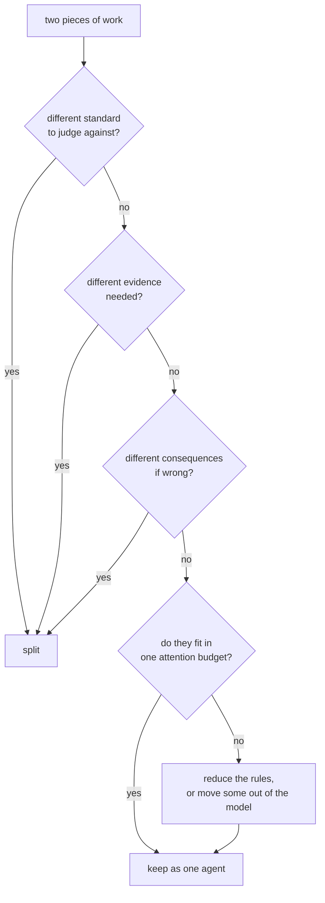

# 1.3 — The three questions that decide a split

## One-line answer

A division of labour is worth its extra requests when the two halves need **different judgement**,
**different evidence**, or **different consequences** — and a split that satisfies none of the three
has bought you a diagram.

## The story

The tailor finally does hire someone, and the argument in the shop is about what she should do.

His first idea is that she should sew and he should sew, so that twice as much gets sewn. That is a
capacity decision, and it is a perfectly good one, but it is not the interesting one, because when
the shop is quiet she is idle and the shop has learned nothing.

His second idea is the one that changes the shop. She stands at the counter when a finished garment
goes into the bag, and she checks it against the docket the customer signed: length, waist, lining,
pockets. She did not cut it. She does not know what was hard about it. She has never met the
customer.

And that is precisely why she catches things. He knows a garment was difficult, so when he looks at
it he sees the difficulty and how well he handled it. She sees a garment and a docket, and the docket
says the trousers were to be taken up an inch and a half.

The two of them are not doing the same job twice. They are doing **different jobs**, and the second
job could not be done by the person who did the first.

## The idea in plain language

[1.2](1.2-what-a-second-duty-costs-the-first.md) established that a split buys **room** — a second
budget of attention. That is real, and on its own it is a weak reason, because you can also buy room
by deleting rules or by moving them out of the model entirely into ordinary code.

The strong reasons are the ones where the second head is doing something the first head **cannot**
do, not merely something it does not have space for. There are three, and this part is the checklist
that Day 58 will apply to every stage of the triage graph.

**Question 1 — different judgement.** Do the two halves have to decide against different standards?
Writing a reply asks *"what should I say?"* Judging a reply asks *"does this meet the standard?"*
Those are different questions with different right answers, and the second one is contaminated by
having answered the first — which is the mechanism
[3.1](../03-the-critic/3.1-a-check-you-never-ran-cannot-fail.md) measures.

**Question 2 — different evidence.** Do the two halves need to *see different things*? A researcher
needs the ticket archive from Days 49 and 50. A drafter needs the retrieved rows but not the search
machinery. A critic needs the draft and the standard, and specifically must **not** see the writer's
reasoning ([3.3](../03-the-critic/3.3-what-the-critic-is-allowed-to-see.md)). When the evidence sets
differ, keeping one agent means every agent carries everyone's context, and Day 19's arithmetic says
you pay for that on every call.

**Question 3 — different consequences.** Does one half do something that cannot be undone? Reading a
ticket is free to get wrong. Sending a reply to a customer is not. A boundary between them is a place
you can later put a check, a log, a rate limit or a human — and Days 63 and 64 build exactly that on
exactly this seam. A split made here is an investment in being able to add a control later.

If none of the three is a yes, the honest answer is that the work is one job and should stay in one
head.

## Why Sutra needs it

Day 58 has five stages and will have to defend each boundary. Without a written test, the defence
becomes taste, and taste produces five agents because five boxes look better than two.

The desk's own case is the worked example. Sutra's reply writer currently does two things: it
composes the reply, and it decides the reply is good enough to send. Run the three questions over
that pair and every one of them comes back yes — different standards, different evidence, different
consequences. That is the strongest possible case for a split, and it is why this day exists at all
rather than being a warning against multi-agent systems.

Run the same three questions over "classify the ticket" and "retrieve similar tickets" and the
answers are much less clear, which is the point: the questions are supposed to discriminate.

## The mechanism

The procedure, as a decision rather than a preference:



The bottom-left branch is the one most designs skip. **Not fitting is a reason to remove duties
before it is a reason to add an agent**, because a rule enforced by ordinary code costs no requests
and never drifts. Two of the desk's five rules are like that: `short` is a word count and `no_jargon`
is a word list. Neither needs a language model to check, and moving them out of the prompt buys the
same room a second agent would, for nothing.

Applied to the desk's real work:

| Two pieces of work | Different judgement? | Different evidence? | Different consequences? | Verdict |
| --- | --- | --- | --- | --- |
| Compose the reply / decide it is good enough | yes — "what to say" vs "does it meet the standard" | yes — the critic must not see the writer's reasoning | yes — one produces text, the other releases it | **split** (this is the day) |
| Classify the ticket / retrieve similar tickets | no — both are "what is this about" | partly — one needs the index, one does not | no | keep as one, unless the rules stop fitting |
| Retrieve similar tickets / draft the reply | no | yes — the drafter needs rows, not the search | no | borderline; split on evidence, cheaply |
| Draft the reply / send it | not a model decision at all | no | **yes** — this is irreversible | split, and put the gate here (Days 63–64) |

Row four is worth pausing on. "Send it" is not an agent. It is a boundary that exists so that a
control can be attached to it, and the control does not have to be intelligent — Day 63 will argue
that most of them should not be. A split is sometimes a place to stand rather than a place to think.

The counter-test that keeps this honest: for every proposed split, name **the rule the second head
rescues**. If you cannot name one, you are buying a diagram.

## When it breaks

Two ways, and they fail in opposite directions.

**Splitting on a noun instead of on a judgement.** This is the common one. Somebody looks at the flow
and sees "tickets", "customers", "replies", and creates a TicketAgent, a CustomerAgent and a
ReplyAgent. None of the three questions was asked. What you get is three agents that all need the
same evidence, all judge against the same standard, and hand the same context back and forth — so
you have paid three requests for one agent's work, and the orchestrator now has to choose between
three descriptions that overlap, which is
[2.3](../02-the-orchestrator/2.3-two-descriptions-that-overlap-are-one-bug.md)'s failure and it is
measurable: 4 out of 10 requests routed correctly.

**Splitting a judgement that has to be made once.** If two agents both partly decide the same thing,
neither is responsible for it. The reply is too long; the writer thought the critic would catch it;
the critic thought length was the writer's job. The seam has to be a clean cut through the decision,
not a shared area of responsibility — and the way you check is to ask who is *accountable* for each
rule. Every rule in the standard should have exactly one owner. A rule with two owners has none, and
that is the version of this failure that survives review, because two owners looks like
thoroughness.

## In production

**What a professional writes instead.** They write the seam down before they write the agents: a
table with one row per rule in the standard and one column saying which agent owns it. It takes ten
lines and it makes both failures above impossible to commit silently — a rule with no owner is an
empty cell, and a rule with two owners is a cell with two names in it. That table is also the thing
Day 63 turns into an approval policy, so it is not throwaway.

**What degrades at scale.** Splits accumulate and never merge. Each one was justified when it was
made, and the justification is not written down anywhere, so a year later nobody can argue for
removing any of them. The system ends up with nine agents, of which perhaps four earn their requests,
and no way to tell which four. Recording *the rule the second head rescues*, in the commit that adds
it, is what makes the split reversible later.

**The failure mode that only appears with real traffic.** The three questions are answered on the
happy path, where each agent has a clean job. Real traffic contains the request that needs two of
them at once — a ticket that is both a bug report and a refund request — and the seam that looked
clean has a case sitting exactly on it. The orchestrator now has to route something that genuinely
belongs to both, and whichever it picks is half right. This is not a reason to avoid splitting; it is
a reason for the orchestrator to be able to say *neither*, which is
[4.3](../04-stopping/4.3-the-third-verdict.md)'s argument arriving early.

**The review comment a senior engineer leaves:** *"Which of the three does this split satisfy? It is
not judgement — both of these agents are answering 'what is this ticket about'. It is not
consequences — neither writes anything. If the answer is evidence, then say so in the pull request
and show me the context each one carries, because if they carry the same context we have added a
request per ticket for a box on a diagram."*

**The interview question:** *"How do you decide where the boundary between two agents goes?"* An
honest answer is a test, not a philosophy: *"I ask three things: do the two halves judge against
different standards, do they need to see different evidence, and does one of them do something
irreversible. Any yes justifies the boundary and I write down which one, so it can be argued with
later. If all three are no, the work is one job — and if it does not fit in one instruction block,
my first move is to take rules out of the model rather than add an agent, because a length limit is a
word count and does not need a model call. The split I would refuse is the one along nouns: a
TicketAgent and a ReplyAgent that need the same context and judge by the same standard are one agent
that costs two requests."*

## Check yourself

Take the five stages Day 58 will assemble — intake, classify, research, draft, review — and run the
three questions over each of the four boundaries between them. Write the table, and for each
boundary you would keep, name the rule the second head rescues.

```bash
cd days/day-57-orchestrator-and-critic/lab
uv run python onehead.py --split
```

**Out loud, without scrolling up:** name the three questions, and say what you should do *before*
adding an agent when the only problem is that the rules no longer fit.

**Next:** [2.1 — An orchestrator owns the flow, not the work](../02-the-orchestrator/2.1-an-orchestrator-owns-the-flow-not-the-work.md).
