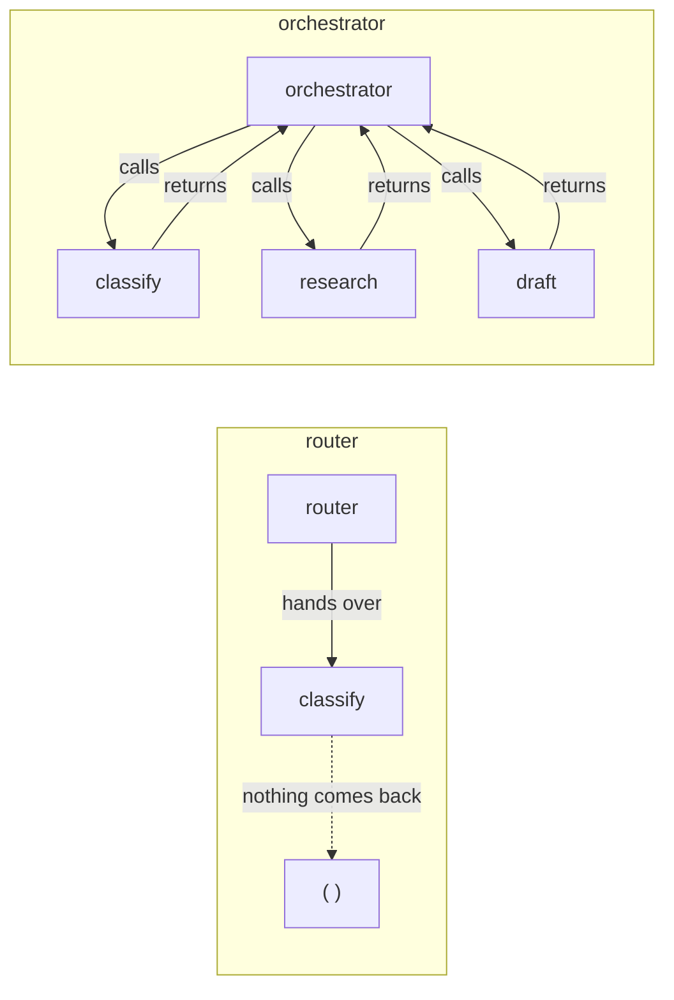

# 2.2 — Orchestrator or router — the difference is whether it comes back

## One-line answer

A router picks who handles the request and stops existing; an orchestrator picks who handles the
*next step* and is still there afterwards — so a router can run one stage and an orchestrator can
run five.

## The story

There are two desks in the entrance of a big hospital and they look identical.

At the first one you say why you are there and they point down the corridor: *"Radiology, second
floor, follow the blue line."* You go. They have finished with you. They do not know whether you
found it, whether radiology could help, or whether you needed blood tests afterwards. If you come
back it is a new conversation, and you start again.

At the second desk you say why you are there and they take a card, write on it, and send you to
radiology — and they keep the card. When you come back they look at the card, write the result on
it, and send you to the blood tests. Then they look again and tell you which consultant you need and
that you are booked in on Thursday.

Both desks pointed at radiology first. Only the second one could get you all the way through,
because only the second one **still had the card** after you walked away.

## The idea in plain language

Day 55 built the mechanism this rests on: a **call** comes back, a **transfer** does not. That part
is [2.1 — A call comes back](../../../day-55-delegation-and-transfer/parts/02-call-or-handover/2.1-a-call-comes-back.md),
and if the distinction is not sharp in your head, read it before this one.

This part is what that mechanism means for **design**.

A **router** decides who should handle a request, hands the request over, and is finished. Its
decision is made once, at the start, on the information available at the start. After the hand-off
the router holds nothing and is responsible for nothing.

An **orchestrator** decides what happens next, gets control back when that step finishes, and decides
again. Its decisions are made repeatedly, each one informed by what the previous step returned.

The consequence is the whole of this part: **a router cannot sequence.** Not "should not" — cannot.
Sequencing requires being present after step one in order to start step two, and a router by
definition is not. Everything else follows:

| | Router | Orchestrator |
| --- | --- | --- |
| Decisions per request | one | one per step |
| Sees the result of a step | no | yes |
| Can react to a failure | no | yes |
| Can loop | no | yes |
| Holds state across steps | no | yes |
| Cost | one decision | one decision per step |

That last row is the honest cost, and it is why a router is not simply the worse option. If your
request genuinely needs one specialist and then it is done, a router is correct and an orchestrator
is a model call per step spent on a flow that never branches.

## Why Sutra needs it

Day 58's triage flow is five stages, and two of them are conditional: research is skipped when
classification is confident, and review sends the draft back to the writer when it is not good
enough. Both of those are decisions made **after** seeing the result of an earlier stage.

That settles it. The triage flow needs an orchestrator, and the reason is not that orchestrators are
better — it is that a router structurally cannot express "look at what came back and decide again".

It matters in the other direction too. Sutra has one place where a router is the right answer:
choosing between the ticket history and the product handbook for a single lookup. One decision, one
specialist, one answer, done. Building an orchestrator for that would spend a decision call per step
on a flow with one step, and the next part shows what that decision costs when it is made badly.

## The mechanism

Two shapes over the same five stages, so the difference is a count rather than an argument.

```python
STAGES = ("classify", "research", "draft", "review", "send")


def orchestrated() -> list[str]:
    """The orchestrator calls each specialist and is still standing when the call returns."""
    done: list[str] = []
    for stage in STAGES:
        result = specialist(stage, done)
        # Control is back here. The orchestrator can look at `result` and decide what is next.
        if stage == "classify" and "finished" in result:
            continue
    return done


def routed() -> list[str]:
    """The router hands the whole request to one specialist. There is no 'after'."""
    done: list[str] = []
    specialist(STAGES[0], done)
    # Control left with the first specialist. Nothing below this line is the router's to run,
    # because the router is no longer the thing holding the conversation.
    return done
```

**Line by line:**

- `orchestrated` has a **loop**, and that is not an implementation detail — it is the definition. The
  loop body can only exist because control returns to it after `specialist(...)`.
- `result = specialist(...)` binds the return value. A router has nowhere to put a return value,
  because the thing that would have received it is gone.
- The `if stage == "classify"` line is there to be a decision made *on a result*. It is trivial on
  purpose: the point is that there is a place to put it at all.
- `routed` has no loop and no binding. It is not a shortened version of the orchestrated function —
  it is a different shape, and the comment marks the exact line after which the router has no
  standing. In a real transfer that line is not "code that does not run"; it is code that belongs to
  nobody.
- Neither function calls a model. The five stages are recorded by appending a name, so the count at
  the end is a fact about control flow and nothing else.

Run both:

```bash
cd days/day-57-orchestrator-and-critic/lab
uv run python router.py
uv run python router.py --route
```

**Line by line:**

- The default arm is orchestration; `--route` is the router. Same stages, same specialists, same
  fixture.
- The script prints one line per stage and then the count, because the count alone would hide *which*
  stages never happened, and which ones they are is the interesting part.

Measured on 2026-09-05:

```text
orchestrator (calls and returns):
    classify   ran
    research   ran
    draft      ran
    review     ran
    send       ran

  5/5 stages ran
```

```text
router (hands over):
    classify   ran
    research   -
    draft      -
    review     -
    send       -

  1/5 stages ran
  the remaining four are not late. There is nothing left to run them.
```

That last line is the one to hold on to. When a routed flow "hangs", people look for the slow step.
There is no slow step. The four stages are not queued, not blocked and not waiting — nothing in the
system has them, because the only component that knew they were supposed to happen handed the
conversation away and stopped.



## When it breaks

The dangerous version is the **accidental** router: a system designed as an orchestrator where one
specialist transfers instead of returning.

Everything before the transfer works. Everything after it silently does not happen, and the run
reports success, because from the runtime's point of view nothing failed — a conversation was handed
over and it ended normally. Day 55's failure lab has the ADK-level version of this as a truncated
pipeline; here is the same thing counted:

```bash
cd days/day-57-orchestrator-and-critic/lab
uv run python -c "
import router
print('orchestrated:', len(router.orchestrated()), 'of', len(router.STAGES))
print('one transfer: ', len(router.routed()), 'of', len(router.STAGES))
print('missing:      ', [s for s in router.STAGES if s not in router.routed()])
"
```

```text
orchestrated: 5 of 5
one transfer:  1 of 5
missing:       ['research', 'draft', 'review', 'send']
```

Four stages missing, exit code zero, no exception, no log line saying anything is wrong. The reply
was never drafted, so the customer got nothing — and the only evidence is an absence, which is the
hardest kind of thing to alert on. The fix is to alert on the **presence** of the final stage rather
than the absence of an error: a run that did not reach `send` is a failed run, whatever the exit code
says. That is Principle 10 applied to control flow.

The opposite break is cheaper and more common: an orchestrator built for a flow that never branches.
Five stages, always in the same order, with a model call before each one deciding what everybody
already knows. That is five decisions spent to produce a constant, and Day 53's graph does the same
sequencing with edges for nothing.

## In production

**What a professional writes instead.** They do not choose between the two globally; they use both,
at different levels. The outer flow is a **graph** — edges, no model calls, because the shape of a
triage pipeline is known at design time and does not need to be rediscovered on every ticket. A model
orchestrator appears only where a decision is genuinely open, and a router appears at the leaves where
one specialist finishes the job. The instinct to pick one architecture for the whole system is what
produces either a model call before every fixed step, or a pipeline that stops after stage one.

**What degrades at scale.** An orchestrator's cost is linear in the number of steps, and every step
is a round trip. On a five-stage flow that is five sequential decisions before the customer sees
anything, and they are sequential by construction — the orchestrator cannot decide step three until
step two returns. Teams reach for parallelism here, and Day 54's fan-out is the right mechanism, but
the orchestrator itself remains a serialisation point. The mitigation that holds is to move fixed
sequences into edges and reserve the orchestrator for the branches.

**The failure mode that only appears with real traffic.** Transfers get introduced by accident, late,
by someone adding a specialist that "handles the whole thing from here" for one category of ticket.
It works for that category. Every other category still returns. So the pipeline truncates for
exactly one class of request, at a rate equal to that class's share of traffic, and the metric that
would show it — completed runs over started runs — is a metric nobody adds until after the incident.

**The review comment a senior engineer leaves:** *"This specialist transfers. Everything after it in
the graph is dead for any request that reaches it, and the run will still exit zero. Either make it
return a result, or move it to the end of the flow and say in the code that it is terminal. And add
the check that a run which did not reach `send` is counted as failed."*

**The interview question:** *"What is the difference between routing and orchestration?"* An honest
answer is about control, not about vocabulary: *"Whether the decider gets control back. A router
picks a handler once and is gone, so it can never react to what the handler produced — which means
it cannot sequence, cannot retry and cannot loop. An orchestrator calls and returns, so it can decide
again with the result in hand. The reason it matters in practice is the failure mode: if a stage in
an orchestrated flow transfers instead of returning, the rest of the pipeline silently does not run
and the process still exits zero. I measured that on my own flow — 5 of 5 stages with a call, 1 of 5
with a transfer, no error either time. So I alert on reaching the final stage, not on exceptions."*

## Check yourself

```bash
cd days/day-57-orchestrator-and-critic/lab
uv run python router.py
uv run python router.py --route
```

Now change `routed()` so the specialist it hands to *also* hands on to the next one, and the next.
Get all five stages to run without the router ever regaining control, then write down what the router
can still not do that the orchestrator can.

**Out loud, without scrolling up:** state the one structural thing a router cannot do, and give the
symptom you would see in production when an orchestrated flow accidentally contains a transfer.

**Next:** [2.3 — Two descriptions that overlap are one bug](2.3-two-descriptions-that-overlap-are-one-bug.md).
