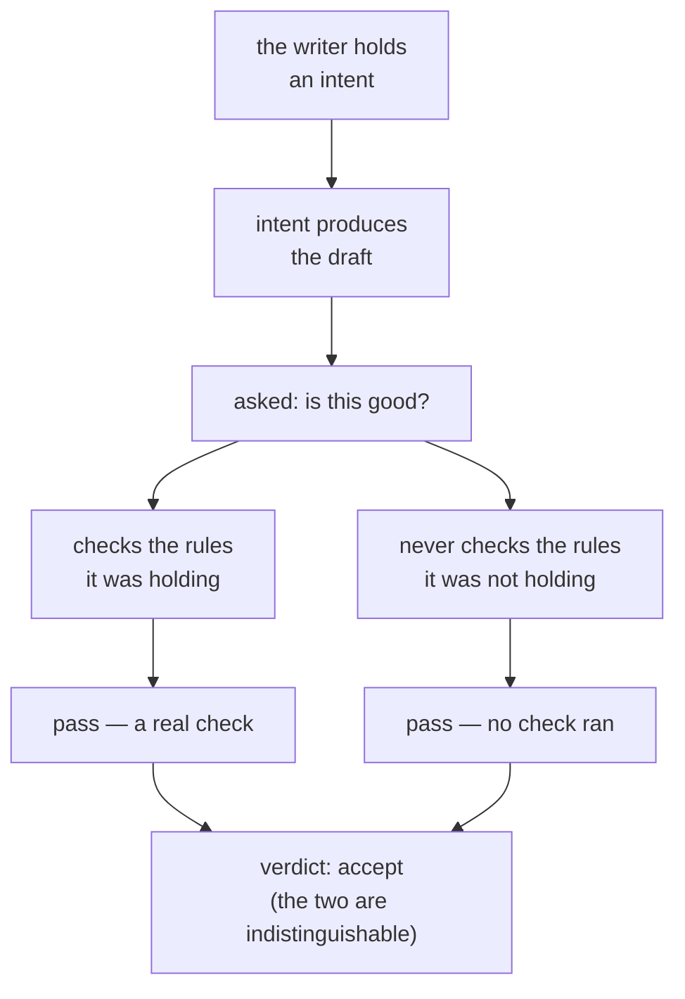

# 3.1 — A check you never ran cannot fail

## One-line answer

A writer asked whether its own draft is good reports on the rules it was **thinking about**, so
every rule it never held in mind comes back clean — and on the desk's fixture that shipped five
drafts out of five with fifteen of twenty-five standard lines failing.

## The story

You are in an examination hall and you have finished early.

You read your paper through. It is fine. You know it is fine because you know what you were doing on
each question — you remember deciding how to set out part (b), you remember choosing the second
example in part (d) because the first one was weak. Every page you turn confirms something you
already know.

At the desk in front of you, someone has stopped reading their own paper and is reading the
**question paper** instead, running a finger down it. Part (a): done. Part (b): done. Part (c) —
*"give two reasons"* — and they stop, and go back, and write a second reason in the margin.

They are not a better student than you. They did not spot a mistake by being sharper. They spotted it
because they were checking against **the question**, and you were checking against **your memory of
answering it**.

Here is the part that stings. If someone asked you afterwards whether you checked your work, you
would say yes, honestly. You did check it. You just never checked the thing that was wrong, because
checking it was never an action you took.

## The idea in plain language

Two words, defined once and used for the rest of the day.

The **artifact** is the thing that exists: the page, the draft, the reply that will be sent. It is
what the customer will read.

The **intent** is what the writer was trying to do. It exists only in the writer's head, and it is
what produced the artifact.

**Self-review checks the intent.** Not because the writer is dishonest, and not because it is
careless — but because the intent is what it has. When you ask the thing that wrote something
whether the writing is good, the question it can actually answer is "did I do what I set out to do?",
and the answer is usually yes, because setting out to do it is what caused it to be written.

The failure has a precise shape, and the shape is why it survives every review:

- A rule the writer aimed at is **checked**, and usually passes, because aiming at it is what made
  it pass.
- A rule the writer never aimed at is **not checked at all**.
- And a check that never ran cannot come back failed.

So the self-review returns "all clear" — and the two kinds of "clear" in that answer are completely
different things. One is a test that passed. The other is a test that never executed. Nothing in the
output distinguishes them, which is exactly why nobody catches it by reading the output.

This is not the same as the writer being wrong about the page. Ask it directly — *"is there jargon in
this reply?"* — and it will look, and tell you. The failure is not in its ability to check. It is in
**which checks it thinks to run**, and it thinks to run the ones it was already holding.

## Why Sutra needs it

Sutra's reply writer currently decides for itself when a reply is ready to send. That is the entire
justification for this day, and this part is the measurement that supports it.

[1.3](../01-when-to-split/1.3-the-three-questions-that-decide-a-split.md) gave three tests for
whether a split earns its requests. Run them here. Different judgement: yes — "what should I say"
against "does this meet the standard". Different evidence: yes, and
[3.3](3.3-what-the-critic-is-allowed-to-see.md) shows that letting the second head see the first
head's reasoning destroys it. Different consequences: yes — one produces text and the other releases
it to a customer. Three out of three, which is the strongest case the day will make for any split.

Day 58's review stage exists because of this part, and Day 63 leans on the same fact from the safety
side: an approval that the acting party grants itself is not an approval.

## The paper behind it

> **Self-Refine: Iterative Refinement with Self-Feedback**
> `arXiv:2303.17651` · 2023 · <https://arxiv.org/abs/2303.17651>

It reported that one model, prompted separately to generate, then critique, then revise, improves its
own output by roughly 20 points absolute on average across seven tasks — with no training of any
kind.

That is the strongest published argument against this part, and it is taught in
[this day's paper document](../../papers/01-self-refine.md), which is where the two results are
reconciled. Read it after the parts, not now.

## The mechanism

The writer's self-check, written so the mechanism is in the code rather than in a claim about it:

```python
def self_check(self, draft: str) -> dict[str, bool]:
    """Grade its own draft.

    The mechanism, stated as code rather than as an opinion: the writer examines the lines it
    was aiming at and finds them satisfied, because aiming at them is what produced the draft.
    The lines it never held in mind are never examined at all - and a line that is never
    examined cannot come back failed. So everything reads `True`, and the two `True`s mean
    completely different things: one is a check that passed, the other is a check that never
    ran.
    """
    self.calls += 1
    aimed_at = set(_INTENT[min(self.calls - 1, 4)])
    examined = {check.key: True for check in RUBRIC if check.key in aimed_at}
    never_examined = {check.key: True for check in RUBRIC if check.key not in aimed_at}
    return {**examined, **never_examined}
```

**Line by line:**

- `aimed_at` is the writer's intent for the pass that produced this draft — the same set `draft()`
  composed from. The self-check has access to the intent and to the page; a real model has exactly
  the same two things.
- `examined` and `never_examined` are built as **two separate dictionaries that both contain
  `True`**, and then merged. That is the whole point of the function and the reason it is not written
  as a one-line comprehension: the two `True`s have different meanings, and writing them separately
  is the only way to see that in the code. Merging them is what the *output* does, and the output is
  what deceives you.
- Nothing here inspects `draft`. That is not a shortcut — it is the claim. A self-check that examined
  the page against every rule would be a critic, and the point is that it does not think to.
- `min(self.calls - 1, 4)` looks back at the pass that wrote the draft rather than the current call,
  because `self_check` increments the counter like any other model call. A self-review is not free.

Now run it against a reader who has only the page and the standard:

```bash
cd days/day-57-orchestrator-and-critic/lab
uv run python selfgrade.py
```

**Line by line:**

- The script takes **two verdicts on the same draft**: the writer's own, and a fresh reader's. Both
  answer the same question — is this ready to send?
- It then prints what the standard says about the page, which is neither party's opinion but a set of
  functions over the text.
- No model is called. The 60% below is a property of the mechanism, not a measurement of any model.

Measured on 2026-09-05:

```text
the draft, and the written standard's verdict on it:
    About your report that you signed out in the middle of the onboarding form. This happened becaus...
    cause=ok fix=ok next_step=NO no_jargon=NO short=NO
    words: 94

two verdicts on the same page:
  ticket:4610
    writer's own verdict   accept  found []
    fresh reader's verdict revise  found ['next_step', 'no_jargon', 'short']
    the page actually fails ['next_step', 'no_jargon', 'short']

  the writer shipped 1 of 1 drafts on its own verdict
  3 of 5 rubric lines were failing when it did (60%)
```

The writer's verdict is `accept`, and it found **nothing**. Not "found some minor issues" — an empty
list. Meanwhile the page has the engineer's word for the bug in it, gives the customer nothing to do
next, and runs to 94 words against a limit of 70.

Across the whole fixture the picture is the same:

```text
  the writer shipped 5 of 5 drafts on its own verdict
  15 of 25 rubric lines were failing when it did (60%)
```

Five out of five shipped. Sixty per cent of the standard failing at the moment of shipping. And every
one of those five self-reviews was, from the writer's point of view, an honest and complete answer to
the question it was asked.



## When it breaks

The failure mode of *this idea* is believing it applies to everything a model says about its own
work, which is too strong and the paper is the reason.

Ask the writer a **specific** question and it answers well. Watch:

```bash
cd days/day-57-orchestrator-and-critic/lab
uv run python -c "
from _desk import TICKETS, Writer, RUBRIC
w = Writer(ticket=TICKETS[0]); d = w.draft()
print('open question -> ', w.self_verdict(d))
print('named check    -> ', {c.key: c.test(d) for c in RUBRIC if c.key == 'short'})
"
```

```text
open question ->  ('accept', [])
named check    ->  {'short': False}
```

Same draft, same moment. Asked *"is this good?"* the answer is a clean accept. Asked *"is this under
seventy words?"* the answer is no. **The capability was never missing; the question was.** That is
the seam the whole rest of the section fits into — a critic is not a smarter reader, it is a reader
that has been given the list of questions and is obliged to ask all of them.

The other break is real and expensive: concluding that self-review is worthless and removing it. On
tasks where checking is genuinely easier than producing, a second look by the same head does find
things, and the paper measures it. What a self-review cannot do is discover a rule it does not know
it should be applying, and that is the specific failure Sutra is exposed to — because a house
standard is exactly a list of rules the writer will not spontaneously think of.

## In production

**What a professional writes instead.** They never ask an open question of the thing that produced
the work. If self-review is used at all, it is used with the **checklist supplied**: not "is this
good?" but "for each of these five rules, quote the part of the text that satisfies it, or say it is
missing". Requiring a quotation is the practical trick — it forces the check to touch the artifact
rather than the intent, and a rule with no quotable evidence is reported as missing rather than
silently passed.

**What degrades at scale.** The gap widens as the standard grows. With two rules, a writer holding
both self-reviews accurately. With twelve rules, the intent covers the four that were salient for
this ticket and the other eight go unexamined every single time — and, worse, *which* eight varies
by ticket, so the failures look random rather than systematic and nobody can find the pattern.
[1.2](../01-when-to-split/1.2-what-a-second-duty-costs-the-first.md) measured the same growth from
the other side.

**The failure mode that only appears with real traffic.** Self-review looks fine in testing because
your test tickets are the ones you had in mind while writing the instructions, so the writer's
intent and your standard are the same set. Real tickets pull the writer's attention somewhere you did
not anticipate — an angry customer, an unusual product area — and the intent narrows to the part that
felt urgent. The rules that go unchecked are exactly the ones about tone and length, on exactly the
tickets where tone and length matter most.

**The review comment a senior engineer leaves:** *"The drafting agent decides its own output is ready.
That is not a review, it is the writer reporting that it did what it meant to do. Ours ships 5 of 5
with 60% of the standard failing. Either hand it the standard as an explicit checklist and require a
quotation per line, or put the decision somewhere that did not write the draft — but 'the agent
checks its work' is not a control."*

**The interview question:** *"Can an agent check its own output?"* An honest answer separates two
questions: *"It can check anything you name for it, and it is quite good at that. What it cannot do
is decide what to check, because the thing it would use to decide is the same intent that produced
the output — so every rule it did not have in mind goes unexamined, and an unexamined rule comes back
clean. It is not lying. 'Nothing wrong' and 'I did not look' are the same output. I measured it on my
own desk: five drafts out of five self-approved with 60% of the house standard failing, and the same
writer answered correctly the moment I asked about a specific rule by name. So I either supply the
checklist explicitly and demand quoted evidence per line, or I put the judgement in something that
did not write the draft — and for anything a customer sees, I do the second."*

## Check yourself

```bash
cd days/day-57-orchestrator-and-critic/lab
uv run python selfgrade.py
uv run python selfgrade.py --all
```

Now add a sixth rule to `RUBRIC` in `_desk.py` — one the writer's `_INTENT` never mentions — and run
it again. Write down what the writer's own verdict says about your new rule, and why.

**Out loud, without scrolling up:** explain why a self-review returns "all clear" without lying, and
say what has to be supplied to make a self-review worth anything.

**Next:** [3.2 — A critic needs something it can fail against](3.2-a-critic-needs-something-it-can-fail-against.md).
