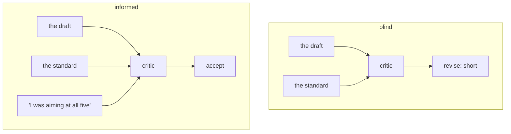

# 3.3 — What the critic is allowed to see

## One-line answer

Show the critic the writer's reasoning and the reasoning becomes the checklist: on the desk's own
fixture the same failing draft goes from **revise** to **accept** with nothing changed except what
the critic was allowed to read.

## The story

At a village show there is a competition for the best fruit cake, and the judging is done behind a
screen.

The cakes come to the table on identical white plates with a number written underneath. The judge
does not know whose cake is whose. She tastes, she writes, she scores, and the numbers are matched to
names afterwards.

One year the organisers decide the screen is unnecessary — everyone knows everyone, and it feels a
bit formal. So the bakers bring their cakes to the table themselves, and naturally they say a word or
two while they set them down. *"It's my grandmother's recipe."* *"I had to use the neighbour's oven,
mine's broken."* *"I've been trying to get this one right for three years."*

Every one of those is true, and none of them is an excuse. The judge is not corrupted and does not
become unfair.

But the cake with the broken oven gets tasted by someone who now knows about the broken oven, and
that is a different act from tasting a cake. She is no longer answering *"is this a good fruit
cake?"* She is answering *"is this a good fruit cake, given everything?"* — and those two questions
have different answers, and only one of them is the competition.

## The idea in plain language

The critic's evidence is **what it is given to look at**. Choosing that set is a design decision, and
it is a bigger lever than the critic's instructions.

The rule: **the critic sees the artifact and the standard. It does not see how the artifact was
made.**

Concretely, for Sutra's pair, here is what is in and what is out:

| Given to the critic | Withheld |
| --- | --- |
| The draft reply, in full | The writer's reasoning or plan |
| The house standard, all five rules | What the writer was aiming at this pass |
| The original ticket | How many rounds this draft has been through |
| The retrieved history the reply is based on | The writer's own verdict on it |

The withheld column is not about secrecy and it is not about fairness. It is about **which question
the critic ends up answering**.

A stated intention is a very effective checklist, and that is the danger — it is a checklist that
arrives already ticked. Told *"I addressed the cause and the fix"*, a reader goes looking for the
cause and the fix. Both are there. The reading finishes successfully, and the three rules the writer
never mentioned were never looked for, because the intention supplied a list and lists feel complete.
That is [3.1](3.1-a-check-you-never-ran-cannot-fail.md)'s mechanism transplanted into a second head:
the writer's blind spot has been handed over intact.

There is one exception worth naming, and it is not really an exception. The number of revision rounds
is withheld from the critic but **known to the graph** — because that is what
[4.2](../04-stopping/4.2-the-brake-belongs-to-the-graph.md) is about. If the critic knows it is on
round three, it starts weighing whether to be difficult, and that is a decision about the process
rather than about the draft.

## Why Sutra needs it

The desk's revision loop hands the draft from the writer to the critic and back, and the obvious
implementation shares state between them, because both are nodes in the same graph and the state is
right there. Day 53 built exactly that mechanism and Day 54 measured what happens when two nodes read
the same key.

So this failure is not hypothetical for Sutra — it is the **default**. If the writer records what it
aimed at, and the critic reads the state, the pair costs two agents and delivers one, and the metric
that would show it is the rubric pass rate rather than anything about the loop.

Day 58 has to make the same decision at the graph level: which keys the review node reads. Getting it
wrong there is invisible, because everything runs, the loop terminates, and the replies get slightly
worse.

## The mechanism

Two critics, one draft. The only difference is the second argument.

```python
def blind_review(draft: str) -> tuple[str, list[str]]:
    """The critic sees the page and the standard. Nothing else exists for it."""
    missing = [key for key, ok in grade(draft).items() if not ok]
    return ("accept", []) if not missing else ("revise", missing)


def informed_review(draft: str, intent: list[str]) -> tuple[str, list[str]]:
    """The critic also sees what the writer was aiming at, and gives it the benefit of the doubt.

    This is not a straw man. A reviewer who has read "I addressed the cause and the fix" reads the
    page looking for the cause and the fix, finds them, and stops - the stated intent has become
    the checklist, replacing the standard that was supposed to be the checklist.
    """
    aimed_at = {key for line in intent for key in RUBRIC_KEYS if key in line}
    missing = [
        key
        for key, ok in grade(draft).items()
        if not ok and key not in aimed_at  # "they meant to; close enough"
    ]
    return ("accept", []) if not missing else ("revise", missing)
```

**Line by line:**

- `blind_review` takes **one argument**. That is the design, stated in a function signature: there is
  no parameter through which the writer's reasoning could arrive, so it cannot arrive by accident
  later. A boundary you have to change a signature to cross is a boundary that shows up in review.
- `informed_review` takes the intent as a second argument and uses it in exactly one place: `key not
  in aimed_at`. That single clause is the whole failure. It does not ignore the standard — it runs
  every check — and then discards the failures the writer had said it was working on.
- The comment on that line is the sentence a reviewer actually thinks: *they meant to; close enough*.
  Nobody writes code that says "ignore this failure". They write code that says "give it the benefit
  of the doubt", which is the same code.
- `aimed_at` is derived from the writer's own log text. In a graph this is not a parameter at all —
  it is a state key that the review node happens to read, which is why the failure is so easy to
  introduce by accident.

Run both against the ticket where two rules genuinely fight:

```bash
cd days/day-57-orchestrator-and-critic/lab
uv run python evidence.py
uv run python evidence.py --shown
```

**Line by line:**

- The fixture is `ticket:5044`, whose cause takes a long sentence to explain honestly. Aiming at
  `cause` and `short` at once is not possible for this ticket, which is what makes it the right test:
  the writer genuinely tried and genuinely missed.
- `writer.calls = 3` puts the writer on its fourth pass, where its intent covers the **whole**
  standard. This matters — the writer is not being careless. It is aiming at all five rules and
  falling short on one.
- Both arms print the writer's own note and the page's true failures before the verdict, so the
  verdict can be checked rather than believed.

Measured on 2026-09-05:

```text
the writer's own note of what it aimed at: ["pass 4: aiming at ['cause', 'fix', 'next_step', 'no_jargon', 'short']"]
the page actually fails: ['short']

critic shown only the page and the standard:
    verdict revise, asking for ['short']
    rubric lines it let through: 0 of 1 failing
```

```text
the writer's own note of what it aimed at: ["pass 4: aiming at ['cause', 'fix', 'next_step', 'no_jargon', 'short']"]
the page actually fails: ['short']

critic shown the writer's reasoning:
    verdict accept, asking for []
    rubric lines it let through: 1 of 1 failing
```

Same page. Same standard. Same failing rule. **Revise becomes accept**, and the reply that goes to
the customer is 106 words against a limit of 70.

Notice what did *not* happen. The informed critic did not become lazy, did not skip the checks, and
did not misread the draft. It ran all five, found the failure, and then decided the failure was
excusable — because it had been told the writer was trying. That is a reasonable thing for a reader
to do and a catastrophic thing for a control to do, and the difference between those two roles is the
entire content of this part.



## When it breaks

The break has no error text, and that is the point — but the *shape* of it is visible in the state.
The realistic version is not a second function argument; it is a graph where the review node reads
one key too many:

```bash
cd days/day-57-orchestrator-and-critic/lab
uv run python -c "
from _desk import TICKETS, Writer
import evidence
w = Writer(ticket=evidence.TICKET); w.calls = 3; d = w.draft()
state = {'draft': d, 'writer_log': w.log, 'rounds': 4}
print('keys a review node can reach:', sorted(state))
print('blind verdict   ', evidence.blind_review(state['draft']))
print('one key too many', evidence.informed_review(state['draft'], state['writer_log']))
"
```

```text
keys a review node can reach: ['draft', 'rounds', 'writer_log']
blind verdict    ('revise', ['short'])
one key too many ('accept', [])
```

Three keys in shared state, and the critic's correctness depends on it reading one of them and not
another. Nothing enforces that. There is no exception, no warning, and no log line — the difference
between a working control and a broken one is a single subscript, chosen by whoever wrote the review
node, probably while trying to be helpful.

The second break runs the other way and is worth knowing so you do not overcorrect. Withhold the
**ticket** as well as the reasoning, and the critic is judging a reply without knowing what it is
replying to — it cannot tell whether the stated cause is the right cause. The rule is not "show the
critic as little as possible". It is precisely: **the artifact and the standard, plus whatever the
standard needs in order to be checked.** For `cause` that includes the ticket. For none of the five
does it include the writer's reasoning.

## In production

**What a professional writes instead.** The critic gets its own **explicit input contract** — a small
structure containing the draft, the ticket and the rubric — rather than access to shared state. Day
53's node input is that mechanism, and this is one of the strongest arguments for using it: a node
that receives a typed input cannot quietly start reading a state key that someone added last month.
The boundary is then reviewable, because it is a type and not a convention.

**What degrades at scale.** State accumulates keys, and every new key is a new opportunity for the
review node to read something it should not. After a year the run state has thirty keys — retry
counts, timings, the writer's confidence, previous verdicts — and nobody remembers which of them the
critic is allowed to see. The rule that survives is that the critic's input is constructed explicitly
by the graph and never handed the whole state, so that adding a key is not automatically granting
access to it.

**The failure mode that only appears with real traffic.** On easy tickets the writer achieves what it
aimed at, so intent and artifact agree and the leak is undetectable — which is why it survives
testing. It only bites on the tickets where the writer tried and fell short, and those are exactly
the hard ones: the long causes, the angry customers, the cases where two rules conflict. So the leak
degrades your output precisely on the traffic you would most want reviewed, and never on the traffic
you tested with.

**The review comment a senior engineer leaves:** *"The review node reads `writer_log` from state. Take
it out. Right now the critic is grading the writer's intentions, and on our own conflict case that
flips a revise into an accept and sends a 106-word reply against a 70-word standard. Build the
critic's input explicitly — draft, ticket, rubric — and do not pass it the state object."*

**The interview question:** *"What should a reviewer agent be able to see?"* An honest answer is a
rule with a reason: *"The artifact, the standard, and whatever the standard needs to be checkable —
so for us the draft, the rubric and the original ticket. Not the writer's reasoning, and not how
many rounds it has been through. A stated intention works as a checklist that arrives already ticked:
told what the writer was aiming at, the reviewer goes and confirms those things and stops looking. I
measured it on a case where two rules genuinely conflicted — same draft, same rubric, and the verdict
went from revise to accept purely because the critic could read the writer's note. It did not skip
any checks; it found the failure and excused it. In a graph this is a one-word bug: the review node
reads one state key too many, and nothing errors."*

## Check yourself

```bash
cd days/day-57-orchestrator-and-critic/lab
uv run python evidence.py
uv run python evidence.py --shown
```

Now change `informed_review` so it also receives the number of rounds, and let it be more lenient
after round two. Run it and write down the verdict. Then say which of the two roles — reader or
control — that critic is now playing.

**Out loud, without scrolling up:** state the rule for what a critic may see, and explain why
withholding the writer's reasoning is not about fairness.

**Next:** [3.4 — The verdict is a list, not a paragraph](3.4-the-verdict-is-a-list-not-a-paragraph.md).
