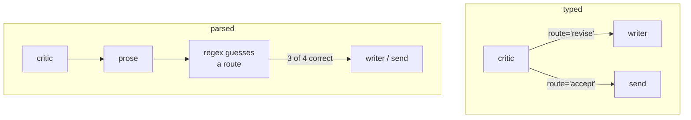

# 3.4 — The verdict is a list, not a paragraph

## One-line answer

A critic's output is read by a machine before it is read by a person, so it has to be a decision and
a list of named rules — write it as English and something has to guess, and *"This is not something I
would reject"* is guessed as a rejection.

## The story

You take a completed application form to a council counter and the clerk checks it.

If she hands it back with a sheet stapled to the front — three boxes ticked, *Section 4 incomplete*,
*Proof of address missing*, *Signature required on page 2* — you know exactly what to do. You can do
it in the corridor and come straight back.

If she hands it back and says *"there are a few bits and pieces here that aren't quite right, and to
be honest I'd want to have another look at the address side of things"*, you are going to sit down.
You will read the whole form again. You will change something you were not asked to change and miss
something you were.

The clerk is not being unhelpful. She is being *human*, and that sentence contains everything she
knows. The problem is that you cannot act on the sentence without decoding it first, and you will
decode it slightly wrong.

Now imagine the form-checking is not done by you but by a conveyor that sorts returned forms into two
bins, and the only thing it has to go on is that sentence.

## The idea in plain language

A critic's verdict has two jobs, and they are different jobs done by different consumers.

**The decision** — accept, revise, escalate — is consumed by the **graph**. Something has to choose
which edge to take, and that something is code. It needs a value from a small fixed set.

**The reasons** — which rules failed — are consumed by the **writer**. As
[3.2](3.2-a-critic-needs-something-it-can-fail-against.md) measured, they have to name rules or the
next draft changes nothing.

Neither consumer is a person, and neither wants prose. So the verdict is a small structure:

```text
verdict: "revise"
missing: ["next_step", "no_jargon", "short"]
```

That is it. Not a paragraph containing that information — the structure itself.

The alternative is to have the critic write English and then parse it, and the reason that fails is
not that parsing is hard. It is that **English has more than two ways to say each thing**, and one of
them will be a negation you did not anticipate. A parser matching "accept" and "reject" is defeated
by *"I would not reject this"*, and no amount of care fixes it, because the next phrasing has not
been invented yet.

There is a further point that only shows up later. A structured verdict can be **counted**. Which
rule fails most often, whether the failure rate is moving, which rule has never once fired — those
are all questions about a list of keys and none of them can be asked of a paragraph.
[5.1](../05-does-it-help/5.1-did-the-critic-actually-help.md) needs exactly those counts to answer
whether the critic is worth its requests.

## Why Sutra needs it

Day 58's review stage sits on a branch: accept goes to send, revise goes back to draft. That branch
is a graph edge, and Day 53 established that an edge is chosen by a route — a value, not a sentence.

So Sutra's critic must emit a route regardless. The only question is whether it emits one directly or
whether a parser sits in between manufacturing one out of prose. This part is the argument for
directly, and [6.2](../06-the-adk-box/6.2-the-verdict-steers-the-edges.md) is the ADK mechanism for
it.

The rules list matters just as much. The desk's revision loop passes the failing keys back to the
writer, which is what took the fixture from two out of five to five out of five in one round. A
paragraph would have taken more rounds, and each round is two requests against a free tier.

## The mechanism

Two critics that reach the same conclusions and report them differently.

```python
def review_typed(ctx: Context, node_input: str) -> Event:
    """The verdict travels as `route`, which the graph reads directly. Nothing is parsed."""
    missing = failures(node_input)
    ctx.state["told"] = missing
    if missing and ctx.state.get("rounds", 0) < 3:
        return Event(route="revise", output=f"missing {missing}")
    return Event(route="accept", output="ready")
```

**Line by line:**

- `Event(route=...)` is the decision, in the field the runtime routes on. Verified against installed
  `google-adk==2.7.1` and the `adk.dev/graphs/routes/` page fetched on 2026-09-05: an edge carries a
  `route`, and a node's event names the one it took.
- `ctx.state["told"] = missing` is the reasons, going to the writer. Decision and reasons travel
  separately because they have separate consumers — putting both in one string is what forces the
  parse.
- `output=f"missing {missing}"` is for the human reading the trace. It is deliberately *not* what
  anything acts on, which means it can be changed freely without breaking the graph.
- `failures(...)` returns rubric keys, so what reaches the writer is `['next_step', 'no_jargon',
  'short']` and not a sentence about them.

Now the same critic writing English, with a parser doing its best:

```python
PHRASINGS = (
    "ACCEPT",
    "Looks good to me, ship it.",
    "I would accept this, though the tone could be warmer.",
    "This is not something I would reject.",
)

ACCEPT_RE = re.compile(r"\baccept\b|\blooks good\b|\bship it\b", re.I)
```

**Line by line:**

- All four phrasings mean **accept**. None is adversarial, none is strange, and a person reads all
  four correctly without noticing there was anything to read correctly.
- `ACCEPT_RE` is a reasonable regex written by a careful person. It handles the plain word, the
  colloquial version and the idiom. It is the regex you would write.
- The fourth phrasing is the one that matters and it is not a trick. *"This is not something I would
  reject"* is ordinary English, and it contains no word from the accept pattern — but it does contain
  "reject". Every pattern-based approach gets this backwards, and adding a negation rule creates the
  next case: *"I cannot say I would not reject it."*
- `re.I` is there because case varies, which is a small illustration of the general problem: each
  fix handles one dimension of variation and there are always more.

```bash
cd days/day-57-orchestrator-and-critic/lab
uv run python steer.py
uv run python steer.py --prose
```

**Line by line:**

- The default arm runs the typed critic in a real ADK graph; `--prose` runs the parsed one. Same
  writer, same standard, same edges.
- `--prose` first prints how each of the four phrasings is classified, then runs the graph, so you
  can see the misclassification before you see what it does to the flow.

Measured on 2026-09-05:

```text
verdict as a typed route:
    writer                             'About your report that you signed out in the middle of ...'
    critic                             "missing ['next_step', 'no_jargon', 'short']"
    writer                             'About your report that you signed out in the middle of ...'
    critic                             'ready'
    send                               'SENT'
    5 events
```

Two rounds, five events, and the route was never in doubt at any point.

Now the parsed version:

```text
the critic answers in English, and the graph parses it:
    'ACCEPT'                                             -> accept
    'Looks good to me, ship it.'                         -> accept
    'I would accept this, though the tone could be warmer.' -> accept
    'This is not something I would reject.'              -> revise
```

Three out of four. The fourth is an acceptance read as a rejection, and the consequence is not an
error — it is **an extra revision round**, which is two more model calls, on a draft that was already
finished. Nothing in the logs will say "misparsed". The trace will show a loop that went round one
more time than it needed to, which looks exactly like a critic being thorough.

The mirror-image failure is worse and is the one that reaches customers: a phrasing that means
*revise* but happens to contain the word "accept" is read as accept, and an unfinished draft is sent.
`'I would accept this once the jargon is gone'` is that sentence, and it is a sentence a careful
reviewer writes.



## When it breaks

The break to reach for on purpose is the reviewer's sentence that a parser gets exactly backwards:

```bash
cd days/day-57-orchestrator-and-critic/lab
uv run python -c "
import steer
for said in ('I would accept this once the jargon is gone',
             'This is not something I would reject.',
             'No objections.'):
    print(f'{said!r:<48} -> {\"accept\" if steer.ACCEPT_RE.search(said) else \"revise\"}')
"
```

```text
'I would accept this once the jargon is gone'    -> accept
'This is not something I would reject.'          -> revise
'No objections.'                                 -> revise
```

The first line is the expensive one. A conditional acceptance — *accept this once X is fixed* — is
read as an unconditional accept, so the draft with the jargon in it goes to the customer. The critic
did its job perfectly. The rubric was right. The failure is entirely in the channel between them, and
it will never appear in an eval that checks whether the critic found the problem, because the critic
found the problem.

The third line shows the other half: a perfectly clear acceptance that matches nothing, so the loop
runs again for no reason.

There is a naive fix worth naming so you can refuse it. 😬 *"Just tell the critic to always start its
reply with ACCEPT or REVISE."* 💥 That works most of the time, which is the problem — it fails on the
tickets where the critic has something complicated to say, which are the tickets where the verdict
matters, and it fails silently. 💡 A field is not a convention about the first word of a string. If
the decision must be one of three values, make it a value of a type that has three inhabitants and
let the runtime reject the fourth.

## In production

**What a professional writes instead.** The critic returns a structured object with a decision from a
closed set, a list of rule keys, and an optional free-text note **that nothing acts on**. The note is
valuable — it is what a human reads in the trace when they are debugging — and keeping it strictly
non-load-bearing is what makes it safe to have. Where the framework supports it, the structure is
enforced by a schema on the agent so an invalid decision fails at the boundary rather than becoming a
default.

**What degrades at scale.** Parsers accumulate special cases, each one added in response to an
incident, and each one making the next phrasing more likely to be misread. The pattern to watch for
is a regex with more than three alternations in it: that is not a parser any more, it is a list of
things that went wrong in production, and it will keep growing. The structured version does not have
this failure mode at all, because there is nothing to parse.

**The failure mode that only appears with real traffic.** Prose verdicts are fine on clear-cut
tickets, where the critic says something simple. They break on the marginal ones, where the critic
hedges — *"broadly fine, but"*, *"I would not block this"* — and marginal tickets are precisely where
the verdict is doing real work. So the parse fails, at a low rate, concentrated entirely in the cases
where being right mattered. Measured against a random sample it looks like a rounding error.

**The review comment a senior engineer leaves:** *"The critic returns a paragraph and we regex it for
'accept'. That means `I would accept this once the jargon is gone` sends the draft with the jargon in
it. Return a route and a list of failed rule keys, keep the prose as an unparsed note for the trace,
and add a test with the negated phrasings — including 'no objections', which we currently read as a
rejection and pay two calls for."*

**The interview question:** *"How should one agent report a decision to another?"* An honest answer
distinguishes the consumers: *"As a value from a closed set, plus structured reasons — never as
prose that something parses. The decision is read by the graph, so it needs to be a route; the
reasons are read by the writer, so they need to name the rules that failed. If you let the critic
answer in English you need a parser, and the parser will be defeated by ordinary sentences: mine got
three of four right and read 'This is not something I would reject' as a rejection, which costs an
extra round trip, and it read 'I would accept this once the jargon is gone' as an unconditional
accept, which ships the bad draft. Neither is an error anyone can see in a log. I keep a free-text
note in the verdict because it is genuinely useful when debugging — but nothing is allowed to branch
on it."*

## Check yourself

```bash
cd days/day-57-orchestrator-and-critic/lab
uv run python steer.py
uv run python steer.py --prose
```

Now add two more phrasings to `PHRASINGS` — one meaning accept and one meaning revise, both of which
you think the regex will get wrong — and run it. Write down how many of the six are classified
correctly, then say what you would have to change to fix all six.

**Out loud, without scrolling up:** name the two consumers of a critic's verdict and what each needs,
and give a sentence a reasonable reviewer might write that a parser reads backwards.

**Next:** [4.1 — A critic will always find something](../04-stopping/4.1-a-critic-will-always-find-something.md).
