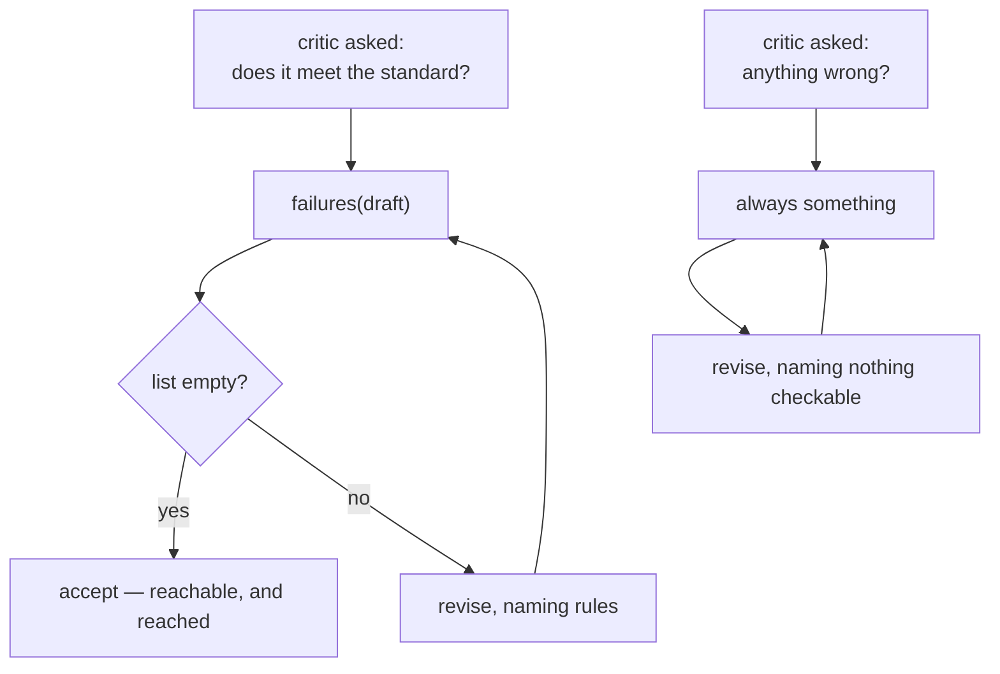

# 4.1 — A critic will always find something

## One-line answer

*"Is there anything wrong with this?"* is a question with no stopping answer, so a critic asked it
keeps saying yes — the desk's fixture satisfied its whole standard on round 2 and the loop was still
running at round 25, having spent 50 model calls.

## The story

A rented flat is inspected before you move in, and you are given a form to note anything wrong.

If the form says *"list any damage"*, you walk round, write *scuff on the hall wall, cracked tile
behind the door*, and hand it back. You are finished, and you know you are finished, because you have
looked at the walls and the floors and there is no more damage.

If the form says *"note anything that could be improved"*, you never hand it back.

The tap could be descaled. The grout by the shower is fine but it is not white. The bulb in the
hallway is a slightly different colour from the one in the kitchen. None of these is an invention and
none of them is unreasonable — they are all true. You are not being difficult. You have simply been
asked a question that does not run out.

The first form has a *finished* state. The second one has no such state anywhere in it, and no amount
of goodwill on your part will produce one.

## The idea in plain language

A **stopping condition** is the fact that makes a loop finish. It has to be something the loop can
observe and that becomes true and stays true.

A rubric supplies one. There are five rules; a draft either satisfies all five or does not; when it
does, there is nothing further to say. *Finished* is a state of the artifact, and it is reachable.

**"Anything wrong?" supplies none.** There is no state of any piece of writing in which a thoughtful
reader can find nothing to comment on. So a critic given that question does not terminate — and the
important part is that **this is not a malfunction**. It is answering correctly, every time. The
question was defective, and the critic is doing exactly what it was asked.

That distinction decides where the fix goes. If the critic were misbehaving, you would fix the
critic — a sterner prompt, a warning not to be pedantic, an instruction to accept when the draft is
good enough. All of those are attempts to make a well-behaved component behave differently, and they
work unreliably because nothing about the situation has changed. If the *question* is defective, you
fix the question: give the critic a closed standard, so that "nothing left" is a state it can
actually reach and report.

And because it can never be guaranteed, you also put a brake outside it — but that is
[4.2](4.2-the-brake-belongs-to-the-graph.md), and the order matters. **The brake is the second line
of defence, not the first.** A system whose only stopping mechanism is a round cap has a critic that
never agrees, and it will hit the cap on every ticket, which means it pays the maximum every time.

## Why Sutra needs it

The revision loop on Day 58 is a cycle in the graph, and Day 54 established what an unbounded cycle
does in the ADK runtime: it keeps going. The `adk.dev/graphs/routes/` page fetched on 2026-09-05 says
it plainly — a graph cycle is not bounded automatically.

So the desk's loop terminates for exactly one reason: the critic eventually says accept. That makes
the critic's stopping behaviour a **correctness property of the graph**, not a quality-of-feedback
issue. If the question the critic is asked has no stopping answer, the triage graph does not
terminate, and on a free tier it does not terminate expensively —
[5.2](../05-does-it-help/5.2-what-the-pair-costs-in-requests.md) prices each round at two requests.

## The mechanism

Two critics, identical except for what they are effectively being asked.

```python
def review(self, draft: str) -> tuple[str, list[str]]:
    """Return (verdict, the rubric keys that failed). The list is the useful half."""
    self.calls += 1
    missing = failures(draft)
    if self.mode == "sycophant":
        return "accept", []
    if self.mode == "insatiable":
        # Always finds one more thing, even with nothing left to find on the standard.
        return "revise", missing or ["tone"]
    return ("accept", []) if not missing else ("revise", missing)
```

**Line by line:**

- The `honest` path — the last line — is a **closed** question. `failures(draft)` returns the rubric
  keys that fail, and when that list is empty the verdict is accept. The stopping state exists and is
  reachable.
- The `insatiable` path is `missing or ["tone"]`. That is the whole of "anything wrong?" in one
  expression: when the standard is satisfied it falls through to something outside the standard, and
  there is always something outside the standard.
- `"tone"` is not a rubric key. That is deliberate and it is the tell — the thing the critic is now
  asking for cannot be checked, so it cannot be satisfied, so it will be asked for again.
  [3.2](../03-the-critic/3.2-a-critic-needs-something-it-can-fail-against.md) measured what a writer
  does with a request like that: nothing.
- Both paths increment `self.calls`, because the point of this part is a number of requests.

Run it with no brake at all:

```bash
cd days/day-57-orchestrator-and-critic/lab
uv run python never.py
```

**Line by line:**

- `never.py` runs the honest critic and the insatiable one over the same ticket with the same writer.
- There is a `HARD_STOP = 25` in the script, and it is **not** the brake this day is about — it is
  there so the demonstration ends. The distinction matters: a hard stop in a lab script is a
  convenience, and a brake in a graph is a control, and [4.2](4.2-the-brake-belongs-to-the-graph.md)
  is about the difference.
- The round-by-round verdicts are printed rather than summarised, because the shape of the list is
  the finding.

Measured on 2026-09-05:

```text
insatiable critic (brake=None):
    round 1  critic: revise  ['next_step', 'no_jargon', 'short']
    round 2  critic: revise  ['tone']
    round 3  critic: revise  ['short']
    round 4  critic: revise  ['tone']
    round 5  critic: revise  ['tone']
    ...
    round 24 critic: revise  ['tone']
    -> hard stop at 25 after 25 round(s), 50 model calls

    the standard was satisfied at round 2. It kept going because the question
    it was asked has no stopping answer. Nothing here is broken code.
```

**Round 1 is a real critique.** Three named rules, all genuinely failing, all fixed by the next
draft. That round earned its two requests.

**Round 2 is where the standard runs out** and the critic asks for `tone` — and from there the loop
is pure cost. Twenty-three further rounds, forty-six further model calls, and the draft is the same
draft it was at round 2, because a writer told to fix `tone` has nothing to change
([3.2](../03-the-critic/3.2-a-critic-needs-something-it-can-fail-against.md) measured that at zero
rubric lines moved).

Now the same fixture with the honest critic:

```text
honest critic (brake=3):
    round 1  critic: revise  ['next_step', 'no_jargon', 'short']
    round 2  critic: accept  []
    -> accepted after 2 round(s), 4 model calls
```

Four calls against fifty. The brake in that run was never reached — it did not need to be, because
the question had an answer and the answer arrived.



## When it breaks

The interesting break is not the runaway — that one is visible. It is the critic that is *mostly*
closed, with one open rule hidden in an otherwise closed standard.

Add an unsatisfiable line to the rubric and watch the loop stop terminating:

```bash
cd days/day-57-orchestrator-and-critic/lab
uv run python -c "
from _desk import RUBRIC, Check, TICKETS, Writer, grade
import _desk
_desk.RUBRIC = RUBRIC + (Check('sparkle', 'it should delight', lambda d: False),)
w = Writer(ticket=TICKETS[0])
d = w.draft()
for i in range(1, 5):
    missing = [k for k, ok in grade(d).items() if not ok]
    print(f'round {i}: still failing {missing}')
    if not missing:
        break
    d = w.draft(told=missing)
"
```

```text
round 1: still failing ['next_step', 'no_jargon', 'short', 'sparkle']
round 2: still failing ['sparkle']
round 3: still failing ['short', 'sparkle']
round 4: still failing ['sparkle']
```

One rule whose `test` can never return true, and the standard as a whole has stopped being closed.
There is no error, the verdicts are well-formed, and the rule looks entirely reasonable in the
table — *it should delight* is the kind of line that gets added after a complaint.

Round 3 is worth reading twice, because it shows something worse than a stuck loop. `short` had been
fixed at round 2 and it comes **back**. The reason is that the writer obeys the list it is given:
told only `['sparkle']`, it stops holding `short` in mind and the long paragraph returns. So the
unsatisfiable rule does not merely fail to terminate — it **undoes rules that were already
satisfied**, and the loop now oscillates between two drafts, each fixing what the last one broke.
A run that is stuck at least stays where it is. This one is going backwards on a rule nobody is
looking at.

This is the practical reason a rubric line needs a real `test` and not a good intention, and it is
the same defect [3.2](../03-the-critic/3.2-a-critic-needs-something-it-can-fail-against.md) found
from the other side: there, an uncheckable rule always passed; here, one always fails. Both are the
same bug — a rule with nothing to check against does whatever its default is — and which way it goes
is an accident of implementation.

## In production

**What a professional writes instead.** The critic is never asked an open question. Its prompt names
the standard, and the output shape is *the subset of these keys that fail* — a closed set, so
"nothing left" is expressible and reachable. Every rubric line is required to have an executable
test, and a line whose test is `True` or `False` for all inputs is caught by a unit test over the
rubric itself, which is a cheap thing to write and catches both the always-pass and never-pass
versions.

**What degrades at scale.** Standards grow, and the longer a standard is the more likely one line is
effectively unsatisfiable — either because it is vague or because it conflicts with another line, as
`cause` and `short` do on `ticket:5044`. A conflicting pair is the worse case, because each rule is
individually checkable and satisfiable, and only their conjunction is not. The loop then runs to the
brake on exactly the tickets where the conflict is live, which is a subset of traffic that grows as
the standard does.

**The failure mode that only appears with real traffic.** With a good standard the brake is rarely
reached, so nobody watches it. Then a rule is added that is unsatisfiable for one class of ticket —
long causes, technical products, a particular customer segment — and the loop starts running to the
maximum for that class only. The average round count barely moves. The request bill does, and the
first symptom is a rate limit on a busy afternoon rather than anything that looks like a logic error.

**The review comment a senior engineer leaves:** *"The critic prompt ends with 'suggest any further
improvements'. That has no stopping state, so the loop's only exit is the round cap and we will pay
the maximum on every ticket. Ask it for the subset of the five rules that fail, and add a test that
every rubric line can be both passed and failed by some input — I want the unsatisfiable rule caught
in CI, not by the quota."*

**The interview question:** *"Your review loop never terminates. Where do you look?"* An honest
answer starts at the question rather than at the loop: *"At what the critic is being asked. If it is
'is there anything wrong', there is no answer that means finished — a thoughtful reader can always
find something, so the critic is behaving correctly and the loop cannot end. I watched that on my
own fixture: the standard was fully satisfied at round 2 and the loop was still going at round 25,
fifty model calls, with the critic asking for 'tone' every time and the writer changing nothing
because there was nothing named to change. The fix is a closed standard so that 'no failures' is a
reachable state. Then I would check for a single unsatisfiable line hiding in an otherwise closed
rubric, which produces the same symptom and is harder to see. The round cap is a backstop for both —
if it is being hit routinely, the cap is not the thing that is wrong."*

## Check yourself

```bash
cd days/day-57-orchestrator-and-critic/lab
uv run python never.py
uv run python never.py --brake 3
```

Now change the insatiable critic's fallback from `["tone"]` to `["short"]` — a rule that *is* in the
standard — and run it again. Write down how many rounds it takes and explain the difference.

**Out loud, without scrolling up:** explain why an insatiable critic is not malfunctioning, and say
what has to be true of a standard for a review loop to terminate on its own.

**Next:** [4.2 — The brake belongs to the graph](4.2-the-brake-belongs-to-the-graph.md).
