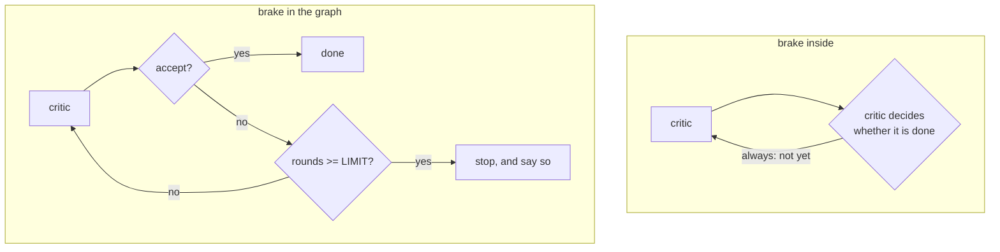

# 4.2 — The brake belongs to the graph

## One-line answer

A limit the critic is asked to observe is advice, and the critic is the thing that will not stop —
the same limit moved into the loop that counts rounds turns 50 model calls into 6.

## The story

At a five-a-side pitch the games are twenty minutes and there is a whistle.

The whistle is not held by either team. It is held by the person on the touchline with the watch,
who is not playing, has no stake in the score, and blows at twenty minutes whether or not anyone has
just been about to equalise.

Imagine handing the watch to the team that is losing and asking them to call time. They are not
cheats. They will genuinely try. But *they* are the ones who want one more attack, and the judgement
about whether the game is over is being made by the party whose interest lies in it not being over.
Every disputed extra minute will be argued in good faith, and every one of them will go the same way.

Nobody thinks this is a question of character. It is a question of **who is holding the watch**.

## The idea in plain language

A **brake** is a limit that stops a loop regardless of what the loop's participants want.

The whole content of this part is one word: **regardless**. A limit that a participant can decline
to apply is not a brake. It is a request, and it is being made of exactly the component whose
behaviour is the problem.

Say the instruction out loud and the circularity is obvious: *"Critic, you are producing endless
revision requests, so please stop producing endless revision requests after three of them."* The
critic that would honour that instruction is a critic that was not going to run away in the first
place. The one that is running away is running away **because it keeps deciding there is more to
say**, and this is another decision, made the same way, by the same thing.

So the brake goes outside the critic, in the component that counts:

| | Inside the critic | In the loop |
| --- | --- | --- |
| What it is | an instruction in a prompt | a counter and a comparison |
| Who evaluates it | the model, each round, afresh | the graph, deterministically |
| Can it be talked past | yes | no |
| Testable | only by sampling behaviour | directly |
| Visible in a trace | as an opinion | as a route |

This is the same argument in three different clothes across the curriculum, and it is worth naming
the pattern rather than meeting it three times. Day 59 makes it about runaway containment: a guard
inside the thing it guards is not a guard. Days 63 and 64 make it about approval: a gate the agent
can route around is not a gate. Here it is about termination. **A control belongs outside the thing
it controls**, and the reason is always the same — a control evaluated by the component it restrains
is evaluated by something with a reason to reach the other answer.

## Why Sutra needs it

Day 58's revision loop is a cycle in the graph, and Day 54 measured what an unbounded cycle does in
the ADK runtime: a routed cycle ran 21 writer passes, then 41 when the limit inside the node was
doubled. The `adk.dev/graphs/routes/` page fetched on 2026-09-05 states it directly — a graph cycle
is not bounded automatically.

That makes the brake part of the graph's correctness rather than part of the critic's quality. The
triage graph has to terminate on every ticket, including the ticket where the standard cannot be
satisfied — and `ticket:5044` in the fixture is exactly that ticket, which is why
[4.3](4.3-the-third-verdict.md) follows immediately.

## The mechanism

The same insatiable critic and the same limit of three, in two places.

```python
def brake_inside() -> tuple[int, str]:
    """The critic is *told* to accept after LIMIT rounds. It is also the thing misbehaving."""
    writer = Writer(ticket=TICKETS[0])
    critic = Critic(mode="insatiable")
    draft = writer.draft()
    rounds = 1
    while rounds < HARD_STOP:
        # The instruction "accept after 3 rounds" lives in the same head that decides the verdict.
        verdict, found = critic.review(draft)
        if verdict == "accept":
            return rounds, "accepted"
        draft = writer.draft(told=found)
        rounds += 1
    return rounds, f"never stopped - hard stop at {HARD_STOP}"


def brake_outside() -> tuple[int, str]:
    """The loop counts rounds. The critic's opinion does not enter the counting."""
    writer = Writer(ticket=TICKETS[0])
    critic = Critic(mode="insatiable")
    draft = writer.draft()
    rounds = 1
    while rounds < HARD_STOP:
        verdict, found = critic.review(draft)
        if verdict == "accept":
            return rounds, "accepted"
        if rounds >= LIMIT:
            return rounds, f"stopped by the graph at {LIMIT}, escalating with {found}"
        draft = writer.draft(told=found)
        rounds += 1
    return rounds, "unreachable"
```

**Line by line:**

- The two functions differ by **three lines**: `if rounds >= LIMIT: return ...`. Everything else —
  the writer, the critic, the mode, the limit value — is identical, which is what makes this a
  measurement rather than a comparison of two designs.
- In `brake_inside` the limit exists only as a comment, and that is faithful to the real thing: an
  instruction in a prompt is, from the loop's point of view, a comment. Nothing in the control flow
  refers to it.
- In `brake_outside` the check is on `rounds`, a variable the loop owns and the critic never sees.
  [3.3](../03-the-critic/3.3-what-the-critic-is-allowed-to-see.md) explains why the critic is not
  shown the round count: a critic that knows it is on round three starts making decisions about the
  process instead of about the draft.
- The check sits **after** the accept branch, so a critic that legitimately accepts on the final round
  still gets its accept recorded rather than being overridden by the brake. The order of those two
  `if`s is a real decision and the wrong order loses information.
- `brake_outside` returns `escalating with {found}` rather than `accepted`. Stopping is not the same
  as succeeding, and reporting it as success is the failure [4.3](4.3-the-third-verdict.md) is about.

```bash
cd days/day-57-orchestrator-and-critic/lab
uv run python brake.py
```

**Line by line:**

- Both arms run the *insatiable* critic, because a brake is only interesting when the thing it
  restrains is actually misbehaving. Against the honest critic both arms return at round 2 and the
  script would show nothing.
- The output reports rounds and model calls, since the point of a brake on this project is a request
  budget.

Measured on 2026-09-05:

```text
the same insatiable critic, the same limit of 3, two places to put it.

    brake inside the critic  never stopped - hard stop at 25 after 25 rounds, 50 calls
    brake in the graph       stopped by the graph at 3, escalating with ['short'] after 3 rounds, 6 calls

    the critic was asked to stop itself. It is the thing that will not stop.
```

Fifty calls against six. Same limit, same critic, same fixture — and the only difference is which
component evaluates the number three.

The `brake inside` arm is worth being precise about, because it is easy to read it as "the model
ignored its instructions". It did not. It was never asked, in any way that had force. The loop's
control flow contains no reference to the limit at all, so there was no point at which the limit
could have applied. **An instruction is not a mechanism**, and the way to tell the difference is to
ask which line of code stops the loop. In `brake_inside` there is no such line.



## When it breaks

A brake in the right place with the wrong reporting is the version that survives review, and it is
the more dangerous of the two.

```bash
cd days/day-57-orchestrator-and-critic/lab
uv run python -c "
import brake
rounds, why = brake.brake_outside()
print('the loop stopped:', why)
print('did the draft meet the standard?', 'no' if 'escalating' in why else 'yes')
print('what a run that reports only success would log: OK, rounds=%d' % rounds)
"
```

```text
the loop stopped: stopped by the graph at 3, escalating with ['short']
did the draft meet the standard? no
what a run that reports only success would log: OK, rounds=3
```

The loop terminated. The brake worked. And a system that logs "OK, rounds=3" has recorded a
**success** for a draft that does not meet its own standard. That is Principle 10 broken at the exit
of the loop rather than inside it: the failure is not that something went wrong, it is that
something went wrong and the system said it had not.

The second break is a brake that is present but unreachable — the classic being a limit compared
against a counter that is reset somewhere in the loop body. The symptom is identical to having no
brake at all, and the code review passes because the check is right there. The defence is a test that
asserts the loop terminates against a critic that never accepts, which is three lines and is the only
kind of test that catches it.

## In production

**What a professional writes instead.** The brake is a property of the loop construct, not of any
participant, and it is accompanied by two things: an **outcome** that distinguishes *converged* from
*stopped*, and a **counter** on how often stopping happens. The second one is what makes the brake
observable — a brake that never fires and a brake that fires on every request look identical from
outside unless somebody is counting, and those two situations demand opposite responses.

**What degrades at scale.** Round caps are usually chosen once, early, on easy tickets, and then
never revisited. As the standard grows the proportion of tickets that cannot converge in three rounds
grows with it, so a cap that was a rare backstop quietly becomes the normal exit path. Nothing
alerts, because hitting the cap was always an expected outcome. The metric that catches it is the
ratio of stopped to converged, and it belongs on the dashboard from the first day rather than after
the first incident.

**The failure mode that only appears with real traffic.** Nested limits multiply. Day 54 measured
this shape directly — retries inside a loop multiply, nine calls behind six visible events — and a
review loop with a per-call retry has the same structure: three rounds times two agents times three
retries is eighteen requests for one reply, and only the three is visible in the graph. The brake you
wrote bounds rounds; it does not bound requests, and requests are the currency. A production system
caps both, and the request cap is the one that protects the free tier.

**The review comment a senior engineer leaves:** *"The three-round limit is in the critic's prompt.
Move it into the loop. As it stands the only thing stopping this graph is a component whose entire
job is deciding there is more to do — ours ran to 25 rounds and 50 calls with the limit written in
the prompt, and stopped at 3 rounds and 6 calls with the same limit in the loop. And when the brake
fires, return `escalate`, not `accept`: right now a run that hit the cap logs as a success with a
draft that fails the standard."*

**The interview question:** *"How do you stop an agent loop?"* An honest answer is about placement
before it is about the number: *"With a counter in the loop, never with an instruction to the agent.
If the limit lives in the prompt, the thing evaluating it every round is the same thing that keeps
deciding there is more to do — I measured that: identical critic, identical limit of three, 25 rounds
and 50 model calls with the limit in the prompt and 3 rounds and 6 calls with it in the loop. The
second half of the answer is what happens when it fires: stopping is not succeeding, so the loop has
to return a distinct outcome and something has to count how often it happens. A brake that reports
its own firing as a success is worse than no brake, because now the bad draft ships and the
dashboard is green."*

## Check yourself

```bash
cd days/day-57-orchestrator-and-critic/lab
uv run python brake.py
uv run python never.py --brake 3
```

Now move the `if rounds >= LIMIT` check *above* the accept branch in `brake_outside` and run it
against the **honest** critic. Write down what changes, and say what information was lost.

**Out loud, without scrolling up:** state where a brake belongs and why, and give the two things a
brake must report when it fires.

**Next:** [4.3 — The third verdict](4.3-the-third-verdict.md).
